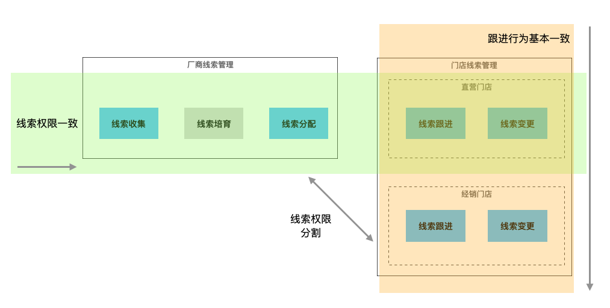
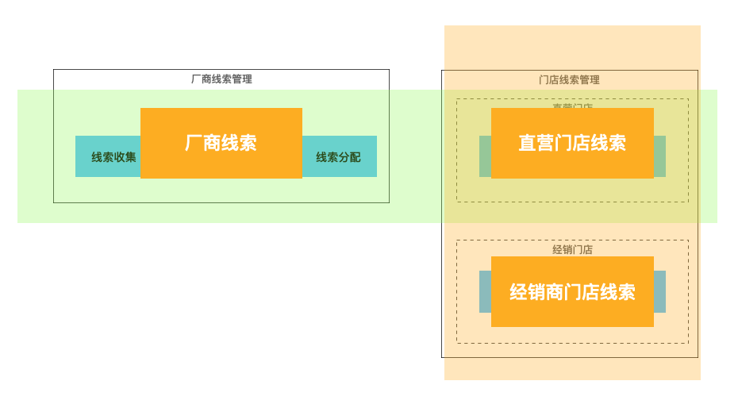

最早在17、18年的时候，做了大约一年多的车企厂商系统 —— 经销商线索管理服务。    
时隔几年，再次接触到线索管理，不同的是：这次的线索管理虽依然是厂商的系统，但包含了厂商线索、门店线索，门店线索又分经销商门店、直营门店。  

## 前言
用领域知识来描述的话， 在汽车销售领域，目前存在以下几种主要的销售模式：
 - 1. 传统经销商模式；
 - 2. 线上销售模式；
 - 3. 直营模式；
 - 4. 车辆订阅模式；
销售线索管理在这四种模式中，都是重要的一个子域，在不同模式中的区别 —— 主要在于获客渠道和销售渠道的不同。
本文主要讲的就是线索管理中的经销商模式和直营模式，因此会出现`厂商线索`、`经销商门店线索`、`直营门店线索`这些关键词。

线索管理从根本上来说，每一个流程和环节都是为了提升客户转化率，最终达成交易。  
主要业务流程包括以下几个步骤：
- 1. 潜在客户注册：潜在客户可以通过网站、电话、短信、线下活动等方式注册成为线索客户，并提交相关信息，例如姓名、联系方式、车型偏好等。
- 2. 线索跟进：线索管理员会根据线索客户的信息，及时与其联系，了解客户需求，介绍产品信息，解答疑问，促成销售。
- 3. 销售机会创建：当线索管理员确定客户有购车意向时，可以将线索转化为销售机会，并将客户信息和需求记录在销售机会中，为后续销售活动做好准备。
- 4. 销售流程跟进：销售人员会根据销售机会中的客户信息和需求，制定相应的销售计划和方案，与客户沟通和协商，促成销售。
- 5. 销售成功：当客户确认购车并完成交易后，销售人员会将销售成功的信息记录在系统中，并对客户进行跟进，提高客户满意度。
从上下游关系来看，厂商进行“线索收集”至“线索分配”，目标是将销售机会推入到可进店接待的阶段；接下来，门店完成线索的线下跟进等一系列活动，目标是促成销售和车辆交付。  
如果车企仅有直营这一种模式，宏观上这就是一个比较简单的流程，看起来是同一个问题域，一个线索模型就可以搞定了。  

然而当前现状，车企大部分都是直营和经销两种共存的混杂模式。  
还有部分车企的经销商并不依赖厂商进行线索管理，即便依赖了厂商的线索管理系统，对线索的权限归属和流程控制也与直营门店有不同的诉求。  
因此，看上去就变成了一横一纵 两块问题子域。
改进一下上面的简图，如下：  
  
横向，厂商与直营门店共用一个线索池，在线索生命周期中，厂商和直营门店是上下游的关系。  
纵向，销售模式的区别造成 —— 经销门店区别于直营门店，与厂商对于线索的销售机会更偏向自由合作的方式，并且经销门店也可保留自己的线索来源、获客方式。  
或者，也有人会说这里应该是 三块问题子域。其实也可以这样说。  

## 疑问
如果要提供解决方案的话，我们的领域和模型应该如何划分呢？如果要用微服务实现的话，应该是几个线索领域对象呢？  
这个问题，当我拿到现有代码，需要在一个微服务中同时实现线索从厂商到经销门店、从厂商到直营门店线索的业务流程时，陷入了沉默。  
毫无疑问，仅从业务领域来看 —— `销售上下文` 中来看，`线索` 是一个统一且独立的领域定义。  
但可惜这个过大的定义和限定边界，对于指导方案落地、设计和构建应用而言，并没有太大实质性的意义。这里需要的是领域模型。
通过和项目同事的流程梳理和交流讨论，最终确认了 3 个领域对象，分别是 厂商线索、经销商门店线索、直营门店线索。  
  

## 论证
### 1. 拆分成3个领域对象的原因
通过领域事件的方式，选取一个具有代表性的长流程 —— 从厂商导入线索到门店销售达成，粗略的展示如下：
  
厂商作为线索上游，门店作为线索下游，红色边框的事件代表着业务流程 或者 细节的明显差异：
- 线索下发后，直营门店直接作为执行方，对线索跟进和销售机会进行执行；而经销门店需要线索接收，销售门店不接收的情况下，此线索无法进入销售门店的线索跟进和销售流程，不具有执行效应。
- 线索回访后，直营门店和经销门店根据回访意见，对线索的分配和调整流程不同；
- 交定金、开票，直营和经销门店一般对接各自不同的财务流程和系统；

同时，对于散客直接进店的，见图中下一排泳道：
  
- 对于直营门店，如果散客信息已经在厂商线索池中存在，直接激活线索；如果该散客是别家直营门店的顾客，创建临时接待任务，完成接待后，与线索所属门店沟通线索归属；如果是新客，创建新线索，放进厂商统一线索池进行线索管理；
- 对于经销门店，无论散客信息是否在厂商统一线索池存在，仅创建并维护为本地线索。

当然，不同的车企在线索管理中，由于经营方式的不同，会存在部分不同的业务流程。上面两张图也并不是一层不变，但已经可以很明确的看出，线索在厂商、直营门店、经销门店3个部分的不同。
也许最初的时候，从以上已知的例子来看，似乎直营门店和经销门店的线索流程差异，主要是：
- 线索的归属控制
- 线索的可见性
- 线索的重复性
- 线索销售对接的下游系统
如果仅使用技术的手段，完全可以使用策略模式和代理模式等，将差异点显性提炼成领域，最终实现一个线索对象完成厂商、直营、经销3部分的流程。
其实，我并不反对这一点，但前提是差异点是可控的，如果厂商对于经销商的业务流程可以进行合并、边界控制，统一的业务流程、模型设计必然是能带来不少好处。
但如果无法实现，其本质性的问题是，厂商和经销商是不同的组织和运营实体，无论是从康威定律，还是运营目标和手段而言，线索实现的差异点都是不可控的。
因此这种情况下，3个领域对象：厂商线索、直营门店线索、经销门店线索，看起来能更好的独立承担各自的领域知识、智能和指导应用构建。

### 2. 在同一个微服务中实现 3 个线索模型的方式
3个领域对象，是否就意味着3套代码实现呢？其实不然。

### 3. 扩展成 3 个微服务行不行？2个呢？

