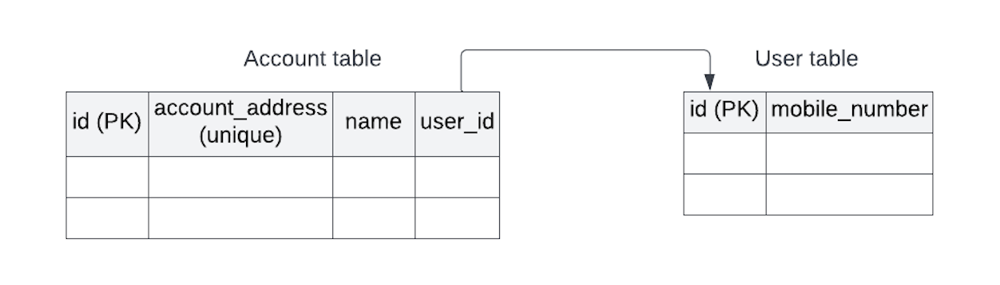
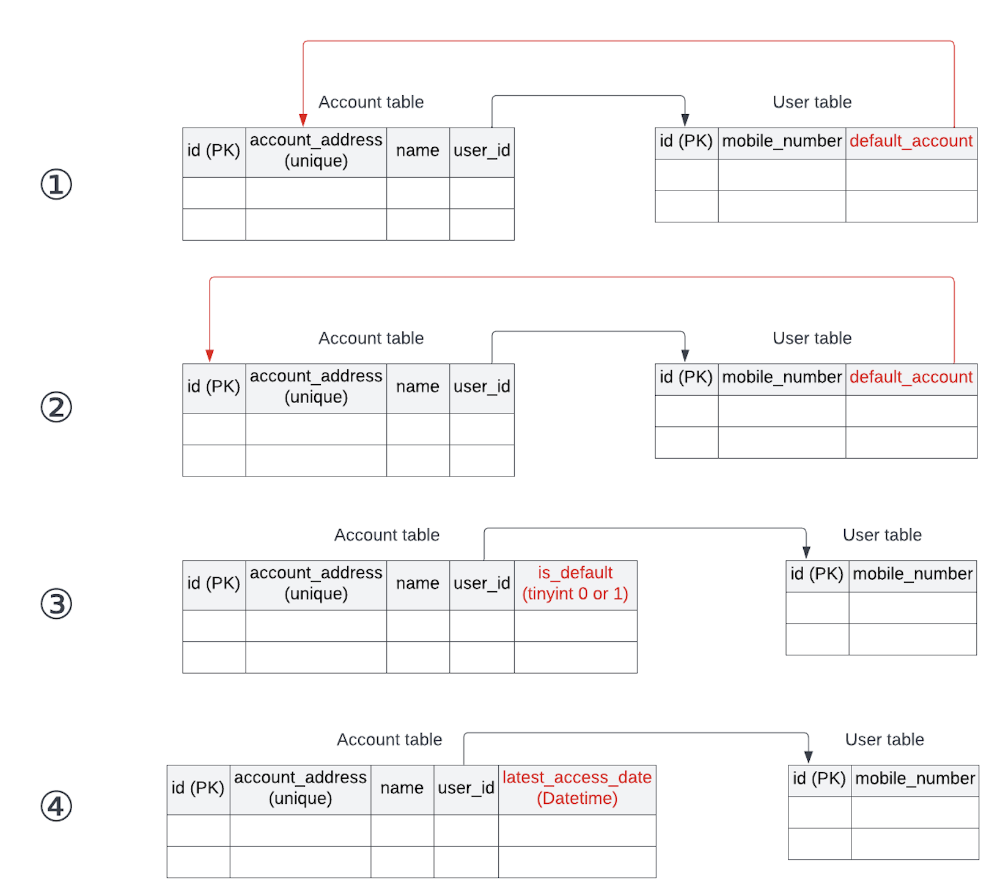

> _前面先写一点废话。_
>_由于最近在整理一些DDD、微服务、架构相关的知识总结，一边看一边回忆一些经历，又由于本人看的东西有时候很杂，记忆力又大不如前，本打算仅用私人手账的形式记录一下。_  
_但回看了一下2019年年前立的flag —— 50篇博客（应该是完不成了吧。。），又想到最近一段时间接触到的咨询同事的写作能力，唉。_
_虽然对自身写作和语言表述能力有些萎靡不振，但，人不能不上进。_
_因此，准备开始简书。_
>
>_这里有人可能要问了：你不是跑去搞区块链了吗，怎么又跑回来微服务、DDD了？_
_嗯。。这个问题问的好。这里就不得不提到本人去搞区块链之前的一段近两年的项目经历了。_
_怎么说呢，这个项目虽然在我的项目经历中已经完结了，但它遗留在我心中的问题还没有完结。_
_就是这样。_

#### 1. 有时候你不得不去写的业务代码
最近出差回来，遇到一些之前项目上的同事聊到自己当前的新项目，无不感叹——不用再像以前一样不停地写业务代码了。  
嗯，可以多玩一些技术、或者新的技术，总是可以让搞技术的人兴奋很久。  
但是，比较可惜，所谓技术要盈利，就要交付产品。要交付产品，必然就会有业务。即使是DevOps平台这种纯技术型的产品，技术上的CI/CD就是它的业务。  
写业务代码，对每个开发来说，基本上都必不可少。  
这时候，技术需要通过实现业务，来展现价值。  

#### 2. 写了这么多业务代码，你是否真的会写业务代码
一定会有人觉得这个问题很奇怪，业务代码不就是一个不断累加的过程么，有什么会与不会？  
说实话，在没有之前那次两年经验的时候，我也是这样想的。但通过那两年的经历，我意识到 —— **复杂业务系统**，业务绝对不是 1+1=2 这么简单。  
但即使这样，在我经历最近一个短期项目，跟客户合作开发的时候，又意识到 —— 即使是 **简单业务系统**，如果开发人员没有 建模意识、或者面向对象的经验、甚至说是没有业务的理解消化能力，写出的代码甚至连 1+1=2 都做不到。
<!-- more -->

这个事情是这样的。  
**背景**：项目是做一款区块链的手机钱包（当然这里要说的与区块链知识无关）。  
可以简单的理解一下 —— 每一个该APP的**User**可以通过”手机号+验证码“登录该APP，而每个User下可以有一批账户**Account**。  
可以想象比对为，某银行app的一网通账号 -> User，一网通账号下有多张银行卡、信用卡账户 -> Account。  
**业务需求**：进入APP首页的时候，首页展示的**”当前Account“**默认为最近一次使用的Account。  
**实现背景**：后台保存数据状态，使用的MySQL数据库。（有一些其他背景，我这里就不另描述为何不采用APP前端保存等方式）  
**表结构类似**：  

看到这里，每个人应该内心都有自己的实现方式了。  
基于这是一个业务简单的系统，可以尝试直接用数据模型的形式表述一下。  
是不是很简单？  

相信许多人都会觉得很简单，它的确也挺简单。  
甚至，当时在项目上第一版代码实现出来的时候，即使code review没有通过，我也没有觉得它是个问题，即使实现方是客户方的Dev。直到正式team code review，在与客户方Dev的沟通中，我才发现，对一些Dev来说，它的确是一个问题。  

那，看一下你实现的数据模型是下面哪一种：

很不幸，当时的第一版代码实现是 **1**。犯了将 Account 的属性泄露到User中的大原则问题。
**(排除)**

再看下 **2**，**"默认账户"**，这是个什么鬼？也许有人会说，这只是字段起名的问题。或者也有人会说，就是”默认要显示的账户“啊。相比于**1**，User 和 Account 之间的关联使用了id，比 **1** 要好很多。但是，User 需要关心是哪个 Account 要显示吗？这种双向关联的设计是必要的吗？好，我们先把 **2** 放一下。

那看下 **3**，每个 account 都有一个 bool 标记，用以标记自己是不是当前 User 下的默认账号。好处是，User 完全不用关心旗下的 Account 被选择的问题。但，先不提 **默认账户** 关键字的问题，可以想象一下，当每次 User 切换了当前的 Account，系统就需要整体检查一遍当前 User 下所有的 Account 的 `is_default`值，并且进行修改。虽然在并发竞争低的场景下，貌似也勉强勉强接受，再想一下是不是有更好的办法？

最后看下 **4**，在 **3** 的基础上再想一下，到底是什么决定了当前 User 所属的所有 Account 中那唯一一条true标记？这个时候 —— **请把，需求拿出来再仔细看一遍。**
**这很重要。**
> ”进入APP首页的时候，首页展示的**当前Account**默认为 **最近一次使用** 的 Account。“

**如果觉得不确定，甚至可以拉上 team 上的 BA 再认真聊一下**。  
DEV：最近一次使用，意思是账号的最近一次使用的时间点很重要？  
BA：我不确认”最近一次使用的时间点“是不是很重要。首页这个场景下，我只关心显示的是最后一次使用的账号。但对于首页上手动点击切换 Account 的弹出层上，Account List 我觉得倒是可以采用根据各自的 **最近一次使用的时间点** 来排序展示。

到这里，可以再拿出之前还没完全排除掉的**2、3、4**，事情就很好解决了。  
**2** 和 **3** 莫名其妙地突出了一个**默认账号**的问题，并且让事情变得复杂 —— **2** 多了双向关联，**3** 多了批量更新，同时都遗漏对了每个“**最近一次使用的时间点**”的记录。  
而 **4** 在抓到“**最近一次使用的时间点**”这个关键信息，并且得到业务认可的同时，解决了首页展示的业务case，并且能很好的支持扩展。  

#### 3. 知识消化、理解业务意图、分析建模、或者是whatever
上面的例子有点长，本人也比较担心自己的表述不太好，让举证方向发展到比较奇怪的地方。或者，有时候不同的人的经历总是可以看出不一样的味道。

当然，这篇博客的目的也并不是为了直奔DDD主题。
只是想要强调一点：写业务代码其实也没那么简单和单调。Dev在开发之前，或者是开发的过程中，都要确保自己对业务知识进行了消化，掌握了业务意图，然后进行建模、实现开发。
即便是在不需要运用DDD的简单业务系统中。

最后引用《领域驱动设计与模式、原理与实践》中的一句话：
> 代码输入并非交付产品的瓶颈；编码是开发过程中最简单的一部分。在非功能性需求之外创建并维持一个能够满足业务用例的领域的有用软件模型才是难点所在。

