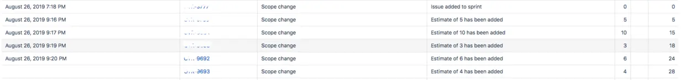

老实说，刚开始要写这篇博文的时候，我在想：我是谁？我在哪里？我在干什么？

目标：
1. 为了让JIRA board owner和admin创建出来的Scrum board更规范；为了使JIRA user在挪卡的时候，有效信息能被能好的track；为了用以统计分析、跟踪的reports能更好的为项目服务。
2. 为了在team Retrospective meeting中，能更好地对Sprint进行回顾，从数据上提供更好的事实支撑和具体分析；为了在以后的Sprint进行逐步良性改善。

最后自己心里还是默念：我是个Tech，我是个Tech，我是个Tech。

### JIRA概念性模型
**`Project`**: 可以理解为Issues所属的集合、命名空间。一般而言，可以一个software project来创建其对应的JIRA project。  
**`Issue`**: 可以具象理解为卡片，一个issue就是一张卡片。  
**`Issue type`**: 卡片类型，可以是Epic、story、bug、task等。  
**`Status`**: 卡片可以选择的状态。一堆status和transition构成一个具体的工作流（workflow），卡跟随工作流中设定的状态进行流转，完成卡的整个生命周期。  

**`Board`**: 具体的项目实践管理的操作空间。一个board可以关联一个project，也可以关联多个project，取决与创建board时的设置。简单一点话，我们这里还是让一个board仅关联一个project即可。  
**`Backlog`**: board中，未加入具体sprint的issues，则会显示在backlog区域内。  
**`Sprint`**: Scrum中的一个概念，代表一个固定的时间盒子（time box），可以是2周~4周。项目团队以每个sprint实现短期交付目标和增量式迭代。在JIRA中，一个Sprint中会加入一批Issues，用以详细定义此次Sprint的目标和工作内容。  
**`Active Sprint`**: 已经组织好issues list的sprint可以通过Sprint plan meeting(或者叫Iteration plan meeting)之后，将此Sprint激活。这时，此Sprint内的所有issues会自动显示在Active Sprint页面上 ———— 大多数JIRA User所关注的可视化电子墙则成功出现。  
**`Release / version`**: JIRA中没有Release这个实体概念。Release对应的实体，其实是version。在Issue的属性中关联上Fix version，则issue可以从Release / version的维度进行数据统计和进度track。  

### 简单上手
如果JIRA新手，可以先参照官方的[Getting started as a Jira Software manager](https://confluence.atlassian.com/jirasoftwareserver/getting-started-as-a-jira-software-manager-938845036.html)

这里，假设我们已经有了Project和已经完成了User Management ———— 一个已经运行了一段时间的开发项目，我们尝试来创建一个新的JIRA Scrum board。

#### 1. 创建一个新的Scrum board。
在旧的board上，点击右上角的按钮[Board]，在下拉框中选择[Create board]。

然后在下一步中选择[Create a Scrum board] > [Board from an existing project]。可看到下图:

输入相应信息后，点击[Create board]，这时新的board就会创建出来。

由于创建时选择了已存在的一个project，该project中有未分配给sprint的issues则会自动显示在新的board的backlog中。  
当然如果board中只需要显示project中一部分的内容，可以通过修改board configuration页面中的filter进行过滤。

#### 2. 配置board的Estimation。
点击board页面右上角的[board]按钮，选择[Configure]。  
进入board configuration页面，选择[Estimation] tag。  
在该页面上选择estimation和tracking基于的单位。

#### 3. 使用backlog来为sprint做准备。
从board页面，点击页面最上方的[create]按钮，来创建issue。

录入issue的必要信息，这时候estimation值一般是没有的，留待IPM中填充。
等准备好所有issues之后，backlog显示如下：

#### 4. 开启IPM（Iteration plan meeting）
在会议上，通过开发人员一起确认各个issue的估点，并且“创建”Sprint，根据估点和优先级，将issues拖入Sprint中。

* __录入估点__  

* __创建Sprint__
点击Backlog右上角的[Create Sprint]，创建一个空的Sprint。然后拖入此次Sprint的issues。

#### 5. 准备开启Sprint。
最后检查一遍issues上的必要信息，特别注意估点（Estimation）已经成功录入。
检查完后，点击sprint右上角的[Strart Sprint]。接着在弹出框中选择好time box时间周期，最后点击[Start]。

这时，该Sprint会进入Active状态，所属issues会显示在board的Active board page中。

* __为什么提醒一定要再检查一遍issues，特别是在确认估点录入之后再start Sprint？__  
因为按这个正常的流程，可以得到一个正常的燃尽图。见下：

如果在start sprint后才开始加入估点记录，则会获得这样的燃尽图报表：

初始点y值为0，guideline完全贴在X轴，没有任何sprint初始Estimation，之后再录入任何一条issue的估点，都被展示成“Scope change”。  

而真正的涉及到Scope change的issue track就会傻傻地无法区分。

#### 6. 修改Active board column。
进入board配置页面，选择Columns page。

JIRA默认的Columns一般分为3条 —— TODO、In progress、Done，一般status和columns是对不上的，可以进行添加和修改。
点击[Add column]，可添加一列，也可以直接点击已有的Column对其进行修改。  
然后，将对应的status分配到Column中。  
在不同的column之间移动的issue时，issue的状态会自动流转到column对应的status。  
  

同时Active Sprint也会同步刷新为新的Columns布局。  
至于status的添加和修改，需要JIRA Project admin的权限可以对workflows进行修改。  

__特别要注意__
* __最后一个Done column中的status一定要明确。如果Done column中有两个及以上status时，请务必确认其相互之间不是上下游状态关系，而是非此及彼的平级关系。__    
因为同一个column中，无法再通过拖动issue来变更status。   
同时如果上下游关系的status混在一个column里也会让lead time无法很好的统计。  
下图就是一个不好的示例 —— Done column中既有`QA Done`，也有`UAT Done`。  

其中QA Done issue count为45， UAT Done issue count为31。  

* __一定要确认最后一个Done column中的status是否需要transition时set resolution。__  
如果还有下游的board需要流转和处理同一批issue的情况，可以暂时一部分status不需要设置set resolution。  
否则，请将最后一个Done column中对应的status transition在workflow配置中，加入set resolution post Function。  

#### 7. 如何对没有resolution的status添加Post function？
点击board页面左下角的齿轮按钮[Project setting]，在点击[workflows],选择对应workflow。  

点击[Edit]按钮，进入编辑状态。假设想要给`QA Done`添加set resolution，点击图右边transition的[post Functions] link。  

点击[Add post function]，进入添加post function的引导流程。  
 

 

__为何强调一定要加入set resolution?__  
在JIRA中并不是自定义一个叫Done的status就代表这张卡片已经达到完成标准、走到了生命周期的终点，而是需要使用issue上的resolution field。  
如果最后不添加resolution会造成的影响，会对一些报表和filter的使用造成影响。  
官方说明见下：  

**特别说明燃尽图报表：**
燃尽图报表中的issue是否complete，是否burndown，与resolution field无关 —— 仅于board上最右的column有关。  
只要issue移动到最右的column，即会显示burndown。  
官方说明见下：  

#### 8. JIRA board users在sprint中，领取issue和传递issue时，一定要记得及时挪卡。

#### 9. 在sprint结束时，一定要记得及时手动点击complete sprint。
 
点击右上角link[Complete Sprint]，这时对于未Done的issue会进行提示：  
 
可以选择移入backlog，或者移入新的sprint中。  
在这里不要因为Sprint时间到了，仍有未完成的issue，而害怕将Sprint complete。  
所有的track行为都应该以实际情况为准，这样生成的数据才能真实进行反馈，为将来的改进提供有效的建议和数据支持。  

Sprint complete了之后，如velocity report就可以计算和汇总这次sprint velocity了。  

### 总结
既然用了有用的工具，就要有效的使用起来。  
要避免仅将JIRA当成一个可视化电子墙的误区。  
 