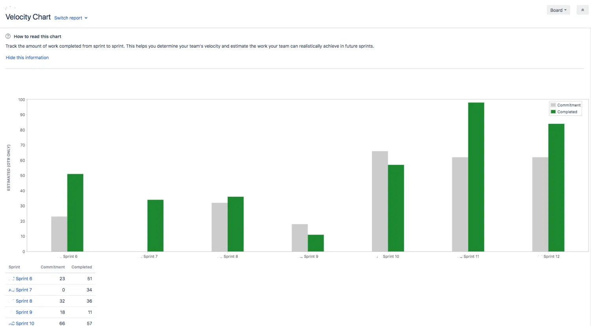
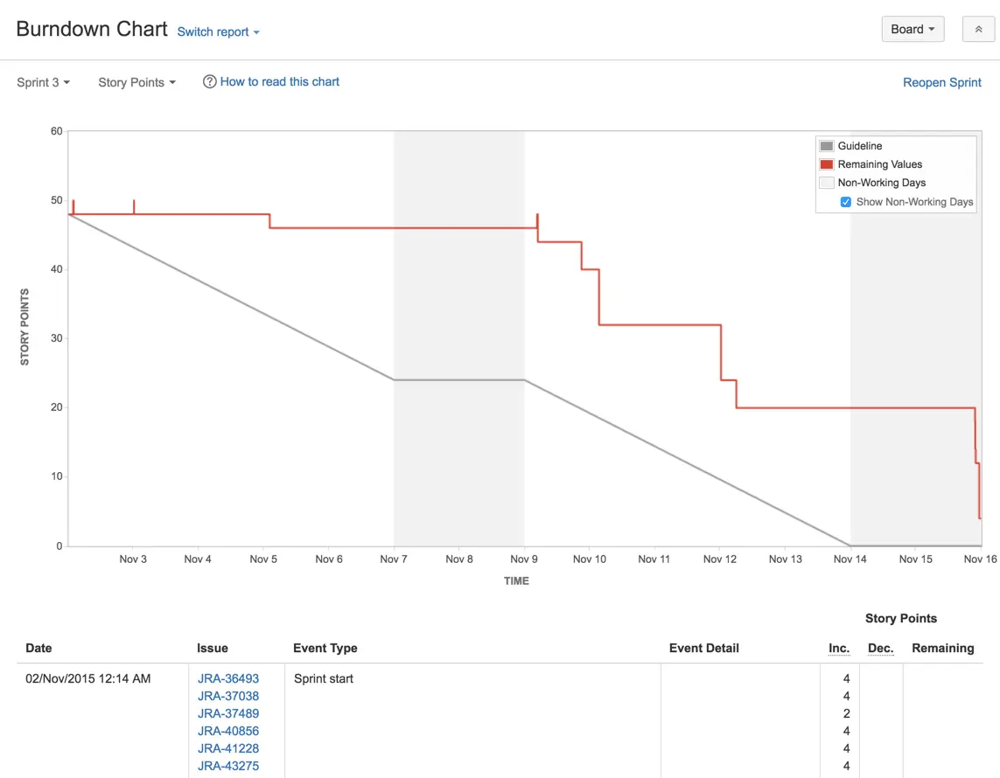
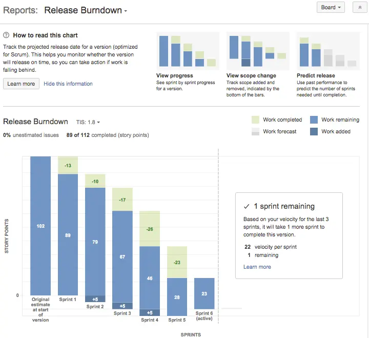
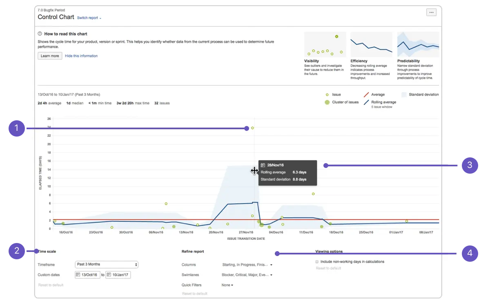
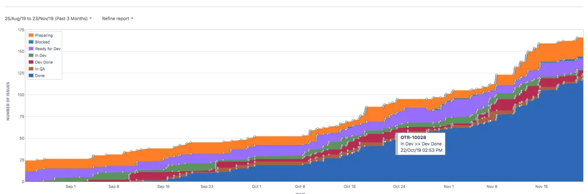

首先，贴一下官方报表的说明文档的链接：[跳转](https://confluence.atlassian.com/jirasoftwareserver084/reporting-979406465.html)
最近读了一本书，书中有一句话，大致意思是：文章太长时，大部分人其实都不会读完它。
觉得很有道理，但是这篇JIRA还是没办法的写了很长。
希望这是本人最后一篇JIRA的博文。耶。

### 与Scrum sprint相关的报表
#### 1. Velocity Chart

该报表会在对应 sprint complete 之后生成出对应的 sprint velocity 总值。
主要的作用是统计历史 sprint velocity，用以对将来的 sprint plan 提供 velocity 上的指导和参考。
以及在 velocity 趋势波动的时候，结合数据和实际情况进行分析 —— 波动产生的原因，用以调整团队在将来 sprint 中的工作。
注意：velocity 本身基于的估算，本身并不能作为一个 sprint 工作量的承诺。

**Commitment（柱）:** 代表 sprint start 的时候，sprint plan 的所有 issues 估算值的总值。
**Completed（柱）:** 代表 sprint complete 的时候，实际完成的 issues 估算值的总值。
**当单次Commitment比Completed高时，**代表未完成计划的 issues scope。
**当单次Completed比Commitment高时，**代表 sprint 中 issues scope 发生了变化。
ps：当然如果你的团队总是无法在 sprint 开启的时候，确定好 issues scope，那 Commitment 柱基本上是帮不了你了。

velocity chart 是 board-specific– 的，意思是说 —— 如果有两个 board 使用同一个 sprint，当前 board 的 velocity chart只会计算当前 board scope（根据board configure Filter）。

#### 2. Burndown Chart

该报表不需要等到 sprint complete 之后才能看。
其根据时间轴，每当sprint内有 issue 估算值变化的时候，就会显示对应变化。
Burndown Chart 主要的作用是在sprint过程中实时跟踪sprint的进度，当 issues scope change 造成 burnup，当 issue completed 后 burndown,
以及观察团队的当前 sprint 剩余工作量、离最终的整体 burndown 的目标还有多远，是否要采取一些其他的行动改进以达到最终 burndown目标等等。

Burndown Chart也是 board-specific– 的，基于当前 board filter：
* Scope change - Issue added to sprint（具体原因）: 一个 issue 加入了此 active sprint。具体原因有多种，比如“Estimate of 1 has been added"添加估算，“Estimate changed from 3 to 2”修改估算，等等其他。
* Burndown - Issue completed: 一个issue被完成。“完成”的定义是基于board column的，当issue被挪到active board最右的column，即认为complete。

#### 3. Release Burndown / EPIC Burndown

Release Burndown / EPIC Burndown 是从 Release version 和 EPIC 的维度，来看涉及到的 sprint issues 的burndown总量。
比如上图：
首先在左上角下拉框选择要查看的 release version，报表进行显示。
图中，该 release 计划交付的 issues 估算值总数102。绿色代表 sprint 完成的量，深蓝色代表 scope change, 浅蓝代表剩余的工作。
假设原计划是5个 sprint 后完成所有 issues，那么该图表明进度已经 delay，剩余 issues 估算值28，已经在占用后续 release的sprint 6 的时间，并且在 sprint 6 中减少了5个估算值的 scope。

### 与Scrum sprint无关的报表
#### 1. Control Chart

主要作用是来查看项目的cycle time（or lead time）。
cycle time代表issues在具体的column对应的状态上耗费的时间。
lead time代表整个团队对issues —— 从对应的需求提出到实现完成耗费的时间。

先从图上按顺序来看一下：
① 指向的绿色空心点，代表一个 issue。如果是一个大的绿实心点，代表一堆很接近的 issues。
② 指向的是，可自定义的报表 x横轴 时间区间。
③ 表示，在报表上使用鼠标悬浮滑动，可以查看固定时间点的值信息。
④ 指向的是，Refine report，此报表最重要的一块 —— 针对 issues scope 的选择。
报表最上面是统计信息`cycle time`、`issues count`。

**Refine report**
`Columns` / `Swimlanes` / `Quick Filter` 三个过滤条件是 "与&" 的关系。
* `Columns`：基于board columns，提供多选。勾选上的 columns，报表会计算出 issues 处于被勾选的 columns 的总 cycle time，并进行显示。
而报表图上的issue绿点的横向坐标，代表该 issue “终止”该组 columns 的时间点。纵坐标代表该 issue 的cycle time。
* `Swimlanes`: 基于board configure Swimlanes设置的JQL filter进行issues scope过滤。
* `Quick filter`: 基于 board configure Quick Filters 设置的 JQL filter 进行 issues scope 过滤。

Swimlanes 一般是基于board计算的，变动不会太大和频繁。因此，可以通过随时定制 Quick filter，来进行 Control chart 报表分析时的过滤。
比如添加一个 Quick filter —— 为了过滤出某一个 sprint 或者 release 的 issues；还比如官方推荐了一个去除`没有参考价值的异常issue` 的方法，就是通过在具体的异常 issue label 上进行标记，然后定制 Quick filter 进行过滤的方式，在 Control Chart 统计时排除异常 issues。

**Include non-working days in calculations**
报表右下角有一个viewing option，`Include non-working days in calculations`不勾选时，cycle time 的计算不会包含非工作日。
至于 Control Chart 上统计数据`cycle time`，包括average\median\min\max的时间显示，单位w/d/h中，`1w = 7 working days`，仅是一种简单的单位换算，不要产生误区。

**查看lead time**
如果项目设定 issue 从 `ready for dev` 到 `In dev` 到 `Dev Done` 到 `In QA` 到 `QA Done`，是一个需求从提出到完成实现的整个流程的话，将 columns 勾选上 `ready for dev` \ `In dev` \ `Dev Done` \ `In QA` 4个状态，则可以统计和绘制出 lead time 和相关 issues。
如果想分析 —— 到开发们完成卡的这段 cycle time，可以仅勾选`ready for dev` \ `In dev` 2个状态，即可查看。注意，不要将最后的缓冲队列 `Dev Done` 误勾选进去。

**rolling cycle time**
rolling cycle time是根据`当前issue + 前面x个issue + 后面x个issue`的平均cycle time。x 是基于时间轴上的issue总数的一个取值。
目的是为了展示cycle time的一个具体范围趋势 —— average cycle time就是一条水平线。
报表上的蓝色阴影区，代表issue cycle time和rolling cycle time的标准偏差值，蓝色区域越窄，代表issue cycle time更接近周边的issues cycle time，这段rolling cycle time置信值越高；越宽的区域，issue异常情况越多，rolling cycle time置信值越低。rolling cycle time置信值越低，代表该时间段附近issue异常越多。

另类使用小tips：columns单选之后，比如In Dev，计算出来的Average cycle * issues count，可以看到在此column内对应issues的时间投入程度（前提，团队有按真实情况及时挪卡）。

#### 2. Cumulative Flow Diagram

Cumulative Flow Diagram 其实非常简单，横轴是时间轴，纵轴是 issue 数量。
不同的色带，代表不同的 column，色带上边界值代表该时间点进入过（处于该column + 已经transfer到后续column）的 issue 总数值，色带的纵向宽度即是 “处于该column” 的 issue 总数。
Cumulative Flow Diagram 主要用来分析 issues 流量趋势是否正常、团队是否存在瓶颈。
比如：
在某一个时间段内，Dev done 色带在纵向上逐渐变宽，代表等待 QA 测试的 issues 堆积越来越多，QA 存在瓶颈；
在某一个时间点，In Dev 色带上边界值有下降趋势，代表有部分 issues 从 In dev 状态被重置回上游 column，代表 issue 内容可能被返工；
在某一个时间点，In Dev 色带在纵向上的宽度比正常时窄，说明在制品在减少，如果开发人员并没有减少时，代表部分开发人员在空转；
在一个 sprint 时间段内，Preparing 高度仍然在上升，说明 sprint scope 在增加；
所有 in progress 的 columns 色带，在横向宽度上变宽，说明 lead time 在逐渐变长。

**Refine report**
与 Control Chart 相同，对 issues scope 进行过滤。参照Control Chart Refine report。