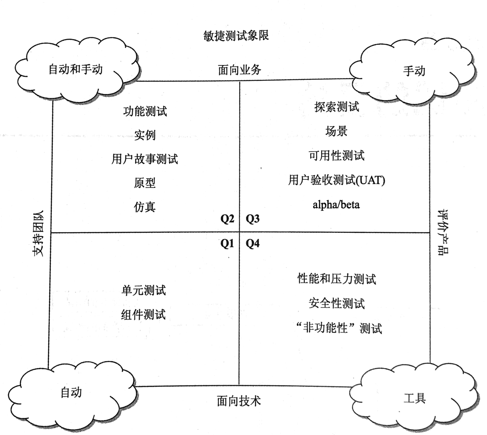

本来这篇博文我是想这样开头的：  

也许有人看见这篇文章的标题会觉得 —— 这跟开发人员无关。  
不，你错了，这跟开发人员有关，并且有部分工作是需要开发人员去做的。  

但，最近遇到了一些事情，我想换一个开头方式：  

人在工作和生活中，风平浪静时，就像在实现 stories。而那些突如其来的、打断风平浪静的局面的事情，就像一个个 bugs。作为一个 Tech，我已经习惯了去解决这些 ”bugs“，但又不免内心会吐槽，这些突如其来的问题，作为产品和服务提供商，就不能重视一下质量建设？  

说到质量建设，就不得不来看一下敏捷测试四象限。（这个转接是不是还蛮丝滑顺畅的）

四象限左边部分，用以”支持团队“ —— 帮助团队开发产品。  
与左边相异的右边部分，用以”评价产品“ —— 对交付的产品增量进行评测。  

四象限下边部分，用以”面向技术“ —— 面向技术领域。  
与下边相异的上边边部分，用以”面向业务“ —— 面向业务领域。  

先声明，敏捷测试四象限可以认为是一个模型，或者工具，大家参照它来划分和搭建项目中的测试“架构”。因此，对于具体的项目而言，并不是每一个部分都必须采用和执行，但至少不要漏掉真正需要的维度和实践。  

<!-- more -->

#### 第一象限，开发们最熟悉的部分
四象限中左下方的象限代表了测试驱动开发。  
估计有人会说，明明象限图上面写的只是”单元测试“、”组件测试“，怎么扯到测试驱动开发上去了？  
测试驱动开发，可以分狭义（TDD）和广义，狭义是指开发时小步开发、先写测试、再写实现的开发方式；广义是指，加上业务、测试参与，以终为始，团队明确最终交付验收测试项，使用测试前置策略，以此出发进行功能设计、开发和构建的整个过程。当然，如果认可了狭义和广义两种方式之后，会觉得并无区别，就是”测试驱动开发“。当然较真一点的，会觉得广义中其实还包含了ATDD、BDD等。  

老实说，早期的时候，我也认为先写测试，还是后写测试（我不是指开发完了之后补测试），没有明显的区别。  
但经历了更多项目之后，深刻地感受到 —— 要使一个团队（对，我说的并不是特指的某个人，我指的是团队），能写出有效、高质量的测试，那还是一起来用TDD吧。  
首先，以测试先行的方式开发的代码，自然会被要求设计为可测试的。  
并且，伴随着开发过程中编写的测试，在帮助设计开发、保证质量的同时，在开发完成以后这些测试也承担着频繁回归和重构安全网的作用。  
最后，当然附加作用就是这些测试是一份产品代码的使用指南。  

至于开发完了之后补测试这种 —— 首先它顶多是只能算是一种回归测试，补上的测试一般会分支覆盖不全；就算最好的情况，分支都覆盖全了，它顶多也只能算另一种白盒测试，对“支持团队进行产品开发”中的设计和开发并无反馈和指导作用。更别说，大部分开发会”产品代码都写完了，赶紧补完测试后，赶去下一个story”的敷衍感。或者，只要没有强制要求，“以后加测试” —— 只是一句自己骗自己的谎言。  

因此种种，敏捷测试第一象限中，测试驱动开发构建出的单元测试、组件测试，用以确保产品代码的内部质量。  
内部质量，不是通过客户判断的，是由开发们定义的。当内部质量下降时，直观的可见损失比如：开发速率越来越慢，越来越多的bugs需要修复，不断被推迟的紧急重构等等。当然，如果除了第一象限外的其他象限测试也都同时翻车，这些产品质量缺陷将会被用户感知。  

> 举个现实生活中有趣的例子：本人最近使用了支某宝办理ETC，ETC设备被邮寄过来收到之后，需要车主安装、激活。  
我打开产品说明书，使用支某宝激活引导小程序进行安装和激活。  
当到达激活这个步骤的时候，提示“OBU设备故障，请联系客服处理”。  
找到客服，客服直接告知：寄回更换设备。  
依样寄回，过了两三天后，手机突然收到一条提示 —— ETC已成功激活？这是在做线上debug？  
联系客服，客服说是技术人员在检修设备。“检修”设备。  
过了两天，快递收到之前那台设备，已被激活。  
总结一句：设备出厂有缺陷，新品寄回仅检修，线上debug激活，用户收到设备仍然一脸蒙圈 —— “账号”不仅被线上debug进行了写操作，到底修好没有还需用户自己开去一个ETC入口检验。  
看，作为一个用户，我虽然看不到内部质量，但同时我也没有看到任何质量构建发挥作用。  

支持团队开发过程的面向技术测试，是所有将要进行的测试的重要基础。如果团队没有对这个象限中的测试做足够多的工作，其他类型的测试将会更加困难。因为团队的代码缺少内部质量，每项任务将需要更长的时间。  

ps：第一象限的内容并非只有单元测试、组件测试，只要是“支持团队开发过程的面向技术测试”都可以放在其内，比如：契约测试。  
第一象限的测试是自动化的，支持快速反馈的。  

#### 第二象限，更高层次的支持团队开发
第二象限也可以叫面向用户的测试，它们确定外部质量和用户需要的功能，包括验证用户故事、功能、界面、交互等等。  
但既然是敏捷测试，这里强调的就又是 —— 测试驱动开发，只不过是从一个更高的层次上，包含了ATDD、BDD。  

第二象限需要测试人员参与，开发人员提供技术支持，产品人员提供业务和用户故事。  
测试人员需要对产品系统有全面的了解、关注全局、故事的业务和技术方面，而且始终考虑最终用户体验，以激发和揭示需求中的边界和隐藏假定，最终同业务和开发们明确验收测试项，以此来帮助团队开发正确的需求。  
在必要情况下，测试人员使用业务领域语言DSL将验收测试转化为能够执行的测试代码，实现BDD，以驱动开发。一些较常见的工具比如cucumber。  

当然，如果有人说，团队测试人员忙的没时间，只能在开发整体完成了之后才能以“测评”、“查bugs”的形式进行用户故事测试、功能测试。  
那我只能送两老话：  
“你无法把质量测试进产品中”、“一次性把事情做好，可以杜绝浪费”。  
简单点说，就是测试人员发现了bugs，还是需要返工给开发人员修复，开发修复后，测试人员再重测，更何况bugs发现的越晚，修复的成本越高。这些种种，其实造成一些时间和效能的浪费，无法实现及时的支持团队开发。  

> 再举一个最近生活中碰到的有趣的例子：本人最近申请了某讯王卡升级5G的业务。  
10月31日出的某讯王卡5G宣传，本人满足上面所有前置条件，看着广告上11月30日之前办理可以半年月租享受7折的优惠，同时想支持一把5G事业，  
于是果断买了5G手机，接着点击了王卡助手的申请升级5G。  
结果，第一次短信反馈，申请失败 —— 因为有一个王卡福利0元1G流量包。  
手动上联通app注销了该业务，显示流量包将在11月30日失效。  
再次点击申请升级，第二次短信反馈，申请失败 —— 因为这个流量包失效时间在11月30日，因此只能在12月才能办理。  
一看，哪有这样的说法，这要是开通不了，不等于广告虚假宣传么，于是马上联系了王卡客服和联通客服。  
历经3天的沟通和协作，最后王卡客服 + 我 + 联通电话客服，才成功完成这次5G套餐的升级。  
主要原因 —— 王卡客服的账号权限根本完成不了这些流量包的立即取消失效，也就无法在广告优惠期内完成办理5G套餐。  
最后是依靠联系联通电话客服这条workaround才完成办理5G套餐。  
看看，整个功能测都没有测试，就上线了。虽然对于5G刚商用，必然有些手忙脚乱表示理解，但另一角度也说明“面向业务”的测试有多重要。  
当然能做到测试驱动开发，就更敏捷了。  

第二象限的测试一般是自动 + 手动，BDD的测试可以实现自动，另外基于界面的End to End、或者是只基于API的重复性回归测试都尽量自动化，将手动测试放在分析 或者 其他自动测试弥补不了的工作上。并且手动测试时的前置条件、测试数据准备等等，其实也可以借助自动化完成以提高效率。  

#### 最后
这篇文章里面的两个生活中有趣的例子，放在第一象限、第二象限有人也许会觉得有些硬靠的感觉。  
我想说 —— 没错🤣。这两个例子硬写进来，就是想吐下槽他们为啥不好好做测试？  

> 我这还有第三个例子：  
在安和某康做体检预约，小程序填入工号后，接收手机验证码进行登录。  
第一次登录成功，完成预约，之后几天token失效了。再进行登录，手机就再也接收不到验证码了。  
反馈给安和某康客服，客服联系了技术部，最后就扔给我一个系统内部日志，告知我已经发送成功。。  
由于想解决问题，本人愿意协助他们线上debug，并联系联通客服排除了手机和联通设置的一切问题，第二次安和某康技术部还是扔给我一个系统内部日志。。  
我是一个用户，与其之间隔了电信供应商、短信渠道商、之后可能才到安和后台，给我看后台内部日志。。  
最后还是客服人员上场，询问我是否完成了预约，没有完成可以人工帮我的哟~ 收不到短信验证码，也可以后台人工查的哟~  
基于安和某康貌似只是个体检资源协调服务公司，可能科技不是他们的核心领域，直到最后我依然无法再登录，那也只能这样了。  