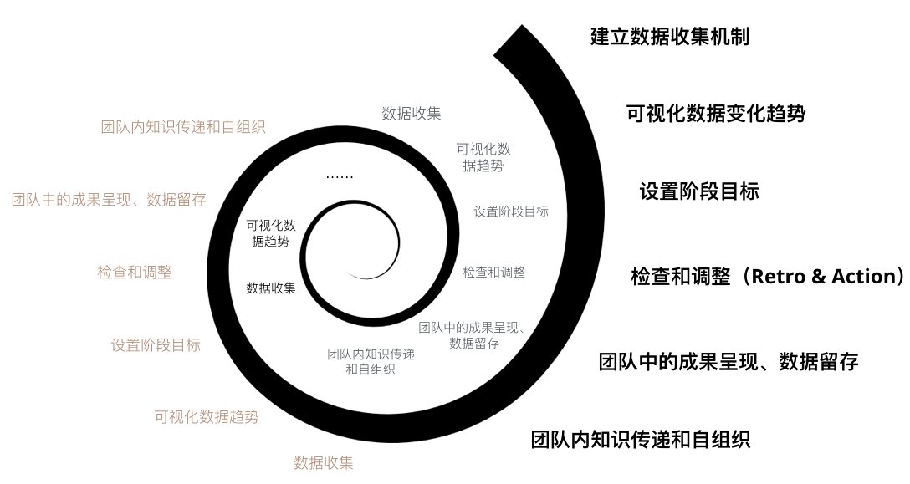

“为什么越身处团队越难改进？”  

最开始我意识到这个问题的时候，那时候我读了一本叫《咨询的奥秘》的书，里面有一个“普雷斯科特腌黄瓜原则”。  
好吧，不要较真，不要记住这个别扭的原则名字。名字根本无关紧要，这本书的风格是在讲故事，里面的名词大部分对应的故事叙事主题。  
这个原则的名字，并没有分享性，更没有Brook's Law这样带有明确的理论体系。  
因此，每次我提到它的时候，只说成“腌黄瓜原则”。  
<!-- more -->

##### 腌黄瓜原则
_故事大体是这样的：_  
> _从前有一根倔强的黄瓜，被普雷斯科特爷爷放在了卤水桶里。它看了看其他的黄瓜，对它们身上发生的事情十分厌恶。_  
_“真是要了命了”，它骂道，“你们这帮黄瓜都怎么啦？一点骨气都没了吗？有自尊的黄瓜不会随随便便不经过抗争就被腌了。”_  
_“那我们能做啥呢？”黄瓜们问到。_  
_“你可以抵抗啊，这就是你能做的。这也是我要做的，我不会让卤水进入我的皮肤的。”_  
>
> _而若干时间之后，普雷斯科特爷爷的腌黄瓜就做成了。_  
> _“孩子，别傻了。如果你在卤水里呆得够久，就变成腌黄瓜了。”_  

_这个故事的最后，书中给了一个总结：_  
> _黄瓜被卤水腌的多，卤水被黄瓜染的少。_  
> _如果小系统试图通过长期和持续接触来改变大系统，那么最后更可能是自己发生变化。_  

_所以，作为咨询顾问，要时不时地跳出客户的环境，不要让自己被“腌”。_  

看到这一段的时候，我本人正身处于绝对的交付一线中，并不能像咨询顾问一样，时不时跳出项目环境。  
因此，那时候我总是渴望有几个新的“新鲜黄瓜“进来，搅动这桶卤水，我们这些”身残心不残的黄瓜们“也顺势可以做一些项目和团队改进的事情。  

也许有人要问：“为什么不渴望的是一个外部的咨询顾问过来，搅动你们从而完成改进？”  
作为一个专业服务以及咨询公司中的一员，我深知在所有的改进和持续完善中，真正能依赖、最后落地的 —— 其实是冲在一线的这个团队成员们自身。  
于是，这个“卤水效应”，仿佛让自我救赎变成了一个不可能完成的事实。  

再后来的一段时间，我真的获取到了跳出“卤水”的机会，接触到了有意思的环境和机会。当再次回头来做改进的事情的时候，我又读到了《丰田模式》。  
在其“拨云见日”中，提到了人类的适应能力。  
##### 人类的适应能力 
_书中有这样一段（源自章节“拨云见日”）：_  
> _乍一看到某个作业流程，我们很容易将所看到的景象与有益的或必需（创造价值）的工作混为一谈。人们都在忙碌，他们行色匆匆，他们努力“做事”，因此看清他们的真实状态绝非易事。_  
> 
> _如果作业流程混乱不堪，我们很容易对真实的状况、什么可以做到及什么不可以做到得出错误的结论。适应周围环境的能力是人类生存必需的特征之一，所幸我们都具备这一能力，然而，正是这种适应能力，使创建精益流程的工作异常艰难。_  
> 
> _从本质上而言，我们会适应周围的环境，并在很短的时间里接受环境，并视之为“正常”而不再予以考虑。在很多情况下，我们会把这种情况当做我们“应该做的事情”。幸运的是，我们可以摆脱这种模式，当从另外一个角度来看待这种情况时，我们的理解便会更深一步。运用精益理念和工具将迫使我们从不同的视角重新审视环境。如果我们的头脑能够接受新的信息，那么真正的转变就可能发生。_  

_还有相似的这样一段（源自章节“站在圆圈内的练习”）_  
> _具有讽刺意味的是，如果你对练习中的流程已十分熟悉，那么这项练习的难度就更大。因为，你已了解浪费存在的“原因”，所以你更倾向于使其合理化，并得出无法改进的结论。在练习中，最好的方法是承认存在浪费，而无须对其做出解释或思考解决之法。_  

书中这两处描述的场景，看起来跟前面“腌黄瓜的卤水效应”有异曲同工之处。然而，《丰田模式》这本书讲述的跟《咨询的奥义》不同的正是 —— 不只是自己跳出卤水之外，而是身处环境中如何完成自我救赎的事。  

所以，当深处团队中改进，我们需要的是什么？“不同的视角重新审视环境”，找到正确的理念和工具，当然还有一系列整体优化等后续。虽然我最近的背景主要是在价值交付，这篇文章我就不延伸讲了。稍微大白话来说的话，就是“不仅要低头做事，还要抬头看路”；精益一点，就是“要定义价值，消除浪费”。  

也许，有人说到 —— 这篇文章前面讲到的我都懂，但当冲在一线的时候，往往那巨大的压力就是没办法、也没有时间去做好价值定位、改善的事情，那些总是排不上优先级。  
好吧，我这里再次借用曾经看过的另一本书中的一个理论：首先支付自己。（由于不是跟软件开发的书籍，这里就不引用了。有兴趣的小伙伴可以使用关键词查询）  
这里借鉴一下，改为“首先投资自己”。  

##### 首先投资自己
_原本“首先支付自己”的故事是这样的：（是一条财富的增长思路）_  

_每个月的薪资发下来的时候，人们习惯于先还信用卡、缴房租、缴各种费用、支付，最后剩下来的才考虑投资、理财。而往往最后却剩下的可能只是空气，这样月复一月、年复一年，选择这样做的人们仍然是靠着每月薪资度日，永远与资本性盈利增长绝缘，一旦失去工作，基本几个月断粮，或者吃存款的份儿。  
因此，为了避免人们是为了生存而工作，日复一日别无选择，就提出了“首先支付自己”的思路。  
也就是，在每个月薪资发下来的时候，先划出优先投资、理财的那部分，剩下的才考虑还款、缴费、支付。不仅可以保障长期的财务投资的同时，在剩下的钱不够用的时候，也可以激励人去创造更多的价值盈利。_  

这里借鉴一下。  
在一线的时候，团队总是被盲目地BU、stories、bugs追着跑，耗掉了大部分的时间，总说用剩下的时间来做价值审视和改进。往往最后剩下的时间可能都是负数，引以为傲的敏捷、精益、价值交付都被抛之脑后。团队在养活自己的边缘挣扎，每日忙忙碌碌、行色匆匆、“努力”做事，最后我们把自己从专业服务做成了外包，日复一日别无选择。团队里的客户也把自己从企业数字化方案推动者做成了外包人员manager。  
所以，当有压力来的时候，请先抗住压力，确保有效的时间来投资团队和价值体系。  

#### 总结
克服”腌黄瓜原则“，克服”人类的适应能力“，保证”首先投资自己“。  
至于怎么做？这不是本篇文章的范围，也许下一篇涉及价值交付的文章中提及。  

最后放一张本人最近画的团队改进图 —— 借鉴自”精益持续改进的螺旋循环图“。  
随便看看，这里不会有说明。就是为了凑图来的 😁  
