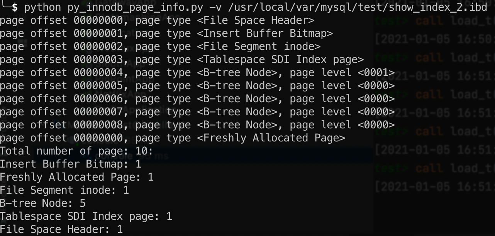
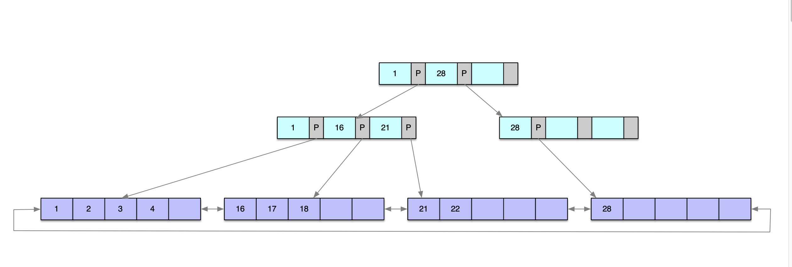

> 关系型数据库系统的世界是非常复杂的 —— 如果我们思考一下我们需要做哪些事情才能满足SQL语句的查询需求，就能意识到这种复杂是必然的。但具有讽刺意味的是，书写SQL是如此简单，表、行与列的概念也非常容易理解。
>
> ​	—— 《数据库索引设计和优化》

<!-- more -->

### 1. 页 (Page)

页，是数据库数据存储方式的逻辑结构。

Innodb 采用将存储数据按表空间（tablespace）的方式进行存放。如果没有开启 `innodb_file_per_table` 设置，新的表的创建会保存进默认的系统共享表空间。

```
mysql> show variables like 'innodb_file_per_table';
+-----------------------+-------+
| Variable_name         | Value |
+-----------------------+-------+
| innodb_file_per_table | ON    |
+-----------------------+-------+
```

当 `innodb_file_per_table` 等于 `ON` 时，会给每个表创建独立的数据文件。

比如，在数据库 `test` 中创建一个表 `show_index` ，在mysql 的 dataDirectory 目录下就回出现一个名为 `show_index.ibd` 的数据文件。

在单个表的数据文件中，数据就是以多个页的形式进行排列。MySQL默认配置下，每16K，即为一个页。

借用了《MySQL技术内幕Innodb存储引擎》作者的工具`py_innodb_page_type.py`，可以查看到单表数据文件的页组成：




MySQL中数据页和索引页，都被归类为B Tree Node类型，严格来说应该是B+ Tree Node。

### 2. B+ Tree Node

B+ Tree概念，需要区分二叉树（Binary Tree）、二叉查找树（BST）、B-Tree（B: Balance）。

在MySQL innodb中，叶子节点页的page level为0，非叶子节点页的page level > 0。



上图是一个聚集索引的B+ Tree图。

1个B+ Tree Node，占据一个页。  

- 在索引页，页的主要记录部分(`User Records`)存放的`Record` = `record header` + `index key` + `page pointer`。
- 在数据页，则是按表创建时的`row_format`类型存放完整数据行记录。
  row_format类型分别有：`Compact`、`Redundant`、`Compressed`和`Dynamic`。

因此，在聚集索引中，非叶子节点都为索引页，叶子节点为数据页；

在辅助索引中，非叶子节点和叶子节点都为索引页。不同的是，叶子节点里记录的是聚集索引中的主键ID值。

注意，在索引页的Record中的`page pointer`，指向的是页，而非具体的记录行。并且Record的`index key`，为指向的page records的起始键值。

#### 2.1. 聚集索引 (Cluster index)

MySQL将数据存放在聚集索引的叶子节点中，由索引进行组织。因此也可称为，数据即索引，索引即数据，在整个页分类中，都被列为`B+ Tree Node`。

图2 即是一个完整的聚集索引的B+ Tree结构展现。


在叶子节点是如何实现双向链接的结构，可以详细看下页内的组织分布。

在表空间文件的一个页的结构上，内容布局为：


在聚集索引中，数据页内除了按照主键大小进行记录存放以外，在`File header`中，有两个字段：`fil_page_prev` 和`fil_page_next`, 分别记录了上一页/下一页的偏移量（offset），用以实现数据页在B+ Tree叶子位置的双向链表结构。

### 3. 数据检索

通过B+ Tree结构，可以明显看到，通过B+ Tree查找，可以定位到索引最后指向的数据页，并不能找到具体的记录本身。

这时，数据库会将该页加载到内存中，然后通过`Page Directory`进行二分查找。

#### 3.1. Page Directory

`Page Directory`是该页存放的`User Records`的一个稀疏目录，存放的内容是Record在页内的相对位置。每两个字节，记录一个相对位置，从邻近`File Trailer`的位置开始倒排存放。


`Page Directory`中每两个字节，代表一个目录槽。在上图中，一共有6个槽。

在页首的`Page Header`部分有一个`Page_N_Dir_Slots`的字段 —— 同样记录了目录槽的数量。


一个目录槽，对应按序的多条记录。记录的相对位置，指向这批记录的第一条记录。

每条记录都有`Record header`, 但目录槽 指向的第一条记录的`Record Header`中第4~8位（bits），是`n_owned`值，代表该目录槽中拥有的记录数量。

`Record header`的组织结构：


比如下图，一共有6个目录槽，大部分目录槽中有4条记录。


### 4. 总结

MySQL Innodb通过页组织成的B+ Tree Nodes结构 和 Page Directory，完成了具体记录的检索。