Docker container 和 JVM的问题诊断，从来都不是静态的，所有来源数据都是一个动态的过程。
一个时间点的快照数据、或者一个单一数据项的字面值，并不能充分进行上下文分析，而是需要一段时间内持续的观测和数据获取，然后在时间维度上的纵向对比、不同实例间的横向对比等等手段，最终定位问题。


如下图中，资源利用率 —— 可能是docker CPU/Mem、JVM CPU/Mem、磁盘/网络IO、线程数等等。

- 图1：在时间段上，根据使用量和压力峰值的分布，资源空闲量充足，无资源利用率瓶颈；所有实例表现一致。
  一般，图1 这种正常态会作为基准值来参考。

- 图2：随着压力峰值时的量变，资源利用率超过阈值（80%），但峰值过后，资源得到逐渐释放，利用率得到回落；所有实例表现一致。
  面对这种压力超过阈值的情况，一般就是开源 或者 节流的解决方式：1. 增加资源额度；2. 分析资源的top customers, 优化代码，节省资源的使用。

- 图3：相同应用的不同实例中，有一个实例的利用率明显区别于其他实例。
  面对这种情况，在确认负载均衡、部署设施都一致的情况下，需要拿取问题实例的容器内、JVM内的各项细节数据进行横向对比和分析。
  
- 图4：资源利用率与使用量和压力峰值不呈现直接的正相关关系；所有实例表现一致。
  这种情况，需要拿取容器、JVM内的细节数据与基准状态（比如升级前的线上版本）进行纵向对比和分析。

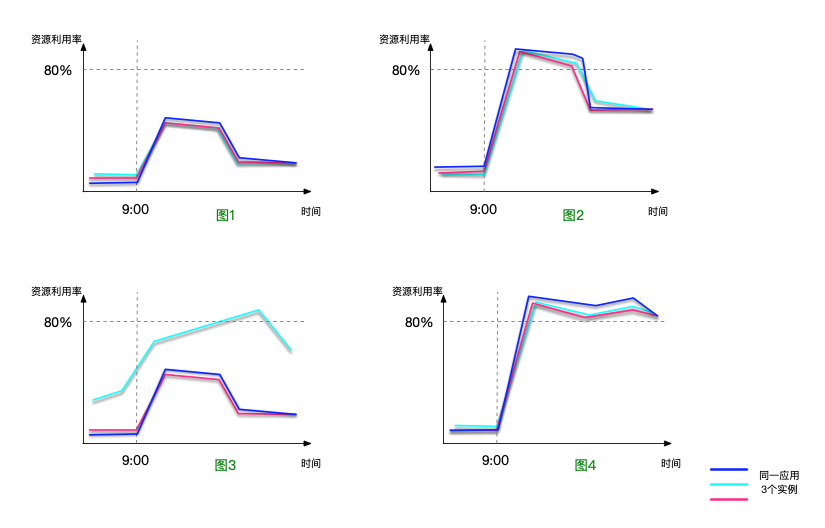

docker JVM出现性能问题时，一般会表现为以下几个方面：

- 内存利用率高出阈值
- CPU利用率高出阈值
- 整体性服务请求响应变慢 或 超时

注：由于此篇指南对应线上部署环境的Docker JVM，除了线上监控工具提供的监视数据以外，涉及到图形化分析工具的使用方式都是离线分析，
并且不涉及各云特色的诊断工具。

## 1. Docker container CPU / 内存高

当发生docker container CPU / 内存高的情况，首先需要确认，是哪些进程在占用容器资源。除了JVM外，是否还有其他大量占用容器资源的进程？  
如果系统没有接入性能监控平台，或者监控平台数据不直观时，可以在docker container内使用一些 Linux 命令。  
推荐Linux工具和命令：  
- top
- iostat
- vmstat

### 1.1 top工具
top是Linux下常用的性能分析工具，能够实时显示系统中各进程的资源占用状况。
```
$ top -c
$ top -Hp <pid>
```

__含义：__
- top 罗列出当前系统中的资源状况，以及进程数量、列表，并且实时刷新，`-c` 选项，显示完整的进程启动命令行。
  top 监控支持交互的形式，具体操作查询linux top使用方法。
- 当获取到 `pid` 后，想要查看具体 pid 进程的资源消耗，以及进程内的线程列表，可使用`-Hp <pid>`。
  H代表 lightweight，切换到此模式，所有Task显示的进程内的Thread数量，清单列表显示的线程清单。

__注意：__ 
在docker中运行top命令时，`CPU%` 和 `MEM%` 是基于docker host物理机的“总CPU”和“总物理内存”的百分比。

### 1.2 iostat工具
iostat是I/O statistics的缩写，用来动态监控磁盘的活动。
```
$ iostat -d -x -k 1 10
```
__含义:__

- `-d -x -k 1 10` 显示磁盘，显示详情，以KB为单位。1秒刷新一次，刷新10次后退出。

确定了主要占用资源的进程后，针对不同的进程服务类型，使用不同的分析工具。
下面主要列举了Java JVM性能诊断。

## 2. JVM 内存利用率高

### 2.1 JVM Memory分配现状

JDK自带的两个工具的用法：

- `$ jmap -heap <pid>`

- `$ jstat -gccapacity <pid>`
  `$ jstat -gc <pid>`

### 2.2 内存泄露

在不存在内存分配问题的前提下，内存持续偏高时，首先需要排除是否是内存泄露。

如何确认是否存在内存泄露：

- 查看HeapDumpOnOutOfMemoryError
- 查看GC状态
- 多次主动生成dump 
- 分析工具 MAT / VisuaVM / JProfiler

#### 2.2.1 HeapDumpOnOutOfMemoryError（内存溢出）

当程序运行过程中，申请对象内存超出剩余可用内存时，则会发生内存溢出异常。
存在内存溢出时，原因上有一定可能 —— 程序中存在内存泄露，对象被错误引用而造成始终无法释放、占据内存。

一般在生产环境的 `JVM Options` 的配置中，都会带有几个如下配置。（如果没有，务必添加）
  ```
  -XX:+HeapDumpOnOutOfMemoryError
  -XX:HeapDumpPath=/heapdump/out_of_memory_error/logs
  ```
__含义__：
- 在运行时发生 `OutOfMemoryError` 时，会输出heapdump文件，文件地址位于 `/heapdump/out_of_memory_error/logs` 此路径下。


存在内存溢出时，根因不一定是存在内存泄露，也有可能是资源压力遭遇瓶颈。
程序在抛出 OutOfMemryError 时，message中会注明原因，比如`Java heap space` 等。
通俗来讲，JVM会抛出 OutOfMemryError 的内存区，不只是堆，一共包含堆、非堆（Metaspace）、堆外（直接内存）、栈四个部分。

__关键概念__:
JVM内存结构划分：
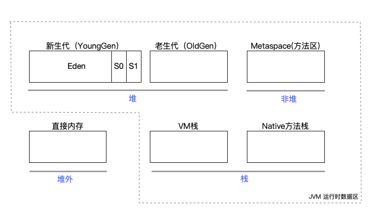

实际上，除去上面6块以外，还有一个程序计数器。但程序计数器占用内存较少，并且不会抛出OutOfMemoryError，这里忽略。
当抛出OutOfMemoryError时，从程序日志中获取errorMessage，从而可以快速定位是哪块内存区域出现了问题。
在不存在内存溢出的情况下，内存长期居高不下，这时可以根据不同内存区域的内存使用率和回收率进行预判。
如：

- 图一，堆内存的利用量高，造成CPU频繁GC。
- 图二，Metaspace 和 堆对内存利用量正常，同时CPU并无频繁GC。JVM 总内存利用量依然很高，这时需分析栈内存的占用情况。
- 图三，JVM 总内存利用量正常，CPU无频繁GC。在排除了非JVM之外的程序占用外，需分析直接内存的占用情况。

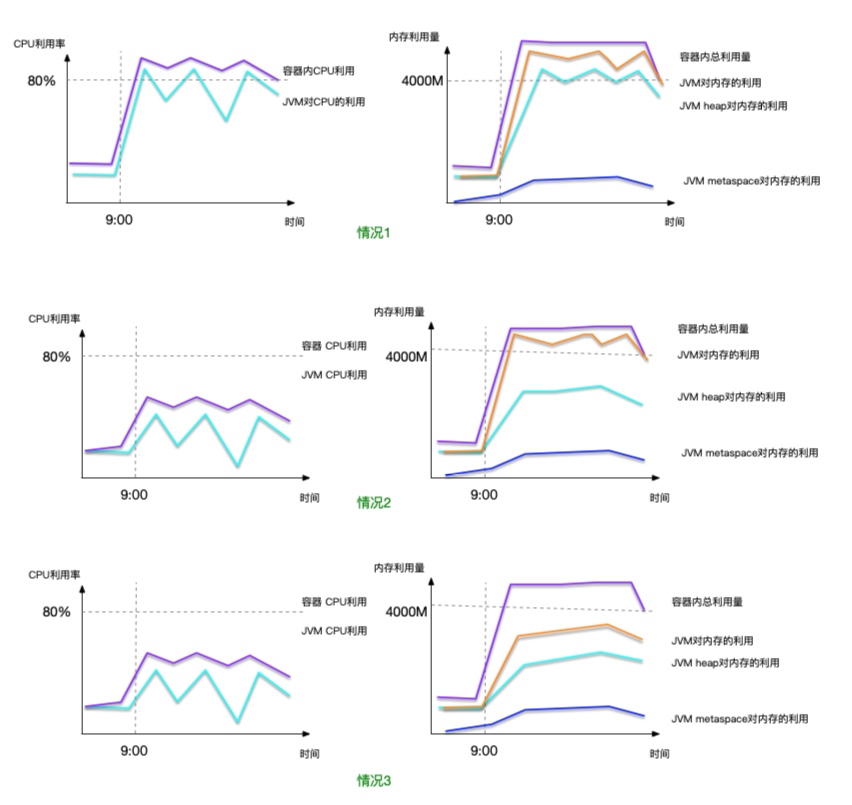

#### 2.2.2 查看GC状态

查看GC状态，可以在没有OutOfMemoryError来源的情况下，快速定位`堆`和 `MetaSpace` 的内存使用量、回收效果、平均常驻容量等等，以此来推断内存对象在新生代、老生代和 MetaSpace 的用量和瓶颈。
一般在生产环境的`JVM Options` 的配置中，会带有如下几个GC配置。

  ```
  -XX:+UseGCLogFileRotation
  -XX:NumberOfGCLogFiles=10
  -XX:GCLogFileSize=100M
  -Xloggc:/heapdump/gc/logs/gc.log
  -XX:+PrintGCDetails
  -XX:+PrintGCDateStamps
  ```

- 前三行：GC日志每个文件大小：100M，最多保留10个文件，超出则使用替换覆盖的策略。
- `-Xloggc:/heapdump/gc/logs/gc.log` ，GC日志路径在`/heapdump/gc/logs/`文件夹下，文件名以`gc.log`为前缀。
- 后两行：打印GC时的详情，打印GC日志的时间戳。

有了这些配置之后，JVM在启动之后，会输出GC日志。

>
> 2020-12-04T17:13:17.280-0800: 22845.509: [GC (Allocation Failure) [PSYoungGen: 581178K->16640K(611840K)] 925472K->909807K(1511936K), 0.5084573 secs] [Times: user=0.36 sys=0.57, real=0.50 secs] 
>  
> 2020-12-04T17:13:17.789-0800: 22846.017: [Full GC (Ergonomics) [PSYoungGen: 16640K->16388K(611840K)] [ParOldGen: 893167K->892384K(1358336K)] 909807K->908773K(1970176K), [Metaspace: 44412K->44412K(1091584K)], 0.5756780 secs] [Times: user=2.70 sys=0.19, real=0.58 secs] 

其中最需注意的是，GC类型-原因、一次GC后内存回收的效果、GC时长。
- `GC (Allocation Failure)`：GC类型 - Young GC，原因 - 内存分配失败。
- `PSYoungGen: 581178K->16640K(611840K)`：新生代从 581178K 降到 16640K，当前新生代总大小 611840K。
- `925472K->909807K(1511936K)`: 堆从 925472K 降到 909807K，当前堆总大小 1511936K。
- 此次GC执行时长0.5084573秒。此时间是物理感知的绝对时间，与后面的real相同。
  
- `Full GC (Ergonomics)` GC类型 - Full GC，原因 - 内存调整，具体由垃圾回收器类型决定。
- `ParOldGen: 893167K->892384K(1358336K)`: 老生代从 893167K 降到 892384K， 当前老生代总大小 1358336K。
- `909807K->908773K(1970176K)`: 堆从 909807K 降到 908773K，当前堆总大小 1970176K。
- `Metaspace: 44412K->44412K(1091584K)`: metaspace 从 44412K 无下降，当前 metaspace 总大小 1091584K。

关键概念：

- 垃圾回收器类型。
  -XX:UseParallelGC 是JDK9之前server模式下的默认回收器，使用的是Parallel Scavenge +  ParOld 的收集器组合进行内存回收。
  即新生代是GC多线程、标记-整理的GC算法，老生代是GC多线程、标记-整理的GC算法。
  此款垃圾回收器，是以吞吐量为目的，即在执行垃圾回收工作的同时，尽量让应用系统被阻塞更短的时间。
  `吞吐量 = （运行用户代码的时间）/ (运行用户代码的时间 + 运行垃圾回收的时间)`
  同时，在CMS/G1之前的通用垃圾回收器，都有JVM申请内存之后不会归还给系统的问题。在CMS得到缓解，G1已经可以做到及时归还。
  
- MinorGC（YoungGC）\ MajorGC(Full GC)。
  Full GC 实际上可以对堆（新生代+老生代）、metaspace、直接内存都产生垃圾回收效果。特别是直接内存，虽然直接内存使用的是JVM外部的内存空间，但对象句柄引用最终是放在JVM堆中，因此在full GC释放掉堆内的对象引用时，也可以造成直接内存释放的效果。

查看GC状态也不是仅看某个时间点的快照值就可得出问题结论，也需要沿着时间轴观察一段时间下的GC效果。
比如，上面的例子中，可以看到第二次Full GC几乎没有什么回收效果，背后可能是大量耗费内存的请求压力造成的，这时候就需要在压力峰值降下来再次观察。

这时候，如果有线上GC的状态监视工具，可以直接查看此段事件的GC数据。如果没有监视工具 或者 GC分析数据不全，可以将GC logs导入到本地的离线分析工具，比如[GCViewer](https://github.com/chewiebug/GCViewer)。

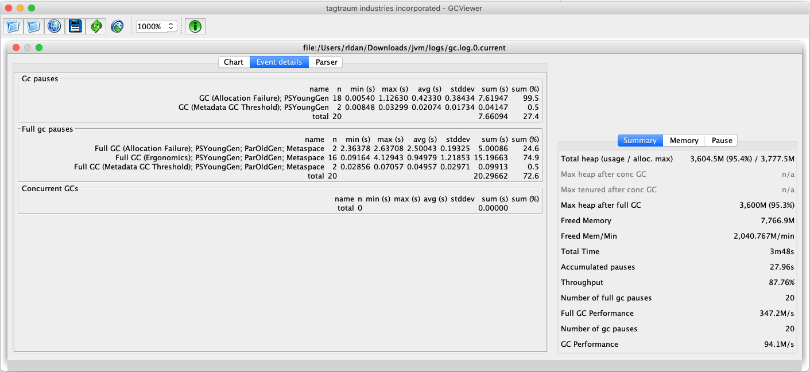

  
还有一些工具提供实时监控heap状态：

```
$ jstat -gcutil <pid> 1000 100
```

__含义：__ 
实时监控JVM 堆使用大小、GC的次数和时间。每1000毫秒刷新一次，一共刷新100次。


通过查看GC状态获知内存被大量分配的是哪几个区域，各区域的增长速率、gc触发的频率和耗时。


#### 2.2.3 手动生成 heapdump 文件

当无 `OutOfMemoryError` 产生，但内存利用率异常时，可以使用 `jcmd` 手动生成 / 获取heap dump文件。

  `heapdump` 文件是当前JVM容器的内存分析快照，一般尝试分析内存问题时，需要在不同维度多次生成 heapdump 文件，用以横向对比（不同JVM之间）或者 纵向对比（同一JVM不同时间阶段之间）。

  ```
  $ jcmd -l
  $ jcmd <pid> GC.heap_dump /tmp/java_pid<pid>.hprof 
  ```

  __含义__：

  - `jcmd -l` 展示所有 JVM 进程，通过该命令获取application的进程id。
  - 根据pid，使用命令 `jcmd GC.heap_dump` 生成heap dump到目标文件路径。
    该命令默认生成 `live objects` 的数据，因此在生成dump文件前，会执行一次full GC。如果不想强制执行full GC，则可以带上options `-all`, 这时会生成所有 `objects` 的数据。

   

#### 2.2.4 分析Heap dump文件

分析heapdump文件的目的，是为了获取最有嫌疑的占用内存的大对象 或 多数对象以及上下文。

  常用的开源免费工具有 MAT、VisualVM、JProfiler。

  - MAT（Memory Analyzer Tool），出自eclipse，可以单独安装使用；

  - VisualVM，部分JDK自带。不带的版本，需要另行下载安装；

  - JProfiler，已经与Intellij IDEA集成，可以直接在Intellij IDEA上使用；

    
对于离线分析，MAT优势比较大，优先推荐。MAT提供更详细和直观的 Leak Suspect report 和 Top Components report，在工具台中还可以交互进行更细节的定位。
 

__Lead Suspect report__ 中主要关注几个部分：

__1. Leak Suspect report的全局图__

  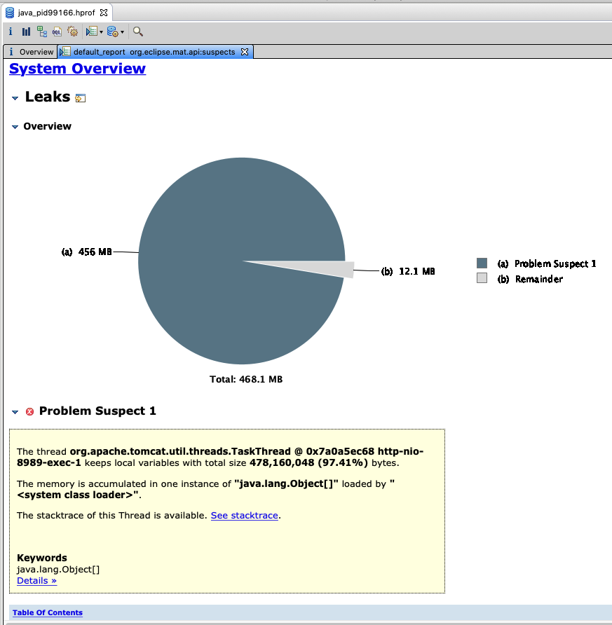

  __图中含义__:

  在tomcat线程运行时，有一个对象实例 `Object[]` 拿住了456M内存，占用堆内存的97.41%。该实例不一定是内存泄露，但作为消耗内存的大对象，依然值得排查。


点击最下面的链接 `Details >>` 可以查看分析详情：

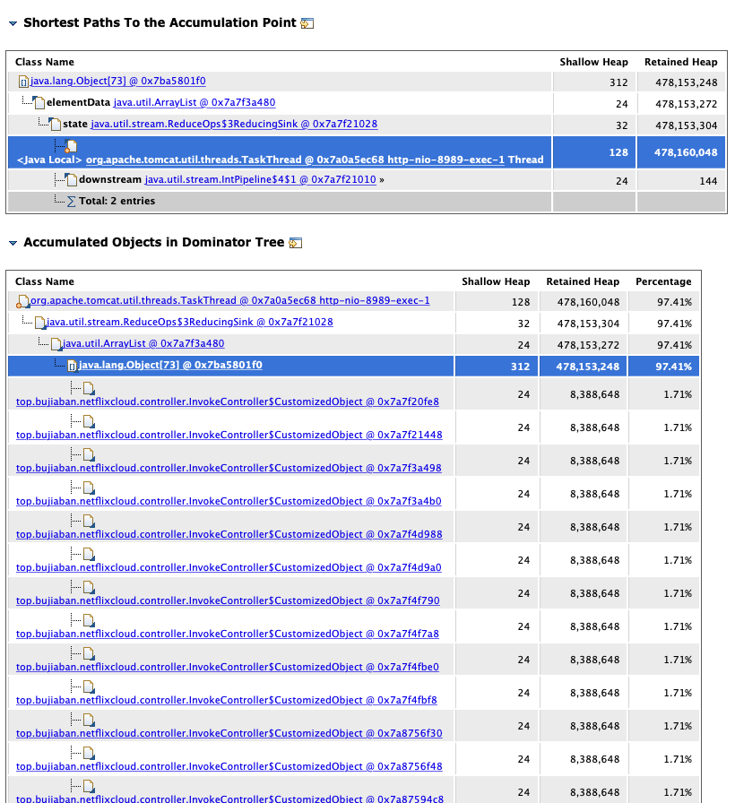

`Details >>` 一般分为几项：

- Shortest Paths To the Accumulation Point：从GC roots 到达 `累积点` 的最短路径；

- Accumulated Objects in Dominator Tree：显示累积对象的 `Dominator Tree` (统治者树)；

- Accumulated Objects by Class in Dominator Tree：显示累积类的 `Dominator Tree`（统治者树）；

- All Accumulated Objects by Class：显示累积类对应的实例数量和一共占用的Shallow Heap。

__关键概念：__

  - Shortest paths
    在Java回收机制中，使用的是可达性分析算法。对象是否要被GC，需要运算从GC roots对象开始，搜索引用链，以此证明该对象不可达。不可达的对象，会被垃圾回收，如果该对象无法被回收，则存在内存泄露。

  - Dominator Tree
    当对象`Object B` 被 `Object A` 引用而造成无法释放的情况，这时候`Object A` 就是 `Object B` 的统治者。

  - Shallow Heap & Retained Heap
    对象自身占用的内存大小，即是Shallow Heap。
    如果：对象`Object B` 被 `Object A` 引用而造成无法释放的情况（Object B 不再引用其他对象），这时候
    `Object A Retained Heap = Object A Shallow Heap + Object B Shallow Heap` 

当获取了Leak Suspect对象以及类型, 以及上面的 `Details` 项，在对这些类型背后的代码获得了解的情况下，很容易找到是哪部分代码执行过程中出现了偏差 —— 注意，仅是执行过程中出现偏差，不一定是问题的根因。
在JVM中所有线程和任务对于CPU、内存、磁盘的资源占用都是共享的，因此问题的根因需要再次推导。

当然，也有比较简单的场景，可以只指根因的。

__2. Top Customers__

在MAT  `Leak Suspect report` 中除了可以查看Lead suspect objects，还可以通过 `Top Customers` 目录查看更多的内存消费者排行。

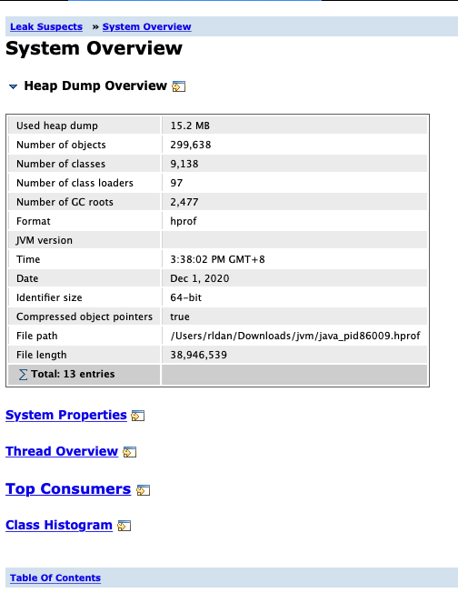

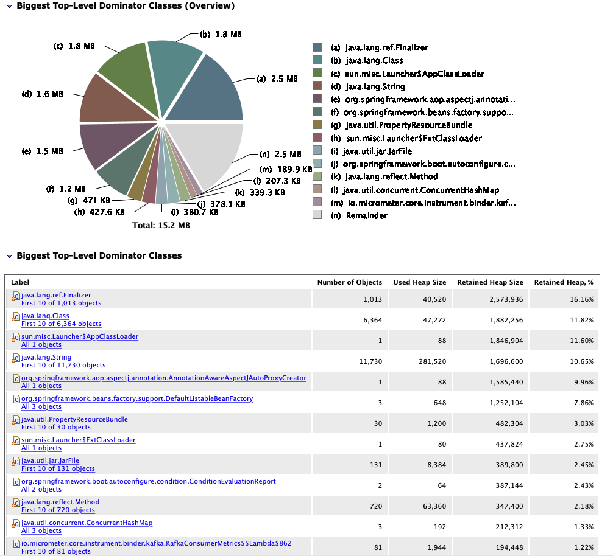


__3. 辅助查看部分Class Histogram和Thread Overview__

`class Histogram` 类直方图，按Retained Heap排序，体现JVM class生成了多少实例，并且占据了多少内存。

由于展示图的顶层大部分是Java内部类型，缺少必要的诊断上下文，因此按内存占用大小挨个查看。
在有具体的聚焦对象时，可以作为辅助工具查看。

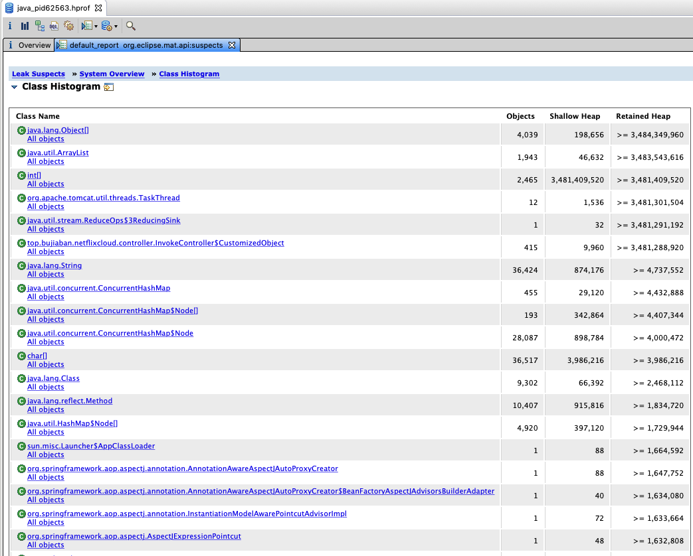

比如，上图中shallow Heap占用特别大的`int[]`，在MAT工具中，可以通过点击`list objects-> with incoming reference`，显示其实际被哪里引用，从而查找到 hold 住这块些内存的程序位置。
下图是最简单的API controller hold住内存，因此容易查找和定位。而如果是跨API的框架和基础设施代码，则需要进一步的分析和定位。

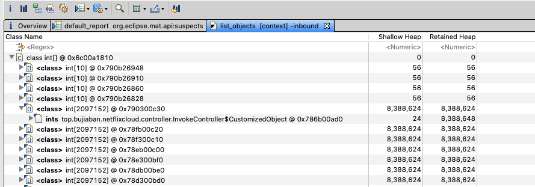

`Thread overview` 线程总览，可以看到所有线程的状态。
由于内存对象的GC roots并不一定是线程，所以此图仅对发现`Dominator`是线程的对象内存有效，一般作为辅助查看。
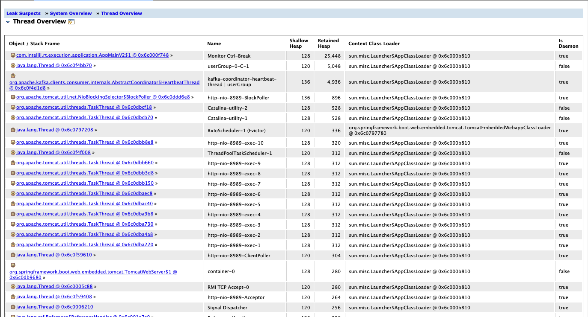


## 3. JVM CPU 利用率高

### 3.1 首先查看JVM中是哪些线程对CPU的占用率高

使用Top命令行：

```
$ top -Hp <pid>
```
查看CPU占用高的线程ID，记录下这些线程ID。

### 3.2 使用jcmd dump thread

使用jcmd命令行：

```
$ jcmd $pid Thread.print > ./manual.tdump
```

### 3.3 将之前记录的线程ID，进行十六进制转换

Linux原生命令行：

```
printf "%x\n" <tid>
```

### 3.4 将Threaddump文件导入`TMDA`工具

[TMDA](https://www.ibm.com/support/pages/ibm-thread-and-monitor-dump-analyzer-java-tmda)工具，IBM线程离线分析工具。

打开 `Thread Details`, 使用16进制的 threadID 在`NativeID`（dump源文件中是`nid`）对应查找到线程状态、调用栈。

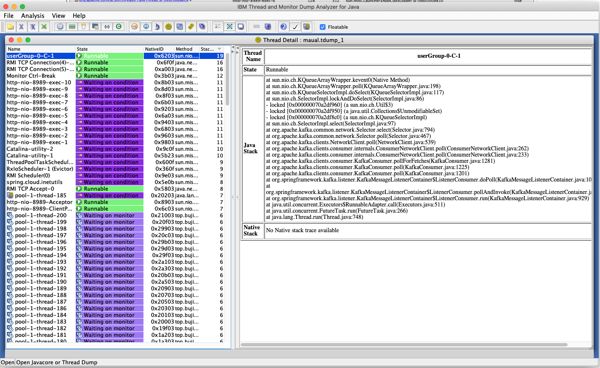

通过分析调用栈，获取相关线程执行的程序位置。
当可疑线程是GC线程时，结合内存分析工具一起诊断。

如果单次 threaddump 分析结果无可疑，可以通过多次生成 threaddump 文件进行时间上纵向对比。

