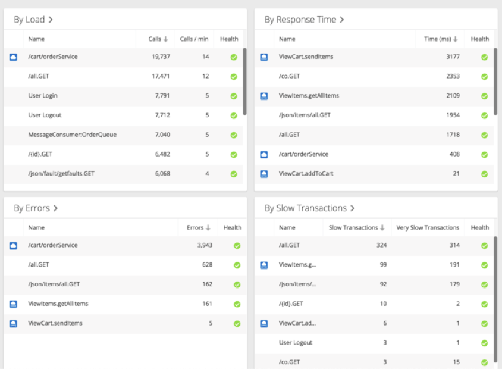
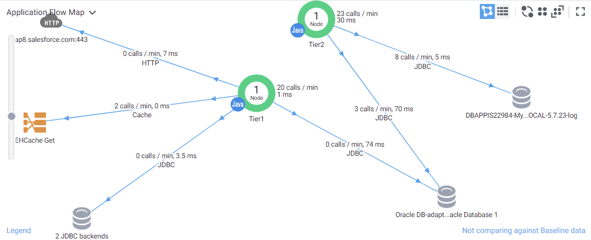
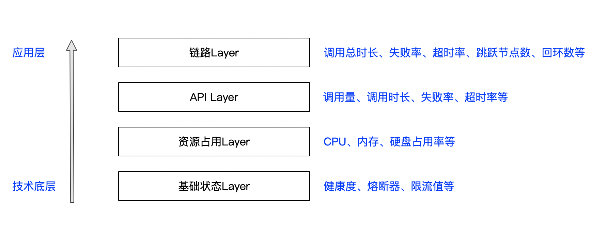

微服务架构已经是时下后端应用开发的主流架构之一。微服务的整个生命周期包括`微服务拆分和定义（产品规划）`、`微服务研发`、`微服务构建与部署`、`监控与运维`几个阶段。

对于一般企业的微服务改造而言，极少部分企业认为用上微服务概念 + Spring cloud套件就是整活微服务架构了；一部分企业还能认识到针对微服务构建和部署所必需的DevOps流水线或平台；接着，越来越多的企业开始接受支持微服务拆分和设计思想的`Domain Driven Design`；在完成前三步的基础上，最终还有少部分企业意识到线上分布式系统带来的复杂性，需要进行微服务线上治理——分层次的监控、诊断及最终的治理方案。

这里就主要从可观测性、层次性、时效性上，聊聊微服务线上治理中的监控。

<!-- more -->

### 系统运行时的可观测性

微服务线上治理的前提——采集线上运行时数据，让系统状态与流程可被实时度量和监控。

管理学之⽗德鲁克曾经说过:“如果你无法度量它，就无法改进它。”

然而对于今天——在各系统存在各种五花八门、各式各样、大量指标数据的当下，如何整合这些指标，在度量的同时，提升整个系统运行时的可观测性，以达到及时地发现问题、定位问题的目的，才是微服务线上治理的基础。

理论上，问题越早发现、越早修复，可以越节省研发成本。一些微服务的问题，在规划、研发、构建等阶段，可以通过线下微服务治理的方式提前解决掉。

然而，对于微服务能力不同、或者理解不同的各企业和团队来说，部分团队需要等到系统被部署到线上运行时才能真正发现和正视问题。

当你面临的团队，不追求clean architecture、不写测试、不坚持重构、没有性能测试和联调测试、甚至没有太多有经验的开发，这时候，线上系统监控将成为最后的反馈堡垒。

因此，带有观测性的线上监控能力是各个微服务团队必不可少的“看家”工具之一。

业内能做到线上监控的开源产品和商业产品不一而足。大家可能见过下面这样的（监控微服务状态、微服务之间调用等）：

或者是，监控 服务对资源CPU、内存、磁盘等利用率趋势：

也有API调用量、失败率、延时时长的TopN统计：

或者，是基于动态链路技术实现的链路图：

### 监控需要分层次

看过上面四种监控示例图，相信有不少做过线上问题诊断的同事会认为：不少指标过于细，或者过于底层，对于发现实际问题和定位问题毫无帮助。

当经过详细调研分析和使用之后，本人发现这些监控模型是应该分层次来理解和使用的。

一共分为`基础状态层`、`资源占用层`、`API层`、`链路层`。

- 基础状态层：各微服务和基础设施服务（比如数据库）的生效配置及实时状态，如健康度、熔断器状态、限流阀状态、灰度状态等等。（示例图1）
- 资源占用层：各微服务和基础设施服务对资源的占用，比如微服务对系统CPU、内存、磁盘等的占用率，微服务内部堆栈对内存的利用率等等。（示例图2）
- API层：各微服务的API性能，API方式包括且不限于http restful API、messageQueue consumer等等；同时，基础设施服务，比如数据库，SQL本身可以理解为一种特殊的API，因此慢SQL统计和监控，也可以算入API层。（示例图3）
- 链路层：统计和追踪由服务请求发起的整个系统内部链路的流转，包括微服务之间、微服务与基础设施服务之间的链路。微服务之间的调用方式包括且不限于http restful、messageQueue等等。（示例图4）

越靠近`技术底层`，指标越孤立，对服务的影响面越广，越难直接定位问题；

越靠近`应用层`，指标越具象，影响面越小，越容易定位问题。

当然也有人会认为，在这种分层结构中，应该将基础设施服务单独拎出来作为一个单独分类  —— 的确也是无不可，除了链路层以外，基础设施服务可以独立完成另外三层的纵向切片。

### 监控需要时效性

在搭建监控工具 或者 接入监控平台时，面对于采集日志、指标的实时运算方式，大多数情况团队都默认监控是实时的 —— 这样能及时发现和响应问题。

并且大部分监控工具，做到了监控自动化，进行实时预警，及时通知到相关人员处理问题；或者，有部分DevOps监控平台甚至可以做到自动化AI管控，针对`基础状态层`、`资源占用层`出现的问题，使用资源临时扩容、资源切换/重启等策略进行线上自动恢复。

然而，随着Q/TPS、数据量的增长，监控服务资源升级的滞后 或 架构的不合理，监控延时的误差会越来越大。

当监控的时效性越来越偏离实时状态，团队对于系统运行时快速发现和响应问题的效率将大打折扣。

