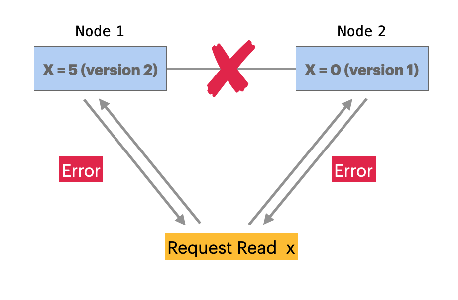
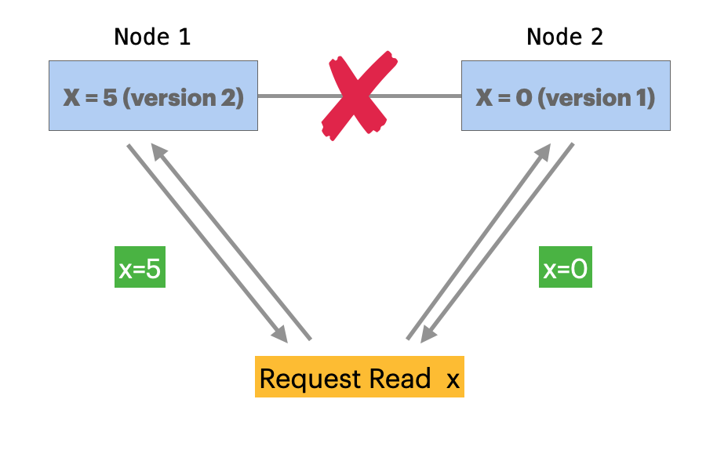
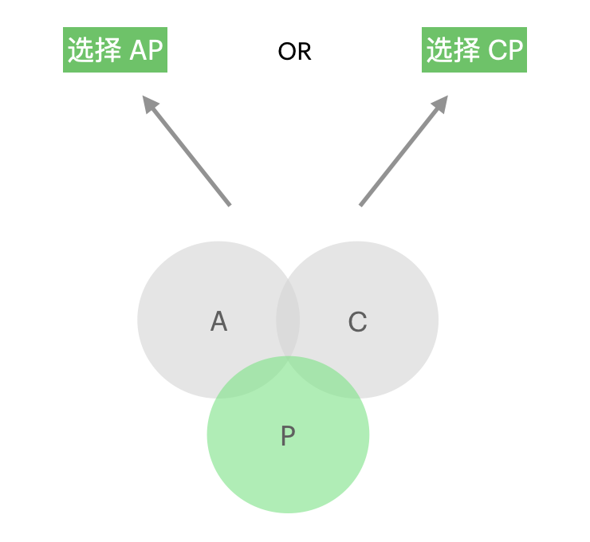
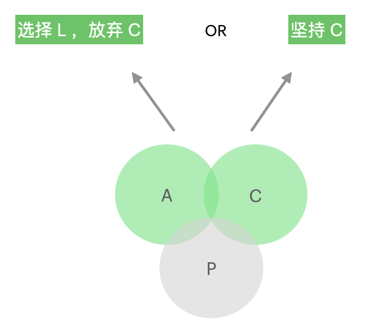
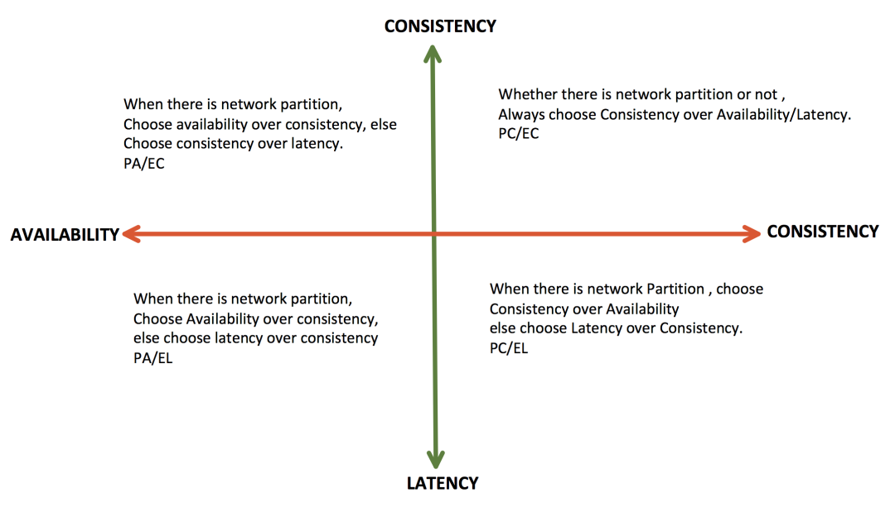

CAP定理，说起来程序员们应该耳熟能详：C(Consistency)、A(Availability)、P(Partition Tolerance)，构成在分布式数据存储中的“不可能三角”，三者只能保证其二。  
来，再展开说说？这时候，多数人的回答就会是是而非，模棱两可。  
也许不少应用级开发工程师觉得 —— 我又不自研集群数据库，也不开发云平台，没必要那么了解 CAP 理论。  
那么，你开发的应用系统，是否使用了分布式架构呢？如果是，CAP 理论可以说是指导构建系统的技术理论基石之一，必须要重视起来。
<!-- more -->

### 1. CAP 定理到底讲了什么?
CAP 定理对分布式数据存储系统的特性进行高度抽象，提炼成了3个维度：  

- `Consistency 一致性`, 每一次读取操作，要么系统返回最新的数据写入值（无论读取到哪一个数据节点），要么返回系统错误。  
这里的一致性，代表的强一致性、线性一致性（Linearizability）。

- `Availability 可用性`, 每一次读取操作都能获得系统的返回，但不保证返回的是最新的数据写入值。
  
- `Partition Tolerance 分区容错性`，当数据节点之间发生网络分区（包括网络丢包、连接中断阻塞等），系统仍然要继续工作。  

这其中的底层逻辑是：分布式数据存储各节点之间通过网络连接，在运行期间不可避免存在网络分区的风险。  
当网络分区发生时，无论是节点之间的状态同步还是数据复制，都会发生异常，部分节点的数据滞留在过去时刻的某种状态。  

而保证`分区容错性`，就是当发生网络分区异常时，整个系统仍然运行并继续工作，这时候提供的服务维度只可能在 Consistency 和 Availability 中保证一项：
  
- 确保一致性，牺牲可用性。  
    系统会通过内部策略，自动修复集群，最终确保`Consistency`声明的强一致性。在自动修复完成之前，外部请求会返回系统出错或者超时。  
    
    _上图简化了集群中的一些问题描述，比如共识算法至少需要三个节点。_  
    _当节点 2 与 节点 1 之间因为通讯异常，未能对 x 的值达成一致，此时外部请求读取 x 的值，系统将返回“系统出错”或者超时。_  

- 确保可用性，牺牲一致性。  
    系统在自动修复集群期间，没有达成数据一致性的各节点仍会对外及时响应，确保`Availability`声明的高可用性。
	 

以上，即是 CAP 理论中 CP 和 AP 的由来。  
然而，在分布式数据存储架构中，虽然网络分区是不可回避的风险，但也不意味着系统任何时候都处于网络分区的状态之下。在没有发生网络分区的时候，CA 应该是主要状态。 

有人也许会对此产生质疑：即使分布式集群一切运行正常，没有发生网络故障，但节点间的数据传输也需要时间、存在网络延时，不可能在未完成数据同步的中间状态下，既保证可用，又保证所有节点数据一致性。  
是的，这种问法很对。  
因此，针对 CAP 理论中的 C，一些专家解释：Consistency，是忽略数据复制延时的，是假设数据复制不存在延时的理论场景。  

然而数据复制的延时，在现实分布式系统运行期间始终存在，因此这时无 `P` 的 `CA` 很难与现实进行相互映射，使用时可能会造成困扰，不如理解为:  

* `Consistency` 是包含正常水平的复制延时的，这部分延时会计算在响应时间中，而不算影响 `Availability`。而当达成一致性的处理时长超出这个正常水平，才算作影响 `Availability`。  
当然，更好的解释，也许应该看下 `PACELC 理论`，可以对此场景进行补充。

### 2. CAP 的扩展：PACELC 理论

通过上面对`CAP 定理`的了解，可以总结为在分布式数据存储架构设计中，至少需要一条 baseline 策略，应对出现网络分区这种危险状况。  

在没有出现网络分区、正常运行的系统状态下，CAP 理论中的 CA 可以达成，但`数据一致性`的状态、以及隐藏在达成该状态背后的`延时时长` —— 这两个现实系统中过于常见的维度，如一双在 CAP 定理中说不清、道不明、又无处安放的小手，又该如何衡量和取舍呢？

这时候，就可以看一下 `PACELE 理论`。  
`PACELE` 是 `CAP 理论` 的扩展， `PAC` 各字母同 `CAP 理论`， `E (Else)` 仅是连接词，`L (latency) `、`C (consistency)`。意思就是，当没有出现网络分区、系统正常运行时，`低延时`（低于数据达成一致所需的平均延时水平） 和 `数据一致性`，二者需要选择其一，不能同时保证。

当有了基于`CAP`扩展出的`PACELE`，个人觉得，分布式数据存储的特性架构描述才比较完整。  
比如，MongoDB 集群的就是典型的 `PA/EC` 系统：在出现网络分区时，MongoDB 集群优先保证可用性，数据可能不是最新；在集群正常状态下，优先保证数据一致性。  
这也就防止了用户一听到 AP 架构就造成的恐慌 —— 以为系统状态正常下，程序员仍需要大量编码、自己处理数据一致性的问题。

下图是`PACELE 理论`中的特性搭配图，（横轴是发生 P 时的A or C 选择，纵轴是没有发生 P 时对 C or L 的选择）：

### 3. 为什么做分布式架构要重视 CAP 理论？

#### 3.1. 对分布式应用架构有借鉴和指导作用  
当前主流的分布式应用架构如微服务架构，在领域微服务之间不可避免地存在数据复制，比如：服务边界内实体、同时也是其他微服务的值对象；采用 CQRS 模式构建微服务；使用事件驱动架构搭建微服务等等。  
只要存在数据在不同服务之间的复制：

- 当复制机制出现连通故障、阻塞、高延迟等（比如消息组件消息堆积等），都可以近似的理解为 `网络分区`， 当发生`网络分区`时，需要有对应策略，无论是优先保证`数据一致性`，还是优先`可用性`？
- 当复制机制正常，数据同步仍存在时间成本。这时候，是优先保证`数据一致性`，还是优先`低延时`？  
虽然以上的 “数据一致性” 不一定是 CAP 中的 “线性一致性” 这种强一致性，但 CAP 理论的这种思考维度和框架，以及扩展出的分布式算法和实践，在分布式应用架构设计中，也有很强的借鉴和指导作用。

#### 3.2. 指导数据存储方案的选型  
分布式应用架构，不可避免地会面临对各种数据存储产品的选型，除了根据应用业务特性以及存储/读/写维度性能的需求，提供容量扩展、高可用的集群特性，也是必不可少的一个考察维度。  
比如，业务特性需要的是一个 PA/EC 特性的集群能力，PA/EL 特性的产品自然是不匹配需求的。  

#### 3.3. 帮助完善数据存储方案落地
前面提了集群数据库的选型，但离方案可落地仍有一段距离，需要完美适配应用的业务场景，可能除了正确执行客户端调用以外，还需要一些额外配置 或者 二次加工，才能达到某些特性目标。  

比如 MongoDB 的 readConcern 和 writeConcern，没接触过 `Quorum NWR` 算法策略的人，可能无法快速意识到 —— MongoDB 即使在 `AP` 状态下，依然可以通过客户端配置 readConcern/writeConcern 有选择地达成数据强一致性。  
而不了解 `Quorum NWR` 的，可能会舍近求远地设计出一些复杂度较高的自研策略。

### 参考资料
[CAP理论维基百科及链接](https://en.wikipedia.org/wiki/CAP_theorem)  
[PACELC理论维基百科及链接](https://en.wikipedia.org/wiki/PACELC_theorem)  