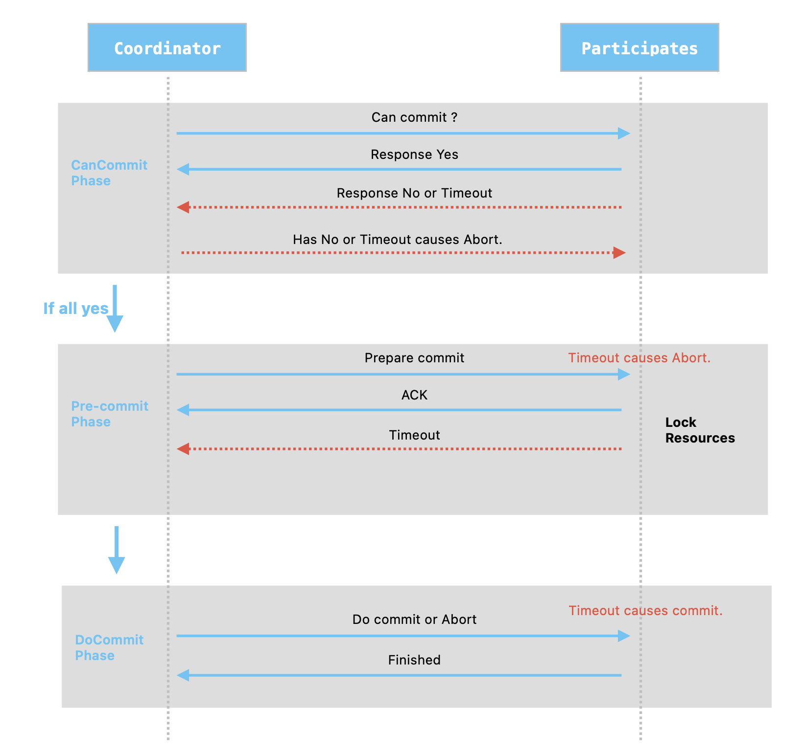

前面写了一篇关于`CAP原理`的博文，说到`一致性 Consistency`，有人往往会想到事务`ACID`特性中的`C: Consistency`，虽然都叫一致性，但完全是两个东西。  

- `CAP`的一致性指：数据库的同一复制集（replicaSet）之间数据相同。  
	_这里的“数据库”，可以是主从、主备、集群架构，但没有单机架构。_
- `ACID`的一致性指：在数据库单一实例中(暂不涉及多个数据源的分布式事务)，成功写入的数据不违反已定义的数据规则，如约束、级联规则等等。    
   _一般在`业务流程`这个上下文下，聊`数据的一致性`，通常是在聊广义的数据一致性，即`ACID`这四项，并非是`C`一项。单机数据库就是通过事务来保障`数据的一致性`。_  
接着，来通过本地事务的详细说一下`ACID`，以及跨多数据源的分布式事务。  
<!-- more -->
*注：* 文章的余下部分，提到的数据一致性，都是指广义数据一致性，即ACID四项。不再涉及`CAP`部分。

### 1. 本地事务ACID
`本地事务`，这里指单个业务服务仅操作单一数据源，完全由 DBMS (Data Base Management System)提供的事务ACID能力。
除去上面对`Consistency`的解释外，剩下的三项：  

- `Atomic(原子性)`：在事务边界内的所有写操作，要么一起成功，要么一起失败(也叫 All-or-Nothing）。  
阻止出现只有部分更新的数据异常。  
- `Isolation(隔离性)`：存在并发的情况下，不同的连接的读、写操作相互之间独立，尽量不受影响。  
从低到高分为四个隔离级别：`Read uncommitted`、`Read committed`、`Repeatable read`、`Serializable`。各数据库厂商实现方式不同，造成标准的表现性有些许差别。比如 MySQL InnoDB采用 MVCC 机制实现事务隔离，Repeatable read 级别可以防止幻读。
- `Durability(持久性)`：保证所有成功提交的数据都能正确被持久化，不会被丢失。

### 2. 跨多数据源的分布式事务
在分布式环境下，由于数据提交链路会涉及到多个数据源节点，要保证提交的数据如单机节点一样拥有事务的 ACID 特性，就变得非常复杂。
因此，分布式事务要解决的核心问题，就是如何在分布式环境中实现这些 ACID 特性。

传统的单机数据库 DBMS 提供事务的 ACID 特性，提供了强一致性模型，屏蔽了开发人员去额外实现底层数据 ACID 四个维度的问题，简化了开发工作。
最早出现的"分布式事务问题"的解决方案，基本是为了对齐数据库的事务能力 —— 实现强一致性，因此出现了比如X/Open XA等协议标准，其背后使用的是 2PC (两段式提交)解决方案。
因此，支持X/Open XA标准的这些强一致性解决方案，也被称为“分布式事务”。
_注意区分一下“分布式事务问题”和“分布式事务解决方案”这两个词。_
_因为事务被分拆到多个数据源节点，带来的事务被分布式了的问题，称为“分布式事务问题”。但分布式事务问题的解决方案，除了最早出现的强一致性的“分布式事务”这一种方案外，还有考虑场景可用的“弱一致性模型”解决方案和“最终一致性模型”解决方案。_
_因此，当有人说：“不要使用分布式事务，尽量使用最终一致性”时，他的意思是不要使用强一致性，并非是让你不要使用多数据源。_

#### 2.1 2PC 两段式提交
两段式提交协议主要分为两个阶段：

##### 第一阶段（prepare 准备阶段）

1. **协调者（Coordinator）**：发起并管理整个事务的进程。它首先向所有参与事务的节点（也称为参与者）发送 prepare request。
2. **参与者（Participants）**：接收到 prepare request 后，每个参与者会锁定资源，执行事务操作，并将操作结果（成功或失败）记录到日志中。然后，它们各自向协调者报告”准备就绪“（表示可以提交，资源已锁定，操作已记录，但尚未实际提交）或“准备失败“。

##### 第二阶段（commit 提交阶段）

- 如果所有参与者都报告”准备就绪“，协调者向所有参与者发送 commit request。参与者在完成事务提交后释放所有锁定的资源，并向协调者报告完成。
- 如果任何参与者报告”准备失败“，或者任何参与者响应超时，协调者向所有参与者发送 rollback request。参与者将撤销所有事务操作，释放所有锁定的资源，并向协调者报告完成。

##### 两段式提交的缺点

尽管两段式提交能够确保分布式系统中事务的一致性，但它也有一些缺点：

- **性能问题**：所有参与者在第一阶段结束时都必须等待，直到收到协调者的最终决定（提交或回滚）。这个等待过程可能会导致系统资源长时间锁定，影响性能。
- **单点故障**：如果协调者在第二阶段崩溃，参与者可能会陷入不确定状态，不知道是应该提交还是回滚，这会导致系统挂起。
- **数据不一致**：在某些极端情况下（如网络分区），可能会导致部分参与者提交事务，而其他参与者回滚事务，从而导致数据不一致。

为了解决这些问题，研究者提出了许多改进的协议，如三段式提交（Three-Phase Commit，3PC）等，旨在提高容错性和减少在事务处理过程中资源锁定的时间。

#### 2.2 3PC 三段式提交

3PC 是两段式提交（2PC）的改进版本，旨在解决 2PC 面临的一些主要问题，尤其是在面对单点故障和网络分区时，能更好地保持分布式系统的数据一致性。
3PC 通过将`prepare阶段`分拆成`Can Commit`和`Pre-Commit`两个阶段， 通过`询问，再锁资源，最后真正提交`的方式，来减少阻塞和减轻单点故障的影响，提高系统的容错性。

##### 第一阶段：准备阶段（Can Commit）

1. **协调者**向所有参与者发送`Can Commit`请求，并等待参与者的响应。
2. **参与者**：
   - 收到`Can Commit`请求后，参与者执行事务相关的准备工作（如检查数据的有效性、预留必需资源等）。
   - 如果参与者判断自己能够提交事务，则向协调者发送`Yes`回复，表明准备就绪。
   - 如果无法提交（如资源不足或数据验证失败），则发送`No`回复，并终止事务。

##### 第二阶段：预提交阶段（Pre-commit）

- **触发条件**：只有当协调者从所有参与者处收到了`Yes`回复，才会进入此阶段。

1. **协调者**：
   - 向所有参与者发送`Pre-commit`请求，通知它们进入预提交状态。
   - 开始等待所有参与者的`ACK`（确认）消息。

2. **参与者**：
   - 收到`Pre-commit`请求后，参与者会执行所有必要操作以准备提交事务，但此时不会真正提交。这可能包括最终的`资源锁定`和`日志记录`，以确保可以安全地提交事务。
   - 准备就绪后，参与者会向协调者发送`ACK`，表示准备提交。

##### 第三阶段：提交阶段（Do Commit）

- **触发条件（提交）**：如果协调者收到所有参与者的`ACK`，则会进入提交阶段。
- **触发条件（中止）**：如果在任何阶段协调者从任一参与者那里接收到`No`，或者超时没有收到预期的回复，它将决定中止事务。

当触发提交分支：
1. **协调者**：
   - 向所有参与者发送`Do Commit`指令。
2. **参与者**：
   - 收到`Do Commit`后，参与者正式提交事务，并在事务日志中记录此次提交。
   - 完成提交后，释放所有锁定的资源，并向协调者发送`完成`消息。

当触发中止分支：
1. **协调者**：
   - 如果决定中止事务，协调者会向所有参与者发送`Abort`指令。
2. **参与者**：
   - 收到`Abort`指令的参与者会撤销所有事务操作，并释放所有占用的资源。

##### 优势
- **减少阻塞**：通过 pre-commit 阶段的机制设定：在此阶段才锁定资源 以及 参与者对于指令超时未接收进行默认事务处理的方式，来减少了阻塞时间。
- **提高容错性**：3PC通过引入额外的预提交阶段，增加了决策过程的灵活性，使系统更能容忍协调者的失败。

##### 缺点
- **性能开销**：引入额外的预提交阶段意味着更多的通信开销，可能对系统性能产生负面影响。
- **复杂性增加**：与2PC相比，3PC的实现更加复杂，需要更多的控制逻辑来处理额外的阶段和可能的状态。
- **仍然存在问题**：尽管3PC在某些方面比2PC更健壮，但它仍然不能完全解决分布式系统中的所有问题，如网络分区情况下的脑裂问题(在第三阶段参与者没有接收到Abort指令，采用了默认的do commit，则会造成参与者群的数据不一致，虽然因为前两阶段的设计，这种情况的概率会比较低)。

总的来说，3PC通过引入三段式算法，在一定程度上提高了分布式系统事务处理的可靠性和容错性，但这也以增加系统复杂性和通信成本为代价。在实际应用中，需要根据系统的具体需求和环境，权衡3PC与其他事务处理机制的利弊。

#### 2.3 总结
通过上面对2/3PC算法的了解，可以发现其并不能完全达到强一致性的目标，在网络分区等情况下仍会出现数据不一致，同时还会带来低性能低并发等问题。
因此，才会有后面解决分布式事务问题的其他解决方案。