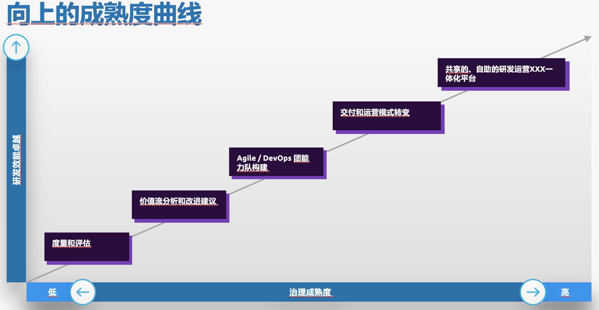
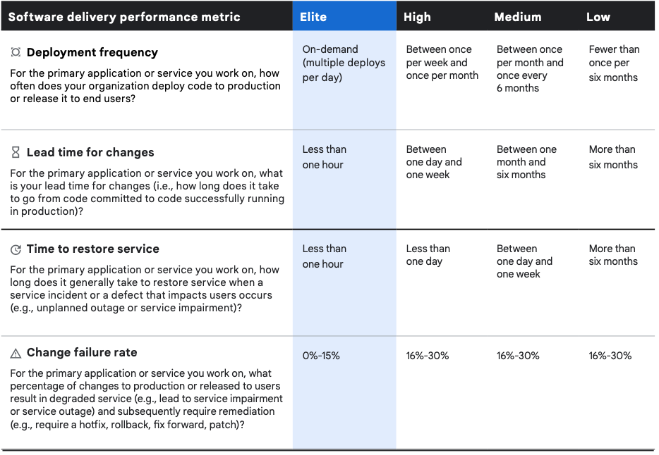
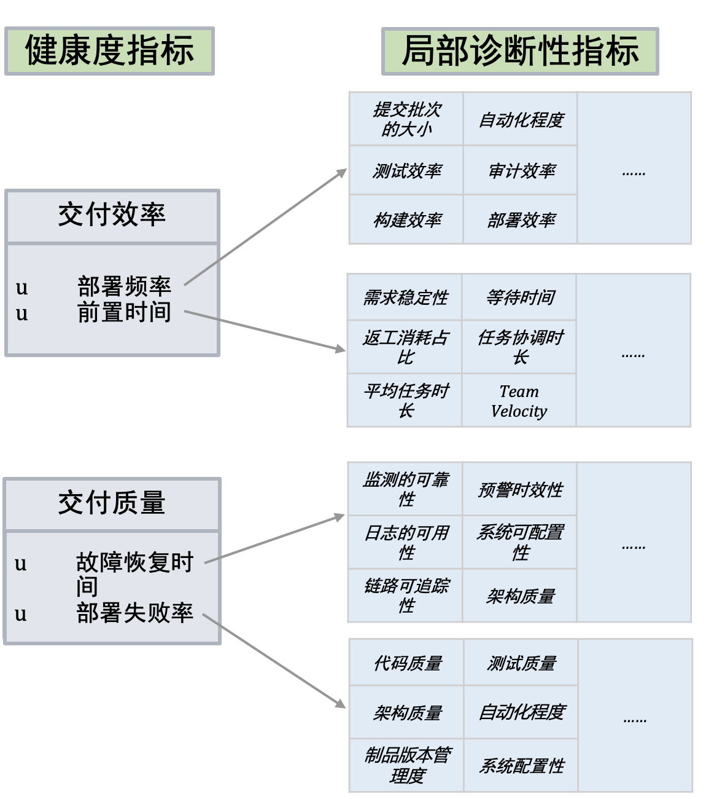
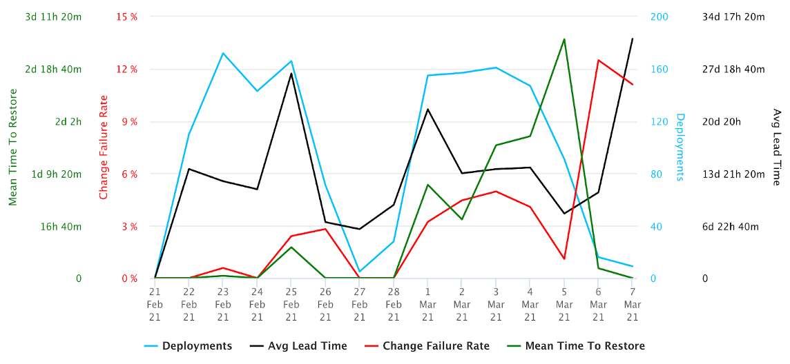

最近几年，国内业界越来越常提及`“研发效能”`这个词，追其根源大部分是始于`“DevOps”`运动的活跃。  
知道 DevOps 发展历史的，基本都了解 DevOps 是受敏捷的影响，是敏捷原则在软件研发到运维运营层面的延伸。  
很多云厂商在推广自己 DevOps 平台服务的时候，也会提及对`“研发效能”`的大幅度影响，比如 AWS 对 DevOps 的描述：
>
DevOps is the combination of cultural philosophies, practices, and tools that increases an organization’s ability to deliver applications and services at high velocity: evolving and improving products at a faster pace than organizations using traditional software development and infrastructure management processes. This speed enables organizations to better serve their customers and compete more effectively in the market.

那么，研发效能 == DevOps 吗？  
答案自然是否定 。  
<!-- more -->
研发效能 明显是“问题域”。  
DevOps 是一种解决方案，且是一种已经被验证、非常成熟的、可以提升软件研发效能的解决方案。  
但就像人感冒发烧一样，吃 A 药可以痊愈，吃 B 药也可以痊愈，打针也可以痊愈，甚至有时候发现吃药效果不理想，最后还是去打了针。  
`研发效能低`，就像人感冒发烧一样，是个 “问题” 。`DevOps`, 是解决这个问题的一种 “药”。

因此，弄清楚了`问题域`和`解空间`的关系之后，我们来看看研发效能和它的解空间，并且主要聊一聊解空间（研发效能治理）。

### 1. 研发效能的定义
研发效能，即持续快速交付价值的能力。  
将其拆解一下：`研发效能` = `效率` + `质量`+ `有效价值`，还有这三项可重复和稳定发生的`持续性`。  

展开来讲，就是

- 要在保证系统可靠性、不降低交付质量的情况下，尽量缩短从业务构想到功能上线的时间  （质量 + 效率）  
- 从而使“最小化可行需求”能快速被验证，确保有效价值，减少浪费  （有效价值）  
- 且整个过程效果可重复发生（持续性）  

### 2. 研发效能的治理
有了定义之后，就来看看如何对研发效能进行治理。  
根据市面上大部分公司的软件工程能力状况，针对研发效能治理，这里提炼了一条“研发效能治理成熟度模型”。

从左至右，研发效能治理分为5个阶段，每个阶段也必须包含它左边所有阶段的成果。  
举个例子：某IT部门采购了一个 DevOps 平台服务，但日常仅仅当做 CI/CD流水线 甚至是“发布工具”来使用，对效能治理没什么概念，这时候该IT部门的治理成熟度自然是低的，可能只在“度量和评估”的位置。

接着，展开来看看效能治理成熟度每一个阶段。

#### 2.1. 度量和评估
管理学之父彼得德鲁克曾经说过：“如果你无法度量它，就无法管理它”。  
对管理如此，对效能治理亦是如此。因此，度量和评估，对于研发效能的治理必不可少。

那么，再来看看为何把“度量和评估”放在治理的第一步呢：

- 首先，想要对研发效能进行治理，必须知道当前效能处于一个什么阶段，对现状有了度量评估和自我认知之后，才能明确之后治理的方向和力度。  
- 同时，度量和评估模型在持续治理的过程中，可以阶段性地重复使用，用以呈现治理成果的效果和进行快速反馈。  

因此，度量和评估，作为研发效能治理的第一步不可或缺。

__接着，来看看如何做度量和评估？__    
__从 “健康度指标” 和 “局部诊断性指标” 分两层来看。__  
##### 健康度指标
首先，借鉴于`DORA`(DevOps研究和评估组织) 的2021年报告中的Four Key Metrics，将其作为研发效能的4个关键 __`健康度指标`__:

- __研发效率__：
	- 部署频率 
	- 前置时间（Lead time）
- __研发质量__：
	- 故障恢复时间 （MTTR）
	- 部署失败率  
	
`特别注意`：区别于 DevOps 只关注于“从代码提交到功能发布”这个区间的前置时间，研发效能中的“前置时间”延伸了覆盖范围 —— 从业务构想到功能发布，涉及研发运营的整个研发周期。  
其他三项，与 DevOps 报告相同。

至于，研发效能中的__`有效价值`__，其与业务关系紧密，度量数据模型需要根据具体业务来设计，因此目前仅给予该项 `健康度评估模型`：
> Measurement involves collecting factual information about the value of a deployed feature and evaluating it against the original hypothesis statement.
> 
Rate your team's ability to collect objective information about the actual value realized by deployed features so that it can inform strategic financial decisions.  
Sit (1-2): We don’t define or measure the value of Features.  
Crawl (3-4): We’ve defined what "value" is but don’t know how to measure it.  
Walk (5-6): We capture qualitative feedback from the business about the value of our Features.   
Run (7-8): We capture qualitative and quantitative feedback from the business and our monitoring systems about the value of our features.  
Fly (9-10): We aggregate the quantitative and qualitative feedback to objectively validate the original hypothesis and inform pivot-or-persevere decisions.
  
看到这里，是不是有点眼熟，如果原本预想的解决方案是 “DevOps一体化” 的话，加上有效价值的度量，是不是方案就要考虑`"BizDevOps"`?! 是不是仅仅一个DevOps的方案就不够匹配了？

##### 局部诊断性指标 
也许有人会觉得，对比下其他类型的度量和评估报告上繁多的指标量，上面这几个指标未免有些简陋。  
比如，连常见的评估应用架构维度的指标都没有。
其实，应用架构指标是有的，但并不属于效能“健康度指标”，而是“局部诊断性指标”。

- 当发现健康度不理想，需要分析、定位和形成改进建议时，这时就要借助于局部诊断性指标。
- 当实施了改进建议，对局部指标进行了优化，最终效果又会传导到健康度指标上。  
如果局部指标改进了，但健康度未提升，这时可能需要回过头来分析和反思一下：是诊断和改进建议的问题，还是本身局部指标需要调整。

有了这两层指标，整个研发效能的度量和评估模型才大体完整。  
而在整个研发的过程中，可以常常阶段性的使用模型进行度量和评估一下，比如每次发布周期完成 或者 每次sprint完成的时候等等。  
使用指标值的时候，也需要注意：__指标值本身并不重要，重要的是通过数据驱动出洞见。而在持续改进的过程中，数据趋势比数据值更重要。__

《下篇》讲接着聊剩下的4个成熟度阶段。

