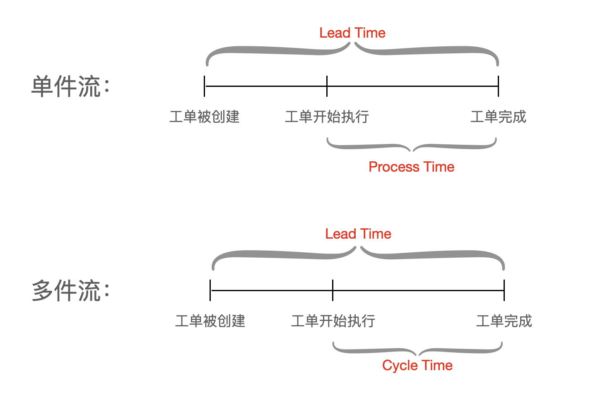
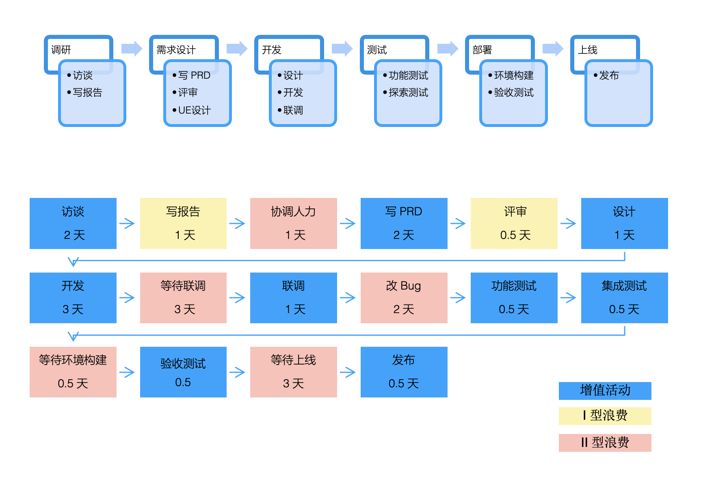
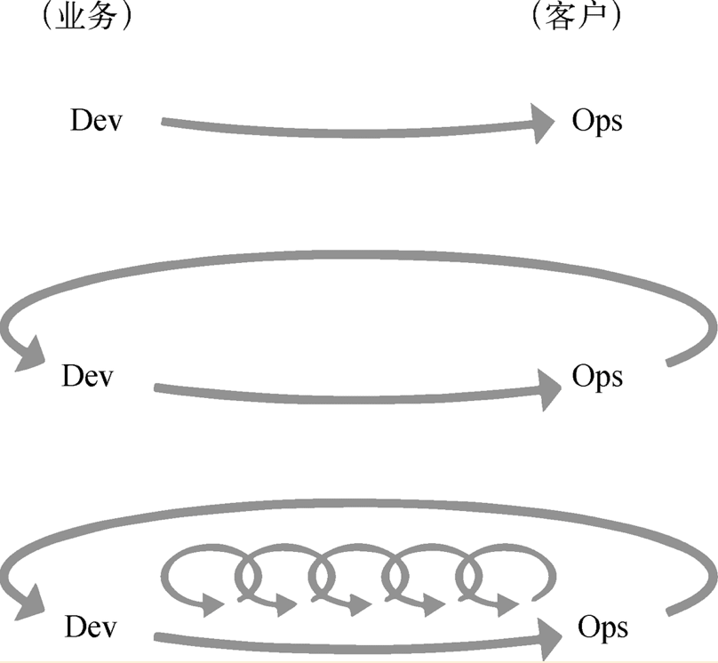

已经过了一旬，下篇居然还没开始动笔。  
反思了一下人生：P  
书接上回。

<!-- more -->

### 2. 接上篇
在上一节的健康度指标中，有非常重要的一项 —— Lead Time。  
Lead Time 的定义来源于传统制造业，指从受订到出货之间间隔的时间。  
同时，与Lead Time 一同被提起的，还有`"Cycle Time"`。 而 DevOps 的度量指标，习惯称其为`“Process time”`。  
Cycle Time 和 Process Time, 在软件研发和 DevOps 领域基本相互等同，主要指去掉排队等待时长，处于生产任务（增值活动）执行的时长。

一定要谈下区别的话，对 DevOps 工具自动化来说，基本每个环节的执行动作都是可重复的、标准的，因此“单件”的 Process time 基本可以代表当前任务的生产性能。  
位于 DevOps 之前的研发环节，每件制品包含知识类的创造、不是标准件、无法准确重复，因此在统计任务时长时（比如：In Dev processing, in QA processing）, 只能通过“多件”运算出均值，亦就是 Cycle time.  

Lead Time 和 Cycle Time 是精益制造中重要的衡量指标。  
自从精益生产在制造业获得成功之后，为了改善产品开发流程，软件研发行业也将精益思想引入到了产品研发之中。

#### 2.2. 价值流分析和改进建议
从研发效能来看，除了宏观的 lead time 的健康度之外，想要回答 lead time 为何会花费这么长时间、具体那些环节比较耗时、是否可以优化耗时时，就需要将研发工作流程打开来看一看。  
想要理解和观察研发流程，有一个重要工具，就是 —— 价值流图（Value Stream Mapping， VSM）。  

软件研发流程，是从需求构想到产品（或功能）发布上线的这个过程中，为了提供用户价值而采取的一系列研发活动。  
价值流图，就是用来观察和分析价值在研发流程中流动的情况。  
价值在整个流动的过程中，会经历增值活动、非增值但必要的活动（I型浪费）、以及非增值可以去掉的活动（II型浪费）。价值流图分析的目的，首先就是去掉 II 型浪费，然后再将 I 型浪费转化为 II 型浪费从而消除。

_也许有人会认为，上图中 QA 进行测试、Ops 进行发布，这些怎么能看做是增值行为呢？这主要是因为，不能只是从代码即是生产的角度去看待软件研发。  
软件研发，其实是一种知识型的创造活动，虽然这些知识最终是通过代码的形式固化下来的。这种知识性的创造活动，包括PO、BA、Dev、QA、Ops所有角色的知识汇总。  
这也是为何敏捷测试总是强调测试左移的重要性 —— 在需求分析或者 Feature kick off 阶段，QA 尽早参与到知识汇集的阶段，也可以降低 Dev 的返工率。即使是处于“开发”下游的“功能测试”，也可以从提供自动化测试代码的视角，察觉到测试的增值贡献 —— 让代码制品拥有了自动化测试代码。_  

正如图中显示，黄色标签为 I 型浪费，红色为 II 型浪费，比如“等待型浪费” —— 等待联调， “返工型浪费” —— 改 Bug。    
那如何实施消除浪费呢？比如上面的等待联调、联调后的bug返工修复。    
没有标准答案，但大体有如下思路：  
1. 当前后端等待联调，团队的Dev是否可以发展成全栈工程师，这样前后端一个Dev就直接完成了，不存在联调。既消除了联调等待，也降低了返工率。  
2. 如果不发展全栈工程师，在story开始阶段，前后端是否可以一起设计和约定好契约（包括happy path、unhappy path、异常处理），由契约DSL上传到contract Mock server，这样可以降低联调成本和返工率。  

#### 2.3. 敏捷 & DevOps团队能力建设
有了前面两步治理成熟度的达成：度量评估和价值流分析，对研发效能有了不同维度整体的了解之后，接着就进入到治理动作的实施中。  
建议使用带有整体优化能力的理论和实践框架 —— 敏捷 & DevOps。这些理论和实践已经被反复验证，并且非常成熟。

敏捷，鼓励创建研发的全功能团队，提升交流和互动，以尽早和持续的交付高价值的软件为目标。一些团队甚至还鼓励成员打破角色边界，比如身兼 QA 能力的 Dev、具备 ops 能力的 Dev 等等。在这个阶段，基于Scrum、Kanban软件研发模式的普及，持续交付理念（Continuous Delivery, Jez Humble 提到的宏观角度的持续交付）也越来越被重视。  

到2009年，终于有人在借鉴敏捷和精益的基础上，创造了 DevOps 这个词，旨在强调将 Ops 加入到产品研发全功能团队的充分必要性，并且兼顾开发思维、实行 infra as code的运维方式和方法，旨在提升产品交付效率和可靠性。  

随着 DevOps 运动的兴起和推广， DevOps 逐渐发展，包括和涵盖了方法论、流程、自动化工具，以及特别强调的 DevOps 文化，并且逐渐影响到了整个研发价值流的参与者们遵循 DevOps 精神进行群策群力。  
比如：Sec、QA 将安全和测试脚本加入Pipeline —— 不需要等到环境验证，在build运行的过程中就可以快速反馈到Dev，进行代码修复。  

《凤凰项目》在DevOps原则，总结了三步工作法：  

- 流动原则。实现开发到运维的工作快速地从左往右流动。
- 反馈原则。从右往左的每个阶段中，应持续、快速地获得工作反馈。
- 持续学习和实验原则。团队建立持续学习和实践的文化。

因此，团队针对敏捷 & DevOps 进行能力建设，可以从整体优化的角度对效能进行治理和提升。  
在具备了敏捷 & DevOps 能力下，再去探索局部优化和治理。  

#### 2.4. 交付和运营方式转变
在敏捷 & DevOps 团队具备稳定和高效地研发效率、高质量、降低了发布成本和发布风险后，让原本正确、但看起来不可实现地交付和运营方式变得可能：

-  系统3~6个月一次大批量发布上线 `-->` 每个月/甚至更短周期 小批量发布上线
-  由需求批量压入迭代的 Scrum 研发管理模式 `-->` 需求拉动的 Kanban 研发管理模式
-  DevOps 2.0、持续交付2.0 逐渐实现。

研发效能被提及，其目标是快速验证产品、获取用户反馈的能力，位于行业前台的系统的快速推出，还能带来抢占市场的机会。  
因此，交付和运营方式的转变，在完成治理成熟度3之后，必要、且可顺势而行。

#### 2.5. 共享的、自助的研发运营XXX一体化平台
也许有人会奇怪，在达成前 4 步效能成熟度之后，第 5 阶次的成熟度居然是推出 研发运营XXX一体化平台？（XXX可能是业务运营等等，反正随着 DevOps 2.0、持续交付2.0、bizDevOps这些相似概念的提出，大家旨在将产品的从概念到投入用户群体，这其中正向、反向的活动都组成一个闭环的整体）  
将研发运营XXX一体化平台放在效能治理成熟度最后一步的逻辑是：

- 即使不依托一体化平台，循序前四个成熟度治理，效能治理也可以在不同的企业和组织中开展。
- 当团队达成前四步治理成熟度，可以考虑将局部优化转化成全局优化。借助研发运营XXX一体化平台，对支持企业和组织内的全局优化事半功倍。
- 研发运营XXX一体化平台，说白了，只是一个工具，投入需要大成本。如果没有前四步成熟度的认知和达成，它也仅仅只是个工具。

### 3. 总结
研发效能治理方案的理论框架，基本到这里就阐述完了。
总结一下，就是：

- 先度量和评估，再价值流分析
- 敏捷 & DevOps 团队能力建设
- 交付和运营模式转变
- 推出 共享的、自助的研发运营XXX一体化平台

### 后话
在我写完（上篇）的时候，一些朋友表达了对国内越来越看重“研发效能”、“研发效能治理”这些命题和观点的不满，我其实也一样。  
但是国内这方面的对软件定制和咨询的商机，又的确会经常出现。从我们这些公司的角度，就会去想 —— 是跪着把这钱给赚了，还是站着把这钱给赚了的问题。我自己也一直没有结论。  
直到最近我在做一个售前方案的时候，跟公司内的一个咨询师交流，发现他对于“研发效能”这词的排斥。我内心颇有点恼，因为他讲的那些其实大家都心知肚明，反而我好像变成那个不道德和狭隘的一方。  
因此，对于赚钱的问题，有了结论 —— 那就站着把钱给赚了吧，以后就只谈 价值交付、持续交付 2.0、DevOps。  

不管怎样，立Flag后第二篇文章，总算是完成了，yeah~
