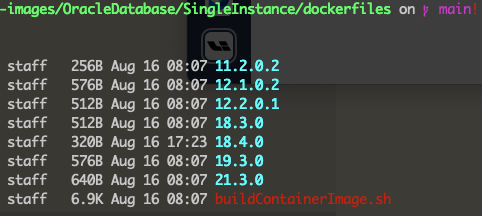
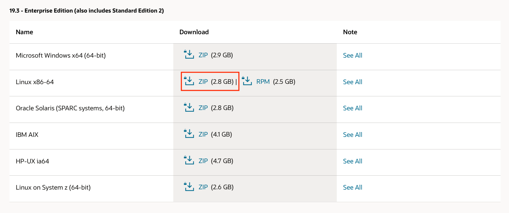
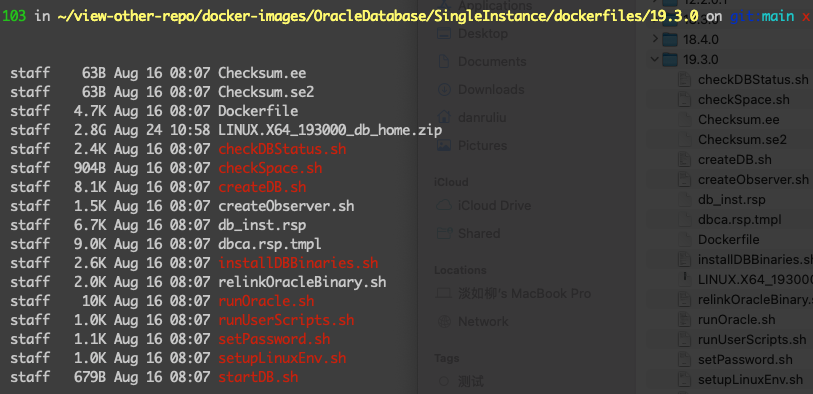

最后一次用 Oracle 应该还是在2012的时候，之后就一路用开源数据库。  
没想到现在还有反手回摸的时候。  
回摸也就算了，等准备好 Oracle 知识回顾，最后发现计划赶不上变化，暂时用不上了。  
重新 review 了一把自己的kanban和计划清单，赶紧记录一下，回到目标的事务上去。  
<!-- more -->

### 1. MacOS 安装 Oracle
对于已经习惯了所有工具都要本地装一装、摸一摸的工程师而言，装个单例数据库这事儿自然不在话下。  
然而search homebrew 和 dockerhub，突然发现 —— 居然没有oracle database。这不就尴尬了嘛？  
去 Oracle 官网查看了一下，要想在 MacOS 上安装Oracle，两种方式：1. visualBox 2. 本地 dockerfile build。  
那自然是选择2了。  

#### 1.1. Oracle 官方dockerfile大合集
访问 Oracle 官方在 github 上 repo [docker-images](https://github.com/oracle/docker-images)。  
```
$ git clone git@github.com:oracle/docker-images.git
```
子目录是 Oracle 各种产品和版本的 dockerfile。比如database，就是 `OracleDatabase`, OGG 就是 `OracleGoldenGate`。  

#### 1.2. 查看 dockerfile
进入到本地 repo 目录 `OracleDatabase/SingleInstance/dockerfiles`，可以看到目前支持的数据库版本：  

选择一个版本，比如 19.3.0，进入目录。

#### 1.3. 下载 Linux Oracle Database 程序包
可以查找官网，也可以通过 readme 文件上的链接跳入下载页面。  
点击链接，手动下载。

对，2.8G。  

#### 1.4. 将下载的database程序包移入`OracleDatabase/SingleInstance/dockerfiles/19.3.0/`


#### 1.5. 运行buildContainerImage
回到`OracleDatabase/SingleInstance/dockerfiles`目录，运行命令`buildContainerImage.sh`。

```
$ ./buildContainerImage.sh -h
$ ./buildContainerImage.sh -v 19.3.0 -s
```
*注意* 运行命令build之前，确保本地没有开启任何网络代理，不然 build 时会失败。  
build成功之后，通过`docker images`查看image，总大小6个多G，体量感人。。 

另外，如果想要安装其他版本，比如18.4.0 和 xe 版本，相同的步骤和方式，但可能需要修改dockerfile的部分语句。  
即使进行了dockerfile修改，xe 版本本人build并没有成功过，这个需要再次检验和查看。  

#### 1.6 docker run
```
docker run --name oracle19 -d -p 11521:1521 -p 15500:5500 -e ORACLE_PWD=123456 -v ~/tmp-oradata:/opt/oracle/oradata oracle/database/19.3.0-se2
```
这时候，通过docker host本地 11521 端口，就可以连接docker oracle了。  

### 2. Oracle Database 基础概念和语句图谱


- Oracle Database
    - 数据库概念
        - 数据库
            - SQL 
                - 查看当前数据库：select name from V$DATABASE;
        - 数据库实例
            - SQL 
                - 查看当前数据库实例：select name from V$INSTANCE;
        - SID
        - CDB & PDB
    - SQLPLUS
        - tnsnames.ora
        - sqlnet.ora
        - 连接
            - sqlplus username/password@host:port/SID
            - conn username/password
    - 用户/角色/权限
        - 用户
            - SQL
                - 创建用户：create user ogg identified by ogg default tablespace customer;
                - 查询用户：select * from dba_users where lower(username)=‘ogg';
                - 删除用户：drop user ogg;        
        - 角色
            - SQL
                - 创建角色：create role etl;
                - 查询角色：select * from DBA_ROLES;
                - 角色授权（系统）：grant connect,resource,create session, alter session to etl;
                - 角色授权（对象）：grant insert,update,delete on t_custmer to etl;
                - 给用户添加角色：grant etl01 to ogg;
                - 删除角色：drop role etl;
        - 权限
            - 定义
                - 系统权限
                - 对象权限：指用户对已有对象的操作权限。
            - SQL
                - 系统权限
                    - 查询系统权限：select distinct PRIVILEGE from DBA_SYS_PRIVS;
                    - 查询grantee拥有的权限：select * from DBA_SYS_PRIVS where lower(grantee)='ogg’;
                    - 给用户添加权限：grant create session,alter session to ogg;
                    - 收回权限：revoke alter session from ogg;
                - 对象权限
                    - 查询grantee用户的对象权限：select grantee, table_name, privilege from dba_tab_privs where lower(grantee) = ‘ogg’;
                    - 分配对象权限：grant all on t_employees to ogg;
                    - 收回权限：revoke delete on t_employees from ogg;
    - 逻辑结构
        - 数据库/表空间/表
            - 数据库
                - SQL
            - 表空间
                - SQL
                    - 创建表空间：CREATE TABLESPACE customer datafile '/opt/oracle/oradata/XE/customer.dbf' SIZE 100M autoextend on next 20M Maxsize 500M;
                    - 删除表空间：drop tablespace customer including contents and datafiles;
                    - 查看表空间数据文件：select file_name, tablespace_name from DBA_DATA_FILES order by FILE_NAME;
                    - 查看所有表空间：SELECT TABLESPACE_NAME, STATUS, ALLOCATION_TYPE, CONTENTS FROM DBA_TABLESPACES;
            - 表
        - 用户/schema/对象
            - 用户
                - SYS/SYSTEM
                    - SYS 是 SYSDBA。可创建数据库。
                    - SYSTEM 是 SYSOPER。权限次之。
                - SQL
                    - 查看当前库下所有用户：select username,ACCOUNT_STATUS,DEFAULT_TABLESPACE, TEMPORARY_TABLESPACE from DBA_USERS;
            - schema
                - 定义
                    - Schema 是用户拥有的所有对象的集合。对象包括：表、索引、视图等等。
                    - 每个用户都会有独立的schema，schema 必须依赖用户的存在而存在。
                - SQL
                    - 查询当前用户和schema：select sys_context('userenv', 'current_user') current_user, sys_context('userenv', 'current_user') current_schema from dual;
            - 对象
