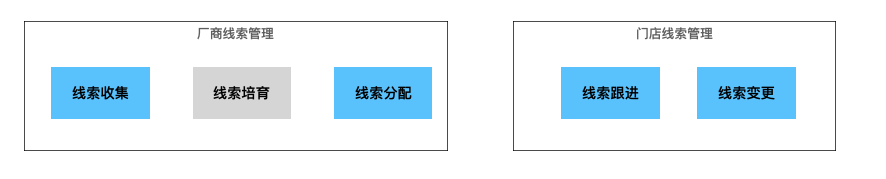

最早在17、18年的时候，做了大约一年多的厂商系统 —— 经销商线索管理服务。  
外人看线索管理，感觉就那点东西，然而团队内的人自己知道 —— 那真是水深火热。  
时隔多年，再次接触到线索管理，不同的是：这次的线索管理虽依然是厂商的系统，但包含了厂商线索、门店线索，门店线索又分经销商门店、直营门店。  
相比之前稍微好一点的是细节复杂度有所降低，就好比一个花费 300W 的线索管理与 3000W 的线索管理的差距。  

线索管理从根本上来说，每一个流程和环节都是为了提升客户转化率，最终达成交易。  
从上下游关系来看，厂商进行“线索收集”至“线索分配”，目标是将线索推入到可以由指定门店接待的阶段；接下来，门店完成线索的线下跟进一系列活动，目标是让客户买车和车辆交付。  
如果车企仅有直营这一种模式，宏观上这就是一个比较简单的流程，看起来是同一个问题域，一个线索模型就可以搞定了。  

然而当前现状，车企大部分都是直营和经销两种共存的混杂模式。  
还有部分车企的经销商并不依赖厂商进行线索管理，即便依赖了厂商的线索管理系统，对线索的权限归属和流程控制也与直营门店有不同的诉求。  
因此，看上去就变成了一横一纵 两块问题子域。  
  
或者，也有人会说这里应该是 三块问题子域。其实也对。  

如果要提供解决方案的话，我们的模型应该如何划分呢？如果要用微服务实现的话，应该是几个线索领域模型呢？  
这个问题，当我拿到现有代码，需要在一个微服务中同时实现线索从厂商到经销门店、从厂商到直营门店线索的业务流程时，陷入了沉默。  
最后，通过和项目同事的流程梳理和交流讨论，最终确认，3 个领域模型，分别是 厂商线索、经销商门店线索、直营门店线索。  

### 1. 拆分成3个领域模型的原因

### 2. 在同一个微服务中实现 3 个线索模型的方式

### 3. 扩展成 3 个微服务行不行？2个呢？

