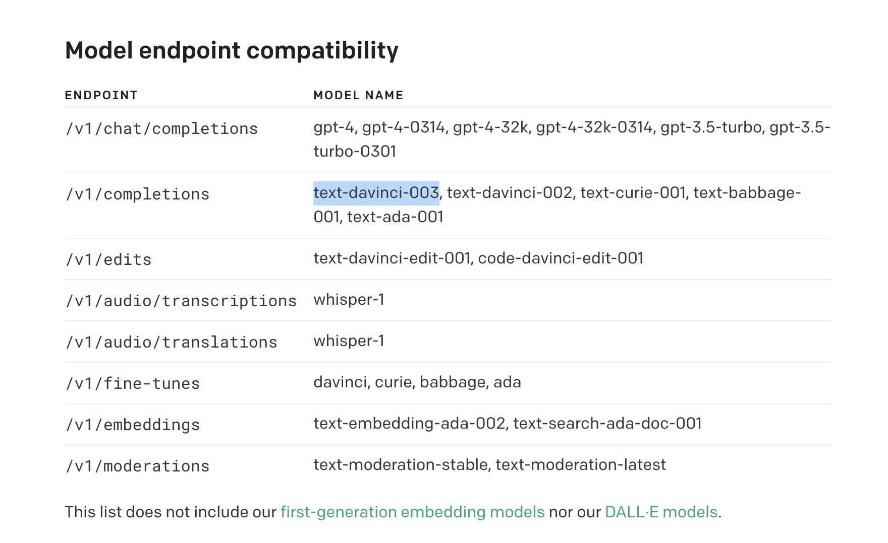
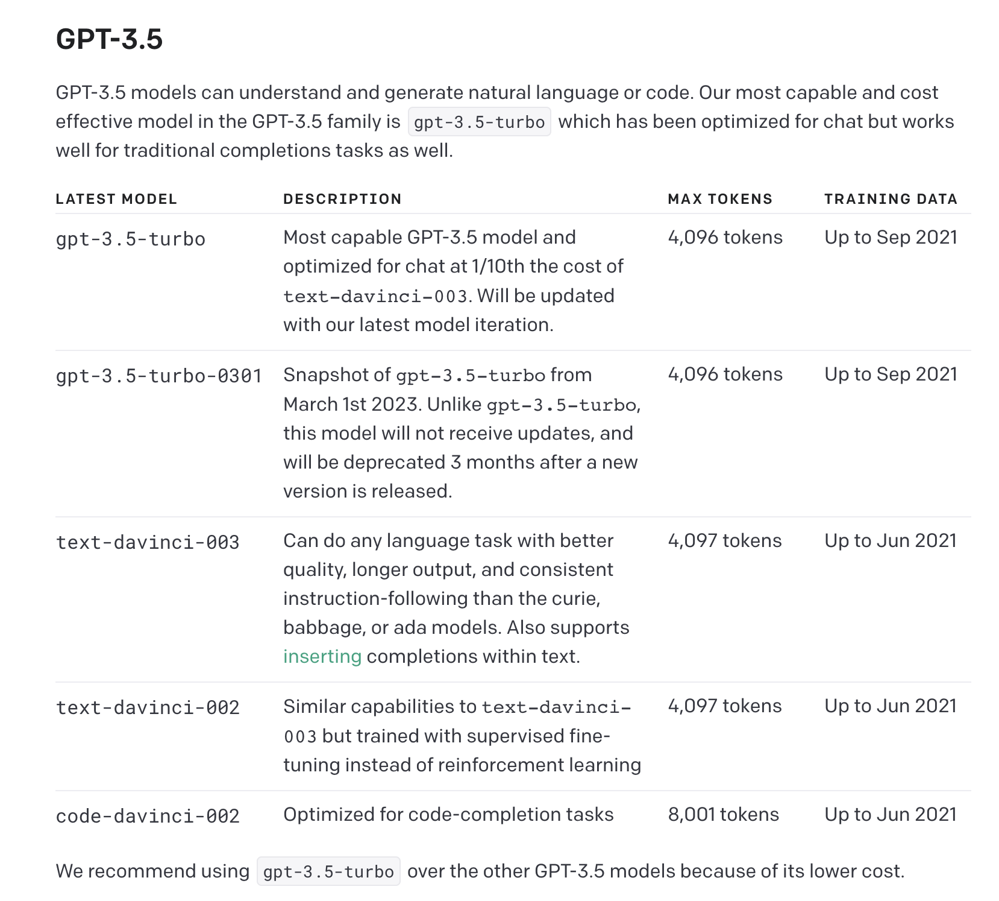
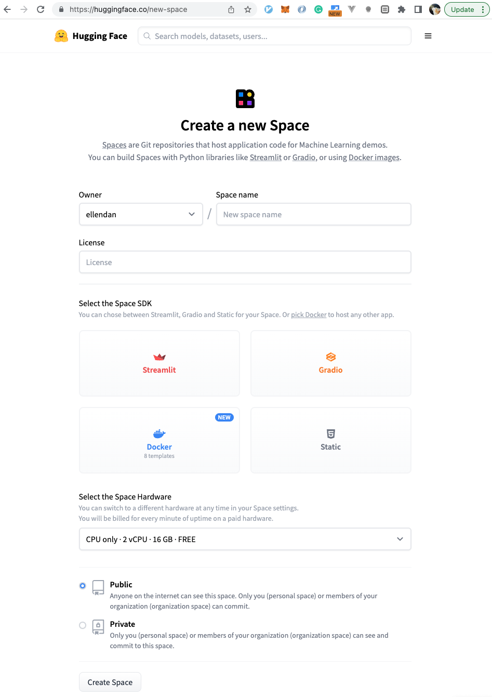
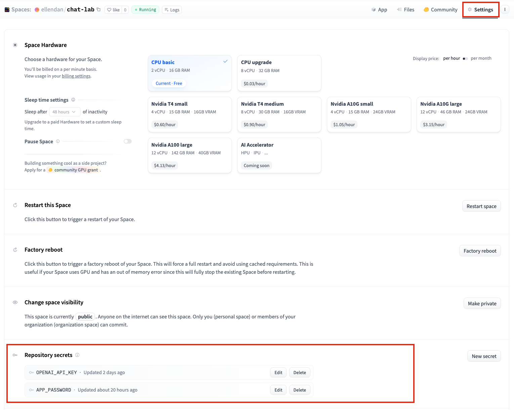
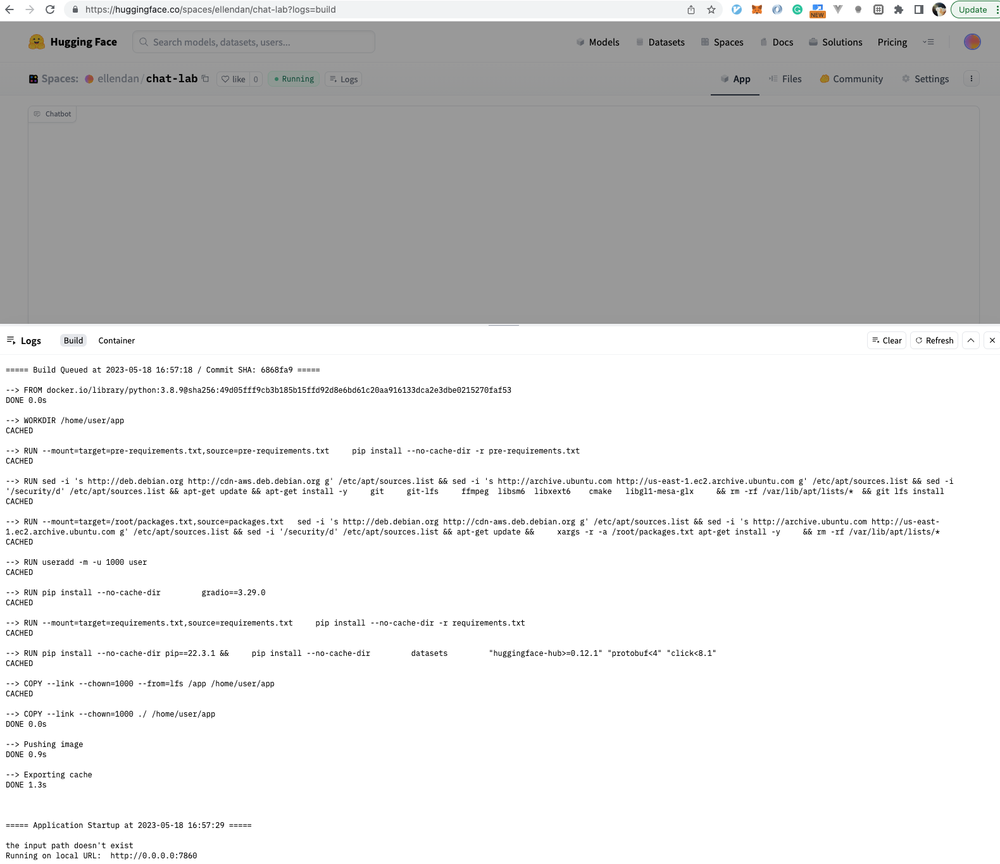
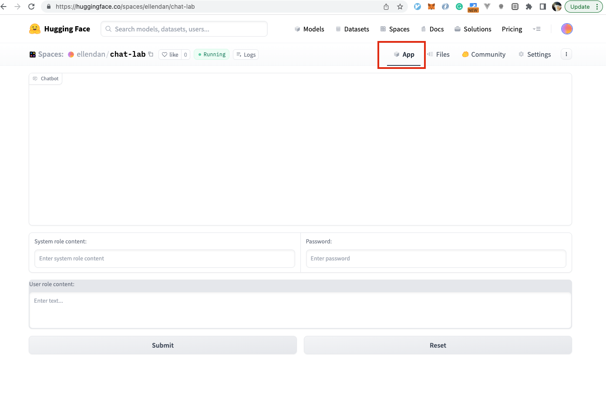
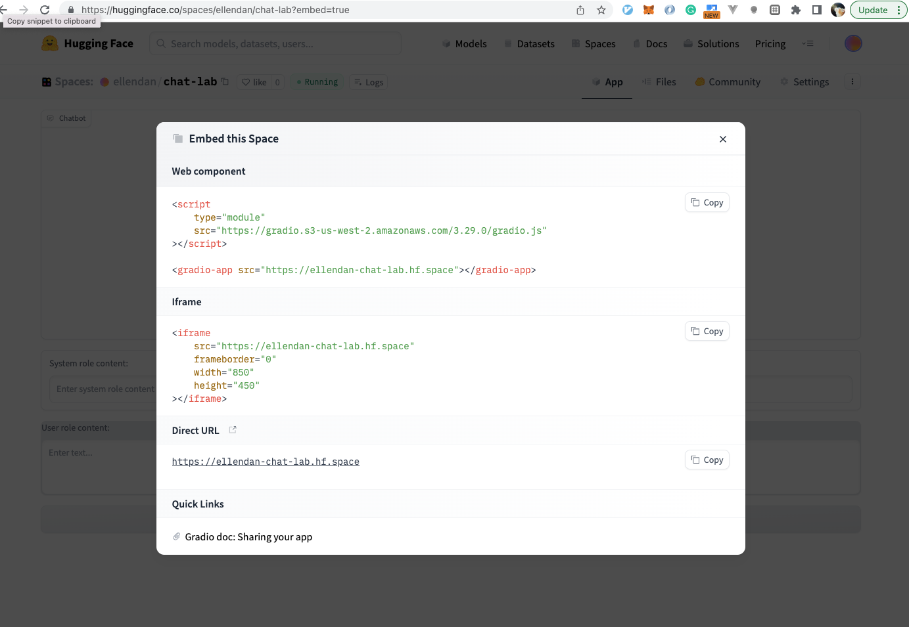
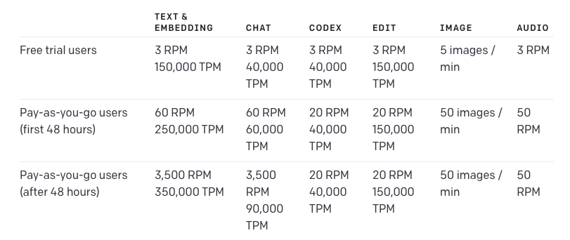

在现在的NLP领域，GPT系列模型已经成为了NLP领域的标配之一，而ChatGPT是基于GPT的一个聊天模型，可以用来生成对话，其效果非常好，可以说是目前最好的开源聊天模型了。
不少使用者已经将ChatGPT当做了日常工作的助手，下面这个chat界面基本已经广为人知。


但 ChatGPT 并不仅仅是支持以上的聊天会话功能，OpenAI 公司也开放了以上会话聊天背后的 API。

<!-- more -->
这些 API 可以直接调用，使用命令行（科学上网），也可以自己搭建服务器。
如果仅仅只是想使用 API 构建一个会话服务，或者 Generic 聊天机器人，专门搭建一个服务器没有什么特别大的意义。
但如果从学习和尝试构建 ChatGPT 应用的角度、从上手程度来衡量的话，Gradio + huggingface 不失为一种快速构建的方式。
Gradio 是一个可以快速搭建 Python web 的工具包，Huggingface 支持源码管理、 Gradio 应用的快速构建和部署。

### 1. 使用 ChatGPT API 编程
#### 1.1 Python OpenAI lib 下载和安装
在新建的工程目录下，安装 openAI lib。
```
$ pipenv install openai
# 或者使用 pip 工具安装，作者本人更偏爱 pipenv，因此 Python 文章里面都使用 pipenv 作为包管理和构建工具
```

#### 1.2 针对 ChatGPT API 编程
在工程目录下编写Chatgpt工具文件`chatgpt_api.py`。
```
class ChatgptAPI:
    def __init__(self, api_key):
        openai.api_key = api_key

    def get_single_completion(self, prompt, model='gpt-3.5-turbo'):
        messages = [{"role": "user", "content": prompt}]
        response = openai.ChatCompletion.create(
            model=model,
            messages=messages,
            temperature=0,
            max_tokens=2048,
            top_p=1,
        )
        return response.choices[0].message['content']
```

__说明：__
提前创建OpenAI账号，生成API key（各种方法各显神通，这里不做赘述）。

在上面的代码中，我们使用了 OpenAI 提供的API，其中：
- `openai.api_key` 需要赋值 OpenAI 官网上获取的 API key
- `openai.ChatCompletion.create`方法（背后就是 API Endpoint: /chat/completions）
- `gpt-3.5-turbo` 模型

查阅过OpenAPI[官方文档](https://platform.openai.com/docs/api-reference)，可以发现，OpenAI 提供了多种模型，可以根据自己的需求进行选择。
同时，不同API，支持和兼容不同的模型。


GPT 4 版本以下，较推荐的两个模型，一个是 `gpt-3.5-turbo`，另一个是 `text-davinci-003`。
这两个模型的区别在于：gpt-3.5-turbo 是一个通用的模型，而 text-davinci-003 是一个专门用于文本生成的模型。
但 gpt-3.5-turbo 的价格只有 text-davinci-003 的 1/10, 同时响应速度也比 text-davinci-003 更快。
因此，gpt-3.5-turbo 是一个性能良好且相对经济实惠的GPT模型版本，适用于许多自然语言处理任务，它提供快速的响应时间和高质量的文本生成能力。
相比之下，Text-davinci-003 更适合对生成文本质量要求更高、且对响应时间要求相对较低的应用场景。

__下面是官方对于3.5版本的模型的对比__：


#### 1.3 Max Tokens
在上面的模型对比图中，会注意到有一个`Max Tokens`的概念。
- 首先，Tokens 本身是文本处理时进行分词的最小单位，同时也是ChatGPT报价收费的最小单位。
    比如，gpt-3.5-turbo 价格是 $0.002 / 1K tokens，text-davinci-003 则是 $0.0200 / 1K tokens。这种收费方式看起来，跟以太坊的 GAS 比较相像。
- 另外，模型中的 Max Tokens 是指，每次请求的最大 tokens 数量，也就是说，会限制文本的最大长度。
    但需要注意的是：每次请求的Max Tokens = User 请求的Tokens + AI assistant 响应的Tokens。也就意味着，如果用户请求的文本长度过长，受Max Tokens的限制，留给AI生成的 Token数量会很少，从而导致请求失败。

因此，对于用户而言，Max Tokens 的限制会造成两方面的考虑：
- 一次请求的最大文本长度，防止文本过长，造成请求失败。
- 处理多轮会话的策略。GPT API并不会帮助客户端缓存上下文，两次API请求之间是完全独立的，因此需要客户端自己来处理多轮会话的上下文。
每次请求的内容，都需要包含之前请求的文本上下文，受Max Tokens限制，对话轮数越多，请求中用户输入的文本占比就会越高，留给AI生成的Token余量就会越少。

代码中针对这两项考虑，可做如下处理（且不限此方式）：
- 设置API的 max_tokens参数，这里限制的是AI生成的Token最大数。除AI生成的Max Tokens外，请求 + 响应中总的 Max Tokens 受模型类型限制。
- 创建会话上下文类型（比如 Conversation），用以保存和传递多轮会话的上下文。
```
class ChatgptAPI:
    ……
    def get_multi_round_completion(self, prompt, conversation, model='gpt-3.5-turbo'):
        conversation.append_question(prompt)
        prompts = conversation.get_prompts()

        response = openai.ChatCompletion.create(
            model=model,
            messages=prompts,
            temperature=0,
            max_tokens=2048,
            top_p=1,
        )
        message = response.choices[0].message['content']
        conversation.append_answer(message)

        return message, conversation

class Conversation:
    def __init__(self, system_prompt='', num_of_round = 5):
        self.num_of_round = num_of_round
        self.history = []
        self.initialized = False
        self.history.append({"role": "system", "content": system_prompt})

        if len(system_prompt) > 0:
            logger.info(f'Conversation initialized with system prompt: {system_prompt}')
            self.initialized = True

    def is_initialized(self):
        return self.initialized
    
    def append_question(self, question):
        self.history.append({"role": "user", "content": question})

    def append_answer(self, answer):
        self.history.append({"role": "assistant", "content": answer})

        if len(self.history) > self.num_of_round * 2:
            del self.history[1:3]

    def clear(self):
        self.history.clear()
        self.initialized = False

    def get_prompts(self):
        return self.history
    
    def round_size(self):
        return 0 if len(self.history) < 2 else len(self.hitory) - 1
    
    def get_history_messages(self):
        return [(u['content'], b['content']) for u,b in zip(self.history[1::2], self.history[2::2])]
```

这里，我们将用户的请求文本和AI assistant的响应文本，都缓存到了`Conversation`类中。在每次请求时，将 Conversaction 中缓存的文本作为`prompt`传入，从而实现多轮会话的功能。
同时，我们还可以在`Conversation`类中增加一些其他的方法，比如设置缓存的最大轮数，超过最大轮数则从缓存中删除最早的会话记录。

### 2. 使用 Gradio 框架构建交互层
使用 Gradio 框架，可以快速构建一个交互式的Web应用，直接使用 Python 创建前端页面和交互。

#### 2.1 安装 Gradio
在工程目录下，继续安装 Gradio lib 包。
```
$ pipenv install gradio
```

#### 2.2 编写 Web 代码
在工程目录下，创建一个名为`app.py`的文件，用于编写 Web 代码。

```
import logging
import os
import gradio as gr
from tools.chatGPT_API import Conversation, ChatgptAPI

chat_api = ChatgptAPI(os.environ.get("OPENAI_API_KEY"))

def predict(system_input, password_input, user_input, conversation):
    if password_input != os.environ.get("APP_PASSWORD"):
       return [(None, "Wrong password!")], conversation, user_input

    if conversation.is_initialized() == False:
        conversation = Conversation(system_input, 5)

    _, conversation = chat_api.get_multi_round_completion(user_input, conversation)
    return conversation.get_history_messages(), conversation, None


def clear_history(conversation):
    conversation.clear()
    return None, conversation


with gr.Blocks(css="#chatbot{height:350px} .overflow-y-auto{height:600px}") as demo:
    chatbot = gr.Chatbot(elem_id="chatbot")
    conversation = gr.State(value=Conversation())

    with gr.Row():
      system_in_txt = gr.Textbox(lines=1, label="System role content:", placeholder="Enter system role content")
      password_in_txt = gr.Textbox(lines=1, label="Password:", placeholder="Enter password")
       
    with gr.Row():
      user_in_txt = gr.Textbox(lines=3, label="User role content:", placeholder="Enter text...").style(container=False)
    
    with gr.Row():
      submit_button = gr.Button("Submit")
      reset_button = gr.Button("Reset")
    
    submit_button.click(predict, [system_in_txt, password_in_txt, user_in_txt, conversation], [chatbot, conversation, user_in_txt])
    reset_button.click(clear_history, [conversation], [chatbot, conversation], queue=False)
demo.launch()
```

__说明:__
    - 使用了 Gradio 的 Chatbot 组件，用于展示 User 请求文本和 AI assistant 的响应文本。
    - 使用了 Gradio 的 State 组件，用于存储用户的 Conversaction 对象。
    - 使用了 Gradio 的 Textbox 组件，用于用户输入系统提示文本、密码和请求文本。
    - 使用了 Gradio 的 Button 组件，用于触发用户的请求。

详细 Gradio 入门可参考：[Gradio document](https://gradio.app/getting_started)

### 3. 提交和部署到 Huggingface 
#### 3.1 创建 Huggingface Space
在 Huggingface 上创建 Space，步骤基本跟创建 Github 的Repository一样。
并且，需要选择 Space 部署时
 - Space SDK：Gradio
 - Space Hardware：有免费的`CPU`和付费的`GPU`可选


#### 3.2 设置环境变量
在 Space 中，需要设置环境变量，用于存储 OpenAI API Key 和 Web App 的密码(为了防止后面App bublic之后，API Key 被滥用)。
Gradio 启动时，会从环境变量中加载这些值。


#### 3.3 提交代码到 Huggingface Space
选择将 Space 的 Repository 用 git clone 到本地，使用方法跟 Github 一样。
然后，将前面两节编写的代码通过 git push 到 Huggingface，Huggingface 会自动完成构建，并部署 Web App。


构建完成以后，Web App 会直接显示在 Huggingface Space的页面上。


#### 3.4 设置 Space visibility Public
如果在创建 Space 时，选择了将 Visibility 设置为 Private，那么只有 Space 的 Owner 和 Collaborator 才能访问到 Web App。
同时，也没有办法通过该 Space 的 URL 访问到 App。

若是想要其他人能通过 Space 的 URL 访问到 Web App，或者需要将 App 嵌入其他网站进行访问时，则需要将 Visibility 设置为 Public。
在设置成了 Public 之后，Space 的菜单会出现`Embed this Space`。



根据上图的提示，将`<script>`和`<gradio-app>`标签复制到其他网站的 HTML 中，即可嵌入到其他网站中。
效果见后面。

### 4. 成果展示
<script
	type="module"
	src="https://gradio.s3-us-west-2.amazonaws.com/3.29.0/gradio.js"></script>
<gradio-app src="https://ellendan-chat-lab.hf.space"></gradio-app>

App 的 Password Input 需要输入作者个人微信号的号码，欢迎大家试用。
同时，由于 GPT API 的调用，有 Rate limits, API 每分钟的调用次数有限制，所以可能会出现无法响应的情况。
- `RPM` - request per minute
- `TPM` - token per minute

