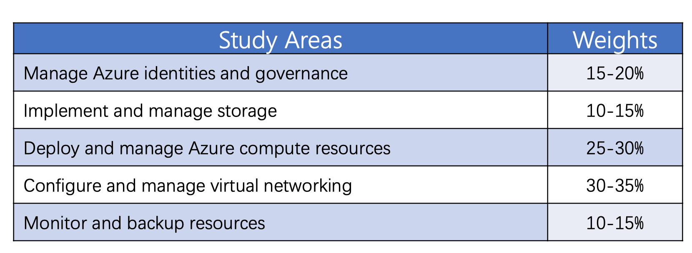
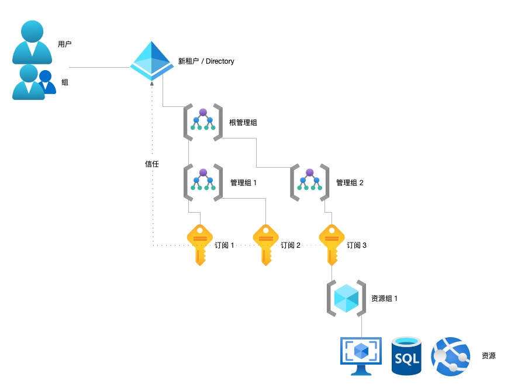
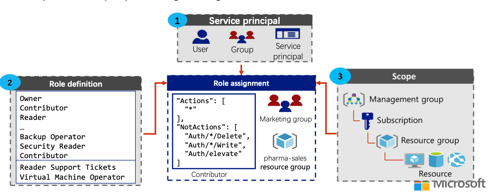
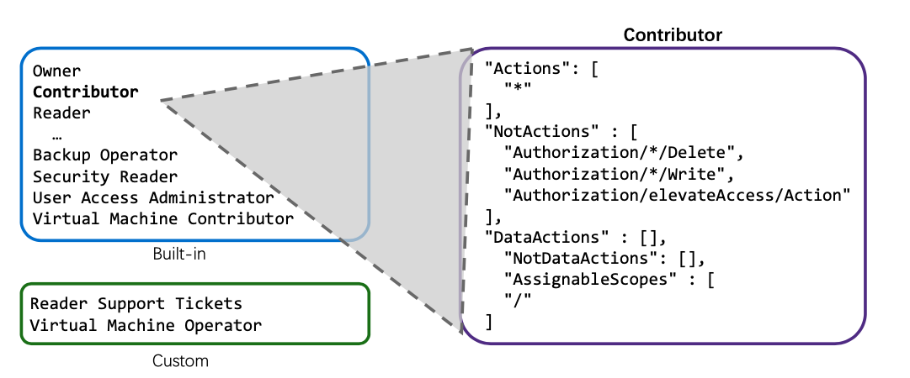
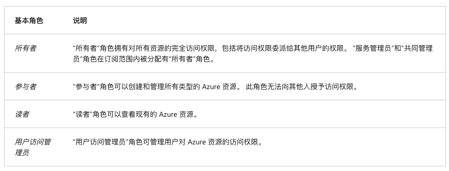
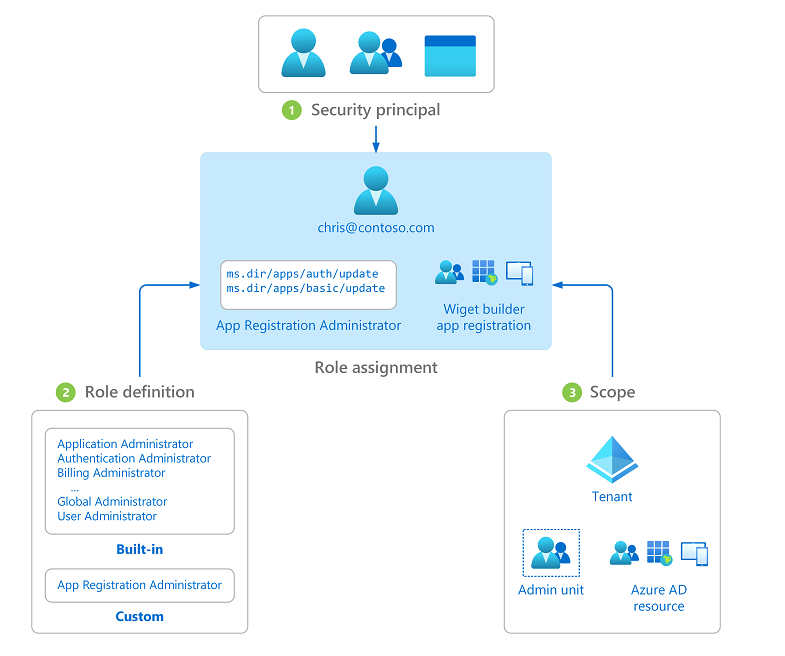
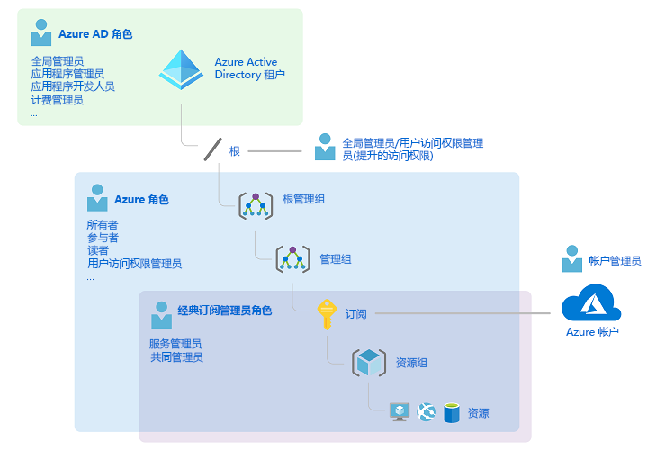
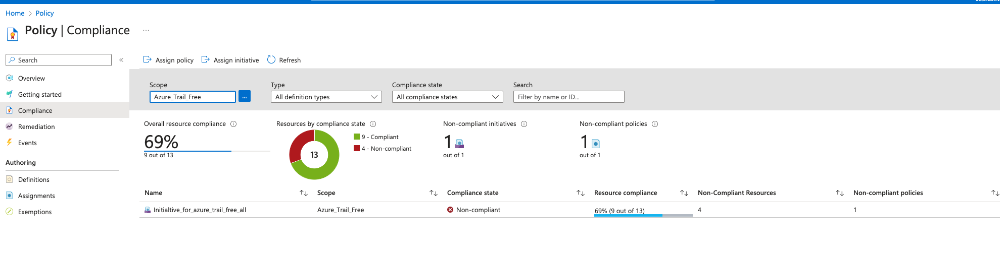
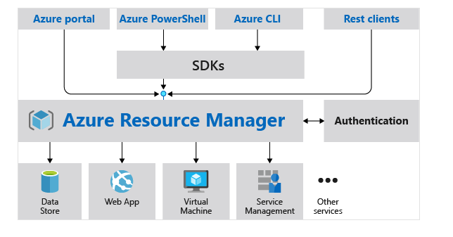
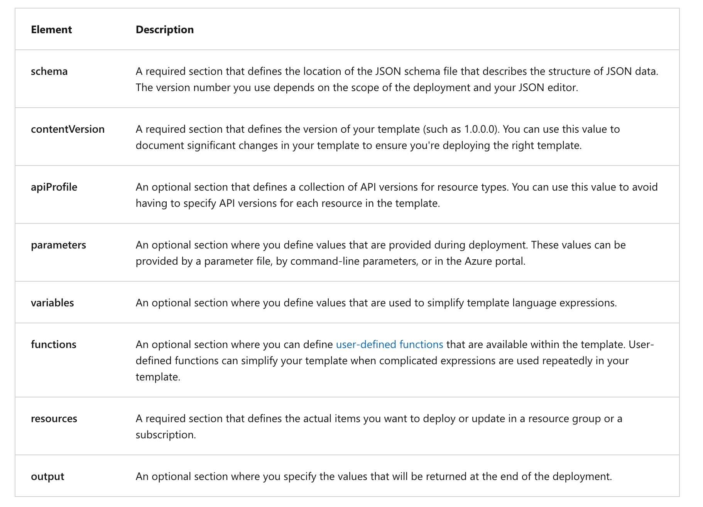

Azure Administrator Associate 涉及五个知识块，下面是官方考证角度给出的清单：
  

## Azure Administrator Associate 知识图谱

- Azure Administrator Associate
	- Azure Basics
		- Identities and governance 
			- Azure Active Directory
				- Tenant & Directory 
				- User & Group
				- Azure RBAC Role & Azure AD Administrator Role
				- Administractive Unit / Device and so on
				- Azure AD connect
		- Resources
			- Management Group
			- Subscribetion
			- Resource Group
			- Resource
		- Resource Manage Tools
			- Azure Portal
			- Azure Cloud shell
			- Azure Powershell
			- Azure CLI
			- ARM Template
	- Networking
		- Virtual Networks
		- IP Addressing
			- public IP & private IP
		- Network Security
			- Network Security Group
			- Application Security Group
			- Azure Firewall
		- Azure DNS
		- Network expand
			- VNet Peering
			- VPN Gateway
				- Site-to-Site VPN Connections
				- Point-to-Site VPN Connections
			-  ExpressRoute
		- Network Traffic
			- Route Table
			- Service Endpoint
			- Load Balancer
			- Application Gateway
			- Traffic Manager
	- Storage
		- Azure storage account
		- Azure storage services
			- Azure Container
			- Azure Files
			- Azure Tables
			- Azure Queues
		- Replication Strategies
			- Locally redundant storage (LRS)​
			- Zone-redundant storage (ZRS)​
			- Geo-redundant storage (GRS)​
			- Read access geo-redundant storage (RA-GRS)​
			- Geo-zone-redundant storage (GZRS)​
			- Read-access Geo-zone- redundant storage (RA-GZRS)​
		- Storage Security
			- Shared Access Signatures
			- Storage Service Encryption
		- Managing Storage
			- Storage Explorer
			- Import and Export Service
			- Data Box
			- AzCopy
	- Compute
		- Virtual Machine
			- Virtual Machine
			- Virtual Machine Extensions
			- VM Availability Sets
			- VM Scale Sets
		- Azure App Service
		- Container Services
		- Azure Kubernetes Service
	- Monitor and backup
		- backup
			- Azure Backup
			- Recovery Service Vault Backup
		- Monitor
			- Azure monitor
			- Azure alert
			- Log Analytics
			- Network Watcher
				- Diagnostics
					- IP Flow Verify
					- Next Hop
					- VPN troubleshoot
					- NSG diagnostics
					- Connection troubleshoot
					- Packet capture
					- Effective security rules
				- Topology


## Azure Basics
### 1. Identities and governance
`Azure Active Directory` 提供了一套基于云的标识管理的完整解决方案。  
在创建租户时，会同时创建 Directory（目录），Azure Active Directory 对目录进行管理，功能上既有基础的`身份管理和验证`、`单点登录`、`多因认证`，也有进阶一点的`设备管理`、`管理单元`、`应用管理`，同时还有支持 Azure AD 与 on-premises 的 Active Directory Domain Service（即 AD DS） 的混合标识方案等等。

#### 1.1 AAD 目录-资源层级对应关系
  
1.  目录对租户下的用户、组等进行管理。  
2. 一个目录可以被多个订阅所信任，但一个订阅仅能关联一个目录、不能关联多个。目录使多租户之间信息、资源独立。  
3. 订阅对资源进行集中管理，包括逻辑层级 Resource Group 以及各种 Resource。订阅为资源提供统一的账单和结算，同时与其他订阅相互隔离。    
4. 想要跨订阅进行一致的访问、策略等管理时，使用 management group(管理组) 实现。管理组层级可以按照组织部门进行创建，最多支持纵向深度 6 层。  

#### 1.2 Role-Based Access Control
基于角色的访问控制 (RBAC) 是一种可帮助管理谁可以访问 Azure 资源的机制。 通过 RBAC，可以确定特定用户针对特定资源可以执行的操作，并控制每个用户可以访问的资源区域。  
在 Azure 中分为：对“订阅资源”的访问授权 和 “Azure AD”的访问授权两类。对“订阅资源”的授权机制即 Azure RBAC(下图)。  
下图描述了 Role-Based Access Control 中的四个核心概念：`Security Principle`(安全主体)  、`Role definition`(角色定义)    、`Scope`(范围)  、`Role Assignment`(分配)。
  
1. Security principle 即可以是单独的 User，也可以是 某个 Group，也可以是 Service Principle。  
2. Role definition，可以是 Azure 预定义的，也可以依据 角色定义模板的格式 进行用户自定义。  
3. Scope 可以涉及多层级，从范围最广的管理组，到粒度更细的具体资源。  
4. Role Assignment，即是绑定上面 3 项的关系，以完成针对具体 Service Principle - Role（permission）- Scope 的授权。  

其中`角色定义`的格式，由 JSON 文件中定义的权限集组成。 其中描述权限集的结构不限于：  
- `Actions` 允许的权限操作。  
- `NotActions` 不允许执行的权限操作。  
- `DataActions` 指示如何更改或使用数据。  
- `AssignableScopes` 可以分配角色定义的范围。 
   

Azure RBAC Roles 提供了100 多种预定义的角色定义，其中包括四个基本的内置角色定义，以及其他根据各资源服务进行特别控制的角色定义。  
下图是四个基本角色：`Owner`、`Contributor`、`Reader`、`User Access Administrator`。
  

__Azure AD Roles:__  
除了 Azure RBAC Roles 之外，还有另一类 Azure AD Roles，也是基于 Role-Based Access Control 机制，区别主要是 Scope 涉及 AD 的对象和资源。  
  

#### 1.3 RBAC Authentication
  
注意上面整体模型中两类 Roles —— Azure AD Roles 和 Azure RBAC Roles 的作用范围。  
默认情况下，Azure Roles 与 Azure AD Roles 不会跨越 Azure 与 Azure AD 的 Scope 边界。 但是，如果全局管理员通过在 Azure 门户中选择“Azure 资源的访问管理”开关，提升了自己的访问权限，则会针对特定租户的所有订阅为全局管理员授予`User Access Administrator`（用户访问管理员角色）。 用户访问管理员角色可以向其他用户授予对 Azure 资源的访问权限。
因此，Global Administrator 本身只是 Azure AD 的最高权限角色，本身并不涵盖对 Azure 资源的权限。  
能对 Azure 资源进行权限分配 的 Global Administrator 的 User， 一般是进行了“权限提升”，或者该 User 本身是某个 Subscription 的 Owner。  

### 2. Resources
Azure 针对资源的管理层级（包括逻辑层级），从上至下一共分为：`管理组`、`订阅`、`资源组`、`资源`。  
管理组、订阅、资源组都有单独的 Service 页面进行设置和使用。

#### 2.1 Policy
Azure Policy 是 Azure 中的一项服务，可用于创建、分配和管理策略，用于控制或审核资源。 这些策略对资源配置强制实施不同的规则，使这些配置符合组织标准和合规性要求。  
Azure Policy 可以被分配和作用于多个层级。  
Policy 的使用有四个步骤：  
- 定义`Policy`（策略）。  
- 定义`initiative`(官方翻译：计划)，是 Policy 的集合。  
- 创建`Assignments`。  
- 确定`Compliance`。  
Azure 预设了一些 Policy 和 Initiative，可以直接用来创建 Assignment；也可以自定义一些 Policy 和 Initiative。  
Policy 和 Initiative 在定义的时候创建了一些参数，可以在创建 Assignments 的时候设置和传入参数值。  
比如：创建了一个 XX_Initiative，其中包含了 `Allowed locations` 的 Policy，此 policy 声明了入参 `listOfAllowedLocations`。在创建 Assignments 时，
可以指定限定的 location 值。  
Policy - Initiative - Assignment 创建完，待合规性检查执行完成后，可以通过`Compliance` 页面确定合规性检查的结果。  
  

#### 2.2 Lock
锁，跟 Policy 不同，可以被设置的级别是：订阅、资源组、资源。锁会被继承、影响子范围内的所有资源。  
锁类型分两种：delete 和 read-only。  
- 被 delete 锁住的资源，不能删除，除非先删除 delete 锁。  
- 被 read-only 锁住的资源，不能被变更，除非先删除锁。  
	注意，这里的变更针对资源的元数据，不包括资源管理的内容。比如 read-only 设置在数据库资源上，数据库管理的数据是依然可以读写删，但数据库设置则不能变更，比如 `reset password`、添加 tag 等等。

#### 2.3 Tag
标签，是一种标记符号，主要用来查询、过滤资源。  
标签在资源层级之间`不能继承`。也就是说，资源组打上了 Tag，如果需要给资源组内所有资源打上相同 Tag 的话，有两种方式：  
1. 手动给资源分别加上 Tag。  
2. 给该资源组分配 Append tag 的 Policy，这样可以通过 Policy 给资源加上相同的 Tag。  

#### 2.4 IAM
每个服务的 IAM 页签，是用来配置访问授权的位置。也就是针对当前资源服务管理 Azure RABC Role assignment 的地方。  
访问授权在不同资源层级之间是可以继承的。意思是，如果给某个管理组设置了 owner，这个 owner 会被管理组下的每一个资源服务识别为 Owner。  

### 3. Resource Manage Tools
#### 3.1 Tools
对资源的管理和使用，Azure 提供了多种资源管理终端：  
- `Azure Portal`，Azure 门户网站页面。  
- `Azure Cloud Shell`，通过 Azure 门户进入，一种通过浏览器界面显示、可与 Azure 资源交互的 shell命令工具。Cloud Shell 按会话分配临时的主机作为操作机，使用文件共享中保存的 5 GB 映像持久保存 $HOME，并在用户 20 分钟内没有交互活动时 shell 连接会超时。    
- `Azure PowerShell`，安装了 Azure module 的 PowerShell 工具。  
- `Azure cli`，Azure 提供的命令行工具。  

各种终端除了交互方式以外，功能上基本没有什么不同，背后都是连接 ARM（Azure 资源管理器）。  


针对 “执行频率和重复性不高、量小的 Azure 运维任务”，可以通过 Azure Portal 进行偶尔操作。  
但对于自动化、重复性高的运维任务来说，使用 Azure Powershell 和 Azure Cli 通过命令行脚本是更高效和可靠的方式。  

Azure PowerShell 示例：(ConferenceDailyReset.ps1)

```
param([string]$resourceGroup)

$adminCredential = Get-Credential -Message "Enter a username and password for the VM administrator."

For ($i = 1; $i -le 3; $i++)
{
    $vmName = "ConferenceDemo" + $i
    Write-Host "Creating VM: " $vmName
    New-AzVm -ResourceGroupName $resourceGroup -Name $vmName -Credential $adminCredential -Image Canonical:0001-com-ubuntu-server-focal:20_04-lts:latest
}
```

执行脚本文件：

```
./ConferenceDailyReset.ps1 learn-3bd98a6a-c556-42bf-975b-81bcc3e53962
```

#### 3.2 Azure Resouce Manager Template
Azure 资源管理器模板（ARM 模板）实现`infrastructure as code` （基础结构即代码）。
ARM 模板使用声明性语法、JSON 文件格式，定义部署的基础结构和配置。 
ARM 模板文件由下列元素组成：
  

示例：(azuredeploy.json)

```
{
  "$schema": "https://schema.management.azure.com/schemas/2019-04-01/deploymentTemplate.json#",
  "contentVersion": "1.0.0.0",
  "parameters": {
    "storageName": {
      "type": "string",
      "minLength": 3,
      "maxLength": 24,
      "metadata": {
        "description": "The name of the Azure storage resource"
      }
    },
    "storageSKU": {
      "type": "string",
      "defaultValue": "Standard_LRS",
      "allowedValues": [
        "Standard_LRS",
        "Standard_GRS",
        "Standard_RAGRS",
        "Standard_ZRS",
        "Premium_LRS",
        "Premium_ZRS",
        "Standard_GZRS",
        "Standard_RAGZRS"
      ]
    }
  },
  "functions": [],
  "variables": {},
  "resources": [
    {
      "name": "[parameters('storageName')]",
      "type": "Microsoft.Storage/storageAccounts",
      "apiVersion": "2019-06-01",
      "tags": {
        "displayName": "[parameters('storageName')]"
      },
      "location": "[resourceGroup().location]",
      "kind": "StorageV2",
      "sku": {
        "name": "[parameters('storageSKU')]",
        "tier": "Standard"
      }
    }
  ],
  "outputs": {
    "storageEndpoint": {
        "type": "object",
        "value": "[reference(parameters('storageName')).primaryEndpoints]"
    }
  }
}
```

将 ARM 模板部署到 Azure 有三种方式：
- 部署本地模板
- 部署已链接的模板
- 在持续部署管道中进行部署

使用 Azure CLI 命令 `az deployment group create` 或 A`zure PowerShell 命令 New-AzResourceGroupDeployment`。

```
$ az login
$ az account list --output table
$ az account set --subscription <subscription_name>
$ az group list --output table
$ az configure --defaults group=<resource_group>

$ templateFile="azuredeploy.json"
$ today=$(date +"%d-%b-%Y")
$ DeploymentName="addSkuParameter-"$today

$ az deployment group create \
  --name $DeploymentName \
  --template-file $templateFile \
  --parameters storageSKU=Standard_GRS storageName=<your-unique-name>
```


