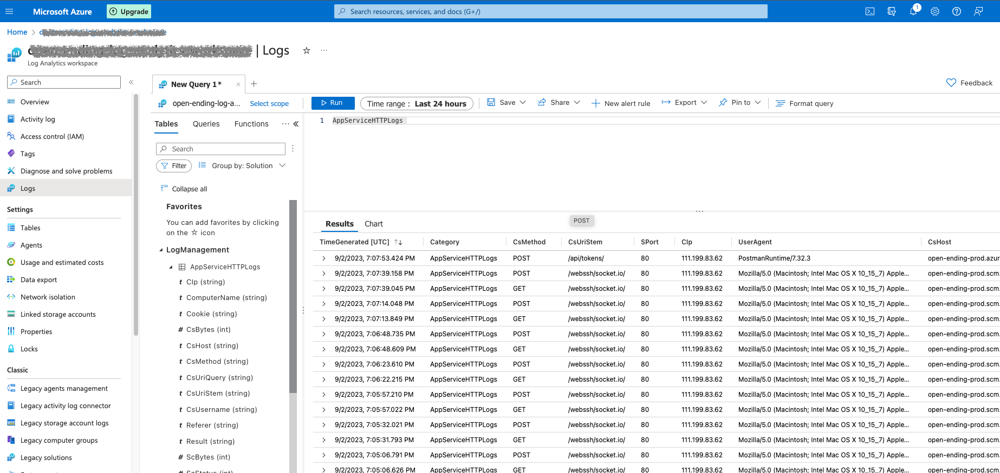

Azure 计算服务提供了多种类型：`VM`、`Container apps`、`App service`、`static App service`、`AKS`、`Logic apps`、`Functions`。
区别于其他计算服务：
- Azure app service 是一款 PAAS 服务，基于 HTTP 提供托管 Web 应用程序、REST API 和移动后端。
- 可以通过 App service plan 购买一套“单位时间固定限额”的即付即用资源池，在此 plan 下可以建立多个应用 share 这份资源；通过 service plan 的变更进行应用计算资源的横向/纵向扩展。
- 同时，不同于 IAAS 提供了计算资源之外，还提供应用运营必须的公用域名管理、负载均衡、健康检查、集成 APIM、日志流管理等整套应用技术运营方案。

以搭建应用服务为目标上，使用 App service 相比 VM、Container apps、AKS，在基础设施的触点和灵活度相对不足，并且着眼点是整包的应用服务，因此更适合于没有整体企业技术架构、不使用微服务的单体应用的搭建运营。

当应用可能面临外部变化、业务扩张增长，当前想要保留应用架构未来的可选择性、延迟当前服务架构类型的选型，建议使用 App service 时选择 docker 方式部署。这样，除了可以最大程度的避免环境差异以外，在未来架构扩张到需要放弃 App service 部署方式时，迁移到 VM、K8S、或者其他云提供商上时，应用服务在代码变更上可以花费最小的成本。

### 1. 创建 Azure 资源服务
#### 1.1 创建 Azure Container Registry
打开 Azure portal，创建 ACR。


接着需要开启 ACR 的 admin 权限。
可以选择两种方式：直接打开 ACR admin，或者生成拥有 ACR admin 权限的 token。
建议使用 ACR admin token，相比于直接开启”服务唯一“的 ACR admin 凭证，admin token 可以创建多个，每个 token 独立设置过期时间、轮换以及失效管理。
下面是使用 Azure portal 创建 admin token。


生成 token 的 password。


#### 1.2 创建 Azure appservice plan
这里使用azure cli 命令行创建。
```
$ az appservice plan create \
   --name <MY_APP_SERVICE_PLAN_NAME> \
   --resource-group <MY_RESOURCE_GROUP> \
   --is-linux 
```
默认创建出的 SKU tier 是 Basic 的，不支持 deployment slot.
Standard tier 以上是支持 deployment slot，可以在 plan 创建之后 scale up.

#### 1.3 创建 Azure appservice
```
$ az webapp create \
    --name <MY_WEBAPP_NAME> \
    --plan <MY_APP_SERVICE_PLAN_NAME> \
    --resource-group <MY_RESOURCE_GROUP> \
    --deployment-container-image-name <nginx:latest>
```
在 ACR 中还没有自建的 docker 物料时，可以使用通用的 nginx image 进行初始化，后面使用 github workflow 时会自动更新 image 设置。

### 2. 配置机密信息
#### 2.1 下载 appservice_publish_profile


#### 2.2 在 GITHUB repo 将 appservice_publish_profile 配置成 secrets


#### 2.3 在 GITHUB repo secrets 配置 Azure CR 的账号信息
相同方式在 GITHUB repo 里配置 secrets：`DOCKER_REGISTRY_SERVER_USERNAME` 和 `DOCKER_REGISTRY_SERVER_PASSWORD`， 内容分别是 ACR admin token 的 name 和 password。
在后面 GITHUB workflow 脚本中会使用这两个机密对。

### 3. 配置 GITHUB workflow 文件
在 GITHUB repo 添加 .github/workflows/<file_name>.yml 文件，内容可参考：
```
# Docs for the Azure Web Apps Deploy action: https://github.com/Azure/webapps-deploy
# More GitHub Actions for Azure: https://github.com/Azure/actions
# More info on Python, GitHub Actions, and Azure App Service: https://aka.ms/python-webapps-actions

name: Latest build and deploy Python app to Azure Web App

env:
  AZURE_WEBAPP_NAME: <APPSERVICE_NAME>
  CR_REPO_HOST: <CRNAME>.azurecr.io

on:
  push:
    branches:
      - release

permissions:
  contents: 'read'
  packages: 'write'

jobs:
  build:
    runs-on: ubuntu-latest

    steps:
      - uses: actions/checkout@v3

      - name: Set up Docker Buildx
        uses: docker/setup-buildx-action@v2

      - name: Log in to Azure container registry
        uses: docker/login-action@v2
        with:
          registry: ${{ env.CR_REPO_HOST }}
          username: ${{ secrets.DOCKER_REGISTRY_SERVER_USERNAME }}
          password: ${{ secrets.DOCKER_REGISTRY_SERVER_PASSWORD }}

      - name: Lowercase the repo name
        run: echo "REPO=${GITHUB_REPOSITORY,,}" >>${GITHUB_ENV}

      - name: Build and push container image to registry
        uses: docker/build-push-action@v4
        with:
          push: true
          tags: ${{ env.CR_REPO_HOST }}/${{ env.REPO }}:${{ github.sha }}
          file: ./Dockerfile

  deploy:
    runs-on: ubuntu-latest
    needs: build
    environment:
      name: 'Production'
      url: ${{ steps.deploy-to-webapp.outputs.webapp-url }}

    steps:
      - name: Lowercase the repo name
        run: echo "REPO=${GITHUB_REPOSITORY,,}" >>${GITHUB_ENV}

      - name: Deploy to Azure Web App
        id: deploy-to-webapp
        uses: azure/webapps-deploy@85270a1854658d167ab239bce43949edb336fa7c
        with:
          app-name: ${{ env.AZURE_WEBAPP_NAME }}
          publish-profile: ${{ secrets.AZURE_WEBAPP_PUBLISH_PROFILE_PROD }}
          images: '${{ env.CR_REPO_HOST }}/${{ env.REPO }}:${{ github.sha }}'
```

### 4. 开启 application logging
#### 4.1 使用 Appservice 的 file logging
App service 默认是不开启 application logging 的，即使代码中配置了 logging config。
需要在 App service 中打开：


这时，在【 Monitoring 】->【Log stream】才会出现应用的 application log。
除了 Log stream 这种方式外，也可以通过浏览器访问网页`https://<your_appservice_name>.scm.azurewebsites.net/DebugConsole` 来查看 logs。


#### 4.2 接入 Log analytics workspace
App service 的日志和指标可以发送和接入到 Azure 的其他服务中，比如 Log analytics workspace，用以支持语句查找和分析。

需要在 App service 处进行配置【Diagnostic setting】，用以开启日志数据发送。


可以选择日志类型和勾选指标，日志数据的目标也可以复选 —— 发送 Log analytics workspace / event hub / partner solution 以及 保存到 storage account（Azure 存储账户）。


**Log analytics workspace** 中进行日志搜索：

