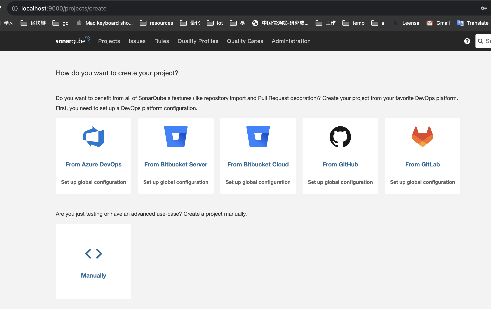
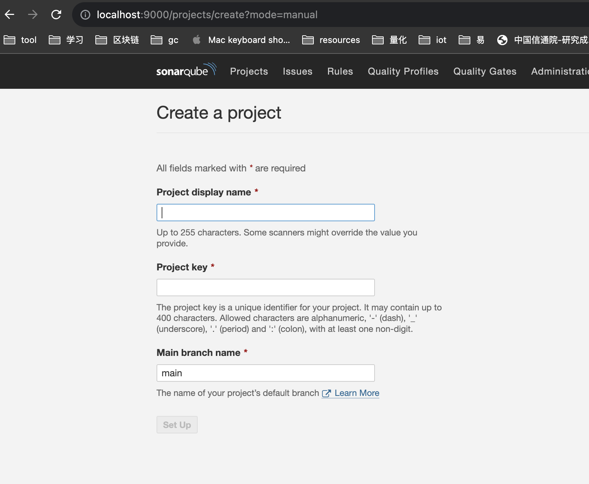
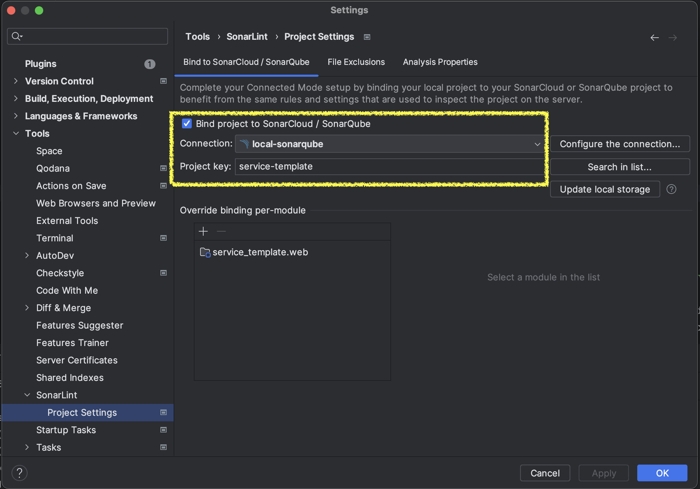

### 1. 环境准备
提前预安装好 docker 和 postgresql 数据库。
sonarqube 除了postgresql数据库以外，只提供对SQLserver和oracle数据两种选择。

postgresql 安装好以后，使用命令：
```
$ createuser -s postgres
$ psql -U postgres
> CREATE DATABASE sonarqube;
```

### 2. 使用 docker images 进行安装
#### 2.1 create volumes
```
$ docker volume create --name sonarqube_data
$ docker volume create --name sonarqube_logs
$ docker volume create --name sonarqube_extensions
```

#### 2.2 docker run
注意：sonarqube 只有community edition是免费的。
```
docker run -d --name sonarqube \
    -p 9000:9000 \
    -e SONAR_JDBC_URL=jdbc:postgresql://host.docker.internal:5432/postgres \
    -e SONAR_JDBC_USERNAME=postgres \
    -e SONAR_JDBC_PASSWORD=... \
    -v sonarqube_data:/opt/sonarqube/data \
    -v sonarqube_extensions:/opt/sonarqube/extensions \
    -v sonarqube_logs:/opt/sonarqube/logs \
    sonarqube:lts-community
```

### 3. 访问本地安装好的 sonarqube
本地地址 http://localhost:9000
默认用户名密码： admin/admin

#### 3.1 创建project
登录访问 sonarque，点击菜单【projects】，创建project。

也可以选择手动创建


#### 3.2 可以使用intellij idea安装sonarlint插件：

配置好后，点击【Update local storage】按钮，下载并使用sonarqube上定义的配置和规则。
这样开发的过程中，idea 可以实时反馈代码编写问题。

#### 3.3 gradle sonar plugin
在 gradle build文件中，plugins 添加 sonar。
legacy 写法:
```
buildscript {
    repositories {
        mavenCentral()
        maven { url 'https://plugins.gradle.org/m2/' }
    }
    dependencies {
        classpath 'org.sonarsource.scanner.gradle:sonarqube-gradle-plugin:3.5.0.2730'
    }
}

apply plugin: 'java'
apply plugin: 'org.sonarqube'
```

然后在 CI 的脚本上添加命令：
```
$ ./gradlew :web:sonar \
    -Dsonar.projectKey=... \
    -Dsonar.host.url=http://localhost:9000 \
    -Dsonar.login=<sonar_token>

```
最后就可以在

### 附录：
[sonarsource docs](https://docs.sonarsource.com/sonarqube/9.9/setup-and-upgrade/install-the-server/#installing-sonarqube-from-the-docker-image)