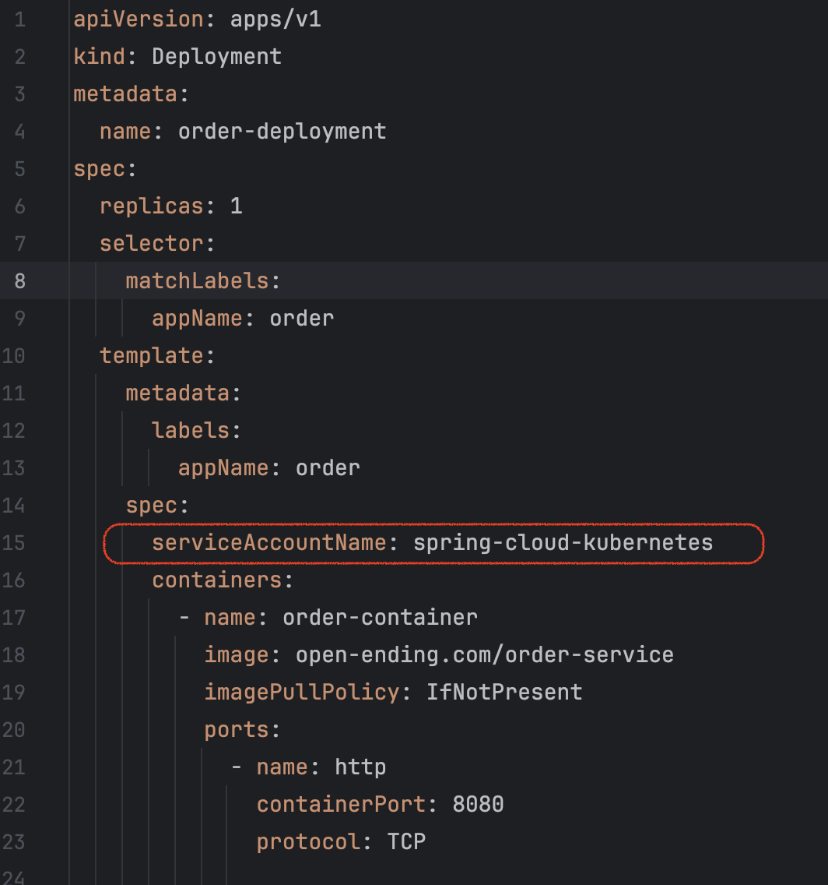
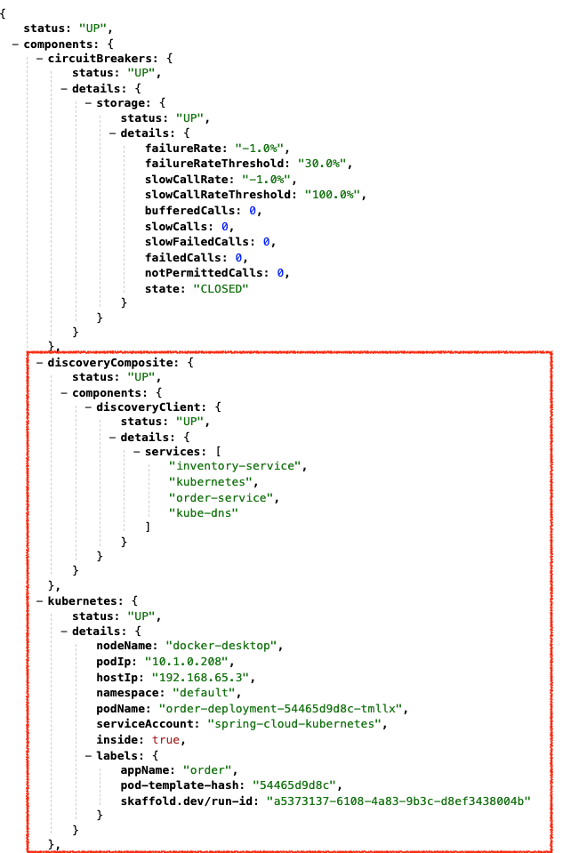
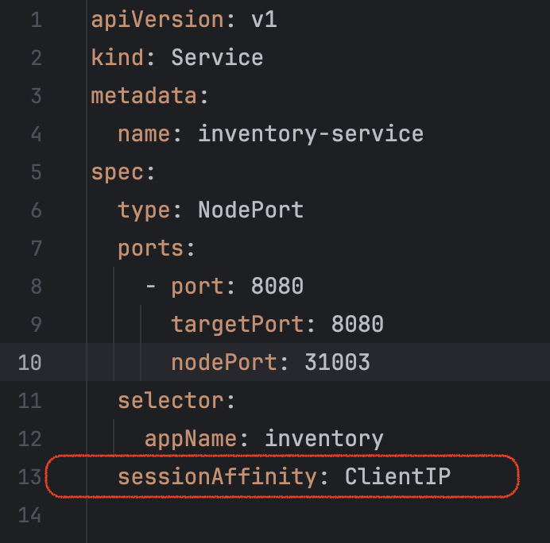
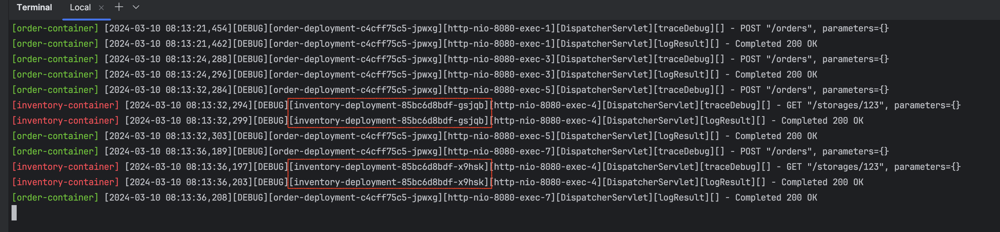
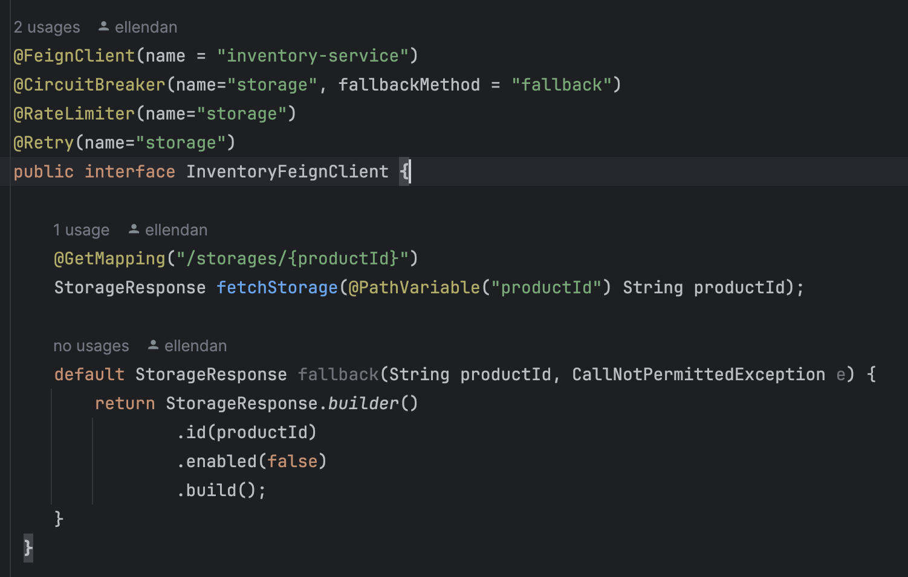
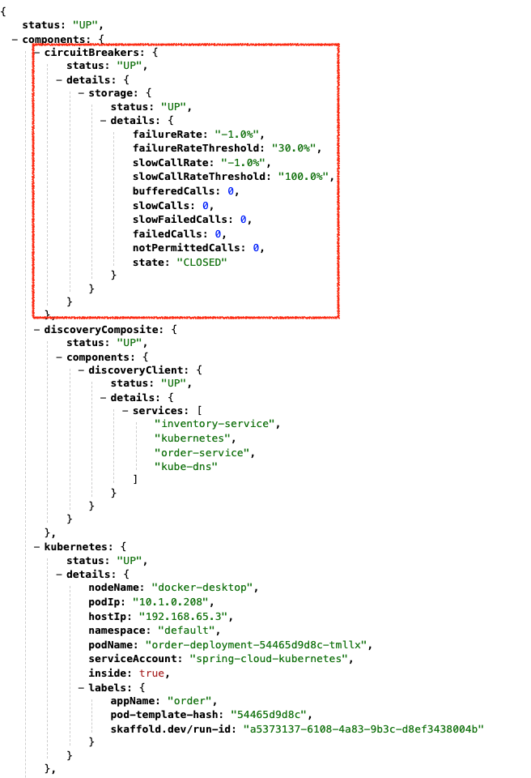
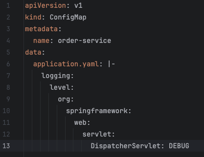

虽然时至当下，微服务架构已经推出了Service Mesh、Serverless等方式，但使用 Spring cloud 这种 SDK框架方式搭建微服务的企业仍然众多。
随着 K8S 的普及、Spring cloud Netflix 套组官方放弃维护，Spring cloud 推出了一些平替用于迁移和升级。
服务注册：`Eureka` -> k8s
服务发现：`Eureka client` -> `spring-cloud-kubernetes`
断路器与容错: `hystrix` -> `resilience4j`
客户端负载均衡: `ribbon` -> `spring-cloud-starter-loadbalancer`
REST API client: `spring-cloud-starter-openfeign`
配置中心：`spring cloud config` -> k8s configmap + `spring-cloud-kubernetes`

[demo 代码库](https://github.com/open-ending/demo-spring-cloud-kubernetes)构建了`inventory-service`和`order-service`两个子服务，order-service 会远程调用 inventory-service。
在代码库根目录中运行`skaffold run`命令，即可自动打包两个images并部署到本地 Kubernetes 上。
也可以切换到各子目录中，同样运行`skaffold run`单独打包和部署。
运行预安装要求：
- docker
- minikuber（或者像 macOS上的docker desktop for kubernetes）
- Skaffold

### 1. REST API calls
OpenFeign 作为一个声明式的 HTTP API client lib, 书写方便，非常好用。
代码库中由 inventory-service 提供被调用的 API，order-service 引用和配置OpenFeign。

### 2. 服务注册与发现
`服务注册`：随着 k8s 的使用，k8s pods 会上报和注册到 k8s API server 中，因此逐渐替代了传统服务注册，不再需要应用代码处理。
`服务发现`：如果是简单的服务调用，k8s 通过安装 DNS 将 service name 与 Cluster IP 进行绑定，客户端可直接使用 service name 作为 host 进行调用。但为何还需要使用`spring-cloud-kubernetes`呢？

`spring-cloud-kubernetes`提供了获取 k8s API server 上 k8s service 背后的 pods list 的办法 —— 是使用客户端负载均衡以及failed retry的前提。
#### 2.1 引入依赖
order-service 的 build.gradle 文件
```
dependencies {
    implementation 'org.springframework.cloud:spring-cloud-starter-kubernetes-fabric8'
    implementation 'org.springframework.boot:spring-boot-starter-actuator'
    ……
}
```
也可以直接引入 all 包，其中包括了 DiscoveryClient 包 和 config 包。
_fabric8生态虽然已经过时，但 spring-cloud-starter-kubernetes-fabric8 依然有维护，并且比 spring-cloud-starter-kubernetes-client 更易使用。因此这里使用了kubernetes-fabric8 包。_

#### 2.2 开启配置
在 Java main application Class 上加上 annotation `@EnableDiscoveryClient`。
```
@EnableFeignClients
@SpringBootApplication
@EnableDiscoveryClient
public class Application {
    public static void main(String[] args) {
        SpringApplication application = new SpringApplication(Application.class);
        application.run(args);
    }
}
```

在 application.yml 中 声明获取的 k8s namespaces范围:
```
spring:
  cloud:
    kubernetes:
      discovery:
        all-namespaces: true
```

#### 2.3 deployment 中配置 service account 权限
项目根路径下的 k8s 目录`privileges.yaml`文件定义了 service account，并且在 `order-service/k8s/deployment.yaml` 中进行引用。


#### 2.4 skaffold开发模式
skaffold支持开发模式，使用命令:
```
skaffold dev
```
这时，skaffold 会使用前台终端命令行窗口构建 image 和部署 k8s，显示 spring console 控制台信息，并且 watch 源代码文件的变更进行热加载。
正常启动后，访问`/actuator/health`, 可以查看到服务发现和 k8s pod信息：


### 3. 客户端负载均衡
有了上面服务发现获取的 pods list，即可供客户端负载均衡使用。
#### 3.1 引入依赖
在 order-service 的 build.gradle 中引入依赖：
```
dependencies {
    implementation 'org.springframework.cloud:spring-cloud-starter-loadbalancer'
    ……
}
```

#### 3.2 切换负载均衡实现
`spring-cloud-starter-openfeign`默认开启的是Ribbon负载均衡，想要生效 spring-cloud-starter-loadbalancer，必须在 order-service 的 application.yml 中配置：
```
spring:
  cloud:
    loadbalancer:
      ribbon:
        enabled: false

```

#### 3.3 限制 inventory-service k8s service负载均衡策略
为了能明确表现出客户端负载均衡的效果，这里特别将 k8s order-service 配置成 `sessionAffinity` —— 如果通过 k8s service 访问 API，来自相同client IP 的请求只会进入同一个pod。
这里 service 通过设置成`sessionAffinity`, 主动屏蔽 k8s service 的负载均衡的轮询策略，然后请求通过`spring-cloud-starter-loadbalancer`的负载均衡能力 —— 调用到不同 pod。



#### 3.4 运行和验证
项目根路径下`skaffold dev`，调用 order-service 的API：
```
$ curl http://localhost:31002/orders --header 'Content-Type: application/json' --data '{"productId": "123"}'
```
这时候，看 inventory-service 控制台，可以看到来自不同inventory-service的被调用日志：


### 4. 断路器与容错
#### 4.1 引入依赖
```
dependencies {
    implementation 'io.github.resilience4j:resilience4j-spring-boot2'
    implementation 'org.springframework.boot:spring-boot-starter-actuator'
    ……
}
```
这里是直接引用的`resilience4j-spring-boot2`, 而不是`spring-cloud-starter-circuitbreaker`。
因为 spring 官方提供封装的库 spring-cloud-starter-circuitbreaker-resilience4j 文档和代码数量不多，推荐使用 resilience4j 提供的库。

#### 4.2 进行配置
resilience4j 本身包含功能：`CircuitBreaker`、`Fallback`、`Bulkhead`、`Ratelimiter`、`Timelimiter`、`Retry`、`Cache`。
但针对OpenFeign的支持目前仅有：CircuitBreaker、Fallback、Ratelimiter 和 Retry。
Bulkhead 不直接兼容OpenFeign，需要额外的代码处理。
[官方配置参数说明见](https://resilience4j.readme.io/docs/getting-started-3)

以 circuitbreaker 和 retry 举例，application.yml中配置：
```
resilience4j.circuitbreaker:
  configs:
    default:
      registerHealthIndicator: true
      slidingWindowType: COUNT_BASED
      slidingWindowSize: 30
      minimumNumberOfCalls: 5
      permittedNumberOfCallsInHalfOpenState: 5
      automaticTransitionFromOpenToHalfOpenEnabled: true
      waitDurationInOpenState: 15s
      failureRateThreshold: 30
      eventConsumerBufferSize: 10
  instances:
    storage:
      baseConfig: default
resilience4j.retry:
  configs:
    default:
      maxAttempts: 2
      waitDuration: 100

# actuator config
management:
  health:
    circuitbreakers:
      enabled: true
    diskspace:
      enabled: false
  endpoint:
    health:
      show-details: always
    metrics:
      enable: true
  endpoints:
    web:
      exposure:
        include: health,metrics
```
- 与 hystrix 机制一样，resilience4 熔断器分5种状态：开启（OPEN）、关闭（CLOSE）、半开（HALF_OPEN），以及 禁用（DISABLED）和强开（FORCED_OPEN）。
判断熔断器是否开启，有两种滑动窗口进行汇聚计算的方式：`COUNT_BASED`和`TIME_BASED`, 可以通过配置文件进行计算规则和阈值设置。
当熔断器开启，多长时间后开始半开尝试 `waitDurationInOpenState`、如何在半开期间判断熔断可关闭等等，都可通过 application.yml 进行参数定制。
- 开启 actuator endpoints, 将熔断器状态添加入 /health 显示。

#### 4.3 instance naming annotation
在 feignClient 上使用 annotation 命名instance。

resilience4j 的 annotation 支持标注在 class/method 两种level。

#### 4.4 启动容器和访问health/metrics endpoints
使用`skaffold dev`构建部署，访问`/actuator/health`确认熔断器状态：


demo 的 inventory-service 添加了random exception，用以支持简单的 API failed效果。
调用 demo 的 API `http://localhost:31002/orders`, 然后可观察`/actuator/health`里熔断器的数据变化。

### 5. 配置管理
demo order-service 默认的 application.yml 中，并不会开启 web logging。
这里会通过 spring-cloud-kubernetes 将 configmap 管理的配置读取到 spring 加载中，用以开启 web logging。
#### 5.1 定义configmap
使用 order-service/k8s/configmap.yaml 定义configmap：

注意：`metadata.name` 必须与spring profile 中的 `spring.application.name`的值保持一致。
在 order-service/k8s/deployment.yaml 文件中干干净净 —— 不需要引用configmap。

#### 5.2 引入依赖
```
dependencies {
    implementation 'org.springframework.cloud:spring-cloud-starter-kubernetes-fabric8-config'
    ……
}
```
或者直接引入 fabric8-all 包。

#### 5.3 启动容器和验证
使用`skaffold dev`运行程序，调用API，验证控制台是否打印了web http log即可。
