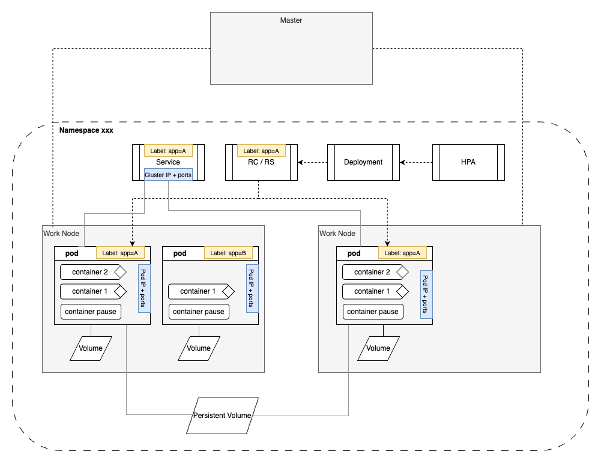
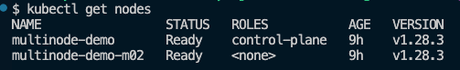
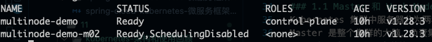
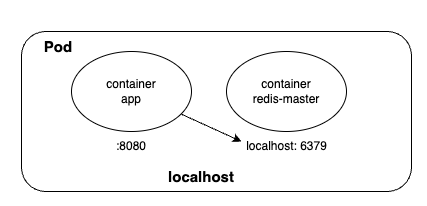
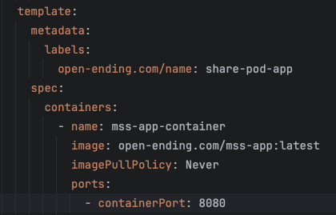
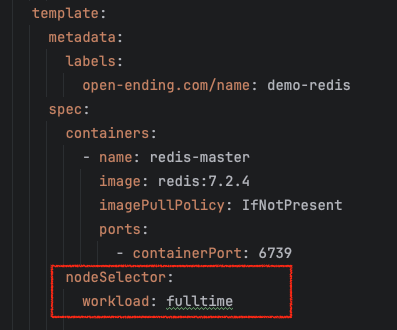
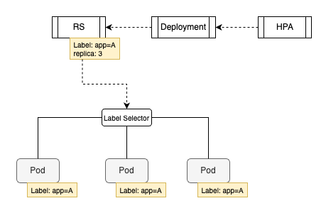
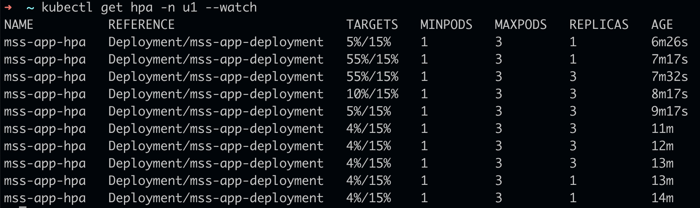

 
各模型概念的定义模版，此文中不会详细涉及。k8s 模版管理和构建工具，比较推荐 Skaffold 或 helm。  
如果想使用 kubectl 命令挨个调用的话，常用的命令规则：
`创建/更新`：`kubectl [create|apply] -f [file_name.yaml]`
`list`: `kubectl get [type]`
`get detail`: `kubectl get [type] -o yaml`
`describe`: `kubectl describe [type] [name]`
`删除`：`kubectl delete [type] [name]`
以上`[type]`是资源类型，包括 [nodes|pods|rs|deployments|svc|endpoints|namespaces] 等。
如果需要限制 namespace，命令后带上`-n [namespace_name]`
_注意: kubectl命令背后是在与`Kube-apiserver`进行交互，并非直接操作工作节点。具体概念，可先看下文，这里并不是非常重要。_

本文依然提供[demo repo](https://github.com/open-ending/demo-kubernetes-kubectl)，预安装 minikube、docker 即可练习使用。
- 子目录`k8s/basic`中，尽量覆盖了本文中提到的概念的基本使用，并持续更新。
- 子目录`k8s/share-pod` 是第二节同 Pod 内两个Container的一个简单操作示例。
- 子目录`k8s/service-without-label`是第四节 No selecter service 的一个操作示例。

## Kubernetes 基本模型和逻辑架构


### 1. Master 和 Node
Kubernetes 集群中服务器分为两种角色：`Master` 和 `Node`。  
Master 是整个集群的大脑，负责集群的管理和协调。它运行着几个关键的组件，如`Kube-apiserver`、`kube-contoller-manager`、`kube-scheduler`、`etcd`。  
Node 机器上除了必要安装的`kubelet`、`docker`、`kube-proxy`以外，大部分运算资源都会供给到用户业务应用服务中。  
Node 安装好之后，需要向 Master 注册和持续上报自己。  

#### 1.1 Node 管理
本地可以使用 minikube 快速启动多节点集群：`minikube start --nodes 2 -p multinode-demo`。  
查看 node 状态，`kubectl get nodes`：  
  

Node 可以手动维护，标记为不可调度，将阻止新 Pod 调度到该 Node 之上，但不会影响任何已经在其上的 Pod。这是重启节点或者执行其他维护操作之前的一个有用的准备步骤。  
将 Node 脱离调度，命令：`kubectl cordon $node_name`：  

Node 重新纳入调度，命令：`kubectl uncordon $node_name`  

### 2. Pod 和 Container(容器)
#### 2.1 概述
Container，即 Docker Container。Kubernetes 给 Container 分了不同的类型，这里暂时不展开。  
Pod 是 Kubernetes 中用于部署和管理容器的基本单元，它将一个或多个 container 封装为一个可管理的单元。  
Pod 内部自带有一个根容器（名叫 Pause），通过根容器，同一个 Pod 内的所有容器：共享一个网络命名空间（Pod IP 和 Port range）；共享存储卷（Volume）。  
同一个 Pod 内的 Container 想要访问另一个 Container expose port，仅需要使用 localhost + containerPort 即可访问。  
  
一般，只有当两个容器为了实现同一个业务功能、关系为紧耦合时，才推荐组装成一个Pod。  

Pod 的定义文件，至少包括两项信息：
- 标签lables
- 容器定义

_在 demo 的目录 ./k8s/share-pod 中是一个最简单的单 Pod 内同时安装了app和redis，同时创建了service和ingress将app http API 通过内部域名 share-pod.test 暴露出 Kubernetes cluster。可拿来练习试手。_

#### 2.2 类型
Pod 分为两种类型：`普通 Pod` 和 `Static Pod`。
普通 Pod 是短暂的实体，它们由 Kubernetes 自动部署到集群中的 Node 上，并在容器失败时，自动重启 Pod；Node 宕机时，被重新调度到其他 Node。

Static Pod 不由 Master 下令安装和管理，仅在具体的某个节点上通过 kubelet 安装，并且只在当前节点上运行，且不上报健康检查等状态。比如 Master 上面的几大关键组件就是以 static pod 存在。

#### 2.3 资源限额管理
每个 Pod 都可对其能使用的服务器上的计算资源设置限额，包括 CPU 和 Memory 两项。
如果不设置资源限制，默认情况下，Pod 对 Node 的资源使用是无限制的。
Kubernetes 的配额管理提供了两种约束方式，分别是 LimitRanger 与 ResourceQuota。其中 LimitRanger 作用于 Pod 和 Container，ResourceQuota 作用于 Namespace（见后）。

在 Pod template 定义时，LimitRanger 仅能定义在 Container[] 上，所有的 Container LimitRanger 累加，等于 Pod LimitRanger。
- `template.spec.containers[].resources.requests.memory` 内存申请的最小量
- `template.spec.containers[].resources.requests.cpu` CPU 核数绝对值申请的最小量
- `template.spec.containers[].resources.limits.memory` 内存最大允许量
- `template.spec.containers[].resources.limits.cpu` CPU 最大允许量

也可通过 namespace 给该命名空间下的 Pod 和 Container 统一配置 LimitRanger。
比如：创建以下 LimitRange 给某一个 Namespace。
```
apiVersion: v1
kind: LimitRange
metadata:
  name: cpu-resource-constraint
spec:
  limits:
  - default: # this section defines default limits
      cpu: 500m
    defaultRequest: # this section defines default requests
      cpu: 500m
    max: # max and min define the limit range
      cpu: "1"
    min:
      cpu: 100m
    type: Container
```

#### 2.4 Pod 的生命周期和 Container 重启策略
Pod 有5种生命周期阶段：`Pending`、`Running`、`Succeeded`、`Failed`、`Unknown`。
- `Pending`: Kubernetes 已接受创建该 Pod，但至少有一个容器未创建完成。此阶段包括等待 Pod 被调度和通过网络下载镜像的时间。
- `Running`: Pod 内的所有容器都已创建完成，至少有一个容器在运行 或 处于启动（包括重启）状态。
- `Succeeded`: Pod 内所有容器都已终止，且退出状态都为成功，Pod 不会再重启。
- `Failed`：Pod 内所有容器都已终止，但至少有一个容器退出状态为失败。
- `Unknown`：由于某种原因无法获取该 Pod 的状态，可能是网络通讯不畅等。

`restartPolicy` 是用于控制Pod内部容器的重启行为。这意味着它直接影响 Pod 中容器的生命周期，间接影响 Pod 本身的生命周期。
restartPolicy 可以有以下几种设置：
- `Always`：当容器终止运行时，无论退出代码是什么，Kubernetes 始终尝试重启容器。
- `OnFailure`：仅当容器以非零状态（即失败）退出时，才会重启容器。
- `Never`：无论容器退出代码如何，Kubernetes 都不会尝试重启容器。
通过在 Pod 定义合适的 restartPolicy，控制 Pod 中的容器在特定情况下是否应该自动重启。

并且 restartPolicy 也需要配合控制器来设置，比如：
- RS 和 DaemonSet：必须设置为 Always。因为要保证 Pod 持续运行。
- Job：仅能设置成 OnFailure 或 Never。成功执行并退出的容器，没必要重启。
- Static Pod：无论设置为何值，容器终止运行时 kubelet 都会重启容器。

总的来说，Pod 的生命周期流转如下图：


#### 2.5 Container 的探针
探针支持四种机制：`exec`、`gRPC`、`httpGet`和`tcpSocket`。
每次探测都会得到三种结果之一：
- `Success`：容器响应成功状态。
- `Failed`: 容器响应失败状态。
- `Unknown`: 探测行动失败，不采取措施，等待下一次探测。

Container 有两种探针：
- `LivenessProbe`: 探针如果返回`Failed`, 则 Kubelet 会杀死容器，然后根据 restartPolicy 决定是否重启。
- `ReadinessProbe`: 探针如果返回`Success`，则代表容器准备好向外提供服务，可以接受请求；如果返回`Failed`, endpoint controller 将从与 Pod 匹配的所有 Service endpoints 中删除该 Pod 的 IP 地址。
如果容器不提供探针，则默认一直返回`Success`。

#### 2.6 Pod 的节点调度
将 Pod 调度部署到哪个 Node 上，除了内置的默认调度之外，还可以显示指定：
- NodeSelecter：定向调度，通过 `.template.spec.nodeSelecter` 设置，精确匹配 Node label。
- NodeAffinity：亲和性调度，通过 `.template.spec.affinity.nodeAffinity`设置，比起 NodeSelecter 有更灵活的调度策略。NodeAffinity 可以和 NodeSelecter 一起使用。
- DaemonSet: 集群的每个 Node 都需要运行某一份相同的 Pod 副本，场景比如日志采集 Fluentd 或 logstash。
- Job: 批处理调度。

NodeSelecter 示例：
1. 临时给 node 打上标签
```
$ kubectl label nodes multinode-demo-m02 workload=fulltime
$ kubectl label --list nodes multinode-demo-m02
```
2. Pod 模版定义时设置`nodeSelector`


### 3. RC、Deployment、HPA
#### 3.1 概述
RC（Replication Controller）：是控制 Pod 水平扩展的关键元件，负责并保证指定数量的 Pod 副本始终运行和可用。通过 RC Kubernetes 实现了用户应用集群的高可用性，同时大大减少了系统管理员在传统 IT 环境中需要完成的手工运维工作。 
它能够自动替换那些失败的、被删除的或不符合用户定义状态的Pods。
一个 RC 定义文件中包括3个关键信息：
- Pod 定义的template
- 副本数量
- 监控目标 Pod 的标签选择规则

在 Kubernets 1.2 version 之后, Deployment 被提出，同时 RC 被升级为 RS（Replica Set）。
Deployment 针对 Pod 提供了更高级的管理功能，比如声明式的更新、回滚、缩放和自我修复功能，同时使用 RS 来管理 Pod 的副本级。
HPA（Horizontal Pod Autoscaler）：自动根据 CPU 使用率或其他指定的度量指标，调整 Pod 副本的数量，以确保应用程序在负载变化时进行自动扩展或缩减。（使用 HPA前，记得要开启集群的 metrics-server）


#### 3.2 Label（标签）
Labels 和 LabelSelectors 是 Kubernetes 用于组织和选择资源的关键工具。
Label 是附加到  Kubernetes 资源上的键/值对，可以用在几乎所有的 Kubernetes 资源上，它提供了一种灵活的方法来指定对象的属性（key/value都可自定义），且后续通过 LabelSelectors 对这些对象进行范围筛选和组织。
比如：RS 通过 Label 来确认其管理的 Pod 副本的数量和状态，Service 通过 Label 来确认与哪些 Pod 关联。

#### 3.3 Pod 扩容和缩容
- 采用手动扩(缩)容，命令：
```
$ kubectl scale --replicas=1 deployment/[name]
```

- 采用自动扩(缩)容，创建 HPA。
HPA 定义文件，包含关键信息：
    - 扩容目标 Deployment
    - 最小副本数
    - 最大副本数
    - 监控指标的类型和阈值
HPA 可以监控的指标分为`资源指标（CPU 和 Memory）`、`自定义指标（Pods/Object）`、`External 指标`，使用时需要 Kubernetes 集群安装了metrics-server。

下面是最简单的监控资源指标CPU的例子。
```
apiVersion: autoscaling/v2
kind: HorizontalPodAutoscaler
metadata:
  name: mss-app-hpa
  namespace: u1
spec:
  scaleTargetRef:
    apiVersion: apps/v1
    kind: Deployment
    name: mss-app-deployment
  minReplicas: 1
  maxReplicas: 3
  metrics:
    - type: Resource
      resource:
        name: cpu
        target:
          type: Utilization
          averageUtilization: 15
```

期望副本数的计算公式：
```
期望副本数 = ceil[当前副本数 * (当前指标 / 期望指标)]
```
在增加负载和停止负载后，副本数量自动增加和减少：


#### 3.4 滚动升级
Deployment 让滚动升级变得容易，仅需要修改 Deployment中的镜像即可。
- 采用`直接执行命令`
```
$ kubectl set image deployment/[deployment_name] [container_name]=[image_name]:[image_version]
# 查看上线状态
$ kubectl rollout status deployment/[deployment_name]
```

- 或者 `修改 Deployment yaml文件`，修改`.spec.template.spec.containers[].image`后保存，会触发 Deployment 发布。
```
$ kubectl edit deployment/nginx-deployment
```

查看 Deployment 历史和回滚也十分方便：
```
# 查看List
$ kubectl rollout history deployment/nginx-deployment
# 查看详情
$ kubectl rollout history deployment/nginx-deployment --revision=2
# 回滚到上一个
$ kubectl rollout undo deployment/nginx-deployment
# 回滚到 revision 2 那个版本
$ kubectl rollout undo deployment/nginx-deployment --to-revision=2
```

### 4. Service
kubernetes 集群通过创建 Service 定义了一个服务的访问入口地址，通过这个统一的入口能访问到其背后的一组 Pod 副本集组成的集群实例。
Service 与 背后的 Pod 副本集之间是通过 labelSelecter 进行匹配关联，并且逻辑上 Service 提供了负载均衡的能力。

service type 有四种类型：
- `ClusterIp`: 通过集群的内部 IP 公开 Service，选择该值时 Service 只能够在集群内部访问。不设置 type 时，默认此值。
- `NodePort`: 通过 Node IP 和 NodePort 公开 Service。Kubernetes 在 Node 上为需要外部访问的 Service 开启一个对应的 TCP 监听端口，外部系统只需要 Node IP + 具体的 NodePort 即可访问此服务。
- `LoadBalancer`: 使用云平台 或 其他Kubernetes集群外 的负载均衡器向外部公开 Service。
- `ExternalName`: 将 Service 映射到一个 DNS 名称。并且不需要设置 selector。

除了四种类型外，Service 还可以定义成：
- `No selector`  
  `No selecter`除了可以与`type=ExternalName`结合用来映射外部域名以外，还可以与`EndpointSlice`一起使用，映射外部endpoints。
- `Headless`
  设置 spec.clusterIP=None，Service 不提供负载均衡，直接返回背后的 pod list。

在 demo 目录 ./k8s/service-without-label中，编写了一个 no selecter service 示例，定义了一个`EndpointSlice`来映射外部 redis 连接端口。
`endpoints-external-redis.yaml`：
```
apiVersion: discovery.k8s.io/v1
kind: EndpointSlice
metadata:
  name: external-redis-service-endpoints
  namespace: u1
  labels:
    kubernetes.io/service-name: external-redis-service
addressType: IPv4
ports:
  - name: ''
    appProtocol: tcp
    protocol: TCP
    port: 6379
endpoints:
  - addresses:
      - "192.168.65.254"
```

### 5. Volume 和 Persistent Volume
卷（Volume）在 Kubernetes 中扮演着存储资源的角色，它可以被 Pod中的容器所挂载和访问。
Kubernetes Volume 跟 docker Volume 类似，区别在于前者有大量的类型扩展和延伸。
Kubernetes Volume 分 临时卷、持久卷、configmap、secret等。
- `临时卷`定义在 Pod 上，与 Pod 的生命周期相同，被同一个 Pod 内的多个 Container 共享。与 Container 的生命周期不相关，即使在 Container 重启期间，数据也不会丢失。
  常用的临时卷：`emptyDir`，在 Pod 分配到节点时被创建，是一块空的目录空间。只要该 Pod 在此节点上运行，它就存在；当 Pod 从 此节点移除，emptyDir中的数据会永久删除。
- `持久卷（Persistent Volume）` 可以比 Pod 的存活期长，当 Pod 不再存在，Kubernetes 也不会销毁持久卷。
  PV 是 Kubernetes 集群中的一种网络存储，是一种集群资源，但独立于 Node 之外。如果某个 Pod 想要申请 PV, 需要新定义一个 PVC（PersistentVolumeClaim），然后在 Pod 定义的 Volume 引用这个 PVC。
- `configmap`，应用部署的一个最佳实践是将配置信息与程序进行分离，configmap 就是 Kubernetes 提供的一种统一配置管理方案。
- `secret`，与configmap相似，但用来存放更机密的信息、秘钥等。

### 6. Namespace
在 Kubernetes 集群中，Namespace（命名空间）是一种将群集内的资源分隔成独立组的方法。命名空间提供了一个逻辑隔离的分区，使得多个团队或项目可以在同一个物理集群上共存，而不会相互干扰。

命名空间对于 Kubernetes 集群的资源管理和访问控制来说是非常有用的。它们允许您：
- 限制资源使用：通过 Kubernetes 的 Resource Quota / LimitRanger，可以限制每个命名空间可以使用的计算、存储资源。避免一个团队或项目消耗了集群中过多的资源，从而影响其他团队。
- 资源名称隔离：在命名空间内，资源的命名只需在该空间内保持唯一，而不必担心与其他命名空间的资源发生冲突。
- 扩展权限管理和访问控制：结合 Kubernetes 的 Role-Based Access Control (RBAC)，可以非常精细地控制哪些用户或组可以访问特定命名空间中的资源。 
