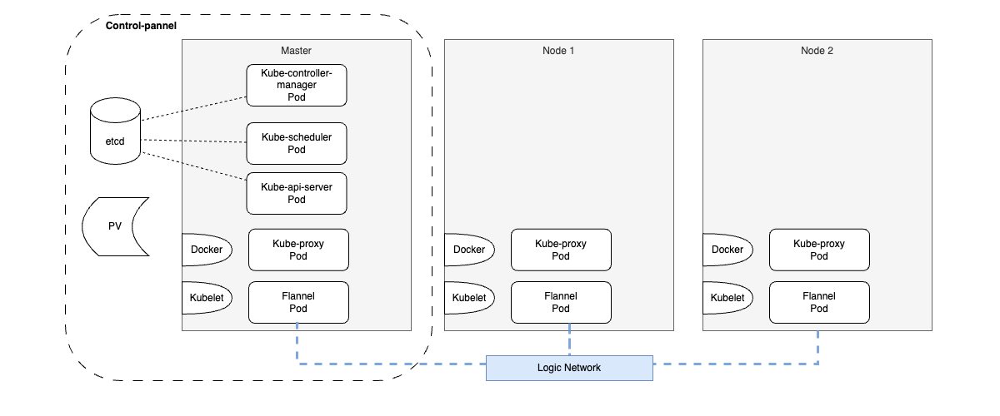

前面回顾了 Kubernetes 的逻辑概念模型和使用，这篇主要回顾一下 Kubernetes 的组件架构。  
之前提到 Kubernetes 将集群中的机器划分为至少一个 Master 节点和一群 Node 节点。  

Master 节点上：  
- 需要预安装 `docker` 和 `kubectl` 程序（运行 Pod 的必需环境）。
- 以 static pod 的方式（使用 kubectl 命令安装）运行`Kube-apiserver`、`kube-contoller-manager`、`kube-scheduler`，这些进程实现了整个集群的资源管理、安全控制、系统监控、Pod调度、弹性伸缩等管理功能。
- 集群数据集中存储在 `etcd` 键值存储库中，为了防止单点故障、进行高可用考虑，可将 etcd 以集群方式部署。
- 网络组件：`kube-proxy`、`flannel`(如果使用 Minikube，Minikube 中使用的网络组件是kindnet，此组件只适合用于开发和测试)

Node 节点上：  
- 需要预安装 `docker` 和 `kubectl` 程序。
- 网络组件：`kube-proxy`、`flannel`。

__control-panel__: 除 Node 工作节点外，Master 节点代表的集群控制面角色也被成为`control-panel`。  
PV（持久卷）是 Kubernetes 集群的资源之一，但并非是安装 Node 和 Master 上，由一些网络磁盘、块或者文件系统提供，然后由 control-panel 进行 PV Provisioning。  
容器需要使用 PV 时，需要创建 PVC（PersistentVolumeClaim）申请对 PV 的使用，最后通过 PVC 挂载到 Pod 上以供容器使用。  

### 1. kube-apiserver
Kubernetes API Server 是 Kubernetes 集群的核心组件，扮演着至关重要的角色，主要功能如下：
- 提供集群管理的 API ：API Server 提供统一的 RESTful API 接口，实现对集群内各种资源对象（如Pods、Services、ConfigMaps、Deployments等）的 CRUD 和 Watch等操作。API Server 底层连接键值存储库 etcd，对收到的请求进行有效性校验后，将变更操作转化为 etcd 中的键值对变化。
同时，API Server 作为集群内部各组件间通信的数据总线和数据中心，API Server 不仅响应资源请求，还负责提供集群状态数据变化的监控接口给其他组件和客户端，如 Controller Manager、kubelet等，从而确保整个集群状态的及时更新和同步。
- 身份认证和授权：API Server 具备强大的安全机制，支持多种认证方式，如 Bearer Token、X509证书、HTTP Base、ServiceAccount 等，并实施精细的授权策略，通过RBAC（Role-Based Access Control）控制用户和组件对 API 资源的访问权限。
- 准入控制：客户端的请求通过身份认证和授权后，还需要通过准入控制链中的每个控制器的检查，检查通过才能完成 API 操作。

### 2. kube-controller-manager
Controller Manager 包含一系列子控制器，它们通过 API Server 监听对应的资源对象变化，作出相应的调整以达到用户定义的期望状态。
这里面包括、但不限于以下几个主要功能：
- NodeController：节点控制器监控集群中每个 Node 的状态，处理节点加入、离开集群的过程，并对异常节点进行标记、删除或重新调度其上运行的Pod，以保持集群整体健康。
- ReplicationController：确保用户定义的 Pod 副本数量与集群中实际运行的数量相匹配。如果有差异，副本控制器会自动增加或减少副本来修正差异。
- ServiceController：服务控制器负责管理服务资源和对应的端点资源，确保服务背后的 Pod 能够被正确地代理和路由流量。
- NamespaceController | ResourceQuotaContoller：命名空间控制器维护命名空间的生命周期，同时资源配额控制器确保各命名空间内的资源消耗不超过预设限额。
- DeploymentController | StatefulSetController | DaemonSetController：这些控制器分别管理不同类型的工作负载，确保 Deployment、StatefulSet、DaemonSet 资源定义的状态与实际集群状态一致，处理Pods的创建、更新和删除。  
通过这些控制器的协调工作，kube-controller-manager 保证了集群的健康与动态调整能力，响应资源变化和节点故障，维持系统的高可用性。

### 3. kube-scheduler
kube-scheduler 负责监视新创建的、还未指定运行节点的 Pods，然后基于调度算法和策略，确定每个待调度 Pod 应该运行在哪个 Node 上，并将 Pod 与 Node 的绑定信息通过 API Server 写入 etcd。   
kube-scheduler 会考虑多种因素来做出调度决策，包括但不限于：各个 Node 的资源需求（如 CPU、内存等）、Node 的健康状态、亲和性和反亲和性设置、Pod 的优先级和抢占逻辑，以及集群中已经部署的工作负载分布。通过这些细致的考量，kube-scheduler 能够优化负载的分布，提高集群的资源利用率和可靠性，同时也支持高级调度功能，如横向扩展和自动恢复。  
kube-scheduler 给一个 Pod 做调度选择时包含两个步骤：
- 过滤：使用预选策略，遍历所有目标 Node，筛选出符合要求的候选 Node。
- 打分：使用优选策略，计算出每个候选 Node 的积分，选出最高者。

### 4. kube-proxy
在 Kubernetes 的每个节点上都会运行一个 kube-proxy 服务进程，负责实现 Kubernetes Service 模型背后的网络代理和负载均衡功能。
- 网络代理：kube-proxy 负责监听 Kubernetes 控制平面的 Service 和 Endpoints 的变化，然后更新 Node 上的网络规则（如 iptables、ipvs等），从而允许网络流量到达这些服务背后的 Pod。无论是来自哪个 Node 的对 Service 的请求，都可以被该 Node 上的 kube-proxy 代理到正确地址。
- 负载均衡：当一个 Service 的后端包含多个 Pod 时，kube-proxy 会负责实现请求的负载均衡，将进入服务的流量均匀地分配给后端的所有 Pod。

### 5. Kubernetes 网络
Kubernetes 自身并不直接提供完整的 Pod 网络组件。相反，Kubernetes定义了一组网络要求和接口，以确保Pod间和集群外部的通信。  
为了满足这些要求，它依赖于第三方网络插件或解决方案，遵循CNI（Container Network Interface）标准。这些CNI插件负责为 Pod 提供网络功能，包括分配 IP 地址、处理网络隔离和路由等。  

Kubernetes对网络有几个基本的要求，任何想要集成的CNI插件都需要遵守：
1. **所有Pod都必须能直接通信，无需NAT**：每个Pod应该有一个唯一的IP地址，并且这个IP在整个集群内部都是可路由的。  
2. **所有节点都必须能直接通信**：节点之间的通信不应被阻塞。  
3. **Pod在与外界通信时，应保持其源IP地址**：为了确保网络的透明性和可追踪性。  

常见的CNI插件：
- **Calico**：提供了丰富的网络策略功能，支持跨主机和云提供商的高性能网络。
- **Flannel**：简单易用，常被用于初学者或者是小规模环境。
- **Weave Net**：提供了自己的网络模型，支持无缝地跨越多个数据中心和云提供商。
- **Cilium**：利用Linux内核的BPF（Berkeley Packet Filter）来提供网络安全、监控和负载均衡功能。

