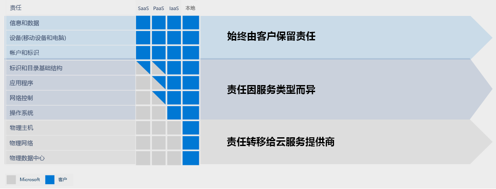
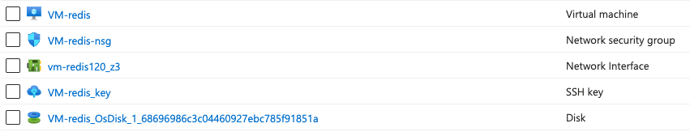
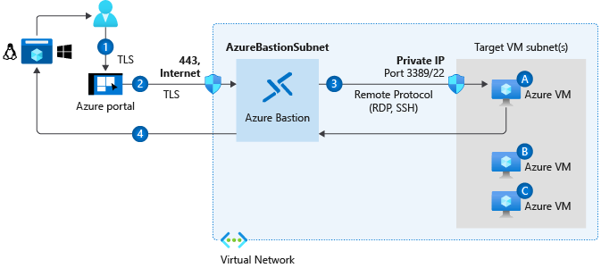

Azure Virtual Machine（简称 VM） 是 Azure 云上的一种非常基本的计算资源，同类竞品有 AWS 上的 EC2、阿里云上的 ECS 等。

基本上有上云经验的工程师，最先入门级的云产品就是虚拟机。

云平台上的虚拟机，如阿里云 ECS、AWS EC2、Azure VM，并不是真实的物理机，而是通过虚拟化技术（Hyper-V、KVM等）在物理服务器上创建的虚拟实例。这些虚拟机为用户提供了类似物理机的计算资源，包括CPU、内存、存储和网络资源，但实际上是共享底层物理硬件的抽象化表示。

### 一、Azure VM 的特征

1. VM 划属于 IaaS（基础结构即服务），VM 提供了操作系统、存储和网络功能，用户可以在此之上运行各种应用程序。
2. VM 可以根据需求快速操作 —— 纵向扩展和缩减。
3. 与虚拟机相关的责任由 Microsoft 和客户共同承担。  
    Microsoft 负责基础设施、物理数据中心的管理和网络安全。客户则负责虚拟机内部的操作系统、安全配置、应用程序管理和数据保护。  
      
    这里稍微提一下“云服务责任共担模型”。一般用户上云的目的，除了保障SLA、性能可弹性、节省研发成本之外，获取专业运维能力之上的责任共担是一个重要理由。  
    **云服务责任共担模型：**
    
    

### 二、VM 由多个资源组件组成
具体包括：
1. 计算单元：vCPU 、 Mem
2. 存储单元：磁盘
3. 网络：NIC 、 Virtual Network 、 Security Group
4. 其他组件：如VM extension、诊断和监控工具

因此，一般情况下，一个 VM 被创建出来后，会在资源清单中发现如下一批资源项：

### 三、如何选择VM大小规格
1. 首先，当然是明确用户方的需求，拿着需求来进行规划。
2. 然后，对照 Azure VM 的分类，进行业务方案比对：
    
    
3. 其次，选择 VM 规格。  
    由于 Azure VM 各分类下的规格和族系实在是太多，想要了解可以参照：  
    
    > [!info] 虚拟机大小概述 - Azure Virtual Machines  
    > 列出 Azure 中虚拟机的不同可用实例大小。  
    > [列出 Azure 中虚拟机的不同可用实例大小](https://learn.microsoft.com/zh-cn/azure/virtual-machines/sizes/overview?tabs=breakdownseries%2Cgeneralsizelist%2Ccomputesizelist%2Cmemorysizelist%2Cstoragesizelist%2Cgpusizelist%2Cfpgasizelist%2Chpcsizelist#list-of-vm-size-families-by-type)  
    
    除非是对 Azure VM 族系非常熟练了解，不然不推荐肉眼遍历清单的方式选择 VM 规格。  
    正常情况，推荐使用以下 VM 选择器，可以根据需求，快速筛选出适合的 VM 族系和规格。  
    
    > [!info] Microsoft Azure VM 选择器  
    > Microsoft Azure VM 选择器：查找所需的 VM  
    > [Microsoft Azure VM 选择器](https://azure.microsoft.com/zh-cn/pricing/vm-selector/)  
    
4. 成本计算。  
    将筛选出的 VM 规格添加到成本计算器中，结合需求成本，最终确定 VM 的规格选择。  
    
    > [!info] 价格计算器 | Microsoft Azure  
    > 为特定方案配置 Azure 产品和功能并预估这些产品和功能的成本。  
    > [价格计算器](https://azure.microsoft.com/zh-cn/pricing/calculator/)  
    

### 四、创建 VM 的方式
创建Azure VM的步骤包括选择区域、操作系统、配置虚拟机大小、设置存储和网络，以及应用安全组和诊断扩展等，这里不细说。

**1、用于创建 VM 的工具**  
对资源的创建和管理，Azure 提供了多种资源管理终端。  
按交互方式分：
- 图形界面：  
    Azure Portal  
- 命令行：  
    Azure Cloud Shell  
    Azure PowerShell  
    Azure CLI  
各种终端除了交互方式以外，功能上基本没有什么不同，背后都是连接 ARM（Azure Resource Management）。  
  
**2、Infrastructure as code**
Azure 提供 ARM Template 作为 Infra as code 脚本，是一种声明式定义，通过ARM Template 脚本可以快速创建和变更 VM。  
4种终端工具，皆可执行ARM Template。

**3、VM Extension**
可以在使用 ARM Template 创建虚拟机时，同时声明 VM Extension，以便在虚拟机创建完成时自动安装软件。这样可以自动化创建 VM 的同时，完成 VM 环境的初始化（软件安装和配置流程等等），提高部署效率。
当然也可以在 VM 创建好之后，通过 VM Extension 功能手动触发环境安装。

### 五、连接 VM 的方式
Azure 提供多种方式连接 VM，包括以下几种：
- RDP 协议。Windows VM 推荐，带远程桌面方式。
- SSH 协议。Linux VM 推荐，Linux VM 无法使用 RDP。
- Azure Bastion。支持 Windows 和 Linux 两种 VM 系统，不需要 VM 开放公网 IP 和 NSG inbound 规则。
  用户只需要网页访问 Azure Portal（https协议），Azure Bastion 将外部连接转换为内部连接接入目标 VM。
  但**注意**，创建和使用 Azure Bastion  需要额外收费。
  

### 六、约束
如果是想要进行 Azure 考试 或者 Azure 架构实施，需要注意一些 Azure 产品的约束细节。
- 磁盘约束。单个VM可以挂载多个存储磁盘，但每个VM最高支持256T的存储空间。