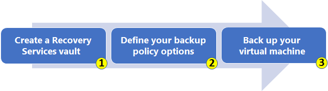
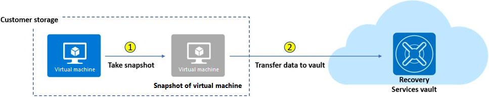

前面介绍了[Azure VM](../../02/liang-ri-yi-gai-nian-zhi-azure-pian-virtual-machine/)。  
当部署了 VM 之后，如何从 VM 层面保证 “业务连续性和灾备（BCDR）”计划呢？  

Azure 为 VM 在这方面提供了多个选项和方案：
- 高可用方面：Availability Sets（可用性集）、Availability Zone（可用性区）、VM Scale Sets（虚拟机规模集）。
- 备份冗余：Azure Backup、Azure Site Recovery。  
这篇聊的就是Azure Backup。

`Azure Backup` 是 Azure 的 一项内置的功能，涉及到多个 Azure 产品和服务。  
它为 Azure 管理的数据资产提供安全备份，并将备份数据保存到 Recovery Services Vault(恢复服务保管库，`Azure Site Recovery` 也将数据保存在此处)。  

### 一、Azure Backup 支持的场景
1. `Azure VM` —— 无需额外安装软件即可轻松备份和还原Azure VM。
2. `本地服务器（本地物理机或虚拟机）` —— 需要安装 Microsoft Azure Recovery Service (MARS) Agent。或者在本地部署 Microsoft Azure Backup Service (MABS) 或 Data Protection Manager (DPM) ，然后由 MARS Agent 将备份服务器的数据备份到 Azure 云。
3. `Azure File Share（Azure文件共享）`
4. `Azure VM 中的工作负载` —— 仅包括 SQL Server 和 SAP HANA 两种数据库。

然而，近期 Azure Backup 的服务边界在不断扩展，新出现了“Backup Vault（备份保管库）”，并对应了新的支持场景（有待观察）: 
- Azure Database for PostgreSQL
- Azure Blob
- Azure Kubernetes

### 二、与 Azure Site Recovery 的区别
`Recovery Services Vault` 是备份的存储实体。  
它除了对 Azure Backup 提供支持以外，同时提供了对 Azure Site Recovery 的支持。  

这两者的区别：  
Azure Backup 的主要目标是 —— 维护让你能够及时回退到目标状态的数据副本，但Azure Site Recovery 几乎可实时复制数据，并允许故障转移。

从业务连续性和可用性上说：
- 如果存在网络或断电等问题，你可使用 Availability Zone（可用性区）。
- 对于 Region（区域）范围的灾难（如自然灾害），使用 Azure Site Recovery。
- 在出现意外数据丢失、数据损坏或勒索软件攻击的情况时使用 Azure Backup。

### 三、特性和机制
备份 VM 遵循简单的三步骤：  
创建恢复服务保管库、定义备份策略、执行备份作业。

- **创建 Recovery Services Vault**  
    创建保管库时，需要选择保管库的冗余复制机制。
    - `本地冗余存储 (LRS)`。这是成本最低的选项，针对服务器机架和驱动器故障提供基本保护。建议将此选项用于非关键方案。
    - `异地冗余存储 (GRS)`：此中间选项在 Paired Regions 的次要区域中具有故障转移功能。 建议将此选项用于备份方案。
    - `区域冗余存储 (ZRS)`：此选项通过跨三个 Azure 可用性区域同步复制存储帐户，来防范数据中心级别的故障。 建议将此选项用于高可用性方案。
    
    以上三项，也是 Azure 各服务中常见的三种冗余选项，经常会看见它们。  
    
- **Snapshots（快照）**  
    Azure Backup 对每种支持的操作系统使用不同的扩展，以生成快照：
    | OS | 扩展 |
    | --- | --- |
    | Windows | VMSnapshot：使用VSS可获取磁盘和内存中数据的副本。 |
    | Linux | VMSnapshotLinux：快照仅是磁盘数据的副本。 |
    
    可见，Azure Backup 针对 Windows 系统可以自带内存数据的复制，但 Linux 则没有此特性。    
    
    生成快照的一致性，分以下三种：
    - `Application consistent(应用程序一致性)  `  
    将整个 VM 作为一个整体进行快照捕获和生成。快照为 VM 及所有正在运行的应用程序提供完全一致性。
    注意，Linux 系统要落实此特性，需要自己编写每个应用的pre \ post scripts，以捕获应用程序的状态。
    - `File system consistent(文件系统一致性) `  
    如果VSS在 Windows 上出现故障，或 pre \ post scripts 在 Linux 上出现故障，则仅会创建文件系统一致的快照。
    - `Crash consistent(崩溃一致性)  `  
    当正在备份时，VM 出现了关闭的情况，快照会被标记为“Crash consistent”。此快照既不能保证 应用程序一致性，也不能保证操作系统的一致性。
    除非实在没有办法，尽量不要使用Crash consistent的快照。

- **Backup policy（备份策略）**  
    备份策略，可定义备份的备份频率和保存时长。 

    - 备份频率        
        目前，VM 备份可每天或每周触发，并且可存储多年。 如果使用”增强策略“，可以触发每小时备份。
        
    - 保存时长  
        先来了解一下，Azure 备份作业分为两个阶段：  
        

        - 阶段 1：根据设置的备份时间点，捕获和生成虚拟机数据的快照。  
        - 阶段 2：将快照传输到 Recovery Services Vault。  
        一般，阶段1是实时完成，但阶段2的完成时长从1小时~24小时内不等。  
        
        因此，这两个阶段拥有不同的保存时长。  
        在第一阶段，快照在 VM 本地进行了“instant store（即时存储）”，存储在 VM 本地的备份又称为“快照层”。  
        在第二阶段，当备份被上传到 Recovery Service Vault 中，称为“保管库层”。  
        - `快照层策略`  
            默认备份在 VM 本地保存的时长为 2 天，可配置为 1 ~ 5 天。  
            在本地存在快照的情况下，可以使用“instant restore（即时还原）”，从而减少等待备份数据上传到保管库、又从保管库下载恢复的时间。  
            因此，如果本地快照保存时长是2天，instant restore 仅可还原两天内的备份数据。  
            
        - `保管库层策略`  
            默认备份在保管库保存的时长为 30 天，可延长存储数年。  
            保存保管库里的备份，默认开启了软删除。即在删除备份项后，备份数据也将保留 14 天。 这可防止意外删除或恶意删除情况，从而允许恢复这些备份，不会丢失数据。  
    
- **Restore**  
    对于还原 VM，可以支持多种还原方式：
    - 创建新 VM —— 从还原点快速创建一个**新的 VM**。
    - 还原磁盘 —— 还原某个 VM 磁盘，然后使用它来创建**新的 VM**。
    - 替换现有项 —— 可还原某个磁盘，并用它来替换**现有 VM** 上的磁盘。
    - 跨区域（次要区域） —— 支持 **创建新 VM**、**还原磁盘** ，暂不支持**替换现有项**。
    - 跨订阅还原、跨区域还原。
    - 选择性磁盘备份 ——允许通过增强策略，备份和还原 VM 磁盘子集。

### 四、约束
- 快照层保存时长：标准版策略，默认可在本地保留 2 天，使用增强型策略默认可在本地保留7 天。 对于标准版策略，保留期值可配置为 1 到 5 天的任何值，对于增强型策略则为 1 至 30 天。
- 软删除：标准版策略，软删除保留 14 天，使用增强型策略可延长此时长。
