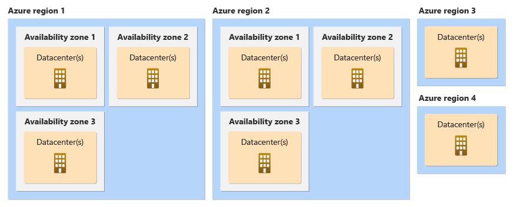

Availability Zones，是当今云平台提供高可用服务的主要方案之一。  
”Availability Zones“ 会被翻译为”可用区“、”可用性区“ 或者 ”可用性区域“。  
个人认为比较好的翻译是”可用区“，因为在中文翻译中，会将 “Zone” 和 “Region” 都翻译成“区域”，而 Availability Zones 和 Region 正好是云平台最广泛和重要的两个概念。  
当然在看文档时，担心混淆的情况下，最好是看英文版本。

### 一、何为 Availability Zones
在搞清楚 Availability Zones 是什么之前，需要了解 Region 的概念。

**Region** 是一个地理位置概念，代表一组数据中心，这些数据中心在网络等基础设施上高度互联，并且位于特定的地理位置内，比如东亚区（HK）、日本东部等。  
Region 使用户能够选择最适合其业务需求的数据中心位置，以实现低延迟、高性能、遵从数据安全等法律法规。  
  
  
在 Azure 云上，有不少 Regions 支持 **Availability Zones**。  
在这些支持的 Regions 中，同一个 Region 内部的数据中心又根据物理、逻辑隔离进行了分组，每个组即是一个 Availability Zone。    
Availability Zones 确保用户的应用程序和数据在面对硬件故障、自然灾害等灾难性事件时，依然能够保持高可用性和可靠性。  

Availability Zones 具有以下特性：
- 地理位置上，Zones 之间不能相距过远，要足以与 Zones 建立低延迟连接。Zones 彼此间通过低延迟的高带宽网络相互连接，确保数据在不同 Zones 之间快速同步。

- 同时，Zones 之间不能相距过近，当地出现停电或天气影响时，应相互之间隔绝影响。

- 每个 Zone 有独立的电源、冷却和网络设施等基础结构。

- 每个 Region 至少有三个 Zones。

- Azure 服务更新，一次只会更新一个 Zone 。一个 Zone 更新完，才会更新下一个。

- 具体哪个 Region 是否支持 Availability Zones，需要查询官方最新 Availability Zones 支持清单。[支持可用性区域的 Azure 服务](https://learn.microsoft.com/zh-cn/azure/reliability/availability-zones-service-support#azure-regions-with-availability-zone-support)

### 二、Zonal / Zone-redundant Service
Availability Zones 针对不同的 Azure 产品服务提供了两种使用方案：
- **Zonal Service（支持可用区的服务）** —— 资源固定到指定的 Zone。  
    用户可以跨多个 Zones 进行合并部署，需要用户自己设计方案 —— 处理数据复制、请求分发、故障转移等问题。  
    一般 Azure 上的 IaaS 支持 Zonal Deployment。比如，Azure VM。

- **Zone-redundant Service（支持可用区冗余的服务）** —— 冗余资源分布于多个 Zones。  
    Azure 自动处理跨 Zones 的数据复制、请求分发、故障转移等问题。
    PaaS 通常支持 Zone-redundant。比如，Azure VM Scale Set（VM 不直接支持 Zone-redundant，想要使用 Zone-redundant 就使用 Azure VM Scale Set）、Azure Database for MySQL等。  

具体服务是否支持 Zonal / Zone-redundant 可以查找清单：[支持可用性区域的 Azure 服务](https://learn.microsoft.com/zh-cn/azure/reliability/availability-zones-service-support#azure-services-with-availability-zone-support)