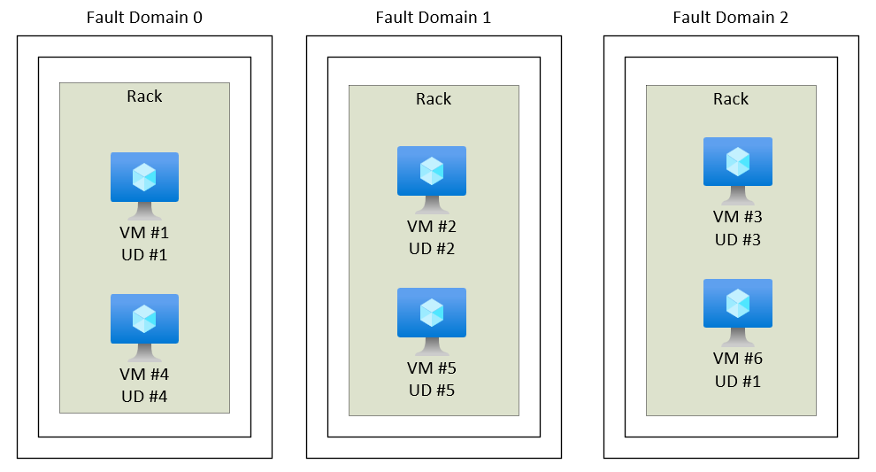

前面讲了 [Availability Zones](../../08/liang-ri-yi-gai-nian-zhi-azure-pian-availability-zones/)，这里再聊一下另一个概念：**Availability Sets（可用集）。**

### 一、何为 Availability Sets
**Availability Sets（也称可用集）**，也是云平台高可用服务解决方案之一。但相比 Availability Zones，是一个适用性并没那个广的概念。

如果说 Availability Zones 是以跨 Zones 的方式，解决单点问题；那 Availability Sets 则是 —— 当想在 单个 Zone 以内、或者所选 Region 不支持 Availability Zones时，解决单点问题的机制。

举个例子：
Azure 为虚拟机提供了多个高可用性选项。 可以使用Availability Sets、Availability Zones 和 Azure VM Scales Sets 来实现高可用性。（Azure VM Scales Sets 这个以后聊，不同于前两者，它是一个 PaaS 功能）

当一组相同功能、或相关联的 VMs，使用 Availability Zones 的方式进行部署，不同的 Zones 之间会进行故障隔离和交替更新，有效避免单点故障。
而当没有条件使用 Availability Zones 时，如何让 Azure 了解哪些 VMs 需要进行必要的故障隔离和交替更新呢？这时候，就可以考虑使用 Availability Sets了。

Availability Sets 是 VM 的逻辑分组，可以让 Azure 了解应用程序的构建方式，以便提供冗余和可用性。  
那什么是让 Azure 了解应用程序的构建方式呢？这里就涉及到了组成 Availability Sets 的两个重要概念：**更新域** 和 **容错域**。

### 二、更新域和容错域
Azure 平台会为 Availability sets 里的每个 VM 分配一个更新域和一个容错域 。  

- **更新域**  
  在同一更新域中的 VMs，在 Azure 升级时，会同一时间一起进行更新。
    
  所谓的 Azure 升级，指“计划内维护”。在计划内维护期间，同一个 Availability Zones 一次仅重启一个更新域。重启的更新域有30分钟的时间进行恢复，此时间过后，就会在另一更新域上启动更新操作。
    
  默认，一个 Availability Sets 会有 5 个更新域，最多可以调整到 20 个。同一个 Availability sets 内的 VMs 会尽量均匀分布在不同的更新域。  

  举个例子，一个 Availability Sets 中有 7 台虚拟机，在 Azure 升级期间，最少有多少台 VMs 可用？（敲黑板，Azure 认证会考）  
  答案是：5台。7 - 2（一个更新域这时候，最多只会有 2台 VMs）。  

- **容错域**  
  容错域定义一组虚拟机，它们共用一个通用电源和网络交换机。  
  当出现局部断电、网络设施故障等，不同容错域内的虚拟机不受影响。  
  一个 Availability Sets 最多只能有 3 个容错域。  

### 三、约束
- 配置 Availability Sets 的方式。  
  只能在创建 VM 时将 VM 添加到 Availability Sets，之后已存在的 VM 无法变更 Availability Sets。  
  若要更改 Availability Sets，必须将虚拟机删除，然后重新创建虚拟机。  

- 有条件使用 Availability Zones 方式的，推荐尽量优先使用 Availability Zones 方案。比起 Availability Sets，可保证更优秀的高可用性和SLA。  