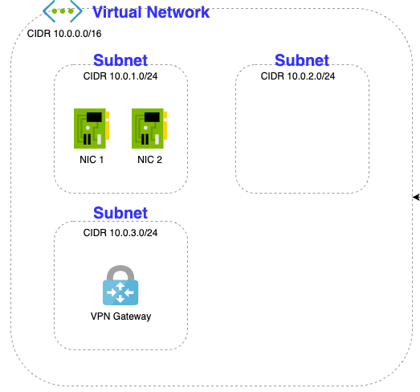
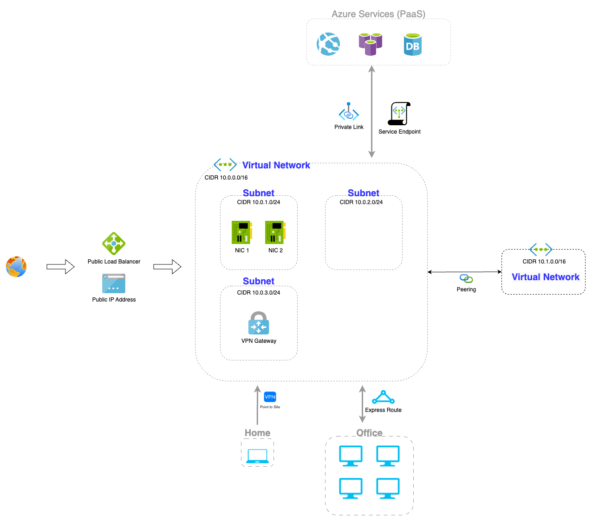
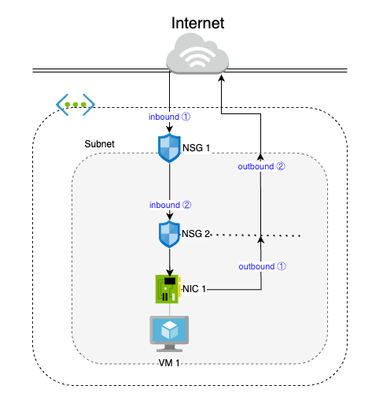

Azure网络架构由多个关键组件组成，这些组件相互配合，提供了高度灵活和安全的网络解决方案。  

## 1. 虚拟网络 (Virtual Network, VNet)
**虚拟网络**是 Azure 中的基础网络隔离单元，更是 Azure 云上专用网络的基本构建基块。通过 VNet 可以在 Azure 云上构建类似于本地局域网一样的复杂网络，它还提供了 Azure 基础结构的额外优势，例如缩放、可用性和隔离。  

**特性：**  
- **IP地址空间管理**：用户可以自定义 VNet 的 IP 地址范围，使用 CIDR 格式。  
- **子网（Subnet）**：VNet 内可以创建多个子网，用于逻辑隔离和管理。注意，子网彼此之间 IP 地址范围不能重叠。  
- **资源连接**：支持将虚拟机、应用服务、数据库等资源连接到 VNet 中。  

借助 Azure VNet，Azure 中的资源可以安全地在相互之间、与 Internet 和本地网络进行通信。  

场景分别包括：  
- **与 Internet 之间的通信。** 可以通过给 VNet 内的资源，比如 VM —— 分配 Public IP 或 使用 Public Load balancer 来与这些资源进行入站通信，甚至管理出站连接。  
- **Azure 资源之间的通信。** Azure 资源可通过三种关键机制进行通信：VNet、Service Endpoints（服务终结点） 和 VNet Peering（对等连接）。  
    1. 一个 VNet 不仅可以连接 VM，也可以连接其他 Azure 资源，例如 Azure Kubernetes Service等。  
    2. 可以使用 Service Endpoints 连接到其他 Azure 服务，例如 Azure SQL 数据库和存储帐户等。 
    3. 创建 VNet 时，只要 CIDR 块不重叠，即可创建对等连接（Peering）到其他 VNet。这样 VNets 中的资源可以相互通信。  
- **与本地资源之间的通信。** 可以使用以下任一选项将本地计算机和网络连接到 VNet：点到站点虚拟专用网络 (Point to Site VPN)、站点到站点 VPN（Site to Site VPN）、Azure ExpressRoute。  
- **筛选网络流量。** 可以使用网络安全组（NSG）和网络虚拟设备（如防火墙、网关、代理和NAT）的任意组合来筛选子网之间的网络流量。  
- **路由网络流量。** Azure 在 Subnet、VNets、本地网络以及 Internet 之间进行网络路由。 用户可以使用路由表（Route Table）或边界网关协议 (BGP) 来进行路由规则定制。  

## 2. 网络安全组 (Network Security Groups, NSG)
网络安全组，是一种用于控制网络流量的访问控制列表（ACL）。它通过定义入站（Inbound）和出站（Outbound）的安全规则，保护 Azure 资源免受未经授权的访问。  
**特性：**  
- **规则定义**：用户可以定义基于源 IP、目标 IP、端口和协议的安全规则。  
- **应用范围**：NSG 可以应用于`子网`或`单个网络接口（NIC， Network Interface）`，实现不同层级的安全策略。  
- **流量过滤**：提供细粒度的流量控制，确保网络安全。  

**单个 NSG 内 Rules 的优先级：**  
- 用户定义的 Rule：优先级数字范围 100 ~ 4096 。  
- 优先级数字越小，优先级越高。  

**应用于 Subnet 和 NIC 的 NSG Rules 优先级：**   
- inbound 方向：关联在 Subnet 上的 NSG Rules 优先级高于 NIC 上的。  
  如下图中 NSG 1 Rules 优先级高于 NSG 2。  
- outbound 方向：关联在 NIC 上的 NSG Rules 优先级高于 Subnet 上的。  
  如下图中 NSG 2 Rules 优先级高于 NSG 1。  

## 3. 虚拟私有网络（Virtual Private Network, VPN）
VPN 允许通过安全的方式将 Azure 虚拟网络与本地网络、Azure 虚拟网络与其他云环境连接起来。它通常使用 IPsec 协议，确保数据在传输过程中的保密性和完整性。
**特性：**  
- **站点到站点VPN**（Site to Site）：用于连接 Azure VNet 和本地数据中心。
- **点到站点VPN**（Point to Site）：允许个人设备通过 VPN 连接到 Azure 虚拟网络。
- **VPN transit for VNet Peering**：是一种混合的网络连接方法，它结合了 VNet Peering 和VPN Gateway 的优势，实现了跨虚拟网络的安全连接和数据传输。可用于 Hub-and-Spoke 网络模型架构。  
  
## 4. 服务终结点（Service Endpoints）
默认情况下，Azure 服务都是针对直接 Internet 访问而设计的。 所有 Azure 资源都有 Public IP，其中包括 PaaS 服务，例如 Azure SQL 数据库和 Azure 存储。 由于这些服务对 Internet 都是公开的，因此任何人都可能访问你的 Azure 服务。

Service Endpoints 可以让 VNet 中的资源直接连接到“特定类型的 PaaS 服务”，确保数据在 Azure 骨干网络中传输，提高了安全性和性能。添加 Service Endpoints 不会删除暴露给外网的公共终结点，它只是提供了流量的重定向。

**特性：**
- **网络扩展**：允许计算资源从 VNet 中直接访问 Azure 服务。
- **安全传输**：数据传输在 Azure 内部网络中完成，事实上不经过 Azure 服务的公网 IP 或 域名，避免了公共互联网的风险。
- **简化管理**：无需额外的代理或 NAT 配置，简化了网络管理。

## 5. 专用终结点 / 专用链接（Private EndPoint / Private Link）
在 VNet 中创建 Private Endpoint，然后通过 Private Link 将“具体的某一个 Azure 服务实例”与用户的 VNet 连接起来，服务实例可删除公共终结点，确保所有流量在专用网络中传输。对比 Service Endpoints 进一步增强了安全性。  

更多 Service Endpoints 和 Private Endpoints 的差异对比，见官方文档 [比较专用终结点和服务终结点](https://learn.microsoft.com/zh-cn/azure/virtual-network/vnet-integration-for-azure-services#compare-private-endpoints-and-service-endpoints)

