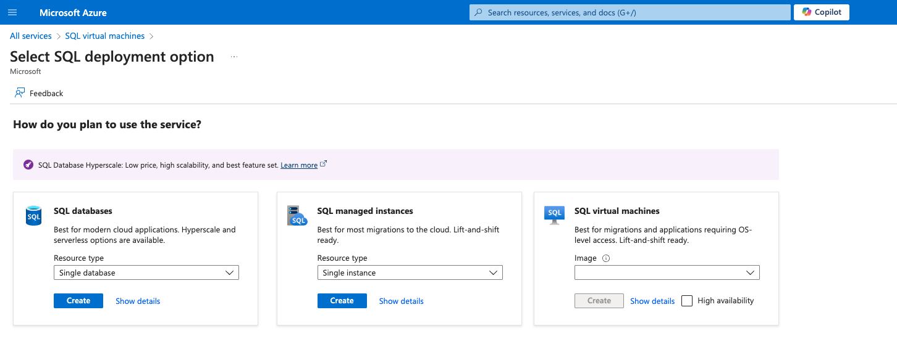
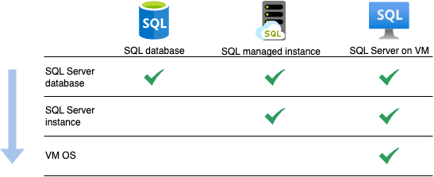
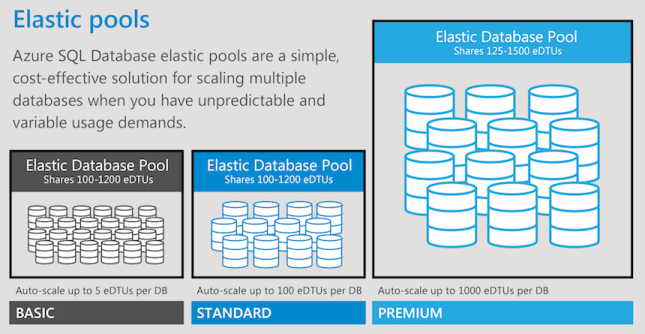
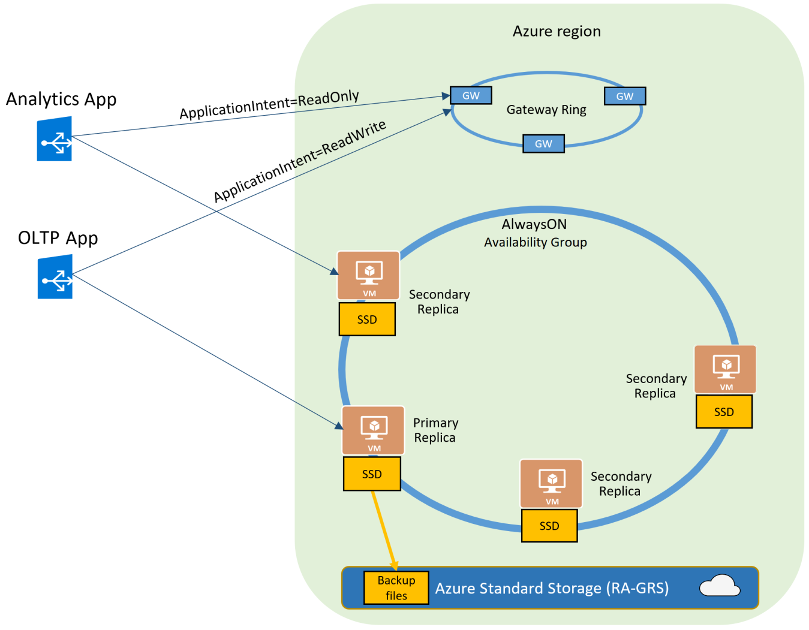

与 SQL Server 数据库的传统印象不同，如果想在 Azure 上申请一台 SQL Server 数据库，你可能会被导航到以下三种产品：  
- SQL 数据库（SQL databases）  
- SQL 托管实例（SQL managed instances）  
- 虚拟机上的 SQL Server（SQL Server on VM）  

用一幅图简单说明这三个产品的不同：  

SQL databases 是 serverless， SQL managed instances 是 PaaS，SQL Server on VM 是在VM 上自维护 SQL Server。  
对 SQL Server 不怎么熟悉的小伙伴可以将 **Database** 想象成 MySQL 的 **schema**, 而 **instance** 则是 MySQL 的 **Database Server**。 
因此，图上三种产品按从左往右的顺序，用户接触到的底层的配置和维护工作量就越大，但可以使用的原版 SQL Server 的功能就越多、定制的自由度就越高。架构设计时，一般可按照功能需求，从左往右依次排除和筛选。  

## 1. SQL databases
Azure SQL databases，是一种 serverless 服务 —— 它面向用户时，抽离了操作系统和数据库服务器实例的概念，因此用户：  
- 无需处理复杂的数据库任务，例如配置和管理高可用性、优化和备份  
- 不能指定 SQL Server 实例的版本，Azure 会自动升级每个 SQL database 底层的 SQL Server 的版本到最新版  

### 数据库弹性池（elastic database pools）
SQL databases 提供了一种动态的纵向可伸缩方案 —— 弹性池，用于管理和缩放负载不断变化且不可预测的多个数据库。  
同一弹性池中的所有数据库位于单个服务器上，并以固定价格共享固定数量的资源，每个数据库可设定最小/最大的资源使用量。

## 2. SQL managed instances
与 SQL databases 一样，SQL managed instances 也是针对 SQL Server 的 PaaS 服务。  
不同的是，不像 SQL databases 那样剥离了数据库实例的概念和运维，SQL managed instances 为用户提供了 SQL Server instance，但依然是省去了大量虚拟机管理的开销。  

提供了 SQL Server instance 也就意味着，相比 SQL databases 额外拥有以下关键功能：  
- 同一个 Instance 上、跨不同 databases 的查询和分布式事务功能  
- 可以使用SQL Server Agent、CLR(公共语言运行时，与.net framework 语言集成开发相关)、数据库虚拟化（与机器学习服务相关）等   

更详细 Azure SQL databases 与 Azure SQL managed instances 的对比，见[官方表格](https://learn.microsoft.com/en-us/azure/azure-sql/database/features-comparison?view=azuresql)

### 实例池（Instance Pool）
可能借鉴于Azure SQL databases 的弹性池，SQL managed instances 创建了实例池的纵向伸缩方案，同样是将多个 instances 部署在同一个服务器上。此功能目前仅标记为 **preview(预览版)**。

## 3. SQL Server on VM
使用 SQL Server on VM 服务，可以访问完整版本的 SQL Server 功能，而无需在本地管理计算机服务器。与 SQL databases 和 SQL managed instances 相比，拥有以下关键特征：  
- 为 SQL Server 和操作系统版本提供了广泛的支持 —— 可以在不同的操作系统上选择不同版本的 SQL Server 进行安装和使用。SQL databases 和 SQL managed instance 始终只能使用最新的 SQL Server 版本。  
- 可以使用原版 SQL Server 的所有功能，比如 SSAS（SQL Server Analysis Services， OLAP 工具）、SSRS（SQL Server Reporting Services）等。  
- 需要用户自己负责 VM 操作系统和 SQL Server 版本的更新操作。    

## 4. Azure SQL 的横向缩放方案
前面的弹性池、实例池都只是针对纵向缩放的 Azure 解决方案。在横向上，是否也有方案呢？   
- Sharding（分片）  
  Azure 仅针对 SQL databases 提供了**弹性数据库客户端库**，以支持进行数据分片。从名称描述上来看，有点像 Sharding-JDBC 这种客户端分片的方案，但实际上这个工具客户端的底层还创建了一个称为**分片映射管理器**的特殊数据库。
  同时注意，**弹性数据库客户端库**目前只有 .net 和 Java 版本。
  
- Read scale-out（读取扩展）  
  相比于分片和传统的读写分离，Azure SQL 在实现读取扩展架构方案上也有支持。SQL databases 和 SQL managed instances 的 **Business Critical** 或 **Premium** 这两个高级 SKU 中提供了 **Always On availability group** 的功能( Basic, Standard, General Purpose 这些低中级 SKU 不提供)。借助此功能，SQL databases 和 SQL managed instances 可以较为轻松的实现读取扩展架构。
      

注意：相比于纵向的弹性池、实例池，Azure 的横向伸缩方案对客户的透明度和易用性没有那么高，特别是需要注意一些有客户端库的场景（比如弹性数据库客户端库仅支持 .net 和 Java 语言，弹性查询仅支持 .net）。因此，横向伸缩方案，如果不考虑 Azure 上 OLAP 产品和机器学习的集成因素影响，个人觉得可以参考和采用一些更广泛和成熟的开源方案。  

## 5. 自动备份
SQL databases 和 SQL managed instances 支持自动备份。用户了解备份的频率，可以用来衡量 RPO（Recovery Point Objective）。  
备份的频率：
- 每周创建[完整备份](https://learn.microsoft.com/zh-cn/sql/relational-databases/backup-restore/full-database-backups-sql-server)  
- 每隔 12 或 24 小时创建[差异备份](https://learn.microsoft.com/zh-cn/sql/relational-databases/backup-restore/differential-backups-sql-server)。  
- 大约每隔 10 分钟创建[事务日志备份](https://learn.microsoft.com/zh-cn/sql/relational-databases/backup-restore/transaction-log-backups-sql-server)。  
详细说明，见[官方文档](https://learn.microsoft.com/zh-cn/azure/azure-sql/database/automated-backups-overview?view=azuresql-db&preserve-view=true)  
