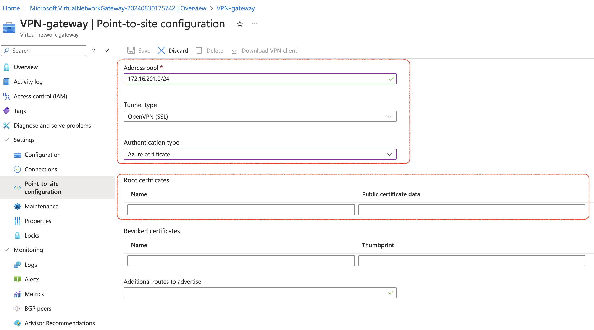

在现代企业环境中，安全的远程云资源访问至关重要。Point-to-Site (P2S) VPN 是一种常见的解决方案，特别适合需要从任意外网位置安全地访问 Azure 虚拟网络 (VNet) 的场景。  


## 一、P2S VPN 的架构机制与原理
P2S VPN 是一种安全的隧道连接，允许单个客户端设备通过互联网连接到 Azure VNet。不同于S2S VPN（站点到站点，Site-to-Site），P2S VPN 不需要任何专用硬件或复杂的网络配置，可以直接让单个设备与云服务进行通信。它的工作原理类似于常见的 VPN 连接，但针对云环境进行了优化。  

在 P2S VPN 的架构中，主要涉及以下组件：

1. **客户端设备**：这是你希望通过 VPN 连接到 Azure 的终端设备。可以是笔记本电脑、台式机或移动设备。

2. **VPN gateway**：Azure 中的虚拟网络网关，用于处理客户端发起的 VPN 请求，建立并维护 VPN 隧道。

3. **身份认证**：用于身份验证的机制，确保只有授权用户能够建立 VPN 连接，比如证书或 Azure AD。

4. **隧道类型**：用于加密数据传输的协议，确保数据在传输过程中不会被窃取或篡改，比如IPsec 或 OpenVPN。

P2S VPN 的优势在于其灵活性和易用性。无论用户位于何地，只要有互联网连接，就可以通过 P2S VPN 安全访问 Azure VNET。  

## 二、身份验证与通道协议  
身份验证和通道协议是 P2S VPN 的核心组件，它们共同确保连接的安全性和稳定性。  

### 1. 身份验证机制  
在 Azure 中，P2S VPN 支持三种主要的身份验证机制：  
• **基于证书的身份验证**：gateway 端必须配置一个可信的根证书，并使用与其匹配的客户端证书进行身份验证。这种方法安全性较高，但需要额外的证书管理。    
• **Azure Active Directory (Azure AD)**：通过 Azure AD 进行身份验证，允许使用 Azure AD 账户直接登录并建立 VPN 连接。适合于与 Azure AD 集成的企业环境，简化了用户管理。   
• **RADIUS 服务器**：使用外部 RADIUS 服务器进行身份验证，适用于需要复杂身份验证策略的环境，如多因素身份验证 (MFA)。  

### 2. 通道协议  
P2S VPN 支持以下主要通道协议：  
• **IKEv2/IPsec**：这是默认的通道协议，提供强大的加密和认证，适用于大多数场景。IKEv2 提供稳定的连接和快速的重连接能力。      
• **OpenVPN**：OpenVPN 是一种基于 SSL/TLS 的开源 VPN 协议开源协议，它可以使用 UDP 或 TCP 进行传输，能够轻松穿越防火墙和 NAT。并且它提供更高的灵活性，支持多种客户端操作系统，特别是在跨平台连接时表现出色。  
• **SSTP (Secure Socket Tunneling Protocol)**：这是微软专有协议，通常用于穿越防火墙和代理服务器，因为它使用 HTTPS 端口 (443) 进行通信，避免了防火墙阻塞。  

## 三、创建P2S VPN 连接 VNent 的操作步骤
现在我们已经理解了 P2S VPN 的架构和关键组件，接下来我们来看看如何在 Azure 中配置并建立 P2S VPN 连接。  

### 1. 准备工作
#### 1.1 在 Azure VNet  中创建 GatewaySubnet 子网
给目标 VNet 创建一个 Virtual Network Gateway Subnet，子网的名称自动填充、且只能命名为 `GatewaySubnet`。VPN gateway 将专门部署到此子网。  
注意不要给此子网配置 NSG，否则 VPN 可能无法按预期工作。  


#### 1.2 准备证书
这里不使用 Azure AD 和 RADIUS 作为认证方式，因此需要准备认证证书，留待在配置 P2S VPN 时使用。  

 **注意**：如果是 Mac 电脑，并且想用 **IKEv2/IPsec** 来创建连接的话，最好使用 Mac keychain 来创建证书，防止 MacOS 自带的 VPN 无法识别证书。  
 下面的演示，我们使用更通用的 OpenVPN 协议，因此直接使用 openssl 工具来创建证书。
 - 首先，创建自签名根证书。    
```
openssl genrsa -out caKey.pem 2048
openssl req -x509 -new -nodes -key caKey.pem -subj "/CN=VPN CA" -days 3650 -out caCert.pem
```
- 然后，创建客户端证书请求（CSR）。
```
# Generate a private key
openssl genrsa -out "${USERNAME}Key.pem" 2048

# Generate a CSR (Certificate Sign Request)
openssl req -new -key "${USERNAME}Key.pem" -out "${USERNAME}Req.pem" -subj "/CN=${USERNAME}"
```
- 接着，使用自签名根证书对证书请求进行签名/证书颁发。
```
openssl x509 -req -days 365 -in "${USERNAME}Req.pem" -CA caCert.pem -CAkey caKey.pem -CAcreateserial -out "${USERNAME}Cert.pem" -extfile <(echo -e "subjectAltName=DNS:${USERNAME}\nextendedKeyUsage=clientAuth")
```
- 最后，验证客户端证书的正确性。
```
openssl verify -CAfile caCert.pem caCert.pem "${USERNAME}Cert.pem" 
```
### 2. 创建和配置 Gateway
#### 2.1 创建VPN gateway
登录到 Azure Portal，使用 Portal 进行实例创建。


需要注意的是：  
1. Resource Group / Region 需与要连接的目标 VNet 相同。  
2. 子网选择在【准备工作】里创建好的Gateway Subnet。  
3. 注意 SKU 和 代系，这两项不同收费和功能也会不同。Azure 的免费账号可以白嫖12个月的第一代 VPNGw1。  
4. 想要高可用，则需要启用 Active-Active 模式，默认是 Active-Standby 模式。启用了Active-Active 模式，则需要为额外多添加的Public IP static Address 付费。  

更详细的操作选项，见[官方文档](https://learn.microsoft.com/zh-cn/azure/vpn-gateway/tutorial-create-gateway-portal#VNetGateway)  

#### 2.2 进行 P2S VPN 设置
创建好 VPN Gateway 后，则进入了最重要的 P2S 设置。
在创建好的 VPN gateway 实例的设置中，选择 **point to site configuration**。


- `Address Pool`，是客户端地址池。当 VPN client 连接上 gateway 之后，需要给 VPN client 分配内网 IP。
  Address Pool 就是指定可以分配的 IP 地址范围。
- Tunnel type，建立通道的协议类型。
- 身份验证类型（证书、Azure AD 或 RADIUS）
  如果选择证书身份验证，这里还需要上传根证书的公钥文件的 Base64 内容(不能换行)。可以使用以下命令进行 Base64 内容导出。
```
# 通过openssl获取 Base64 内容
openssl x509 -in caCert.pem -outform der | base64
```


下面是官方枚举的配置 —— 可以支持的搭配类型。  
**本机 VPN 客户端**，指操作系统自带的 VPN 工具。  
**OpenVPN 客户端**，指需要自行下载安装、支持 OpenVPN 协议的 VPN 工具。  

### 3. 配置 VPN 客户端
#### 3.1 下载 VPN 客户端配置文件
确保已保存过 P2S configuration 的设置，然后点击“Donwload VPN client”。这里下载的并不是客户端工具，下载的是客户端配置文件。  


将下载好的文件进行解压，里面包括 Azure 生成好的配置文件。
比如这里我们打算使用 OpenVPN 客户端，可以打开 OpenVPN 文件夹内的文件。


vpnconfig.ovpn 文件需要进行编辑，红框位置替换成之前【准备工作】中生成的客户端证书&密钥。


#### 3.2 安装和配置 OpenVPN
这里我下载和安装的 OpenVPN connect，[官网地址](https://openvpn.net/client/)
  
安装好 client 工具后，导入之前配置好的客户端配置文件。


### 4. 连接到 Azure VNET
选择刚刚配置好的 P2S VPN Gateway。如果连接成功，你的设备将获得分配的 IP 地址，并能通过 VPN 安全访问 Azure VNet 中的资源。
点击连接，即可以看到连接上的状态。


同时可以测试一下是否能访问云内资源，比如这里有一台没有配置 Public IP Address 的 VM。SSH 内网 IP 进行测试一下，登录成功。
