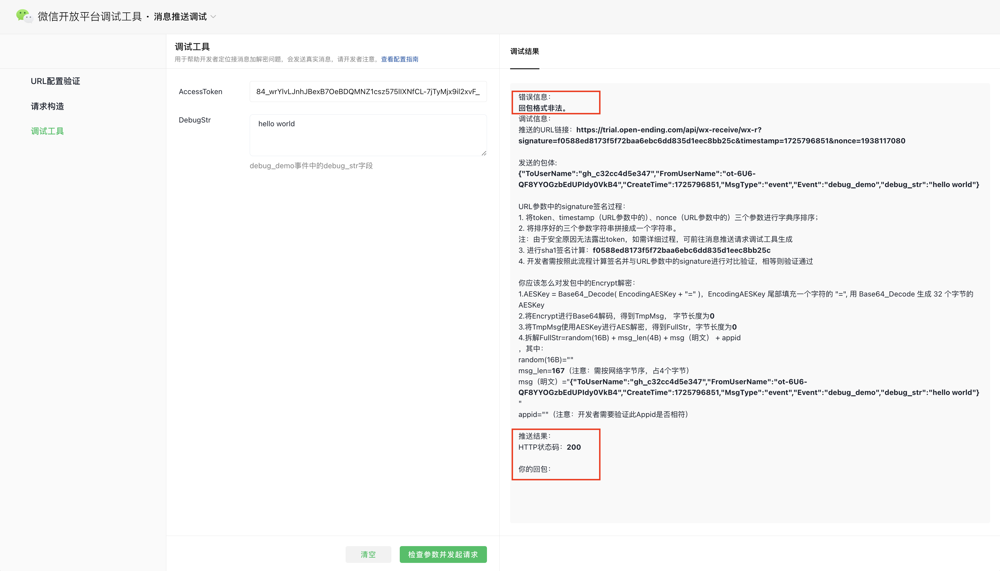

## 简读版


### 一张图讲清楚微信消息订阅的流程  
微信消息订阅分为两个阶段：  
1. 第一阶段，用户同意进行一次消息订阅。  
   在小程序通过本地API `wx.requestSubscribeMessage` 调起与用户的交互弹窗【发送一次以下消息】，用户点击允许后，小程序调用微信平台的某个API。然后微信平台通过开发者配置的【消息推送】地址（比如上图中的`/api/wx-notification`），将用户同意一次消息通知的事件结果推送给开发者服务器。  
2. 第二阶段，开发者服务器履约一次消息订阅。  
   当开发者服务器需要推送这一次被用户订阅的业务消息体时，首先获取微信平台调用的AccessToken，然后通过 AccessToken 的权限调用微信平台 HTTP API 发送业务消息。然后微信平台会将接收到的消息体，推送到用户手机微信的【服务通知】栏内。如果开发者发送的业务消息体带有“跳转链接”的，当用户点击消息卡片时，会跳转到小程序的指定页面上。  

### 遇到的坑：  
1. 小程序开发阶段，在 devTool 上点击“允许发送消息”时，不会触发微信平台推送事件结果给开发者服务器。  
   **【解决方式】**：如果需要在小程序开发版上进行测试的话，只能通过手机扫描 devTool上 的二维码，进行真机调试。  
2. 微信平台提供的推送事件结果的[消息推送调试工具](https://developers.weixin.qq.com/apiExplorer?type=messagePush)-**“调试工具”**, 明文模式即使是按照文档说明 response 空字符串或者success，依然会显示错误信息“回包格式非法”。  
   
   **【解决方式】**：未找到解决方式，微信社区也有同样的问题发帖。通过观察，目前不影响事件结果的推送和后续推送。  
3. 微信平台推送的事件结果与文档示例不一致，造成误认为微信平台不推送事件结果。  
   
   而实际上：  
   
   当然，部分微信文档上用文字备注补救了这个问题：List 内元素为单个，即返回对象，否则才返回数组。（典型的 —— 不修正代码，修正文档备注，我先笑一个）  
   **【解决方式】**：先关闭后端 API 的 request 格式校验，主动日志打印 request body，重新根据实际运行时的 request body 自定义 request 格式校验。  
   如果对 List 这个 1 或 N 的 Bug 感到厌倦，可以在 request 格式校验时，排除对 List 这个字段的校验。我就是这样干的。  
4. 微信推送的事件结果中的 **ToUserName** 使用的是小程序账号原始ID，并非是小程序开发时常用的识别身份的 AppID。  
   **【解决方式】**：开发者服务器自己额外保存 originAccountID 到 AppID 的对照关系，接收到事件推送的时候，做一次 toAppID 的转换。  

### 个人哔哔两句  
作为一个多年的企业应用系统的架构和开发者，一个企业应用 —— 少则需要与企业内部其他系统集成上10个，多则40、50个，谈集成一直是应用开发的一大重点。  
因此，虽然微信的消息订阅集成中遇到了一些不愉快地小坑，甚至会影响开发体验，但作为一个经常需要谈集成的技术也不是不能理解：一般集成的设计和协商部分，会指派资深一些的技术人员双方定好集成方式、协议、结构体和频次等等；而在开发部分和联调部分，则会由一些普通开发人员进行代码开发和调试。比如：上面第3个坑出现的问题，可能写代码甚至是一个毕业生或者实习生。。  
一般为了防止上面这种坑的出现，特别是一些拥有开发规范的正规厂商，有一些解决方案，比如：  
1. 在集成的设计阶段，使用工具将设计好的接口形成格式化的契约（比如swagger yaml等等），并且开发阶段后在 pipeline 上定期对代码进行 **契约测试**。  
2. 非自动化的方案也有，比如：开发人员每天进行code review、或者提交代码时提 PR 等。  

## 流程操作版  
### 1. 准备阶段  
#### 1.1 选择业务消息模板  
小程序消息订阅的消息分为四类：新版一次性订阅消息Beta（不用弹窗）、一次性订阅消息（用户通过弹窗订阅）、长期订阅消息、设备订阅消息。  

作为个人的小程序资质，选择了第 2 种 —— 一次性订阅消息（用户通过弹窗订阅）。其他三类，在资质和使用场景上都有不同的限制。  

按照 [小程序订阅消息开发者指引](https://developers.weixin.qq.com/miniprogram/dev/framework/open-ability/subscribe-message.html) 第一步完成模板的选择，将公共模板添加入【我的模版库】中准备使用。  
获取开发中需要使用的`templateId`，以及模版内容需要的变量，比如下图中的`thing1`、`phrase3`、`time4`和`Thing5`。  


### 2. 开发阶段
认识到三个预定义的变量：  
1. **Token**：狭隘微信平台与开发者服务器之间，生成签名和验证签名时使用的保密字符串。  
2. **EncodingAESKey**：微信平台与开发者服务器之间，加密消息和解密消息时使用的对称密钥。  
3. **templateID**：即上面准备阶段获取的模版 ID。  

认识到微信集成的消息体结构：  
1. **JSON 和 XML**， 微信平台推送事件（request body）时支持这两种格式，可在微信平台配置消息推送时指定格式。  
2. **明文模式、兼容模式、安全模式**，微信平台对推送事件内容进行加解密的方式。选择明文模式，微信不会对消息内容进行加密，安全模式则会加密。  


#### 2.1 用于测试验签的GET API  
开发者服务器接收微信事件推送的 HTTP API 需要是一条 POST Method API。  
但微信要求开发者服务器提供一条相同路径的 GET Method API，用以配置时对消息推送地址进行测试。此API 主要的作用：  
1. 连通性验证  
2. 验证开发者验签算法的正确性  
3. 验证开发者内容解码算法的正确性（如果选择明文传输，则不需要解密）  

##### 1. **验签**    
微信平台向开发者配置的 HTTP API 推送事件时，会在 queryString 上传递3个参数：`signature`、`timestamp`、`nonce`。  
开发者这需要将（明文模式）：  
1. `timestamp`、`nonce` 和 预定义变量 `token` 一共 3 项封装进一个数组，然后对数组进行按字典升序排序，最后将数组项拼接成一个字符串。   
2. 对步骤1生成的字符串进行 sha1 运算，计算出签名 calc_signature。  
3. 将 queryString 上的 `signature` 值与步骤2计算出的 calc_signature 值，进行比较：如果相等，则认为验证通过 —— 发送方拥有正确的保密字符串，否则认为验证不通过。  

以上是**明文模式**，总结一下：  
**input**: `signature`、`timestamp`、`nonce`、`token`  
**output**: return calc_signature == signature  

**安全模式**，不同的点是：  
**input**: `msg_signature`、`timestamp`、`nonce`、`token`、`Encrypt`
**output**: return calc_signature == msg_signature  
- 需要多加入 request body 中的 `Encrypt`，一共 4 项进行 sha1 计算签名 calc_signature。    
- 验签时，使用的是 queryString 上的 `msg_signature` 值。  

##### 2. **加解密**    
微信要求开发者使用：  
1. 使用 **PKCS#7** 标准的填充规则，来封装原始消息内容。  
2. 使用对称加密算法 AES 的 CBC 模式 来加解密。  
3. 需要用到预定义变量中的 `EncodingAESKey` 。 

这部分微信提供了不同语言的 Sample 代码，可直接参考代码。[Sample code](https://wximg.gtimg.com/shake_tv/mpwiki/cryptoDemo.zip)  

##### 3. **测试**    
当 GET API 开发完成，并发布到开发者服务器上之后，可以使用微信提供的[消息推送调试工具](https://developers.weixin.qq.com/apiExplorer?type=messagePush)的第一个 “**URL配置验证**” 对 GET API 进行验证和诊断。注意，这时还不需要去小程序管理后台设置开发者服务器地址。  

##### 4. **提前配置验证**    
在完成了“URL配置验证”的测试之后，可以考虑提前去微信平台配置开发者服务器地址（如果有测试环境，建议先配置成测试环境）。  
登录[小程序管理后台](https://mp.weixin.qq.com/)，在【开发管理】页面完成配置，据说在点击“提交”时，微信会去验证这条GET API。  


#### 2.2 用于接收微信推送事件结果的 POST API  
这条 POST API， 才是真正接收微信事件消息的 API。  
除了验签和加解密必要的 input 之外，微信传入的 request body 明文 JSON （或者解密之后）是：  
```
{
  "ToUserName": "gh_123456789abc",
  "FromUserName": "o7esq5OI1Uej6Xixw1lA2H7XDVbc",
  "CreateTime": "1620973045",
  "MsgType": "event",
  "Event": "subscribe_msg_popup_event",
  "List": {
        "TemplateId": "hD-ixGOhYmUfjOnI8MCzQMPshzGVeux_2vzyvQu7O68",
        "SubscribeStatusString": "accept",
        "PopupScene": "0"
    },
 }
# 若 "List" 只有一个对象，则只返回对象本身；若 "List" 多于一个对象，则返回一个包含所有对象的数组。
```

此API 需要：  
1. 继承 GET API 中**验签**和**加解密**的能力。  
2. 为了便于消息推送调试工具进行调试，代码分支上可以支持 `Event`值为 "debug_demo" 的处理逻辑。如果 Event 等于 **debug_demo**，事件结果不读取 `List`，需要读取`debug_str`。  
    ```
    # debug 的 request body
    {
        "ToUserName": "gh_97417a04a28d",
        "FromUserName": "o9AgO5Kd5ggOC-bXrbNODIiE3bGY",
        "CreateTime": 1714037059,
        "MsgType": "event",
        "Event": "debug_demo",
        "debug_str": "hello world"
    }
    ```
- 微信提供的[消息推送调试工具](https://developers.weixin.qq.com/apiExplorer?type=messagePush)的第二个“**请求构造**”，可以按照工具表单上填写的 input 生成微信调用时的 queryString 和 request body（注意，不会发送真实的请求）。复制这些内容，可以用于本地开发测试。  
- 微信提供的[消息推送调试工具](https://developers.weixin.qq.com/apiExplorer?type=messagePush)的第三个”**调试工具**“，使用的前提条件：1. 提前在小程序管理后台配置好了开发者服务器地址；2. 实现了"debug_demo"分支逻辑的 POST API 已经发布到开发者服务器上。  
  在调试工具的表单上填写 `AccessToken`（微信平台提供的API 接口动态获取）后，调试工具会根据这个 AccessToken 从微信平台定位到小程序的具体信息，从而得到小程序配置好的开发者服务器地址等信息。调试工具封装好`DebugStr` 到 request 中，最终真实的去调用开发者服务器的POST API。  
  

3. 除去 Event 为 "debug_demo" 的分支外，主逻辑分支需要实现真实接收事件推送的业务逻辑。  
   比如，我的小程序就在每次接收到消息订阅 Event 时，使用数据库对该用户可用的订阅次数进行计数，这样当该用户的订阅次数为0时，则停止对该用户下发消息。  

#### 2.3 用于发送业务消息体的方法逻辑  
相比于开发者按照微信的要求提供 API，调用微信的 API 进行发送消息则非常简单。  
可直接参考[官方文档](https://developers.weixin.qq.com/miniprogram/dev/OpenApiDoc/mp-message-management/subscribe-message/sendMessage.html)  
具体在什么时机调用发送消息，按照各自的业务来。  

### 3. 联调阶段  
1. 配置消息推送地址  
    如果在开发阶段，没有提前配置小程序的开发者服务器地址，在联调阶段首先要做的，就是去配置开发者服务器的地址。  
2. 小程序调起消息一次性订阅弹框  
    开发者在小程序的业务流程中添加代码`wx.requestSubscribeMessage`，参数值需要带有`tmplIds`(即 templateID 的值，这里支持多个 templateID)。  
    具体API说明见[wx.requestSubscribeMessage 官方文档](https://developers.weixin.qq.com/miniprogram/dev/api/open-api/subscribe-message/wx.requestSubscribeMessage.html)  
    
3. 确认开发者服务器接收到事件结果  
   这里完成对“微信消息订阅第一阶段”的联调，确保 POST API 按预期接收到小程序用户的操作结果，并完成后台业务处理。  
4. 确认手机微信接收到业务消息  
   根据业务逻辑触发消息发送，确保用户在手机微信上接收到了“服务消息”，并按期望填充了消息模板的内容。  
5. 确认业务消息卡片跳转成功  
   在用户手机上点击接收到的“服务消息”，确保微信打开期望的小程序页面，并进行内容展示。  
