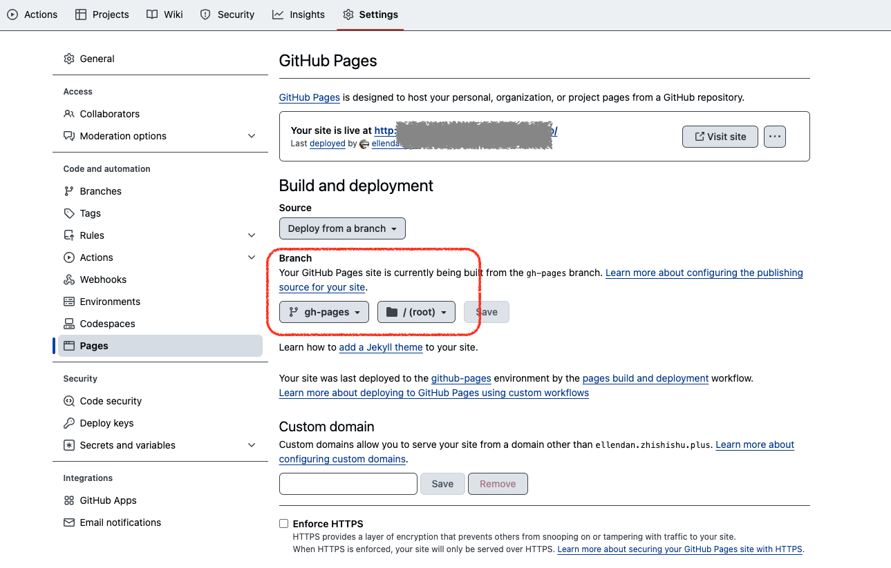

最近想要在博客上挂载一个知识库，虽然更换博客的主题是一种解决方式，但实在不想折腾，于是就用 gitbook-cli 来搭建一个知识库，然后通过 hexo 来部署到博客上，这样既可以利用 hexo 的博客功能，又可以利用 gitbook 的知识库功能。


    对于新搭建博客的人来说，这种方式并不推荐：
      1. gitbook-cli 由于 gitbook.com 官方推进商业化的原因，早在几年前就停止维护了。  
      2. gitbook-cli 只支持 nodejs 10.x 以下版本进行构建，如果使用 11.x 以上版本，会报错。  
      3. 相比于使用gitbook-cli, 直接选择带有 Wiki 布局的博客主题，对于项目维护来说，可以保持结构简单、减少维护成本和提升效率。  

    如果考虑了以上三点，仍选择 gitbook-cli 作为方案的话，可以继续往下看。

## 如何在 hexo 上挂载 gitbook 自制的 wiki 呢？

### 1. 安装 gitbook-cli

- 预安装环境

  - nodejs 10.x 以下版本
  - npm 7.x 以下版本

  
    如果本地机器无法安装以上版本，可以尝试放弃使用 gitbook 了。因为即使可以使用 CI/CD pipeline 环境来构建，但相比于本地机器，反馈弧有点长，不利于预览和调试。选择其他更新一些的方案，不失为一种更好的搭建知识库的方式。
  

- 安装

    ```bash
    npm install gitbook-cli --save
    ```

### 2. 初始化 gitbook 项目

1. 本地创建 gitbook 项目目录
2. 初始化 gitbook 项目

    ```bash
    mkdir wiki
    cd wiki
    npx gitbook init
    ```

    这时会自动生成 gitbook 的项目目录结构，自带默认文件：
    - README.md：默认封面 inntroduction 页面。
    - SUMMARY.md：wiki 显示在左侧侧边栏的内容。
    - book.json：需要手动创建，gitbook 配置管理文件。

3. 本地运行 gitbook

   ```bash
    npx gitbook serve
   ```

### 3. 在 hexo 博客上添加wiki菜单

在 hexo 主题的配置文件 `_config.yml` 中添加如下菜单配置：

```yaml
menu:
  Wiki:
    icon: fas fa-book
    url: /wiki/
```

然后，将更新好的主题通过博客项目进行部署。

### 4. 部署 wiki

可以采用多种方式部署，如果博客已经使用的 GitHub Pages 运营, 见下 4.1。

#### 4.1 github pages 部署方式

1. 将本地 wiki 项目 push 到 github repo
2. 配置 Github Action flow，文件位置 .github/workflows/pages.yml

   ```yaml
    name: Deploy with GitHub Pages dependencies preinstalled

    on:
      push:
        branches: ["main"]
      workflow_dispatch:

    permissions:
    contents: read
    pages: write
    id-token: write

    concurrency:
    group: "pages"
    cancel-in-progress: false

    jobs:
    build:
        runs-on: ubuntu-latest
        steps:
        - name: Checkout
            uses: actions/checkout@v4

        - name: Gitbook Action
            # 使用插件 gitbook-action 进行 gitbook 构建
            uses: ZanderZhao/gitbook-action@v1.2.4
            with:
            token: ${{ secrets.FOR_GITPAGE_TOKEN }}
            source_branch: main
            publish_branch: gh-pages
   ```

3. 配置 github repo setting

    
    由于博客主站已经使用 GitHub Pages，默认域名是 `${username}.github.io`。
    每个 Github 账号，在 Github pages 仅能创建一个主站点，但可以创建多个子站点 —— 在主站点已创建的情况下，其他 Github pages 的项目都会被分配到主站点的域名之下，比如`${username}.github.io/wiki` 。
    

  由于第二步 workflow 的 `publish_branch` 设置为 `gh-pages`，所以在 github repo setting 中配置 pages 时需要将 `Branch` 设置为 `gh-pages`。
  

#### 4.2 自运营服务器部署方式
如果是使用的自运营服务器，我部署的思路是这样的：

1. 通过 Github Action 将 wiki 项目编译好的文件 push 到博客主站的 repo 源码中。
2. 通过博客主站的 Github Action 部署主站的时候，将 wiki 的文件打包进主站的部署目录中。
3. 主站部署完成时，wiki 作为一个子目录部署到了博客主站中。

因此，执行层面上：

1. 在 wiki repo 的 Action flow 中，除了设置 `publish_branch` 之外，还要设置 `publish_repo` 和 `publish_dir`，如下：

  ```yaml
    jobs:
      build:
        runs-on: ubuntu-latest
        steps:
          - name: Checkout
            uses: actions/checkout@v4

          - name: Gitbook Action
            uses: ZanderZhao/gitbook-action@v1.2.4
            with:
              token: ${{ secrets.FOR_GITPAGE_TOKEN }}
              source_branch: main
              # 发布到主站的 repo 地址、branch 和具体的目录路径
              publish_repo: xxx/xxx.github.io
              publish_branch: stable-source
              publish_dir: /books/wiki
  ```

2. 修改主站的 Action flow 文件，在 build stage 中，添加复制文件的步骤：

  ```yaml
    jobs:
      build:
        runs-on: ubuntu-latest
        steps:
          - uses: actions/checkout@v3

          - name: Setup Node
            uses: actions/setup-node@v3.1.1
            with:
              node-version: '19.x'
          - name: Before install
            run: |
              sed -i 's/git@github.com:/https:\/\/github.com\//' .gitmodules
              git submodule update --init --recursive
              git submodule update --remote --merge
              npm install
          - name: Install
            run: |
              npm run clean
              npm run build -d
              # 复制编译好的 wiki 文件到部署目录中
              cp -r books/wiki public/wiki
  ```

### 5. 完成

部署完成后，就可以通过点击博客主站的新wiki菜单跳转到 wiki 主页了。 