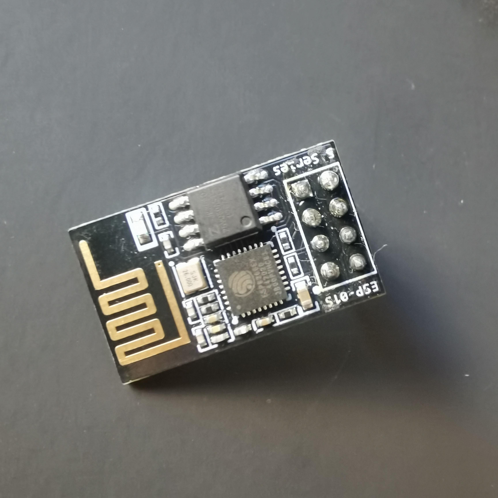
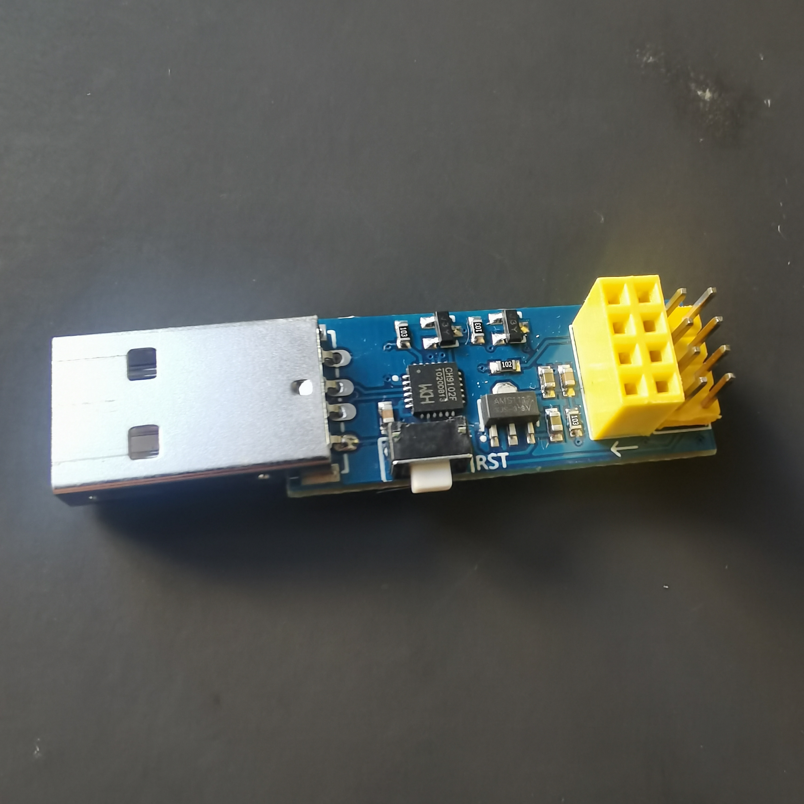
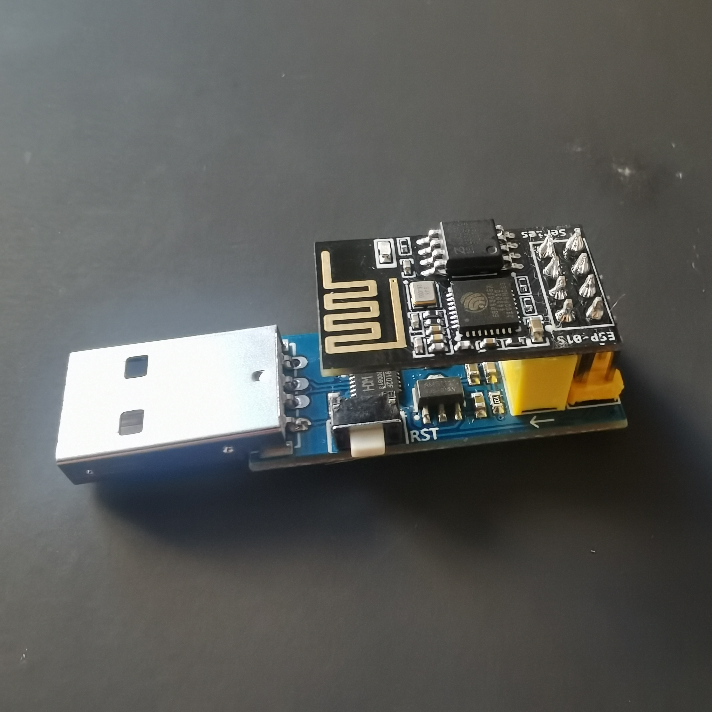
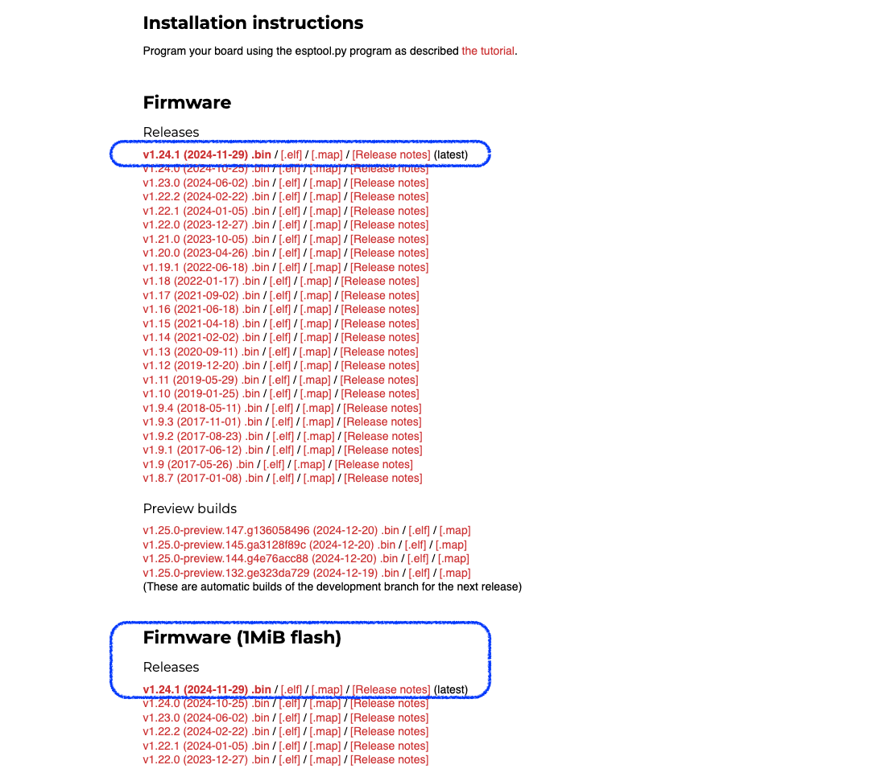
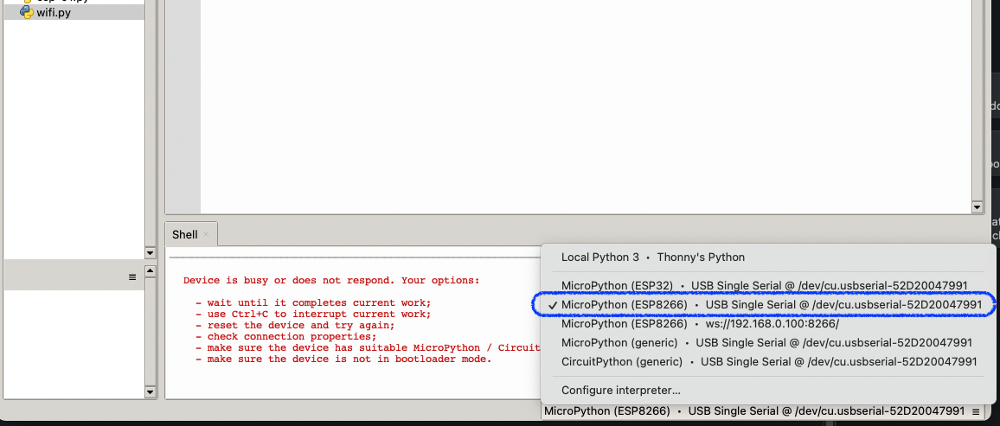
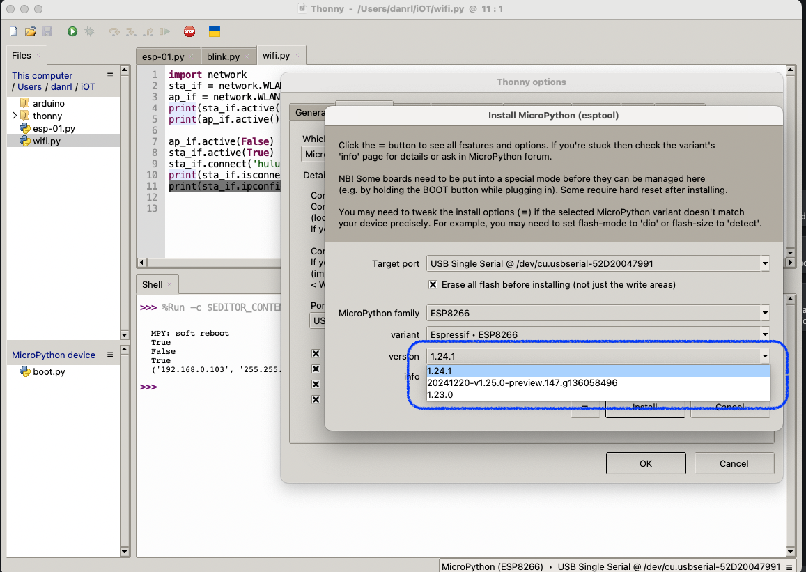
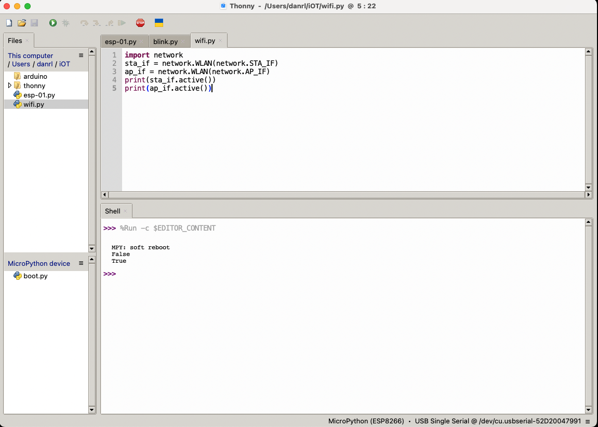

三年前，我在淘宝上购买了一块 Raspberry Pi Pico 板。然而，最初的 Pico 板并不带有 WIFI 模块，因此我额外购置了一个小型 WIFI 模块，即 ESP-01S 开发板。  
ESP-01S 开发板出厂时使用的是 AT 指令集，并附带了适用于 C++ 开发环境的固件烧录软件。  
作为一名从 Raspberry Pi 入门的程序员，我自然更偏好与 Python 相关的 MicroPython。因此，在此总结一下关于 MicroPython 烧录以及开发环境搭建的过程。

## 1. 准备工具
手头除了 ESP-01S 这块 ESP8266 协议的开发板外，还需要一个 USB 转串口的固件烧录器。

  
  
  



有了USB转串口烧录器，就可以将ESP-01插到电脑上进行烧录了。

## 2. 下载 MicroPython ESP8266 bin 文件
接下来，我们需要在电脑上下载适用于 ESP8266 的 MicroPython 固件。访问 MicroPython 的官方网站进行下载。  [MicroPython官方下载ESP8266 Firmware](https://micropython.org/download/ESP8266_GENERIC/)  
见下图，点击下载。

如若之前购买的 ESP-01S 的闪存只有 1M，下载图中第二个蓝框中下的固件，不然烧录会报错。



## 3. 烧录固件
### 3.1 安装 esptool 工具
```bash
pip install esptool
```
### 3.2 擦除 ESP-01S
将烧录器插入电脑，执行擦除指令。  
```bash
# 查找烧录器接入的串口
ls -l /dev/cu.*
# 我的机器上，显示串口名是 /dev/cu.usbserial-52D20047991
esptool.py --port /dev/cu.usbserial-52D20047991 erase_flash
```
### 3.3 烧录下载好的 MicroPython 固件
```bash
# 需要替换串口和本地固件的路径
esptool.py --port /dev/cu.usbserial-52D20047991 --baud 460800 write_flash --flash_size=detect 0 ~/Downloads/ESP8266_GENERIC-FLASH_1M-20241129-v1.24.1.bin
```

烧录成功后，ESP-01S 默认设置为 AP（Access Point），使用手机，可以查看到一个`MicroPython-xxx`开头的热点。

## 4. 安装 MicroPython IDE —— Thonny
### 4.1 安装 IDE Thonny
```bash
brew install thonny
```
### 4.2 选择连接的环境（解释器）
将电脑上的烧录器拔下重插。  
打开 Thonny，点击右下角选择 ESP-01S 上的 MicroPython 开发环境。  



通过 Thonny -> Configure Interpreter 也可以进行固件烧录和升级，Thonny 内置了esptool。但是能选择的固件版本有限，比如 1M flash 的版本就没有。


### 4.3 读取当前 WIFI 状态
本地编写 demo.py 文件，然后点击运行。
```MicroPython
import network
sta_if = network.WLAN(network.STA_IF)
ap_if = network.WLAN(network.AP_IF)
print(sta_if.active())
print(ap_if.active())
```



## 5. 测试连接 WIFI
切换成 STA 模式 —— 连接本地WIFI。
```MicroPython
import network
sta_if = network.WLAN(network.STA_IF)
ap_if = network.WLAN(network.AP_IF)
print(sta_if.active())
print(ap_if.active())

ap_if.active(False)
sta_if.active(True)
# 使用自己本地的 WIFI SID name 和 password 替换
sta_if.connect('<AP_name>', '<key>')
print(sta_if.isconnected())
print(sta_if.ipconfig('addr4'))
```
