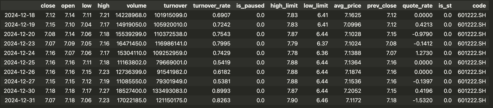
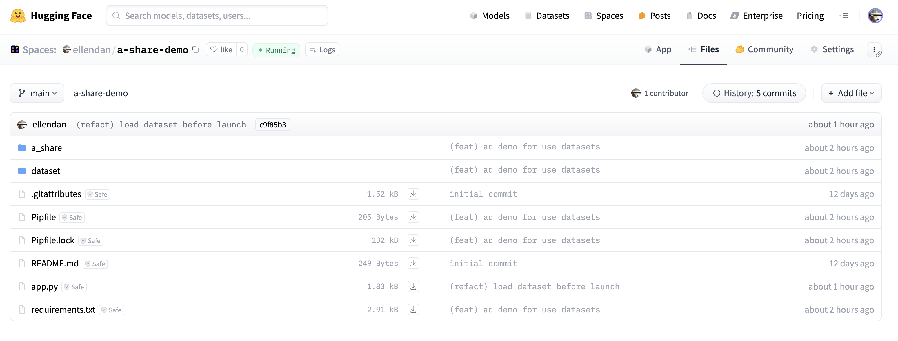
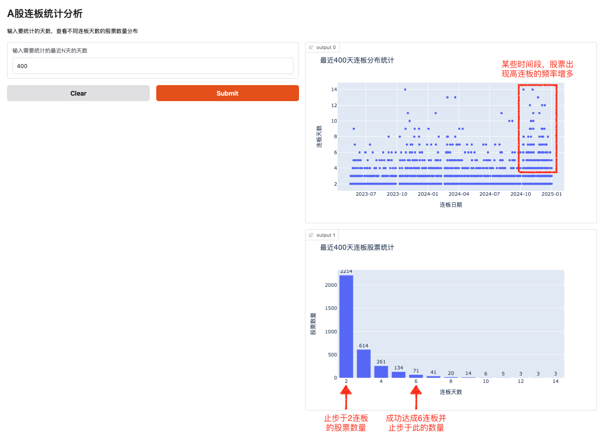

自2024年9月底A股市场突然上涨以来，我重新开始关注股市。同时，从网上收集了一些数据，尝试从业务和技术两个角度进行分析，并利用手头掌握的一些工具加以应用。
或许有人会问，现在市场上有这么多股票理财App，各种指标已经目不暇接，为什么还要花时间自己编写代码呢？对此，我有以下看法：
1. 股票理财App 就跟 SaaS 平台一样，提供的是符合更多受众的通用功能，以及带来更高销售额和运营周期的付费功能。掌握了 DDD 的应该都知道，企业的竞争力体现于核心域，而核心域的应用化需要靠定制才能落地。投资理财亦是如此，掌握如何定制自己的工具和策略，可以增强自身理财的竞争力，同时做到有依据的理性理财。
2. 区别于企业应用领域的定制化 —— 唯有大企业才能承担高昂的定制成本，理财类量化分析小散即可做到。
3. 相比于一有新技术就拿来革自己的命的程序员群体来说，有那种卷研发效能指标的劲儿，不如转换下赛道思路：向前一步 —— 多学习一些非技术领域的业务知识，拿新工具来卷卷自己的理财收益率啊。
4. 对于想学习 Pandas 的小伙伴来说，股票数据分析也是一个不错的主题背景。

本文旨在通过分析连板数量的分布情况，来观察和理解打板的概率，端正理性追板的心态。
以下是实现这一目标的步骤。
## 1. HuggingFace Hub Datasets
我从网上抓取了2005年1月1日~2024年12月31日的A股日行情数据（烛线图数据），然后创建了 HuggingFace dataset: [ellendan/a-share-prices](https://huggingface.co/datasets/ellendan/a-share-prices)。

### 1.1 Dataset 的使用
#### 安装 datasets 库
```bash
pipenv install datasets
# or use pip
# pip install datasets
```

#### 从HuggingFace Hub 上下载数据文件
```python
from datasets import load_dataset

dataset = load_dataset("ellendan/a-share-prices", data_files="all-prices.csv", download_mode="reuse_dataset_if_exists")
data_frame = dataset['train'].to_pandas()
```
load_dataset方法的参数：
- data_files 如果不指定，将会下载该 dataset 下所有的文件。
- download_mode 默认值就是`reuse_dataset_if_exists`，数据文件会进行本地缓存，默认路径是`~/.cache/huggingface/datasets`。


每次执行 `load_dataset` 时，都需要使用 VPN，因为除了下载数据外，该过程还会进行 verify。因此，如果 VPN 网络不稳定，可能会导致错误并需要重新尝试加载。
在这种网络状况下，建议访问 HuggingFace 网站，将数据集中的 csv 文件下载到本地，然后从本地加载。
[官网loading method文档说明](https://huggingface.co/docs/datasets/loading#hugging-face-hub)


### 1.2 数据特征项

如上图，每行数据包括：
- 'Unnamed: 0'，行情发生的日期。
- close，收盘价。
- open，开盘价。
- low，最低价。
- high，最高价。
- volume，成交量。
- turnover，成交额。
- turnover_rate，换手率。
- is_paused，是否停牌。（0否，1是）
- high_limit，当日涨停的限价。
- low_limit，当日跌停的限价。
- avg_price，当日所有成交量的均价。
- pre_close，前一日收盘价。
- quote_rate，涨跌幅。
- is_st，是否 ST。（0否，1是）
- code，股票的代码。
总数据量约有13M行。

## 2. 编写 Pandas demo
我创建了一个 HuggingFace Space，demo 代码保存在其中[ellendan/a-share-demo](https://huggingface.co/spaces/ellendan/a-share-demo)。
如想借鉴复制代码，请以 HuggingFace Space Repo 上为准，本人后续可能会优化和更新代码。

### 2.1 使用 Pandas 进行连板统计
关键代码在`a_share/demo.py`文件中，方法`load_stock_data`：
```Python
def load_stock_data():
    dataset = load_dataset("ellendan/a-share-prices", data_files="all-prices.csv", download_mode="reuse_dataset_if_exists")
    data_frame = dataset['train'].to_pandas()
    data_frame['date'] = pd.to_datetime(data_frame['Unnamed: 0'])
    data_frame.drop(columns=['Unnamed: 0'], inplace=True)
    data_frame.set_index(['code','date'], inplace=True)
    return data_frame
```
- 使用 load_dataset 加载数据集
- 数据集转换成 pandas DataFrame，并设置二维索引，第一维是 column: code, 第二维是 colume: date

方法`serie_high_limit`对各股票按时间序列，计算连续的涨停板数量和终止日期：
```python
def prepare_features(source_data_frame, last_n_days=400):
    source_data_frame = source_data_frame.iloc[-last_n_days:]
    # ①
    is_high_limit = (source_data_frame['close'] == source_data_frame['high_limit']) * 1 * ((source_data_frame['is_st'] < 1) * 1)

    if is_high_limit[is_high_limit > 0].empty:
        return pd.DataFrame()

    source_data_frame['is_high_limit'] = is_high_limit
    # ②
    is_segment_start = (is_high_limit.diff() != 0) * 1
    source_data_frame['segment_start'] = is_segment_start
    # ③
    source_data_frame['segment_index'] = is_segment_start.cumsum()
    # ④
    serie_high_limit = source_data_frame.groupby(by='segment_index').apply(
        lambda x: pd.DataFrame({
            'date': x.index.get_level_values("date"),
            'high_limit_days': x['is_high_limit'].cumsum()
        }),
        include_groups=False
    )
    # ⑤
    serie_high_limit = serie_high_limit.groupby(by='segment_index').agg(
        max_high_limit_days=('high_limit_days', 'max'),
        date=("high_limit_days", lambda x: x.idxmax()[2])
    )
    return serie_high_limit

def serie_high_limit(source_data_frame, last_n_days=400):
    data_frame = source_data_frame.groupby(level=0).apply(lambda x: prepare_features(x, last_n_days))
    return remove_trade_data_overdate(data_frame, last_n_days)
```
- source_data_frame 数据集中包括“所有的股票”的日行情数据，首先需要对 source_data_frame 按 code 进行分组，这样才能算出每支股票各自历史行情中出现过的连板数据。
- 计算单只股票的连板的逻辑在方法 prepare_features 中，思路是这样的：
    - ① 当收盘价(close) == 涨停限价(high_limit)时，则是当日涨停（值1：涨停，值0：否），添加 `is_high_limit`列给 DataFrame
      
    - ② 当每行数据的 `is_high_limit`值与前一天的值不相等时，则认为不连续的段的开始（值1：是，值0：否）。数据添加新列`segment_start`。
      
    - ③ 给每个不连续的段分配段索引——对`segment_start`列的值进行 cumsum 运算，然后赋值给新列`segment_index`。
      
    - ④ 针对`segment_index`列进行分组运算，每个段内部的交易日是连续涨停的第几天（值0：未涨停，值1：涨停第一天，值2：连续涨停第2天……值n：第n天）
      
    - ⑤ 将分组进行聚合运算，每个段仅保留最大连涨那个交易日的数据，`max_high_limit_days` 最大的连涨天数，`date` 最大连涨那条数据对应的交易日期
      

### 2.2 使用 gradio 和 plotly 进行 web 展示
Web展示代码在`app.py`文件中。
```python
import gradio as gr
import pandas as pd
import plotly.express as px
from a_share.demo import load_stock_data, serie_high_limit

source_data_frame = load_stock_data()

def process_and_plot(last_n_days):
    serie_high_limit_data = serie_high_limit(source_data_frame, int(last_n_days))

    # 将处理好的数据进行过滤，只保留连板天数>=2的数据，进行柱状图显示
    count_by_high_limit_days = serie_high_limit_data[serie_high_limit_data['max_high_limit_days'] >= 2].groupby(by='max_high_limit_days').count()

    plot_data = pd.DataFrame({
        '连板天数': count_by_high_limit_days.index,
        '股票数量': count_by_high_limit_days['date']
    }).reset_index(drop=True)
    fig = px.bar(
        plot_data,
        x='连板天数',
        y='股票数量',
        title=f'最近{last_n_days}天连板股票统计'
    )
    fig.update_traces(text=plot_data['股票数量'], textposition='outside')

    ge_2_data = serie_high_limit_data[serie_high_limit_data['max_high_limit_days'] >= 2]
    scatter_data = pd.DataFrame({
        '连板日期': pd.to_datetime(ge_2_data['date']),
        '连板天数': ge_2_data['max_high_limit_days']
    }).reset_index(drop=True)
    fig2 = px.scatter(
        scatter_data,
        x='连板日期',
        y='连板天数',
        title=f'最近{last_n_days}天连板分布统计',
    )
    fig2.update_layout(
        xaxis=dict(
            tickformat="%Y-%m",
        )
    )
    return [fig, fig2]

# 创建Gradio界面
demo = gr.Interface(
    fn=process_and_plot,
    inputs=[
        gr.Number(label="输入需要统计的最近N天的天数", value=400, minimum=1, maximum=1000)
    ],
    outputs=[gr.Plot(), gr.Plot()],
    title="A股连板统计分析",
    description="输入要统计的天数，查看不同连板天数的股票数量分布",
    flagging_mode='never'
)

if __name__ == "__main__":
    demo.launch(debug=True)
```

本次代码主要是为了填充 HuggingFace Space APP页面，因此选择了使用 gradio + plotly。正常情况下，本地进行数据分析和探索更推荐使用 jupyter + matplotlib。
后续的 demo 大部分将使用 jupyter + matplotlib 的方式。


## 3. 结果展示
### 运行结果

从图上可以看到，近400个交易日内：
- 图1，2024年10月之后，A 股市场转暖，4连板以上出现的频率增多，提供了更多的打板机会。
- 图2，历史行情中止步于 2 连板的股票机会有2214次。因此，只要看到2连板、就一头热往里冲，幻想会6连板、10连板的小散们，需要警醒：真正路过2连板、顺利达成6连板的股票机会只有 3.1 %，不要无脑追板。 
### HuggingFace Space Web 线上 demo

白嫖的免费CPU，运算速度很慢，每次执行可能要1分钟+。可以将代码库 clone 到本地运行。

<script
	type="module"
	src="https://gradio.s3-us-west-2.amazonaws.com/5.9.1/gradio.js"
></script>
<gradio-app src="https://ellendan-a-share-demo.hf.space"></gradio-app>
