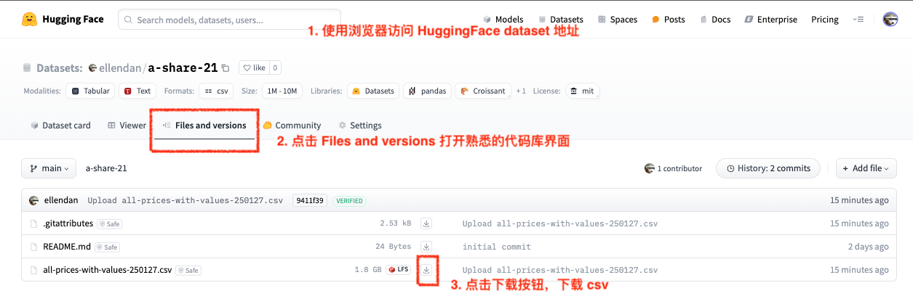
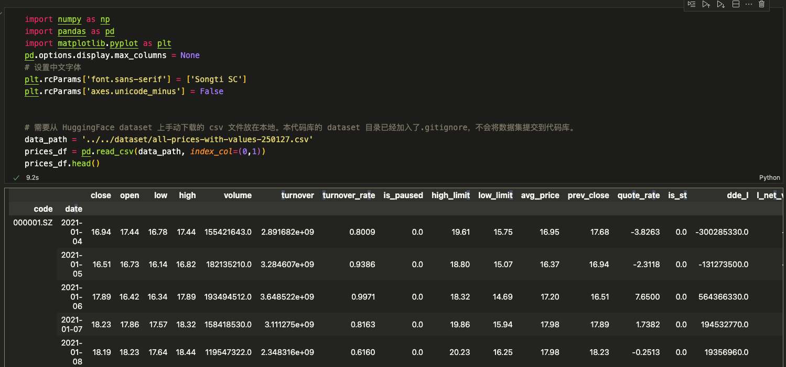
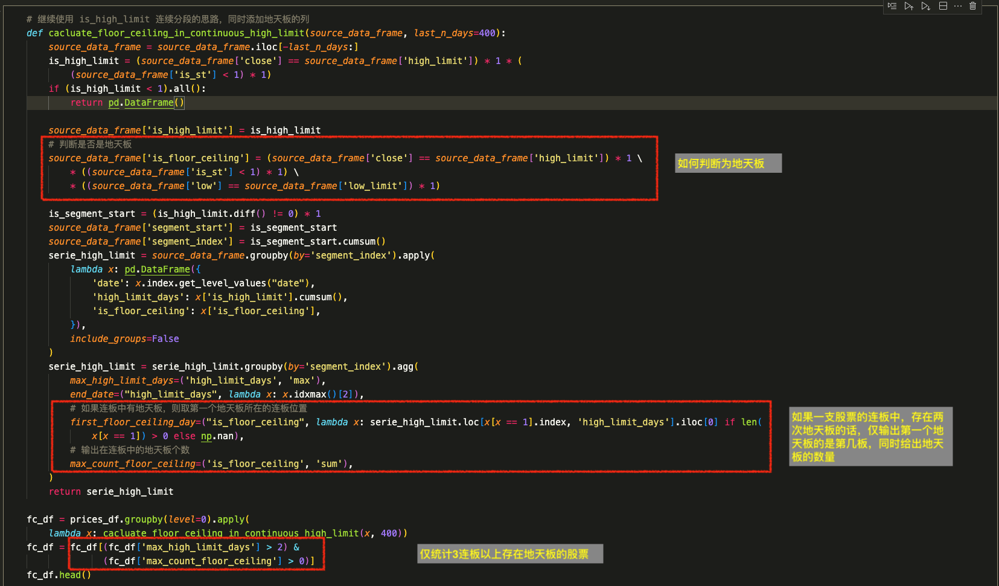
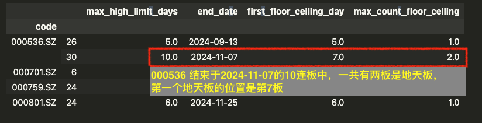
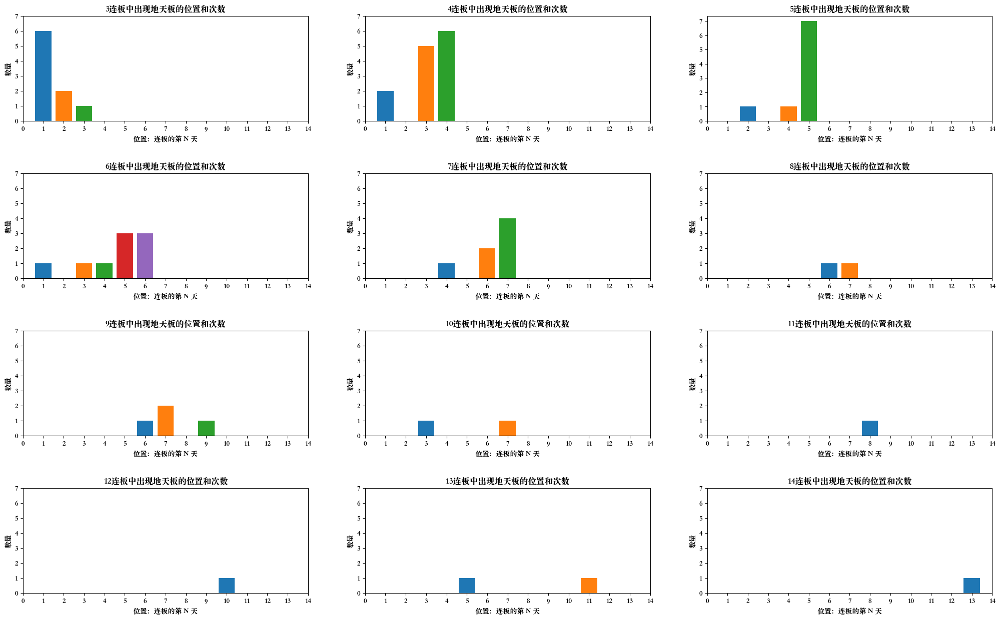
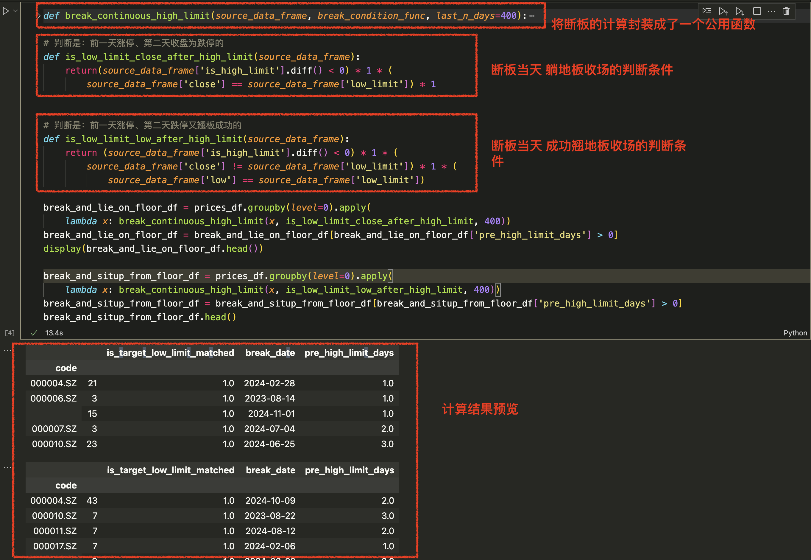
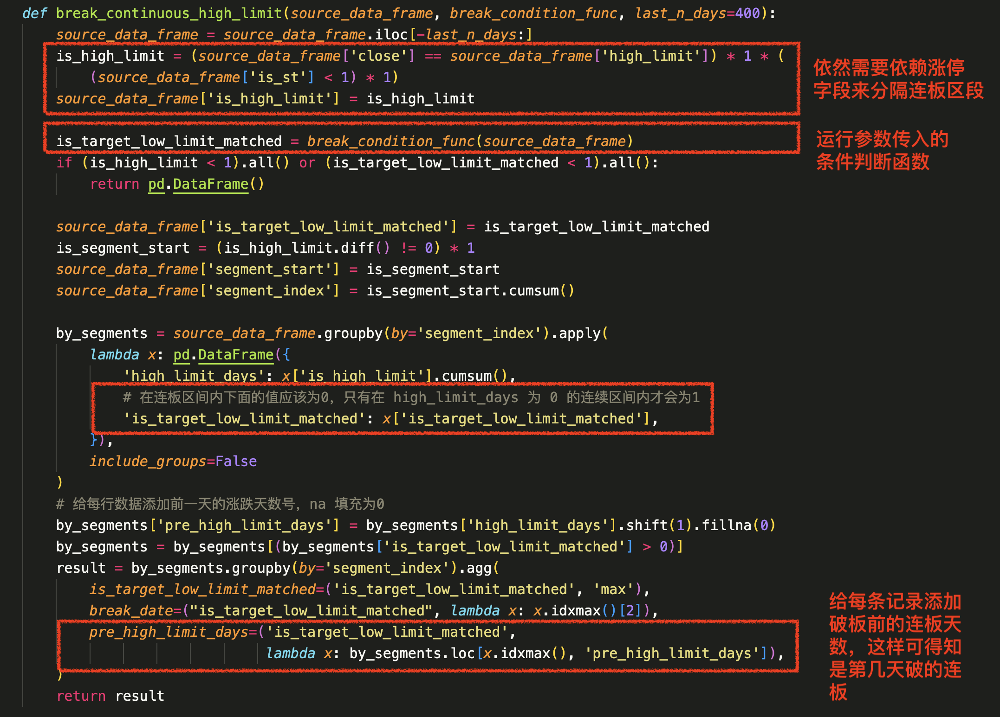
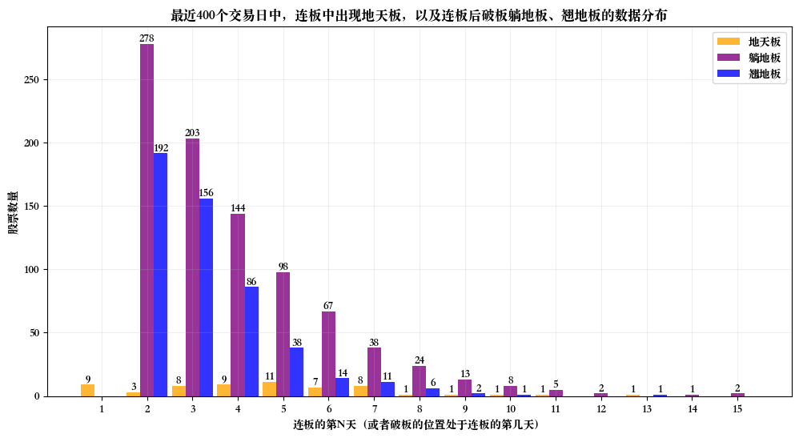
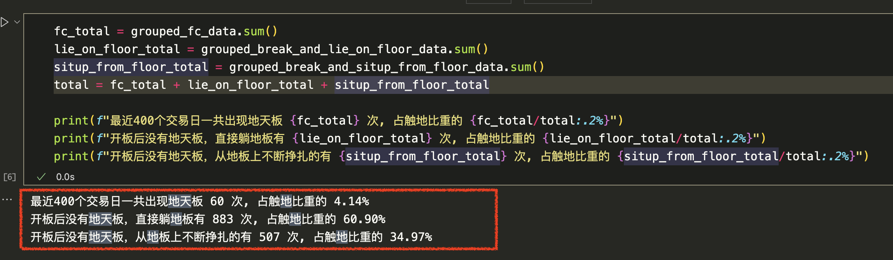

在春节后开市的第一天，一些年前的涨停板直接出现了跌停的情况，同时也出现了一支地天板。 
当地天板出现时，如果从地板买入，则会在一天内获得 20cm 的浮盈，诱惑是大的。
**但是**，注意，**但是** —— 连板中触及跌停后，实现地天板的概率有多少呢？又有多大概率会直接躺地板上起不来，或者稍微好一点从地板上翘板成功呢？

flowchart LR;
    A[已经连续涨停N板] --> B{分时图突然触及跌停};
    B -.->|可能| C[地天板];
    B -.->|可能| D[躺地板];
    B -.->|可能| E[翘板成功];


在上篇博客中（[使用Pandas分析A股连板数量的分布](https://ellendan.com/2025/01/07/shi-yong-pandas-fen-xi-a-gu-lian-ban-shu-liang-de-fen-bu/)），我使用 Pandas 统计了近期的涨停连板的数量分布，这次我们用另一种思路来统计一下地天板的数量分布，同时回答一下以下问题：
1. 在各数量连板的股票中，地天板分别分布在第几板？
2. 在所有连板的股票中，一旦在第N板的位置上触及跌停，实现地天板的股票数量、破连板且躺地板的股票数量、破连板且地板翘板成功的股票数量。
3. 所有涉及连板后触及跌停的情况中，地天板的占比、躺地板的占比、翘地板的占比。


本文旨在通过分析地天板的数据分布，来观察和理解连板中出现跌停后各情况的概率，端正理性追板的心态。同时，对于想要学习 Pandas 的小伙伴来说，股票数据分析也是一个不错的主题实践方向。  

以下是代码步骤。如果想直接看数据结果，可以跳到最后一个章节。  


## 1. 加载日 K 线数据
不同于上篇博客中使用 HuggingFace 的`datasets`库来下载和加载数据集，这次我们手动下载 csv 文件，然后使用 Pandas 自带的函数从本地加载数据集。
### 1.1 下载数据集 csv 文件到本地
这次我们使用另一个A股日线数据集，HuggingFace dataset 位置 [ellendan/a-share-21](https://huggingface.co/datasets/ellendan/a-share-21)。
与之前的数据集不同的是，该数据集的范围是：2021-01 ~ 2025-01 的 A股日线数据。
在缩小了数据范围的同时，每行的数据特征除了日K线的数据之外，增加了每日的 DDE 数据和估值数据（这两块数据本次博客代码中不会使用）。



数据集每行数据，日K线部分包括：
- code，股票的代码。
- date，行情发生的日期。
- close，收盘价。
- open，开盘价。
- low，最低价。
- high，最高价。
- volume，成交量。
- turnover，成交额。
- turnover_rate，换手率。
- is_paused，是否停牌。（0否，1是）
- high_limit，当日涨停的限价。
- low_limit，当日跌停的限价。
- avg_price，当日所有成交量的均价。
- pre_close，前一日收盘价。
- quote_rate，涨跌幅。
- is_st，是否 ST。（0否，1是）
总数据量约有 4.92 M行。
### 1.2 创建 notebook script 文件
这次我们的代码，依赖的 Python 库分别是：
- `Pandas`
- `numpy`
- `jupyter`
- `matplotlib`

确保本地代码库已经进行了安装。
如果是下载笔者 HuggingFace Space 上的 Demo 代码库[ellendan/a-share-demo](https://huggingface.co/spaces/ellendan/a-share-demo)，下载后请阅读 README 进行安装。
这次的 Pandas notebook script 文件的位置在`<projectDirectory>/a_share/ipynb/floor_ceiling.ipynb`。
### 1.3 加载下载好的 csv 文件
在 `floor_ceiling.ipynb`文件运行以下 python 代码。
```python
import numpy as np
import pandas as pd
import matplotlib.pyplot as plt

pd.options.display.max_columns = None
# 设置中文字体
plt.rcParams['font.sans-serif'] = ['Songti SC']
plt.rcParams['axes.unicode_minus'] = False

# 需要从 HuggingFace dataset 上手动下载的 csv 文件放在本地。本代码库的 dataset 目录已经加入了.gitignore，不会将数据集提交到代码库。
data_path = '../../dataset/all-prices-with-values-250127.csv'
prices_df = pd.read_csv(data_path, index_col=(0,1))
prices_df.head()
```

运行后可以看到数据集中的各列，如下图：


## 2. 编写 Pandas 函数计算连板中的地天板
### 2.1 用 Pandas 计算最近400个交易日内的目标数据


代码中有三个重点项：
-  1 判断地天板的条件：
    -  `source_data_frame['close'] == source_data_frame['high_limit']` 当日收盘价等于涨停价
    - `source_data_frame['is_st'] < 1` 非 ST 股票
    - `source_data_frame['low'] == source_data_frame['low_limit']` 当日最低价等于跌停价
- 2 在各股票的连板区间，计算地天板的数量`max_count_floor_ceiling`、第一个地天板的发生位置（即是第几板）`first_floor_ceiling_day`
- 3 过滤掉 2 连板的股票`(fc_df['max_high_limit_days'] > 2) &(fc_df['max_count_floor_ceiling'] > 0)`


不用怀疑 —— 真的有股票在一次连板区间出现了两次地天板。但这并不意味着地天板就很常见，继续看后面的整体统计就会体会到。



### 2.2 使用 Matplotlib 将结果可视化
Matplotlib 绘图代码都比较简单和模式化，感兴趣可以自行查看 Demo 代码库，这里就不单独解释了，直接来看一下绘图结果。



解释：
- 图中一共有12张子图，分别对应着最近400个交易日内最高实现了 3连板 ~ 14连板的股票数据。
- 以第一张子图为例子，这张图统计的是 400个交易日内所有的最高实现了 3 连板的股票，地天板分别有6次出现在第一板、2次在第二板和1次在第三板。

结果观察：
- 从 4 连板以上的股票数据来看，大部分地天板出现了之后，连板趋势已近尾声。
- 其他结论，可自行读图判断。

## 3. 编写 Pandas 函数计算断板当天触及跌停的数据
### 3.1 用 Pandas 计算最近400个交易日内的目标数据


上述代码中：
 - `躺地板`的判断条件
    - `source_data_frame['is_high_limit'].diff() < 0` 前一天是涨停(值为 1)，当天不涨停(值为0)，因此 diff 函数返回 (0-1) = -1
    -  `source_data_frame['close'] == source_data_frame['low_limit']` 当天收盘价等于跌停价
- `翘地板`的判断条件
    - `source_data_frame['is_high_limit'].diff() < 0` 
    - `source_data_frame['close'] != source_data_frame['low_limit']` 当天收盘价不等于跌停价
    - `source_data_frame['low'] == source_data_frame['low_limit']` 当天最低价等于跌停价

接着看公用函数 `break_continuous_high_limit`， 区别于之前地天板——针对连板区间内的数据统计，这个函数统计的是各股票不涨停的连续交易日区间。


**特别注意** 字段`pre_high_limit_days`, 这个字段记录了每次破连板前的连板天数，后面通过此字段值 + 1，即可得知破连板当天是原本连板的第几天。
### 3.2 使用 Matplotlib 将结果可视化

解释：
- 这张布局图是将所有的连板股票数据（无论最高几连板）都汇总到了一张图上。
- 我们统计的是实现了 3 连板以上的股票数据，没有包括只有 2 连板的股票。
- 以第二根柱群为例，近400个交易日以内所有连板股票中，在连板的第二天出现地天板的数量有3次，相比于地天板，直接破连板当天躺地板上的有 278 次，从地板上挣扎成功的有 192 次。

结果观察：
- 无论连板的第几天，一旦触及跌停，躺地板的数量 > 翘地板的数量 >>>(远远大于)>>> 地天板的数量。

**我们也可以看一下将这3类数据汇总后的总体比重：**

结果：
- 地天板出现占比次数是 4.14%，躺地板 60.9%，地板后翘板成功的 34.97%。

## 4. 结果总结
从最近400个交易日的数据统计结果来看（数据截止时间2015年01月31日），已经可以回答文章之前提出的三个问题。

**第一个问题：”在各数量连板的股票中，地天板分别分布在第几板？“**
结论见下图：


**第二个问题：”在所有连板的股票中，一旦在第N板的位置上触及跌停，实现地天板的股票数量、破连板且躺地板的股票数量、破连板且地板翘板成功的股票数量“。**
结论见下图：


**第三个问题：”所有涉及连板后触及跌停的情况中，地天板的占比、躺地板的占比、翘地板的占比。“**
结论：

破连板当天触及跌停时，非常非常大的概率是直接躺地板，其次是从地板上挣扎一下的翘地板，非常非常小的概率是地天板 —— 具体数据显示：
> 最近400个交易日一共出现地天板 60 次, 占触地比重的 4.14%。
> 开板后没有地天板，直接躺地板有 883 次, 占触地比重的 60.90%。
> 开板后没有地天板，从地板上不断挣扎的有 507 次, 占触地比重的 34.97%

**因此，千万不要盲目地期待地天板。**