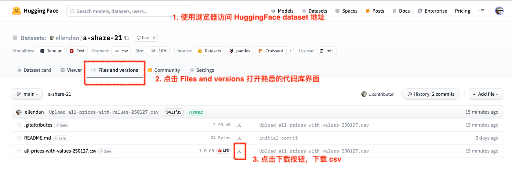

使用过股票理财 App 的小伙伴们都会发现，在市场行情趋势图中会充斥着大量的技术指标值，比如 MA、MACD、KDJ 等等，而我之前的 Pandas 实践中使用的数据都是日线原始数据。  
那么，如何获得每日的技术指标呢？非常简单，从日线原始数据进行计算。  

简单一点的 MA 指标， 比如`MA3`：近3天“收盘价”的简单平均数，`MA5` 近5天，`MA10` 近十天，以此类推。  使用 Pandas，可以很简单地一行代码 `df['close'].rolling(5).mean()` 快速实现。  
但技术指标众多，也有不少如 MACD 这样稍嫌复杂的指标，若是靠自己慢慢写代码、造轮子，就有些多余了。

Python 中有一些股票指标的开源库，可以直接使用，比如 TA-Lib、stock-pandas 等。
- (TA-Lib)[https://ta-lib.org/]，知名开源库，提供 200 多个专业金融技术指标的计算。
- (stock-pandas)[https://github.com/kaelzhang/stock-pandas]，数据结构是对 Pandas DataFrame 的继承和扩展，使用简易的指令表达式快速生成指标和技术分析。  
本文使用的就是 stock-pandas 库，当不需要使用 TA-lib 200多个众多指标时，stock-pandas 的编码风格和指令表达式会更受 Pandas 使用者的青睐。


本文我以最常见的 MACD、KDJ 双指标为例子，使用 Pandas 分析在近期数据中 MACD + KDJ 双金叉策略的准确度。
Pandas 代码地址依然是在 HuggingFace 上的 a-share-demo 库中[脚本地址](https://huggingface.co/spaces/ellendan/a-share-demo/blob/main/a_share/ipynb/MACD_KDJ.ipynb)。
以下是代码实现步骤。


### 1. 安装 Python 依赖库
本次依赖的库：
- pandas
- numpy
- jupyter
- stock-pandas

### 2. 加载数据源
这次使用的还是 HuggingFace上的 A股日线数据集 [ellendan/a-share-21](https://huggingface.co/datasets/ellendan/a-share-21)，请手动下载 csv 文件，保存到 demo project 的 `dataset` 文件夹下。


本文发出时，修正了上次一些 na 无用数据问题，已经下载了该数据集的小伙伴，如果自定义编程时，碰到 na 问题，可以：
- 可以无需重新下载，自己使用代码预处理 `source_data_frame = source_data_frame.dropna(subset=['close'])`。
- 或者，重新下载。




```Python
from stock_pandas import StockDataFrame
import pandas as pd
pd.options.display.max_columns = None

# 需要从 HuggingFace dataset 上手动下载的 csv 文件放在本地。本代码库的 dataset 目录已经加入了.gitignore，不会将数据集提交到代码库。
data_path = '../../dataset/all-prices-with-values-250127.csv'
prices_df = pd.read_csv(data_path, index_col=(0,1))
prices_df.tail()
```

### 3. 计算 MACD列、KDJ 列和未来5日涨幅列
计算 3 个关键列：
- `macd.g.fork`，macd 金叉。
- `kdj.g.fork`，kdj 金叉。
- `target`，以当日收盘价为基准，未来第5个交易日的收盘价的涨幅是否超过10%。
测算的最终目标，可以理解为以双金叉为买入信号，预测持股5日后的涨幅是否超过10%。
```Python
def cacluate_indicators_and_target(source_data_frame, last_n_days=400):
    source_data_frame = source_data_frame.iloc[-(last_n_days+26):]
    stock_df = StockDataFrame(source_data_frame)
    
    predict_days = 5
    target = ((stock_df[f'change:close,{predict_days + 1}'] > 0.1) * 1).shift(-predict_days)

    df = pd.DataFrame({
        'close': stock_df['column:close'],
        'bullish': stock_df['style:bullish'] * 1,
        'macd.dif': stock_df['macd.dif'],
        'macd.dea': stock_df['macd.dea'],
        'macd.h': stock_df['macd.h'],
        'kdj.k': stock_df['kdj.k'],
        'kdj.d': stock_df['kdj.d'],
        'macd.g.fork': (stock_df['macd.dif / macd.dea'] & stock_df['macd.dea >= 0']) * 1,
        'kdj.g.fork': (stock_df['kdj.k / kdj.d'] & stock_df['kdj.k < 40']) * 1,
        'target': target,
        }, index=source_data_frame.index)
    df.dropna(inplace=True)
    return df

_indicators_df = prices_df.groupby(level=0, group_keys=False).apply(
    lambda x: cacluate_indicators_and_target(x, 400), include_groups=False)
_indicators_df.head()
```

代码中主要使用了 stock-pandas 的几个指令表达式：
- `column:close`，获取 StockDataFrame 中传入的原始字段列`close`(收盘价)。取出收盘价，主要是为了用于验证和比对计算数据。
- `change:<on>, <period>`，计算 StockDataFrame中某列的值的变化率。
- `style:bullish`，计算当天是否是涨（红色蜡烛）。
- `macd.*`，计算 macd 系列指标，如 `dif`(快线)、`dea`（慢线）、`h`（红绿柱）。
- `kdj.*`，计算 kdj 系列指标，如 `k`、`d`。
- `/`，特殊操作符 “上穿”，比如 macd 金叉，就是 `macd.dif / macd.dea`（快线从左往右上穿慢线）。
    同理还有，`\`，“下穿”。
- `>=`、`>`、`><`、`==`、`<=`、`<`，值比较操作符，
更多说明见 (stock-pandas文档 README)[https://github.com/kaelzhang/stock-pandas]。

代码中使用了金叉的判断条件为：
- MACD 金叉(macd.g.fork)：`stock_df['macd.dif / macd.dea'] & stock_df['macd.dea >= 0']` 
    - `stock_df['macd.dif / macd.dea']`，macd 的 diff 线是否上穿 dea 线
    - `stock_df['macd.dea >= 0']`，dea 值是否处于零上，用于限定金叉是`零上金叉`。
- KDJ 金叉(kdj.g.fork)：`stock_df['kdj.k / kdj.d'] & stock_df['kdj.k < 40']`
    - `stock_df['kdj.k / kdj.d']，kdj 的 k 线 是否是上穿 d 线
    - `stock_df['kdj.k < 40']`，k 值是否小于 40，用于限定金叉在 `超卖区`附近。

代码中计算未来5天的涨幅的方式：`((stock_df[f'change:close,{predict_days + 1}'] > 0.1) * 1).shift(-predict_days)`
- 1、`stock_df['change:close,6'] > 0.1`，取当日的收盘价，以 “6” 为时间窗、对比往前数5天的收盘价 —— 涨跌幅是否大于10%。
    
- 2、`.shift(-5)`，由于全文代码的目标，是为了看“当日”双金叉对“未来5日”涨幅预测的准确度，因此需要将第1步计算出了的`change:close` Series中每个值按 index 方向向前移动5行。这样，在每行的数据中，即有了当日的是否金叉的列、也有了未来5日的涨幅列。
- 3、将值添加为 DataFrame 的新列 `target`。


### 4.  按照双金叉条件进行过滤和结果统计
```Python
exist_macd_g_fork = _indicators_df['macd.g.fork'] > 0
exist_kdj_g_fork = _indicators_df['kdj.g.fork'] > 0
current_bullish = _indicators_df['bullish'] > 0

# 添加当日红色蜡烛为辅助条件提升预测成功率
double_g_fork = _indicators_df[exist_macd_g_fork & exist_kdj_g_fork & current_bullish]
display(double_g_fork[double_g_fork['target'] > 0].head())

print(f"MACD、KDJ双金叉预测未来5日的涨幅大于10% 的成功率：{double_g_fork[double_g_fork['target'] > 0].shape[0] / double_g_fork.shape[0] :.2%}")
```

运行后结果：


我这里依然是使用的最近400个交易日的数据。最后测算出双金叉预测未来5天涨幅超过10%的成功率只有 11.03%。