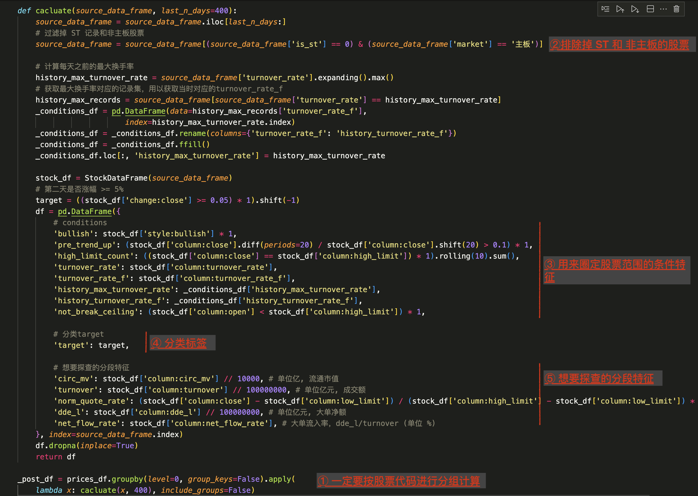
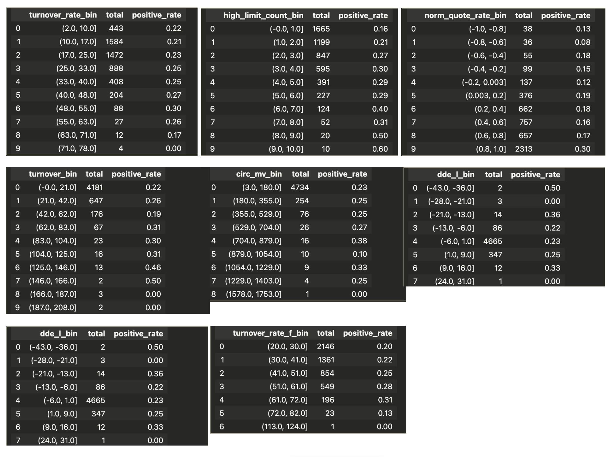
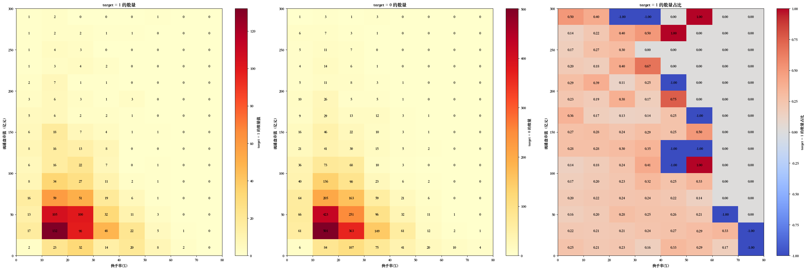
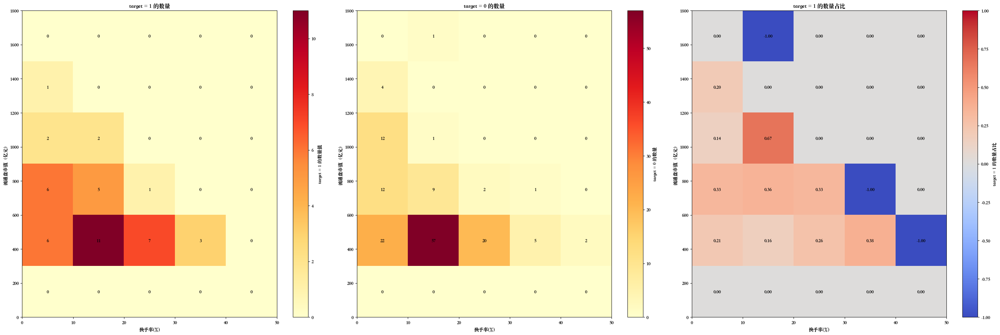
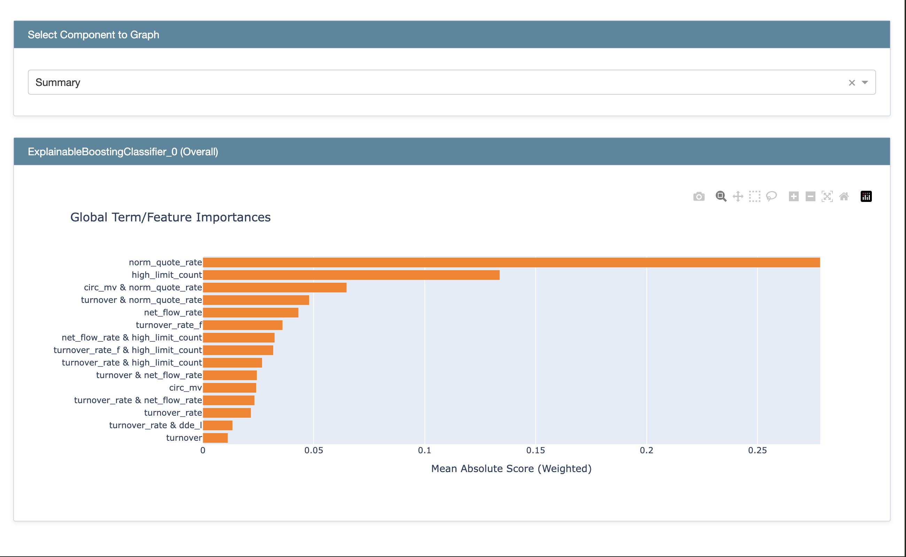
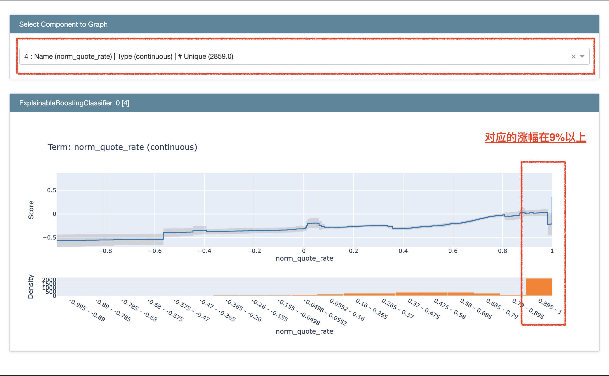
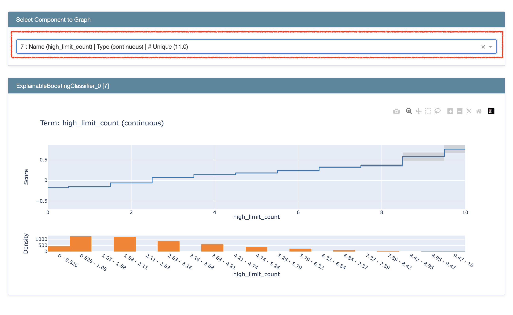
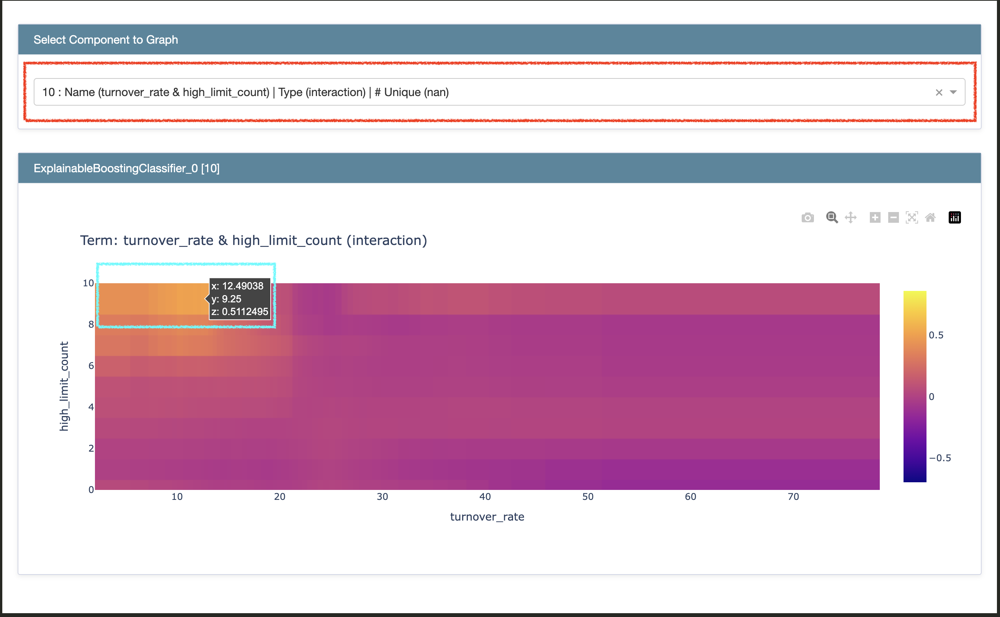

## 一、引言  

之前有小伙伴留言：有时候整体统计的成功率看起来不尽如人意，但是如果将特征分段的话，部分区间的成功率会提升不少。
今天我们就以“当日高换手率”为场景来看一下：
- 可能影响”第二天涨幅“的特征数据分布都是怎样的？
- 快速进行特征分段分析的工具 —— Pandas.cut 和 InterpretML.

在股票市场中，换手率 —— 指在一定时间内，股票的“成交量”与“流通股本”的比率。
高换手率通常被视为市场活跃度的指标，但其背后的原因和影响因素复杂多样，可能由多种因素引起，如市场热点、利好消息、主力资金操作等。
**需要注意：** 使用数据进行技术分析时，是不会直接解释因果关系的。数据分析，是以数据规律的方式呈现特征的分布和相关性，旨在为一些业务推断和猜测进行验证和提供数据支持。

## 二、本文数据范围定义

### 1. 高换手率
换手率的定义是：`成交量(Volume) / 流通股本(float_share)`。  
那么，如何定义这个比率的高低？

在本篇博客上下文中，我暂时将`高换手率`的范围圈定为：
**“
换手率(turnover_rate)接近该股票历史最大换手率（history_max_turnover_rate）,
且自由流通股换手率(turnover_rate_f) 大于10%。
”**

字段解释：
- 股本，分为总股本(total_share)、流通股本(float_share) 和 自由流通股本（free_share）。
  在最新更新的数据集（dataset）中，这 3 个字段的数据都会提供。
  所谓”自由流通股本“，是指扣除了十大流通股东、持股5%以上等（减持时必须发公告）股本之后，剩下的部分”流通股本“。
- 自由流通股换手率（turnover_rate_f），即 `volume / free_share`，在数据集中也会直接提供 turnover_rate_f 值。


希望查看不同范围的小伙伴，可以克隆 [huggingFace Demo 脚本](https://huggingface.co/spaces/ellendan/a-share-demo/blob/main/a_share/ipynb/high_turnover_rate.ipynb)自行修改高换手率条件。


### 2. 分类标签
当圈定了历史数据中出现”高换手率“的股票之后，我们对这些股票进行打标分类：
**“
出现高换手的第二天，收盘价是否涨幅 5% 以上。
”**

是，则标记为正类（值为1）; 否，是负类（值为0）。
也就是常说的二分类。

下面将介绍如何使用 Pandas 和 InterpretML工具对高换手股票进行特征分段分析。
## 三、代码操作

### 1. HuggingFace 数据集

这次依然使用 [HuggingFace dataset ellendan/a-share-21](https://huggingface.co/datasets/ellendan/a-share-21)，具体为`all-prices-with-values-250303.csv`文件。
250303 这次更新，除了以前的日线价格字段外，增添了以下关键字段：
- `total_share`，总股本。
- `float_share`， 流通股本。
- `free_share`，自由流通股本。
- `total_mv`，总市值，单位万元。
- `circ_mv`，流通市值，单位万元。
- `turnover_rate_f`，自由流通股换手率，单位%。
- `exchange`，交易所。`SSE` 是上交所；`SZSE` 是深交所。
- `market`, 市场类别 。`主板` / `创业板` / `科创板` / `CDR`。

```Python
import pandas as pd
from stock_pandas import StockDataFrame

pd.options.display.max_columns = None
# 需要从 HuggingFace dataset 上手动下载的 csv 文件放在本地。本代码库的 dataset 目录已经加入了.gitignore，不会将数据集提交到代码库。
data_path = '../../dataset/all-prices-with-values-250303.csv'
prices_df = pd.read_csv(data_path, index_col=['code', 'date'])
prices_df.tail()
```
### 2. 数据处理

在进行分析之前，我们需要对特征进行处理。
这里跟以前一样，主要使用 Pandas 和 stock-pandas 工具来完成。
详情见源代码脚本，[脚本地址](https://huggingface.co/spaces/ellendan/a-share-demo/blob/main/a_share/ipynb/high_turnover_rate.ipynb)。
以下是数据处理的代码片段截图：

**说明：**
1. 数据集中包括了上交所和深交所所有的股票。
   因此，在处理特征时，一定要记得按股票代码分组进行处理。不然，像 expanding()、rolling()、diff() 等跨记录行的多行运算，会算错。
2. `(source_data_frame['is_st'] == 0) & (source_data_frame['market'] == '主板')`
    - 数据集已经添加了`market`字段，可以直接排除掉 ST 股票（涨停限价 5%）和非主板（涨停限价 20%）的股票。
3. 准备好用来过滤股票范围的条件特征。
   虽然这些特征也可以用来做分段分析，但需要注意 —— 在它被作为条件之后，分段范围会缺失一部分区间。
    - `bullish`，当日烛线图是否是红柱。
    - `pre_trend_up`，最近20日的趋势：是否价格上涨10%。
    - `high_limit_count`, 最近10日的涨停板数量。
    - `turnover_rate`, 换手率。
    - `turnover_rate_f`，自由流通股换手率。
    - `history_max_turnover_rate`, 当天之前(包括当天)出现过的历史最大换手率。
    - `history_turnover_rate_f`，历史最大换手率那天的自由流通股换手率。
    - `not_break_ceiling`，开盘价非涨停价，用来去掉破板股的极端数据。
4. 分类标签：`((stock_df['change:close'] >= 0.05) * 1).shift(-1)`，第二天收盘时是否达到涨幅 5% 以上。
5. 想要进行分段查探的特征。
    - `circ_mv`，流通市值，源数据集单位是`万元`，这里换算成`亿元`。
    - `turnover`, 成交额，源数据集单位是`元`，这里换算成`亿元`。
    - `norm_quote_rate`，归一化后的涨跌幅。
      由于股票价格的变动对应到涨跌幅时，涉及到小数四舍五入的问题，因此涨跌停的幅度并不是标准的 ± 10%。为了避免数值超过 10% 的这样的小偏差，这里将价格对照到各个股票涨跌停价格区间进行数值归一化，让涨跌幅控制在 ± 1 范围内。
    - `dde_l`，大单净成交额，单位元（数据来源同花顺）。包括特大单+大单：单笔成交量>60000股，或者单笔成交金额>30万。
    - `net_flow_rate`，大单净流入率，单位 %（数据来源同花顺），`dde_l / turnover`。

### 3. 按条件进行数据整体统计
利用前面准备好的 condition 部分的特征字段，我们对股票数据范围进行筛选。
为了更接近正常的选股逻辑，除了`高换手率`之外，还添加了近20日价格趋势上涨、当日收红、非破板等限定条件。  
最后统计圈定的数据中，正类占总数量的比率。  
代码如下：  
```Python
# 换手率接近历史最高换手率，且换手量占自由流通盘的比例 >= 10%
_high_turnover_rate_condition = (_post_df['turnover_rate'] >=(_post_df['history_max_turnover_rate'] * 0.8)) & (_post_df['turnover_rate_f'] >= 20)

_filtered_df = _post_df[(_post_df['pre_trend_up'] > 0)
                & (_post_df['not_break_ceiling'] > 0) # 非破板
                & (_post_df['bullish'] > 0) # 看涨
                & _high_turnover_rate_condition]

print(f"满足条件的总数据量：{_filtered_df.shape[0]}")
print(f"其中达成目标的数量：{_filtered_df[_filtered_df['target'] > 0].shape[0]}")

ratio = round(_filtered_df[_filtered_df['target'] > 0].shape[0] / _filtered_df.shape[0], 2)
print(f"平均成功率：{ratio}, 即 {ratio*100}%")
```

运行后显示：
```Text
满足条件的总数据量：5130 
其中达成目标的数量：1173 
平均成功率：0.23, 即 23.0%
```
也就是，按选股条件筛选出了 5130 次股票数量，其中达成第二日涨幅 >= 5% 的股票一共是 1173 次，整体统计的成功率是 23 %。

### 4. 探查特征内各分段的数据分布

#### 4.1 使用 pandas cut 进行分段统计
首先，我们只使用 pandas，不使用其他工具对特征进行分段查看，关键函数 pandas.cut (有需要的也可以试试 pandas.qcut 函数)。

```Python
import pandas as pd
feature_names = ['turnover_rate', 'turnover_rate_f', 'circ_mv', 'turnover', 'norm_quote_rate', 'dde_l', 'net_flow_rate', 'high_limit_count']

_bin_filtered_df = _filtered_df.copy()
results = []
for feature in feature_names:
    _bin_filtered_df[f'{feature}_bin'] = pd.cut(_bin_filtered_df[feature], bins=10, precision=0)
    # 统计每个分段的样本数和正类占比
    grouped = _bin_filtered_df.groupby(f'{feature}_bin', observed=True)['target'].agg(
    total='count',
    positive_rate=lambda x: round(x.mean(), 2),
).reset_index()
    grouped = grouped.dropna()
    display(grouped)
```
**说明：**
- `cut()`函数，按一维数组的 min ~ max 值区间将数组分隔成 `bins`参数（这里是10）个区间格子。
- 我们将需要分析的所有股票数据（5130条），放入各个特征分段区间进行数量统计`count`(总数)、`positive_rate`(正类的占比，因为正类的值为1，负类为0，因此求平均值mean()正好就是占比值)。


运行结果，如下图：

**说明：**
- 从以上8个特征的数值等区间分段统计来看，的确有一些特征区间的 positive_rate > 0.23（整体数据的正类占比）。
  可以关注一下这些分段区间，但同时也需要注意该区间的`total`值，过小的基数造成的 positive_rate 的提升可能具有偶然性。
    - `turnover_rate_f > 41%`区间，正类占比高于平均值。
    - `norm_quote_rate > 0.8`区间，正类占比 30%。
    - `high_limit_count > 2`区间，正类占比至少高于 27%。
- 一些特征区间数据过于集中，比如`circ_mv_bin`等于`(3, 180)`这个区间占据了 92% 以上的数据，只是等区间的 cut() 很难观察到该特征的细节特性。
#### 4.2 使用 matplotlib 进行交叉分段分析
Pandas cut 只能查看到单一特征分段的特征分布，如果想要看交叉特征，如何实现呢？
这里，我们先用 matplotlib 热力图对一组交叉特性进行分段可视化 —— 换手率（横轴） + 流通市值（纵轴）。

```Python
import numpy as np
import matplotlib.pyplot as plt

# 设置字体，让 matplotlib 图片可以显示中文
plt.rcParams['font.sans-serif'] = ['Songti SC']
plt.rcParams['axes.unicode_minus'] = False

def plot_heatmap_with_ratio(_df, vertical_step=20):
…………（见源文件脚本）…………

_circ_mv_segment_1 = _filtered_df[_filtered_df['circ_mv'] < 300]
_circ_mv_segment_2 = _filtered_df[_filtered_df['circ_mv'] >= 300]

plot_heatmap_with_ratio(_circ_mv_segment_1)
plot_heatmap_with_ratio(_circ_mv_segment_2, vertical_step=300)
```
**说明：**
- 通过前面 cut 分段可知：circ_mv（流通市值）数值范围跨度大，从3亿~1800亿，同时数据主要集中在第一个区间。因此，我们将 circ_mv 分成两个大的区间各绘制一套热力图 —— 小于300亿元和大于300亿元。

绘图结果：


**说明：**
- 每套图有三张子图：（左）正类的数据分布，（中）负类的数据分布，（右）正类占比。
  在（右）子图中，没有数据的栅格显示”灰色“，只有负类的栅格显示”蓝色“，其他有正类分布的栅格显示”红色“，数据越大，颜色越深。
- 虽然从左子图和中子图中发现，数据集中在：20亿 < circ_mv < 100亿 和  10% < turnover_rate < 40% 之间。但通过右子图发现，在这个区间的正类占比并没有太显著的提升。
#### 4.3 使用 InterpretML 对特征进行解释性分析
如果每个单一特征和交叉特征，都使用上面两种方式手动可视化，效率会非常的低。
因此，这里借助 InterpretML 对各特征分段进行解释。

>InterpretML 是微软开源的一款专注于机器学习模型可解释性的 Python 工具库，旨在帮助用户理解和解释模型的决策逻辑。它提供两类核心功能：
>
>1. **模型无关解释**：支持对各类黑箱模型（如神经网络、集成模型）进行全局特征重要性分析（如 SHAP 方法）和局部预测解释（如 LIME 技术），揭示模型整体规律及单个样本的决策依据；
>2. **明箱模型构建**：内置可解释的模型（如可解释提升机 EBM），在保证高精度的同时直接输出清晰的规则，例如特征分箱对结果的影响。其可视化工具直观展示分析结果，适用于医疗、金融等高信任度需求场景，助力模型调试、合规审查及决策透明度提升。

下面使用的就是明箱模型 EBM，对数据特征进行分段规则解释。
代码调用非常简单：
```Python
from interpret.glassbox import ExplainableBoostingClassifier
from sklearn.metrics import roc_auc_score
from interpret import show

X, y = _filtered_df[feature_names].to_numpy(), _filtered_df['target'].to_numpy()

ebm = ExplainableBoostingClassifier(feature_names)
ebm.fit(X, y)

# 使用 ROC-AUC 简单进行评估
auc = roc_auc_score(y, ebm.predict_proba(X)[:, 1])
print("AUC: {:.3f}".format(auc))

ebm_global = ebm.explain_global()
show(ebm_global)
```
**说明：**
- 使用 ROC-AUC 进行简单评估。如果该值 <= 0.5，基本等于随机猜测，模型没学到任何东西。ROC-AUC 越大越好，最大值为 1。
- 调用 interpret.show()函数会在 Jupyter Notebook 上自动绘制出可交互的可视化图表。

**总体结果:**

**说明：**
- 从图上可以看到，在全局样本数据的加权平均的情况下，贡献度最高的（对正确判定二分类的贡献，也叫特征重要性），是单一特征的`norm_quote_rate`和`high_limit_count`。
- 图上显示两特征交叉，全局评分最高的是 `circ_mv`和 `norm_quote_rate` 的交叉，具体的局部分箱贡献，需要选进去看 interaction 图。
- 默认情况下，ExplainableBoostingClassifier 模型最多只进行两个特征的交叉，如果期望三个特征以上的交叉，需要代码显式指定。
- 默认显示重要性前 90% 排名的特征，如果想要查看的特征没有显示在 Summary 直方图内，则说明该特征的重要性评分比最后一名还要低。

**分段（分箱）结果：**

**说明：**
- 从图上可以看到，数据大多集中在 `norm_quote_rate > 0.9`这个区间，但 0.9 ~ 1.0 这个区间的偏差特别大。
- 只有当 norm_quote_rate == 1.0 时，对于正类的预测才有较大的贡献度。
- 0.9 < norm_quote_rate < 0.98 这个区间，score 接近于0，对于分类预测几乎没有贡献。
- 0.98 <  norm_quote_rate < 1.0 这个区间，score 小于0，对于负类的预测有一定作用。
个人看法，猜想背后的逻辑的 —— 高换手的情况下，涨停会大概率提升第二天继续大幅上涨的信心，而封板失败，会降低第二天继续大幅上涨的几率。


**说明：**
- 在 high_limit_count >=3 之后的区间，随着涨停板数量的增加，逐渐增加正类判定的概率。
- 在 high_limit_count < 3 的区间，基本只会加强负类的判定概率。
- 因此，当一只股票`近10日涨停板的数量大于3`的正类概率大于另一只股票`近十日涨停板的数量小于3`为正类的概率。


**说明：**
- 双特征交叉，可视化图表就是热力图。Z 轴值为 Score，通过高亮度的热力块可观察到贡献度高的区域。比如，上图中左上角蓝色框的区域，对正类的判定贡献度很高。
- 特征交叉页面不会显示各特征的样本数据权重。查看样本数量分布，还是需要去单特征局部图查看。
  

想要看到所有特征分段贡献表现的，可 clone 脚本到本地自行运行。


### 5. 添加涨停作为选股条件进行验证
```Python
_checked_filtered_df = _post_df[(_post_df['pre_trend_up'] > 0)
    & (_post_df['not_break_ceiling'] > 0)
    & (_post_df['bullish'] > 0)
    & (_post_df['norm_quote_rate'] >= 0.9) # 添加条件
    & (_post_df['high_limit_count'] >= 9) # 添加条件
    & _high_turnover_rate_condition]

print(f"满足条件的总数据量：{_checked_filtered_df.shape[0]}")
print(f"其中达成目标的数量：{_checked_filtered_df[_checked_filtered_df['target'] > 0].shape[0]}")

ratio = round(_checked_filtered_df[_checked_filtered_df['target'] > 0].shape[0] / _checked_filtered_df.shape[0], 2)
print(f"平均成功率：{ratio}, 即 {format(ratio * 100, '.2f')}%")
```

打印结果：
```Text
满足条件的总数据量：27 
其中达成目标的数量：15 
平均成功率：0.56, 即 56.00%
```
**注意：** 虽然正确率从 23% 提升到了 56%，但”10天内涨停板9次以上”本身就是一条非常极端概率的情况，也缺少大量数据验证支持 —— 这个结果是偶然的，还是必然的。
就像我们如果使用 `high_limit_count > 9` 且 `10 < turnover_rate < 15` 作为添加条件的话（上面 turnover_rate & high_limit_count 图高量部分），成功率可以达到 100%，但数据样本却只有2条。
因此，这些结果，能否拿来预测未来数据，只能各人见仁见智。

## 四、结论

- **特征分段技术分析：** 简单的分段可以使用 Pandas 和 Matplotlib，想要全局分段解释则更建议使用 InterpretML 这样的工具。
- **对于业务场景方面：** 上升趋势中出现高换手率的股票，`当日收盘涨停`、`近10日有涨停板3次以上的`这两个条件，可以提升对第二日涨幅5%以上的判定概率。
