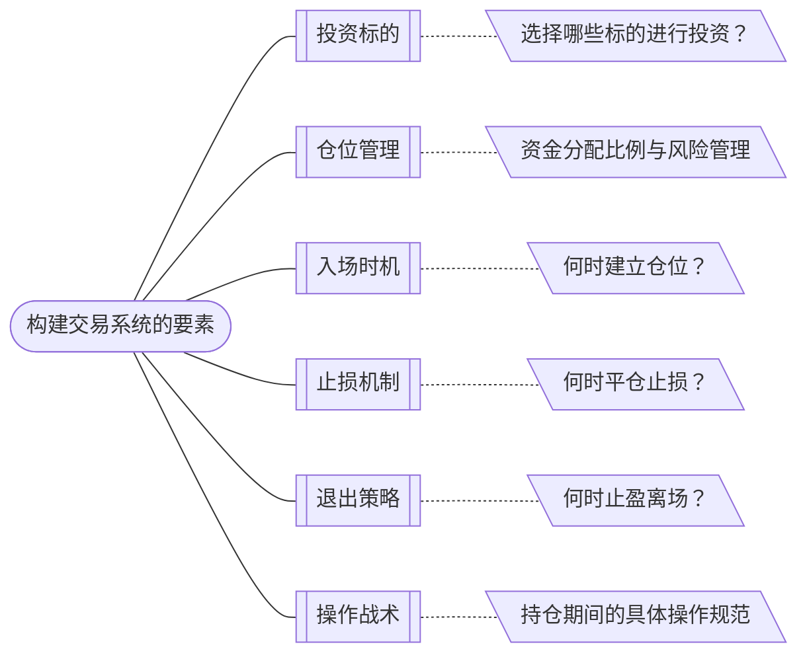
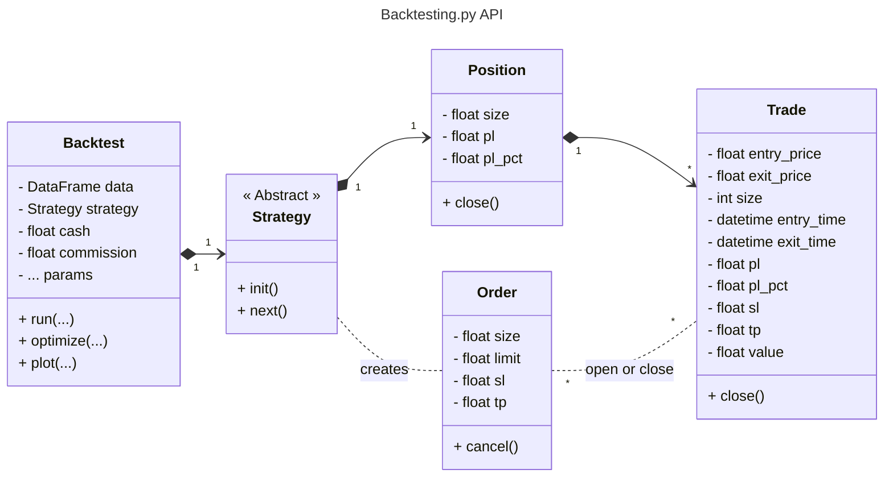
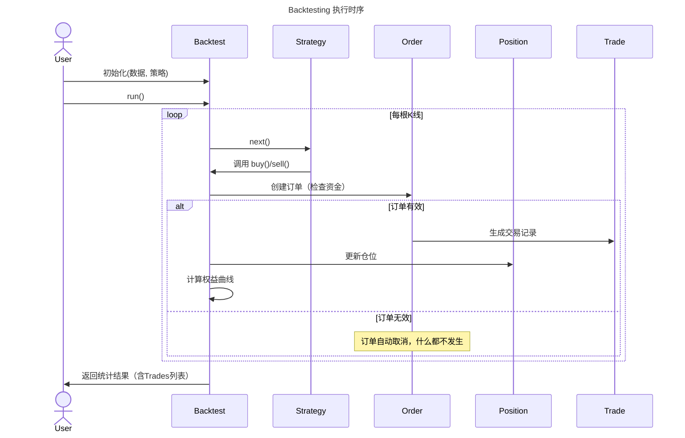
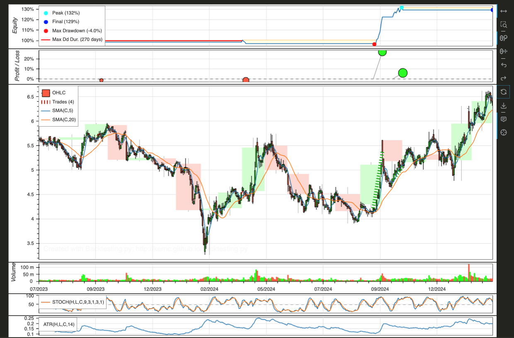
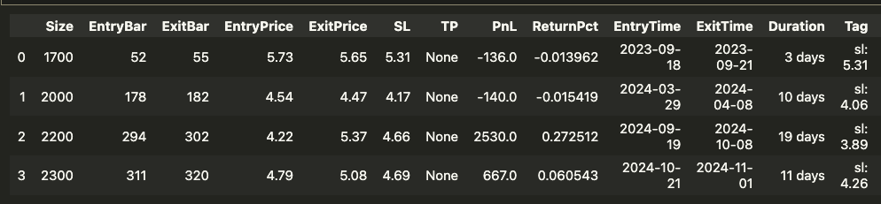

## 一、引言
在先前的文章中，我们主要运用 Pandas 进行数据量化分析，该工具在数据统计、特征工程、数据清洗与预处理等环节发挥着核心作用。  

然而对于股票量化分析而言，单纯依赖 Pandas 难以支撑系统化交易体系的构建。资深交易者常说的"系统性"与"纪律性"，本质上指向一个完整交易系统（注意：不是特指软件程序）的搭建。一个成熟的交易系统应当包含以下核心要素：  


这六大维度的决策逻辑，本质上都需要基于历史规律的提炼与未来趋势的概率判断。但依赖主观经验构建的交易系统往往存在三大结构性缺陷：  

1. ​**幸存者偏差**：过度聚焦成功样本，忽视沉默的失败数据。  
2. ​**逻辑漏洞**：忽略交易摩擦（手续费、滑点）、流动性限制等现实约束条件。  
3. ​**时空错位**：历史规律可能因市场的演变而失效。  

正是这些客观存在的认知局限，凸显了量化回测引擎的核心价值——通过严谨的数学模型与历史数据验证，将模糊的交易直觉转化为可验证的概率优势，最终实现投资决策的科学化与系统化。  

传统量化回测框架如 Zipline、Backtrader、PyAlgoTrade 等，虽然在功能完备性上具有优势，但普遍存在依赖项复杂、学习曲线陡峭等问题。更重要的是，这些框架的最新维护时间都至少在两年前。对于希望快速掌握交易系统核心概念的开发者而言，这些框架并非理想选择。

本文重点推介 Backtesting 这一轻量级回测框架，其核心优势在于面向对象的设计理念和极简主义架构。该框架不仅提供逻辑清晰的策略开发接口，还内置了可视化分析模块，大幅降低了策略验证的复杂度。需要说明的是，其在高级功能层面存在局限，例如动态选股、多资产组合管理、实盘对接等复杂功能尚未实现。

总体而言，该框架凭借其低学习门槛和平缓的学习曲线，特别适合作为交易系统开发的入门工具。对于初次接触量化交易的开发者，能够有效搭建从策略构思到回测验证的完整认知闭环。

## 二、Backtesting 的架构
阅读 Backtesting 的[官方 API 文档](https://kernc.github.io/backtesting.py/doc/backtesting/backtesting.html)，就会发现 Backtesting 提供了5大类对象。



上图是简略的画法，Backtesting 源代码中实际上用了一些中间类，但为了更好理解概念，我将其在图上省略。


- **Backtest** 类是核心容器，也是 Portal，负责组装各组件和参数。它有三大函数：
    - `run()` 运行回测。
    - `plot()` 将回测结果可视化。
    - `optimize()` 自动优化 Strategy 参数。
- **Strategy** 类是用户需要定制的主要类，用户可以在其中定制自己的仓位管理、入场时机、止损机制、退出策略以及操作战术。它有两大函数：
    - `init()` 初始化函数。获取用户注入的股票时序数据，计算出参与策略量价相关的指标。
    - `next()` 为时间驱动函数。如果用户注入的是日线数据，在时间重放时，每一日执行一次；如果注入的是分时数据，则每一条分时记录执行一次。
      next() 是定制用户策略的集中位置。
-  **Position** 类是仓位，主要对交易总量和盈亏进行监控，以及执行平仓操作。
- **Order** 类，用户在 Strategy 类中进行的每一次买卖、止盈止损等操作，都会生成对应的订单。当订单被判定有效、并被成交时，会将结果映射成 Trade 对象。函数：
    - `cancel()` 当订单没有被成交时，可以执行取消操作。主要用于限价订单。
- **Trade** 类，只有被成交的订单，才被映射成交易。 一条交易，管理着从买入到平仓退出整个周期段的记录。
    - `close()` 平仓操作。Trade 提供平仓函数，当 Position 对象进行平仓时，实际上也是调用的所有活跃状态的 Trade 对象的 close() 函数。
      除了平仓这个动作之外，所有的交易操作，都需要通过 Order 对象来传达执行。

通过上面可以看到，使用 Backtesting 回测引擎，用户的主要代码工作就是定制**Strategy**类。
**注意：** 介绍 Strategy 类时，我没有提到投资标的的选择策略。是的，Backtesting 目前不支持策略动态选股。



## 三、代码操作
Demo 的代码库依然是在之前的 HuggingFace Demo Space 中，[脚本地址](https://huggingface.co/spaces/ellendan/a-share-demo/tree/main/a_share/ipynb/backtesting_py)。

### 1. 依赖库
- Pandas （用来加载数据源）
- TA-Lib（用来计算指标）
- backtesting

这次指标的计算，我们使用TA-Lib库，TA-Lib 的底层是 C/C++ 库，在 Python pip 安装之前，需要安装 C/C++ TA-Lib 库。  
如果是 macOS：
```shell
brew install ta-lib
pip install ta-lib
```
Linux / Windows 则见[官方readme](https://github.com/ta-lib/ta-lib-python?tab=readme-ov-file#dependencies)。

### 2. 加载股票数据
数据集在线上老位置：[HuggingFace dataset ellendan/a-share-21](https://huggingface.co/datasets/ellendan/a-share-21/blob/main/all-prices-with-values-250303.csv)。
```python
import pandas as pd

# 从本地 CSV 文件加载股票数据
data = pd.read_csv('../../../dataset/all-prices-with-values-250303.csv',
parse_dates=['date'], index_col=('code', 'date'))

# 按 backtesting 的格式，确保数据列名正确
data = data[['open', 'high', 'low', 'close', 'volume']]
data.rename(columns={'open': 'Open', 'high': 'High', 'low': 'Low', 'close': 'Close', 'volume': 'Volume'}, inplace=True)
```
框架对股票数据的支持，集中在量和价两方面，即 `OHLC（Open/High/Low/Close）` 和 `Volume`。

### 3. 实现 Strategy 类
#### 3.1 init() 函数
我们主要使用的策略目标：
- 使用 MA5 高于 MA20 进行市场行情选择
- 使用 KD 金叉进行择时买入，KD 死叉卖出
- 使用 ATR 进行仓位管理和止损指导

因此，在需要在 init() 函数中对涉及到的指标进行批量计算，以提供给 next()函数使用。
```Python
import talib as ta
from backtesting import Strategy
from backtesting.lib import crossover, cross

class KDJCross(Strategy):
    # 均线参数
    n1 = 5
    n2 = 20
    
    # 仓位管理参数
    risk_percent = 0.10 # 风险敞口为账户的10%
    # 止损参数
    stop_loss_atr_multiple = 3 # ATR的倍数作为止损距离
    trailing_stop_loss = 1 # 是否启用追踪止损
    atr_period = 14 # ATR计算周期

def init(self):
    # 计算KDJ指标的KJ
    self.k, self.d = self.I(ta.STOCH, high=self.data.High, low=self.data.Low, close=self.data.Close, fastk_period=9, slowk_period=3, slowk_matype=1, slowd_period=3, slowd_matype=1)
    
    self.sma1 = self.I(ta.SMA, self.data.Close, timeperiod=self.n1)
    self.sma2 = self.I(ta.SMA, self.data.Close, timeperiod=self.n2)
    
    # 计算ATR (Average True Range)
    self.atr = self.I(ta.ATR, self.data.High, self.data.Low, self.data.Close, timeperiod=self.atr_period)
```
#### 3.2 next() 函数
这里使用了最简单的单次进场/单次平仓的策略，如果想分批进场和退出，也可自行定制。
```python
def next(self):
    current_price = self.data.Close[-1]
    
    # 如果短期均线在长期均线之上 + KD金叉 + D在50之下，买入
    if (self.sma1[-1] > self.sma2[-1]) and crossover(self.k, self.d) and self.d[-1] < 50 and not self.position:
        # 计算仓位大小
        position_size = self._position_size()
        # 计算止损价格
        if self.atr[-1] > 0:
            _stop_price = stop_loss_price(current_price, self.atr[-1], self.stop_loss_atr_multiple)
        # 下带有止损的市价订单
        self.buy(size=position_size, sl=_stop_price, tag=f'sl: {_stop_price}')
    
    # 除此之外，如果持仓，且KD死叉 + D在50之上，卖出（平仓）
    elif self.position and cross(self.k, self.d) and self.d[-1] >= 50: 
        self.position.close()

    # 更新追踪止损，用以锁住盈利
    elif self.trailing_stop_loss > 0 and self.position:
        # 计算新的止损价格
        if self.atr[-1] > 0:
            new_stop = stop_loss_price(current_price, self.atr[-1], self.stop_loss_atr_multiple)
            # 如果新的止损价格高于当前止损价格，则更新止损价格（只上移，不下移）
            if new_stop > self.trades[-1].sl:
                self.trades[-1].sl = new_stop

def _position_size(self):
    """计算头寸大小，基于风险管理原则"""
    # 获取当前价格和ATR
    current_price = self.data.Close[-1]
    current_atr = self.atr[-1]
    
    # 如果ATR数据不足，使用默认值
    if current_atr <= 0:
        return 100 # 默认购买100股，即1手
    
    # 计算止损距离（以ATR的倍数表示）
    stop_distance = current_atr * self.stop_loss_atr_multiple
    # 根据账户风险比例计算头寸规模
    # 风险金额 = 账户价值 * 风险比例
    risk_amount = self.equity * self.risk_percent
    
    # 仓位大小 = 风险金额 / 止损距离
    position_size = risk_amount / stop_distance
    # 最大仓位大小 = 账户价值 / 当前价格
    max_size = self.equity * 0.99 / current_price
    # 返回合适的仓位大小（较小的那个值）
    position_size = min(position_size, max_size)
    return max(100, int(position_size / 100) * 100)
```

next() 函数一共有三个分支：
- **买入。** 在 ma5 运行在 ma20 之上时，只要 KD 金叉（同时 D 在 50之下），则建仓。
- **卖出。** 排除掉买入的条件之后，只要 KD 出现交叉（同时 D 在 50之上），则平仓。
- **跟踪止损。** 在收益上升时，调整止损价，用于锁住盈利。

在买入时，调用了`buy()`函数：
- `sl（stop-loss price）`: 设定初始止损价。
  当止损价定的太远时，会造成过多亏损；定的太近时，又会造成在震荡中过早出局。
  因此，我们这里使用《海龟交易法则》中提到的ATR（真实波动均值，单位是货币单位￥/$等），使用 ATR 作为参照标准设置 2倍 ATR 为止损价。
- `size`：设定买多少股。
  虽然设定了止损价控制了部分风险，但如果仓位过重，仍然可能让账户亏损超出我们的期望。因此，需要计算仓位，从而让风险幅度控制在期望的范围内。$最大亏损金额 = （买入价 - 初始止损价） \times 仓位（股数）$
  当然，也有人会担心仓位过小，造成盈利变少。风险和盈利中如何取得平衡，本身就是一种考量和取舍 —— 可以选择加大仓位，同时最大的亏损金额的上限必然也会升高。 
  本例子中设定的账户风险敞口为10%，即只能接受账户价值出现 -10% 的亏损。固定了账户风险敞口和初始止损价，自然就可以计算出仓位买多少股了。代码中由函数`_position_size()`实现。
  举个简单的例子：账户风险敞口是 10%，但是想买一只股票的 2ATR ~= 15% 股价幅度，那么如何保证止损的时候亏损的金额是在账户的 10% 之内呢？那自然是轻仓啦。

### 4. 实例化 Backtest 容器
```python
import backtesting
from kdj_strategy import KDJCross, commission

selected_stock_data = data.loc['002483.SZ'][-400:]
# 创建回测实例
bt = backtesting.Backtest(selected_stock_data, KDJCross, cash=10000, commission=commission, trade_on_close=True)
# 运行回测
stats = bt.run()
# 输出回测结果
print(stats)
# 绘制回测结果
bt.plot()
```

前面介绍过：Backtesting 没有策略的动态选股组件。在 Backtest 初始化的时候，通过参数静态绑定了具体被回测的股票标的。
- `selected_stock_data`，回测使用的某只股票的 OHLCV 数据。
- `KDJCross`，用户实现的策略类。
- `cash`，回测的初始现金额。
- `commission`，佣金。
  **注意**，这里的佣金与A股的习惯不同。A股，是按每笔订单的总金额进行比例收取；Backtesting 这里的佣金，是按标的每一个单位进行比例收费的。因此，千万不要在这里写 .00025 这样的浮点数，不然会按每股收佣金，造成买价金额错误、大量订单无法成交。
  demo 源代码中的 `commission()` 提供了简单的将A股佣金转换成每股佣金的计算。
- `trade_on_close`，时间驱动时，市价订单是否按当天的收盘价进行成交。True，按当天收盘价；False，按第二天的开盘价。

### 5. 执行回测
#### 5.1 回测结果概要
调用`Backtest.run()`，运行回测，然后打印结果。
下面是打印的回测 Summary：
```
Start                     2023-07-06 00:00:00
End                       2025-03-03 00:00:00
Duration                    606 days 00:00:00
Exposure Time [%]                         7.0
Equity Final [$]                  12920.97943
Equity Peak [$]                    13150.9817
Commissions [$]                       0.02057
Return [%]                           29.20979
Buy & Hold Return [%]                14.49275
Return (Ann.) [%]                    17.52117
Volatility (Ann.) [%]                12.01635
CAGR [%]                              11.2452
Sharpe Ratio                          1.45811
Sortino Ratio                         5.04565
Calmar Ratio                          4.34312
Alpha [%]                            28.20636
Beta                                  0.06924
Max. Drawdown [%]                    -4.03423
Avg. Drawdown [%]                    -1.83829
Max. Drawdown Duration      196 days 00:00:00
Avg. Drawdown Duration       86 days 00:00:00
# Trades                                    4
Win Rate [%]                             50.0
Best Trade [%]                       27.25118
Worst Trade [%]                      -1.54185
Avg. Trade [%]                        6.98771
Max. Trade Duration          19 days 00:00:00
Avg. Trade Duration          11 days 00:00:00
Profit Factor                        11.33606
Expectancy [%]                        7.59186
SQN                                   1.16059
Kelly Criterion                       0.45683
_strategy                            KDJCross
_equity_curve                             ...
_trades                      Size  EntryBa...
```
可以看到 Duration 606 天（这里是自然日），实际交易日应该是 400 天。  
账户持仓的时间是 606 x 0.07 天，最后的收益是 2920 元，曾经最高收益是 3150 元。  
最终收益率是 29%，最大回撤是 -4.03%。交易频率低，仅有4次，胜率 50%。
具体的其他项含义，可以自行问 DeepSeek。

#### 5.2 结果图形可视化
调用`Backtest.plot()`，显示可视化图表。

说明，默认从上到下显示5部分：
- `Equity`：账户资产总值。
- `Profit / Loss`：盈利或亏损的交易结算点。
- `OHLC`：蜡烛图。**注意**，这里是按国外的习惯：上涨是绿柱，下跌是红柱。目前好像没有设置可以修改。
- `Volume`：交易量柱图。
- `多指标图`：除了 MA  等需要放在蜡烛图上一起看的指标之外，其他指标会在最下方另外绘制。比如这里的 KD、ATR。

同时，这是一个可交互的图表。如果在 Jupyter Notebook 中显示的效果不好，可以调用代码关闭 —— 这样 Backtesting 会生成一个 html 使用浏览器打开。
```python
backtesting.set_bokeh_output(notebook=False)
```

#### 5.3 数据具体的交易明细
获取回测结果句柄中的`_trades`属性（`stats['_trades']`），打印交易明细。

每一条交易上的固定属性有：
- `size`: 仓位股数。
- `EntryBar`：建仓的 bar 索引。就是 DataFrame 按时间排序后的自然索引值。
- `ExitBar`：退出的 bar 索引。
- `EntryPrice`: 建仓时的股价。
- `ExitPrice`：退出时的股价。
- `SL`： 止损价。
- `TP`：止盈价。
- `PnL`：盈利金额。
- `ReturnPct`：盈利率。
- `EntryTime`: 建仓时间。
- `ExitTime`：退出时间。
- `Duration`：持股市场。
- `Tag`：从 Order 对象那里继承来的标记字符串。
  我这里用于记录初始止损价，由于 Backtesting 没有直观的标记来区分 Trade 的退出原因。因此，当我发现 Trade 的退出价等于 Tag 里的 sl 值时，就可以知道此次交易是跌破初始止损价而退出的。

每条交易上其实还有非固定的属性：主要是建仓和退出时的各个指标值。

### 6. 执行参数优化
前面进行回测时，策略 KDJCross 中的成员参数，我们使用的静态指定的方式：
```python 
# 均线参数
n1 = 5
n2 = 20

# 仓位管理参数
risk_percent = 0.10 # 风险敞口为账户的10%

# 止损参数
stop_loss_atr_multiple = 3 # ATR的倍数作为止损距离
trailing_stop_loss = 1 # 是否启用追踪止损
atr_period = 14 # ATR计算周期
```

这些参数可能是按主观或者是历史经验选择的，有没有可能有更合适的参数？比如：短期均线选择3日、10日，长期均线选 30日、60日等。
如果一次次地去改代码测试，那太费事了，Backtesting 提供了参数的自动优化工具。
调用代码：
```python
stats = bt.optimize(n1=range(2, 21, 1),
                    n2=range(5, 101, 5),
                    stop_loss_atr_multiple=range(1, 11, 1),
                    trailing_stop_loss=range(0, 2),
                    maximize='Equity Final [$]',
                    constraint=lambda param: param.n1 < param.n2)
display(stats)
```
让 Backtesting 自动进行参数范围的组合：
- 将想要组合优化的参数进行范围录入：
  - 短期均线周期 n1，从 2 到 21 的范围，步长取 1
  - 短期均线周期 n2，从 5 到 101 的范围，步长取 5
  - ATR 止损倍数 stop_loss_atr_multiple，从 1 到 11，步长取 1
  - 是否开启跟踪止损 trailing_stop_loss，取 0 或 1
- 以最终回报最大化（Equity Final）为优化目标
- 约束：n1 必须小于 n2

打印优化后的最优回测 Summary：
```
Start                     2023-07-06 00:00:00
End                       2025-03-03 00:00:00
Duration                    606 days 00:00:00
Exposure Time [%]                        9.75
Equity Final [$]                  13715.97563
Equity Peak [$]                   13715.97782
Commissions [$]                       0.02437
Return [%]                           37.15976
Buy & Hold Return [%]                18.79699
Return (Ann.) [%]                    22.02613
Volatility (Ann.) [%]                13.88604
CAGR [%]                             14.04193
Sharpe Ratio                          1.58621
Sortino Ratio                         4.83448
Calmar Ratio                          4.96974
Alpha [%]                            35.57097
Beta                                  0.08452
Max. Drawdown [%]                    -4.43205
Avg. Drawdown [%]                    -1.81923
Max. Drawdown Duration      196 days 00:00:00
Avg. Drawdown Duration       65 days 00:00:00
# Trades                                    5
Win Rate [%]                             60.0
Best Trade [%]                       27.25118
Worst Trade [%]                      -1.54185
Avg. Trade [%]                        6.76572
Max. Trade Duration          19 days 00:00:00
Avg. Trade Duration          12 days 00:00:00
Profit Factor                        13.33821
Expectancy [%]                        7.24996
SQN                                   1.52366
Kelly Criterion                       0.55754
_strategy                 KDJCross(n1=3,n2...
_equity_curve                             ...
_trades                      Size  EntryBa...
dtype: object
```
可以看到回报率从 29% 提升到了 37%。

输出优化后的参数值：
```python
# 打印优化后的策略参数
stats._strategy
```
显示：
```xml
<Strategy KDJCross(n1=3,n2=25,stop_loss_atr_multiple=2,trailing_stop_loss=0)>
```
最优参数结果：
- 短期均线 3
- 长期均线 25
- ATR止损倍数 2
- 不开启跟踪止损


**特别注意**：这只是在一只股票上、某一段历史交易周期内，回测的最优参数。如何利用和再次验证策略参数的有效性，需要在不同的股票上回测进行横向对比，同时也在单只股票的不同交易周期回测进行纵向对比。  从而避免过拟合、策略无法泛化使用的问题。


## 四. 结束
这次介绍了Backtesting 这个回测引擎，除了了解必要的技术工具以外，更重要的是：
- 通过工具了解背后的思维体系、逻辑和知识
- 工具是为了业务和需求服务的，只有能达成最终的目标，才是有用和合适的工具
- 不要过于沉迷工具的复杂性，这世上始终有学不完的工具

这篇博客写的有点过于长了。如果有小伙伴吐槽 —— 这哪里可能 10分钟之内学会？但这的确是门槛特别低的回测引擎了：P 
如果对业务和概念还不熟悉，推荐阅读《海龟交易法则》入门，加油哦~