## 一、前言
近期在量化分析 Demo 中，一直使用 `ellendan/a-share-21` 这一短期前复权价格数据集，而旧数据集 `ellendan/a-share-prices` 则长期未更新。  
`ellendan/a-share-prices` 数据集的时间跨度较大（自 2005 年至今），原本为机器学习模型提供，但近期数据更新几乎停滞。
这两天做 AI workflow 的时候，突然想看看有没有白嫖地资源 —— 给这个数据集挂一条数据流水线，让它自己定期更新。最后选择了 [Prefect](https://www.prefect.io/)。  

选中 Prefect 考虑这几点：
- 对 Python 支持度高，相比一些数据平台的 DSL 或者 UI 拖拉拽的开发方式，自由度更高。
- 有白嫖的 Cloud 资源可用。
- 可集成大量通用研发平台（我这里主要使用了Github Action、HuggingFace Datasets）。
- 学习曲线低，工具轻量级。  

## 二、数据流水线的架构设计
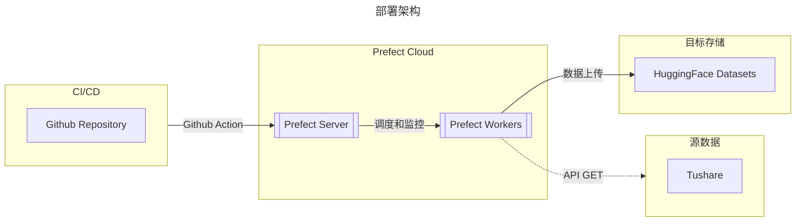
架构中涉及到的组件和平台包括：Github、Prefect cloud、Tushare(国内一个量化数据平台，提供源数据 API)、HuggingFace Datasets。  
Prefect cloud 提供的组件包括两部分（可类比Kubernetes master 和 Node）：
- 控制面板层，包括部署、调度工作节点和监控。  
- 工作节点。可选两大类型：
  1. Prefect cloud 内置的（Prefect managed）
  2. 外部集成（第三方平台或者本地部署的）。其中又分为两类：
    - pull 类，需要自维护 container。
    - push 类，serverless。

为了白嫖 Prefect cloud 的资源，我自然是选择了 Prefect managed。Free tier 提供一个 vCPU core 2 的共享计算资源，配额是 10 hours per month。

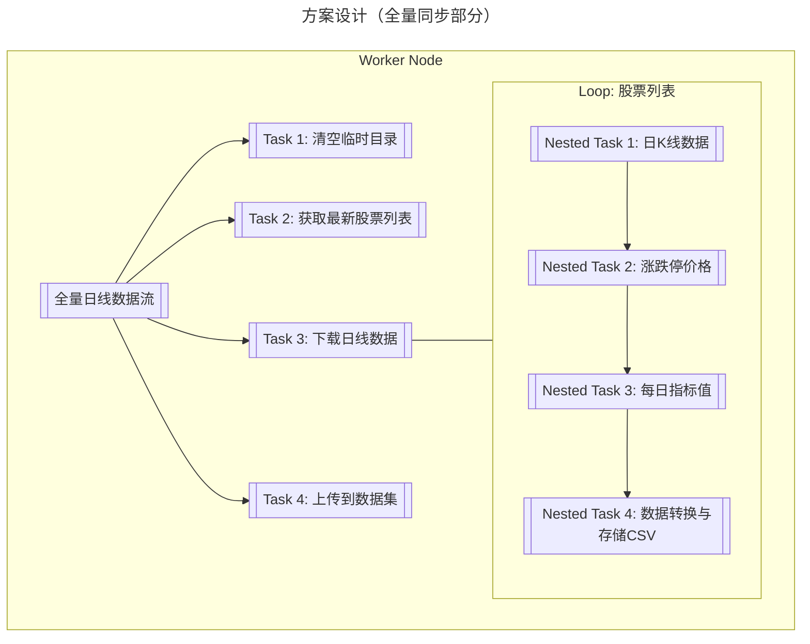
在方案设计方面：分为了`全量更新`和`增量更新`两部分，脚本上对应了两条数据工作流。    
因为全量更新耗时长，且花费大量 Tier 计算时间，在完成首次全量更新后，每天仅运行增量更新即可。**同时，能使用增量更新的方式更取决于 —— 这个数据集是不复权价格，如果是前复权，就必须每次重新运算、不能使用增量更新了。**  
从大颗粒步骤维度上，全量和增量看起来没有太大差异，但落实到实现上，其实增量更新需要匹配不同的 APIs、考虑的情况也更复杂，但这里不再赘述了，详情见代码脚本。  

`Task2`、`Task3`、`Nested Task1-3` 的作用和设计，是考虑到源数据端 Tushare APIs 的数据维度和内容，最大程度地还原和拼接出`ellendan/a-share-prices`数据集原有的数据字段。旧数据源对 Data Pipeline 方式并不友好，因此切换成 Tushare。  

## 三、操作步骤
### 1. 安装开发环境
#### 1.1 安装 Prefect server
本地安装 Prefect 开发环境非常简单，使用 pipenv (或者 pip) 安装 Prefect 库：
```shell
pipenv install prefect
```
然后，运行命令启动 prefect server：
```shell
pipenv run prefect server start
```
这时候，终端命令行就会显示服务器启动：
```shell

 ___ ___ ___ ___ ___ ___ _____
| _ \ _ \ __| __| __/ __|_   _|
|  _/   / _|| _|| _| (__  | |
|_| |_|_\___|_| |___\___| |_|

Configure Prefect to communicate with the server with:

    prefect config set PREFECT_API_URL=http://127.0.0.1:4200/api

View the API reference documentation at http://127.0.0.1:4200/docs

Check out the dashboard at http://127.0.0.1:4200
```

注意，这启动的是控制面板层，类似于 Kubernetes api-server所在的 master 节点，它主要用来接收 prefect 命令请求、监控和执行调度。  
使用`http://127.0.0.1:4200`，可以访问 UI界面：
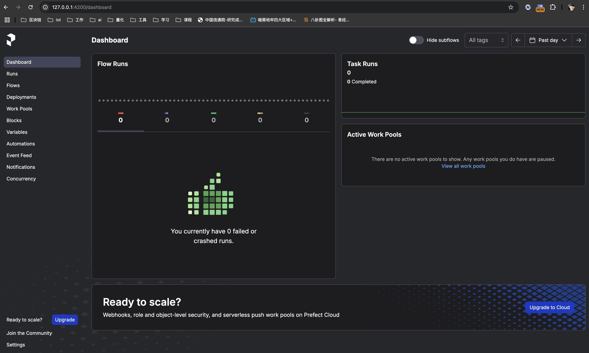
### 2. Flow 开发
脚本代码在 github 上，[Github 仓库地址](https://github.com/ellendan000/a-share-data-pipeline.git)。 
使用装饰器 `@flow` 和 `@task` 标记对应函数即可。  

#### 2.1 全量更新
```Python market/non_fq_daily_kline.py
from pathlib import Path
from datetime import datetime, timedelta
import shutil
from huggingface_hub import HfApi
from pandas import DataFrame, Series
import tushare as ts
import pandas as pd
from prefect import flow, task
from prefect.blocks.system import Secret
from prefect.cache_policies import INPUTS
from prefect.concurrency.sync import rate_limit

LOCAL_FILE_PATH = "data/non_fq_daily_klines.csv"

tushare_secret_block = Secret.load("tushare-token")
ts.set_token(tushare_secret_block.get())

@task
def setup_data_dir() -> None:
    """Task 1: 设置数据目录"""
    parent_folder = Path(LOCAL_FILE_PATH).parent
    if parent_folder.exists():
        shutil.rmtree(parent_folder, ignore_errors=True)
    parent_folder.mkdir(parents=True, exist_ok=True)


@task(
    retries=3,
    cache_policy=INPUTS,
    cache_expiration=timedelta(hours=1)
)
def fetch_stock_list() -> DataFrame:
    """Task 2: 获取最新的主板股票清单"""
    df = ts.pro_api().stock_basic(
        exchange='SSE,SZSE',
        fields=[
            'ts_code',
            'name',
            'area',
            'industry',
            'market',
            'exchange',
            'list_date'
        ])
    return df[df['market'] == '主板']


@task
def fetch_all_stock_daily_price(stock_list: DataFrame, start_date: str, end_date: str) -> str:
    """Task 3: 抓取所有股票的非复权日线数据"""
    for idx, (_, row) in enumerate(stock_list.iterrows()):
        print(
            f"正在获取 {row['ts_code']} 的日线数据，整体进度 {idx+1}/{stock_list.shape[0]}")
        kline_df = fetch_daily_price(row, start_date, end_date)
        append_to_csv(kline_df, LOCAL_FILE_PATH)

    return LOCAL_FILE_PATH

@task(retries=3)
def fetch_daily_kline(ts_code: str, start_date: str, end_date: str) -> DataFrame:
    df = ts.pro_api().daily(ts_code=ts_code, start_date=start_date, end_date=end_date)
    df = df.reset_index()
    df = df.set_index(['ts_code', 'trade_date'])
    return df[['open', 'high', 'low', 'close', 'pre_close', 'pct_chg', 'vol', 'amount']]


@task(retries=3)
def fetch_limit_price(ts_code: str, start_date: str, end_date: str) -> DataFrame:
    df = ts.pro_api().stk_limit(ts_code=ts_code, start_date=start_date, end_date=end_date)
    df = df.reset_index()
    df = df.set_index(['ts_code', 'trade_date'])
    return df[['up_limit', 'down_limit']]


@task(retries=3)
def fetch_daily_index(ts_code: str, start_date: str, end_date: str) -> DataFrame:
    df = ts.pro_api().daily_basic(ts_code=ts_code,
                                  start_date=start_date, end_date=end_date)
    df = df.reset_index()
    df = df.set_index(['ts_code', 'trade_date'])
    return df[['turnover_rate', 'turnover_rate_f', 'volume_ratio', 'pe', 'pe_ttm', 'pb', 'ps', 'ps_ttm', 'dv_ratio', 'dv_ttm', 'total_share', 'float_share', 'free_share', 'total_mv', 'circ_mv']]


@task
def fetch_daily_price(stock_series: Series, start_date: str, end_date: str) -> DataFrame:
    """NestedTask 3.1: 从数据源获取单只股票的历史日线数据"""
    rate_limit("tushare-daily-api")
    ts_code = stock_series['ts_code']
    kline_df = fetch_daily_kline.submit(
        ts_code=ts_code, start_date=start_date, end_date=end_date)
    limit_df = fetch_limit_price.submit(
        ts_code=ts_code, start_date=start_date, end_date=end_date)
    index_df = fetch_daily_index.submit(
        ts_code=ts_code, start_date=start_date, end_date=end_date)
    kline_df, limit_df, index_df = kline_df.result(), limit_df.result(), index_df.result()
    merged_df = pd.concat([kline_df, limit_df, index_df], axis=1)

    stock_info_df = stock_series.to_frame().transpose()
    stock_info_df['list_date'] = pd.to_datetime(stock_info_df['list_date'])
    stock_info_df.set_index('ts_code', inplace=True)
    merged_df = merged_df.join(stock_info_df, on='ts_code')

    merged_df.dropna(subset=['close'], inplace=True)
    return merged_df


@task
def append_to_csv(stock_df: DataFrame, file_path: str) -> None:
    """NestedTask 3.2: 写入 csv"""
    stock_df.rename(columns={
        'pre_close': 'prev_close',
        'pct_chg': 'quote_rate',
        'vol': 'volume',
        'amount': 'turnover',
        'up_limit': 'high_limit',
        'down_limit': 'low_limit',
    }, inplace=True)
    stock_df.index = pd.MultiIndex.from_arrays([
        stock_df.index.get_level_values(level=0),
        pd.to_datetime(stock_df.index.get_level_values(level=1))
    ], names=['code', 'date'])

    first_write = not Path(file_path).exists()
    stock_df.to_csv(
        file_path,
        mode='w' if first_write else 'a',
        header=first_write,
        index=True
    )


@task
def upload_to_hf_datasets(file_path: str, end_date: str, huggingface_repo_name: str, repo_file_name: str) -> None:
    """Task 4: 上传到 Hugging Face Datasets"""
    print("上传到 Hugging Face Datasets")
    hf_api = HfApi(token=Secret.load("hf-token").get())

    hf_api.upload_file(
        path_or_fileobj=file_path,
        path_in_repo=repo_file_name,
        repo_type="dataset",
        repo_id=huggingface_repo_name
    )
    
    _last_update_date_file_name = ".last_update_date"
    with open(_last_update_date_file_name, "w") as f:
        f.write(end_date)
    hf_api.upload_file(
        path_or_fileobj=_last_update_date_file_name,
        path_in_repo=_last_update_date_file_name,
        repo_id=huggingface_repo_name,
        repo_type="dataset"
    )


@flow(log_prints=True)
def fetch_non_fq_daily_kline(huggingface_repo_name: str, 
                             repo_file_name: str,
                             start_date: str="20050101",
                             end_date: str="") -> None:
    """Flow: 抓取非复权日线数据"""
    if end_date == "":
        end_date = datetime.now().strftime("%Y%m%d")
        
    setup_data_dir()
    stock_list = fetch_stock_list()
    print(f"主板股票数量: {stock_list.shape[0]}")

    local_temp_file = fetch_all_stock_daily_price(
        stock_list, start_date, end_date)
    upload_to_hf_datasets(local_temp_file, end_date, huggingface_repo_name, repo_file_name)

# Run the flow
if __name__ == "__main__":
    fetch_non_fq_daily_kline(
        end_date="20250401",
        huggingface_repo_name="ellendan/a-share-prices", 
        repo_file_name="all-prices.csv")

```
**额外注意的有两点：**
- 秘钥、凭证、Token 等都不要写在代码库中，务必保存在 Secrets 保管库中。Prefect 支持 AWS、Azure 等第三方保管库，同时也提供了内置的 Secrets 保管功能。
- 流量限制，Prefect 不仅提供了支持普通串行任务，同时也支持并发任务和流量控制。
- 模块`__main__`块内的这种直接调用 flow 函数的方式，仅使用于 debug，可以在 Dashboard 上查看到 run 的情况，但并不会将 flow 发布到 Prefect Server —— 不会生成 Deployment。

#### 2.2 配置 Tushare API token 和 HuggingFace Access token

打开 Dashboard 界面中的 **Blocks** 菜单。
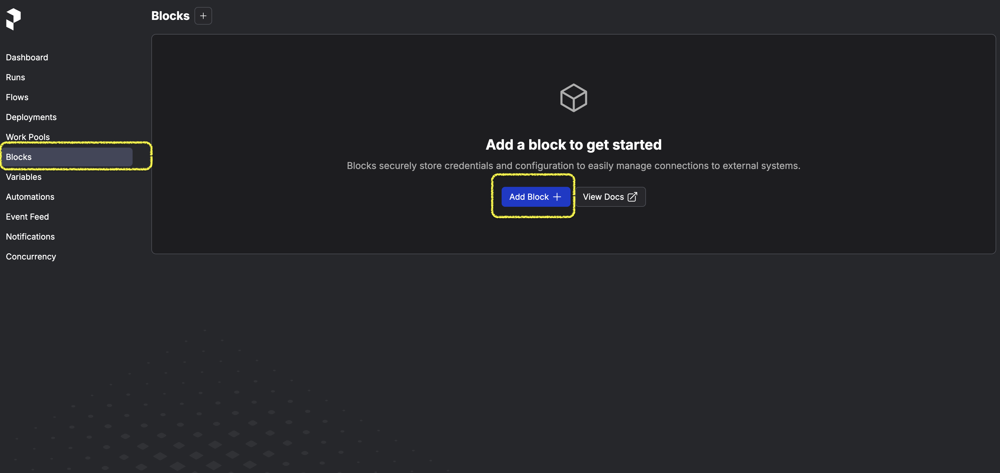  
选择创建 **Secret Type Block**。
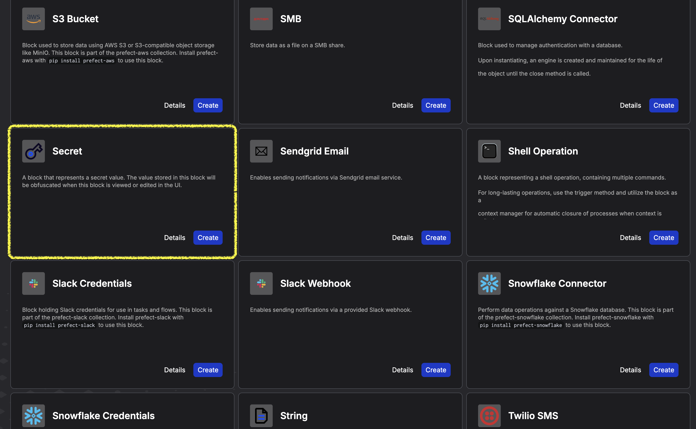

新建一条 Secret Block 保存好 tushare API token。相同的方式再保存一次 HuggingFace Access Token。    
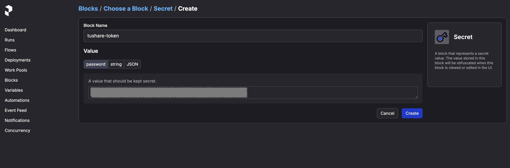
代码中使用 Secret 的方式：
```Python 
from prefect.blocks.system import Secret

tushare_secret_block = Secret.load("tushare-token")
api_token = tushare_secret_block.get()
```

#### 2.3 配置 Concurrency limit
像上游源数据端，对访问频率有限制的，比如我的 Tushare 账号访问 API 的频率限制是 200次/分钟。可以使用 Prefect 的 Concurrent limit 来对任务进行速率限制。  
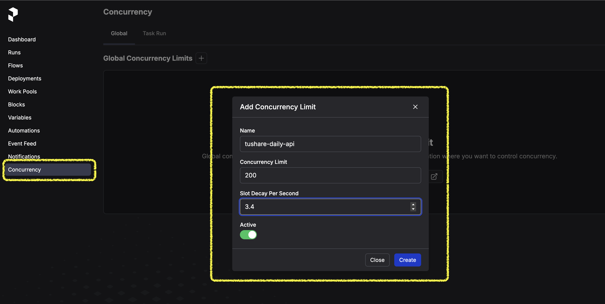
[官方Concurrency limits详细参数说明](https://docs.prefect.io/v3/develop/global-concurrency-limits).
代码中使用 limit 的方式：
```Python
from prefect.concurrency.sync import rate_limit

@task
def fetch_daily_price(stock_series: Series, start_date: str, end_date: str) -> DataFrame:
    """NestedTask 3.1: 从数据源获取单只股票的历史日线数据"""
    rate_limit("tushare-daily-api")
    …………
```
在需要限速的 task 函数内，直接使用 rate_limit 方法完成切面控制。

#### 2.4 运行调试
```shell
# 在当前 shell 显式激活 virtualenv
pipenv shell
# 设置需要连接的 Prefect server，调试中可以观察日志和监控
prefect config set PREFECT_API_URL="http://127.0.0.1:4200/api"
# 运行调试
python market/non_fq_daily_kline.py
```
命令行控制台可以看到后台日志，同时日志也会上报给 Prefect Server。  
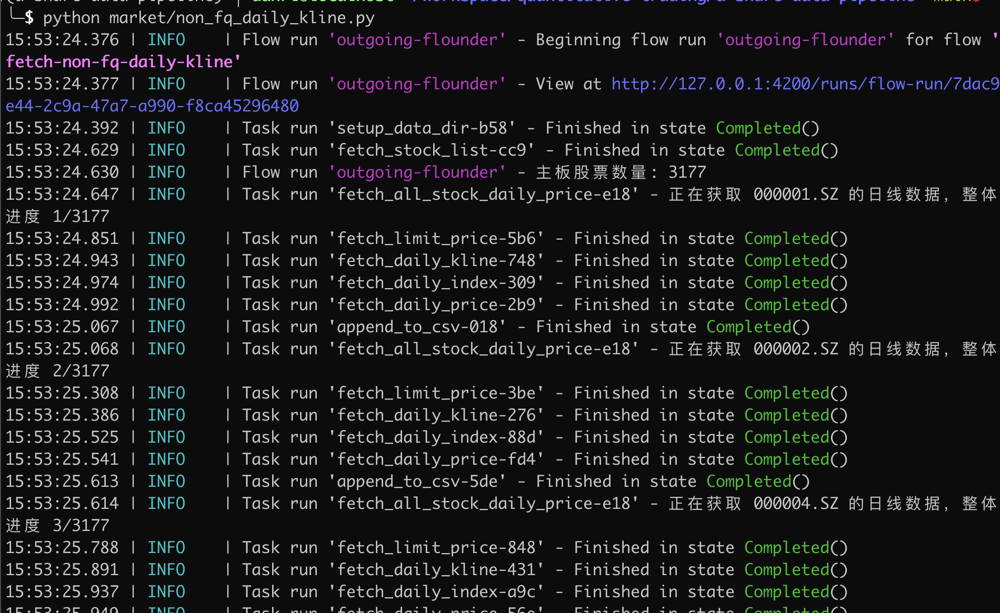

相同的方式，完成[**增量更新**的数据工作流脚本](https://github.com/ellendan000/a-share-data-pipeline/blob/main/market/delta_non_fq_daily_kline.py)，本地都运行调试通过，接下来就可以考虑部署了。
### 3. 部署到 Prefect Cloud
#### 3.1 注册 Prefect Cloud
访问 [Prefect Cloud 地址](https://app.prefect.cloud/auth/sign-in)。  

Prefect Cloud 注册了之后，Free Tire 被限制只能用有一个 workspace（default），但每个月有一定的免费计算配额。
#### 3.2 创建 Work Pool
Prefect Cloud 本身就是控制面板层，我们只需要创建自己的 Worker 节点就好了。
使用 Dashboard UI 界面点击创建 Work Pool。
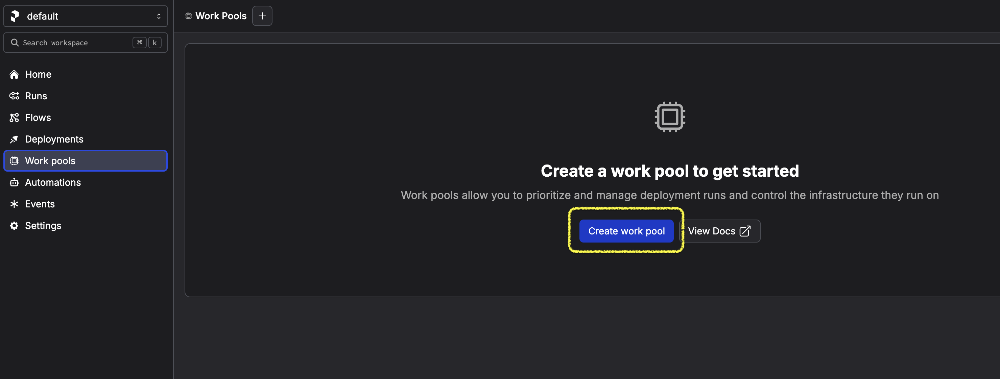
**第一步，选择 Work pool 类型。** 
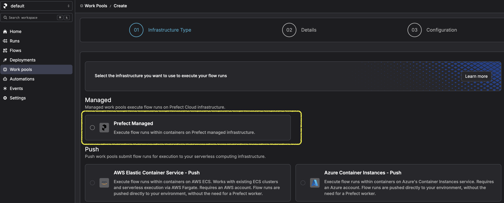
**第二步，填写基本信息。**
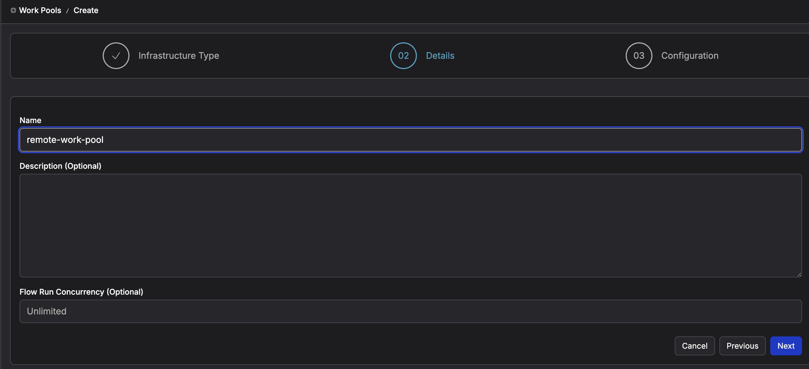
**第三步，定制配置信息。**
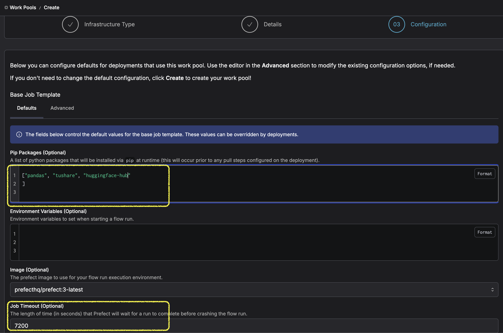
**注意黄框的两项：**
- python 脚本里需要使用的库。  
    如果我们选择的 Work Pool 是容器方式的话，就不需要这么麻烦地配置了，直接在 Dockerfile 里面打包就好。但这里是 Prefect managed 方式，就需要进行参数配置了。
- Job 超时时间，即 Flow 的运行超时时间。默认是 600 秒，如果超时未跑完的话，Prefect Cloud 会强行终止。  
    由于我们这里的全量脚本运行时间长，因此我将超时时间设置为了 7200 秒。

**创建成功后看效果，work pool 已经创建成功，并且 ready。**
黄框部分可以看到 Free Tire 的免费配额：每 30 天 10 个运算小时。  
#### 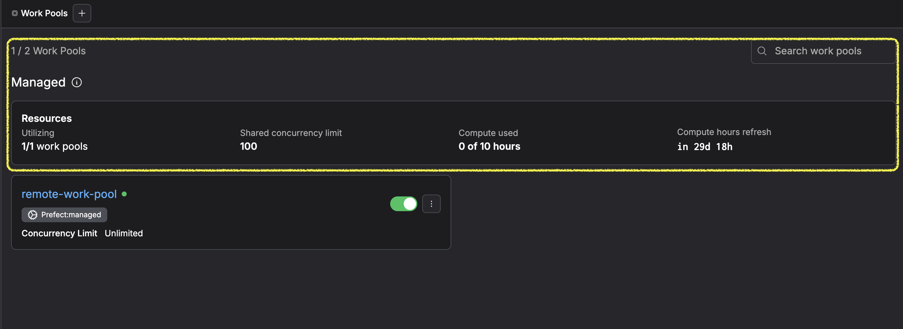3.3 配置 Secret Blocks 和 Concurrent Limit
使用上面章节 2.2 和 2.3 相同的方式在 Prefect Cloud 进行配置。  

#### 3.4 给 Github Repo 新建 Actions 
在 git 文件夹下，新建Github action flow：
```yaml a-share-data-pipeline/.github/workflows/deploy-prefect-flow.yaml
name: Deploy Prefect flow

on:
  push:
    branches:
      - main

jobs:
  deploy:
    name: Deploy
    runs-on: ubuntu-latest

    steps:
      - name: Checkout
        uses: actions/checkout@v4

      - name: Setup Python
        uses: actions/setup-python@v5
        with:
          python-version: "3.11"

      - name: Prefect Deploy
        env:
          PREFECT_API_KEY: ${{ secrets.PREFECT_API_KEY }}
          PREFECT_API_URL: ${{ secrets.PREFECT_API_URL }}
        run: |
          pip install pipenv
          pipenv sync
          pipenv run prefect deploy --all
```
特殊点说明：
- `step: Prefect Deploy`，连接 Prefect Cloud 部署的步骤。  
- `PREFECT_API_KEY` 和 `PREFECT_API_URL`，使用 Github repository 中设置的 Secrets 来设置环境变量。  
    PREFECT_API_URL 格式是：`https://api.prefect.cloud/api/accounts/[ACCOUNT-ID]/workspaces/[WORKSPACE-ID]`。读取方式见[manually-configure-prefect-api-settings](https://docs.prefect.io/v3/manage/cloud/connect-to-cloud#manually-configure-prefect-api-settings)。
- Git Action 运行命令：先安装依赖，然后触发 prefect 进行部署：`pipenv run prefect deploy --all`。  
    真正需要部署的工作流，会在 **prefect.yaml** 文件中定义。

#### 3.5 使用 yaml 文件定义 prefect 部署过程和细节
```yaml a-share-data-pipeline/prefect.yaml
name: cicd-deployment
prefect-version: 3.0.0

pull:
- prefect.deployments.steps.git_clone:
    repository: https://github.com/ellendan000/a-share-data-pipeline.git
    branch: main

deployments:
  - name: non-fq-daily-kline
    entrypoint: market/non_fq_daily_kline.py:fetch_non_fq_daily_kline
    work_pool:
      name: remote-work-pool
    parameters:
      huggingface_repo_name: ellendan/a-share-prices
      repo_file_name: all-prices.csv
  - name: trade-calendar
    entrypoint: market/trade_calendar.py:fetch_trade_calendar_flow
    work_pool:
      name: remote-work-pool
  - name: delta-non-fq-daily-kline
    entrypoint: market/delta_non_fq_daily_kline.py:fetch_delta_non_fq_daily_kline
    work_pool:
      name: remote-work-pool
    parameters:
      huggingface_repo_name: ellendan/a-share-prices
      repo_file_name: all-prices.csv
    schedule:
      - cron: 0 0 21 ? * MON-FRI
        timezone: Asia/Shanghai
```
[yaml deployment 配置的官方说明](https://docs.prefect.io/v3/deploy/infrastructure-concepts/prefect-yaml)。  
说明：
- 使用 process 类型的 worker，不需要build image，因此不需要配置 build action 和 push action。只需要配置 pull action 即可。
- deployments 项用来定义具体的数据工作流的部署方式。其中`delta-non-fq-daily-kline`使用 schedule cron 的方式定时调度运行：+8时区的每个工作日晚上21点。

#### 3.6  提交 python 代码到 Github repo
将之前调试好的 prefect flow python 文件提交到 Github repo（main branch），即会触发CD 对 Prefect 进行持续部署和更新。  
当 Github Action 部署成功后，可以在 Prefect Cloud 上看到已经部署成功的工作流 Deployments。  
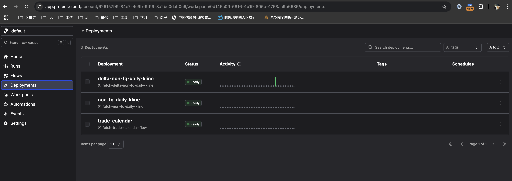

#### 3.7 手动触发全量同步
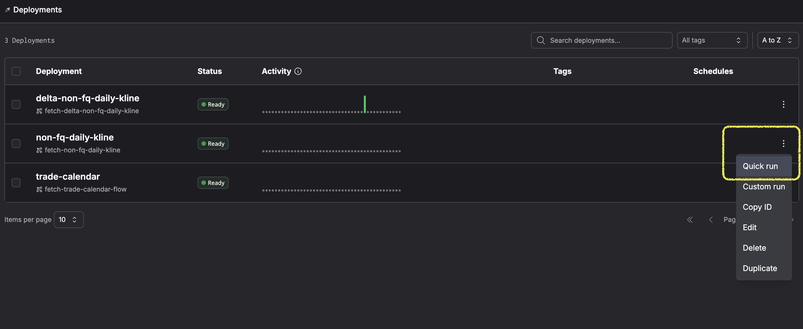
全量同步，对于每个目标数据集理论上只需执行一次，手动点击运行即可。  
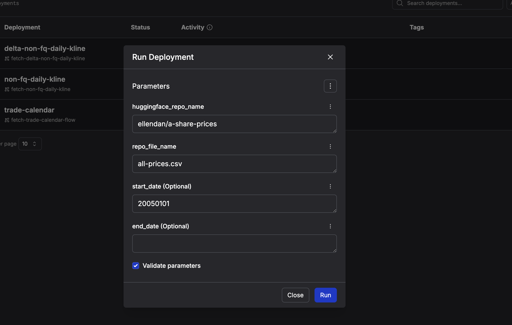
点开 **Quick run** 后，弹出 Input dialog，默认参数值已经在创建 Deployments 时写入，也可以手动修改 Flow 运行时的入参。  

#### 3.8 运行增量同步
在全量同步完成后，等待后续第一个工作日的晚上21点，Prefect cloud 会按 cron 配置自动运行增量同步。

## 四、效果
1. [ellendan/a-share-prices](https://huggingface.co/datasets/ellendan/a-share-prices)数据集支持数据工作流自动更新，当前已经更新到了2025年4月3日。
2. 数据集的数据来源切换到了支持 API 方式的新数据源 Tushare，尽量还原原数据集的字段，但有三个字段取消提供：`is_st`、`avg_price`和`is_paused`。详情见数据集的 README，README已经更新。
3. 数据集的最近一次更新时间会写入文件`.last_updated_date`，可自主查看。
4. **全量更新**后叠加**增量更新**，会让数据集不能再按照 `date` 字段顺序排列，因此加载数据集之后，必须手动排下序，才能保持原有脚本的效果。（[ellendan/a-share-demo 首页的连板数据分布](https://huggingface.co/spaces/ellendan/a-share-demo/blob/main/a_share/demo.py) 代码已修改。）
