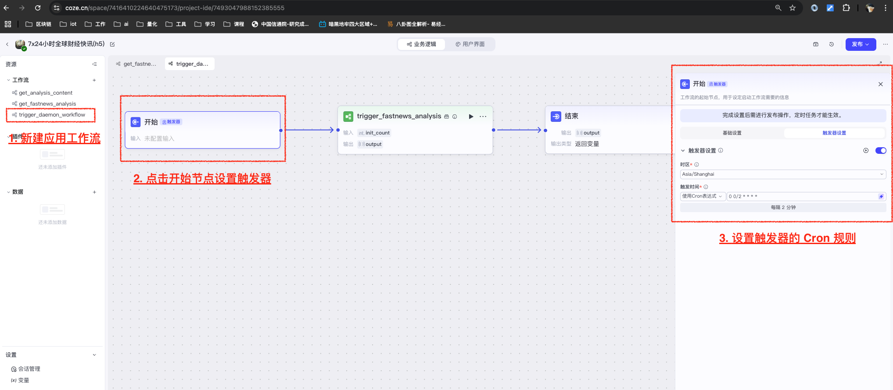

事情的起因，是发生在大 A 的黑色4月7日那天。  
众所周知，4月2日是美国宣布给全世界加关税，4月3日大A还没太大动静，但谨慎的小伙伴们应该都事先完成了减仓。过清明节的时候，我还跟朋友聊天，最后琢磨着等周一开市后买进一点一带一路概念的股票。 
结果我在周一（4月7日）开盘就盯上了两支逆势上涨的股票，一支是连云港，一支是永安药业。当看见这两只股票的时候，由于关税原因，我直接排除了港口出身的连云港🤣，选择了永安，然后当天就被打脸了。  
于是，不明真相的我，问了下 Deepseek 连云港逆势连板的原因。Deepseek 搜集完情报，又想了一会儿，告诉我：因为连云港主要对日韩贸易😱😱😱 且周末的时候出过一条“中日韩自贸区谈判的进展”的消息。  
当然故事的结尾，我还是在永安药业积极自救做 T，于4月8日涨停时成功盈利退出。  
往前想来，但凡我事先问一下 Deepseek，或者周末关注一下消息，可能就不会错过连云港这次机会。  
于是，我尝试做一个AI 自动化流程帮我实时解析快讯消息的方案。  

## 一、方案规划
当前常用的 AI 自动化的技术架构基本分为三个方向：
- 同进程。
    比如 Langchain 座下的 LangGraph，优点是自由度高、可以直接在业务系统中代码开发，缺点是需要代码开发、运维的工作量以及部署资源。  
- 不同进程。
    比如热门的 MCP，开发者不需要考虑部署的资源问题，用户会将 MCP Service 安装到本地，缺点仍然是代码开发的工作量。  
- 远程调用。
    分两种：定制 或者 低代码平台。
    - 定制方向。
        比如 Langchain 工具箱里面有一个 LangServe 可以帮助将开发好的 Langchain 服务发布成 REST API Server。
    - 低代码方向。
        比如耳熟能详的 Dify 和 Coze。优点自然是低代码、无运维，但缺点也很明显 —— 低代码化，自由度低，功能可扩展度和开发体验完全依赖平台技术开发人员的能力和素质。

一般，选择技术方向需要结合多方面的考量因素，比如功能扩展性、业务响应速度、部署运营成本、开发测试复杂度等等。  
回到我的需求：
- 需要一个 7x24 小时的财经快讯实时解读，功能简单。
- 资源上，尽量使用托管、0 部署成本。
- 网络上，使用国内的消息源和大模型，需要部署在国内。
- 开发上，demo 级别即可，少代码开发。

总体看来，选择 Coze 比较合适，并且 Coze 应用支持 Cron 级别的触发器。  
当然，也会碰到不少坑，这些在最后的总结中都会提到。  

## 二、方案设计
通过前期调研 —— 在当前版本的整个 Coze 中，支持周期轮询触发功能的，唯有“ Coze应用 ”这一种资源体。因此，Demo 的目标交付物就是一个 Coze 应用。  
下面是简单的方案概述：
Coze 应用除了H5前端页面外，主要包括两条工作流：
- 后台定时调度工作流：每2分钟运行一次，实时解读增量快讯，然后将解读结果存储在数据库中，便于所有用户进行前台读取。
- 前台访问工作流：响应用户前端发来的请求，从数据库中读取已经处理好的快讯数据。

从上图即可发现，整个应用中技术的复杂度主要体现在后台调度工作流中。  
在开发后台调度工作流时，我将职能分切成了三个部分：
1. Coze 插件开发：将网络抓取的过程，封装成了一个组件。
2. 主流程开发：控制着每次调度的流程主干和批处理机制。
3. 解析工作流开发：针对每条快讯，大模型 Function calling 收集和读取网络信息，进行解析归纳，再由 DeepSeek-R1 推理进行分类标记和总结，最后将所有大模型生成的文本物料保存到数据库（Token消耗起来挺贵的，生成一次就保存起来🤣）。


## 三、开发细节
### 1. Coze 插件开发

该插件是 Coze 云侧插件，使用 Python 开发。  
背后依赖的是东财 7x24全球直播频道的两条 API。

遵循东财 API 的调用规律：
1. 初始化页面时，调用`https://np-weblist.eastmoney.com/comm/web/getFastNewsList`，默认读取一定数量的最新快讯。每天快讯包括内容：
```json
{
    "code": "202504153377382069",
    "image": [],
    "pinglun_Num": 1,
    "realSort": "1744706307082069",
    "share": 1,
    "showTime": "2025-04-15 16:38:27",
    "stockList": ["90.BK0428", "150.014238"],
    "summary": "德国次日交付的基本负荷电力价格上涨32.3%，至每兆瓦时88.0欧元。",
    "title": "德国次日交付的基本负荷电力价格上涨32.3%",
    "titleColor": 0
}
```

注意 realSort 是一个非常重要的字段，相当于数据流中`watermark`水印字段，用来判断增量数据。
2. 页面初始化后，定时轮询使用 realSort 值调用`https://np-weblist.eastmoney.com/comm/web/getFastNewsCount`，来检查未读取的增量快讯的数量。
3. 有新的增量数据时，再次调用 `https://np-weblist.eastmoney.com/comm/web/getFastNewsList`，读取快讯清单，使用 realSort 截取出增量记录。

Coze 插件中两个工具，就是对应着这两条 API 的功能：  
- fetch_fast_news_list。获取快讯清单。  
- check_fast_news_count。读取未更新的增量数量。  
想要获取该插件源码，请见最后附录。  
目前小伙伴在插件商城无法搜索到该插件，因为该插件上架审核因为不合规等理由未上架成功。所以只有开发者自己可以用🤣。

### 2. 子工作流开发

最初去设计快讯分析流程的时候，想要给每个大模型节点执行“批处理”选项 —— 为了节省 token。但在测试的过程中发现，如果一次批处理中途失败，那么批次中已处理的内容无法保存到数据库，rerun 反而造成了 token 的浪费。并且随着批量的增大，中途失败的概率并不低。  
因此，子工作流被重构成了 input 单条快讯，靠主工作流批处理调用子工作流。  
想要参考两个大模型节点的 prompts，请见最后附录。ps. prompts 后面还会针对问题不断改进。  

**数据库的表格结构：**

### 3. 主流程工作流

**不用放大看了🤣 Coze 并未提供图片导出功能。这是截屏出来的，的确是看不清。**
流程基本跟前面画的主流程一致，但实现的时候受 Coze 组件的制约，分拆成了更多的节点。  
下面是首次初始化快讯（默认获取两条快讯）的调试路径图，可以看到途径的所有节点，由于获取了2条快讯，因此调用了两次子工作流 fastnews_analysis。同时 workfow 的开关，是以数据库 workflow_toggle 表的形式实现的。


### 4. 添加定时触发器
打开新建的应用，添加一条带有触发器的应用工作流 —— 提供触发机制，调用主流程工作流节点。


## 四、成果展示
在成功发布了插件（非上架）、发布了工作流、发布了应用（渠道扣子商店）之后，H5页面已经可以被访问了（但你必须登录 Coze，不然 Coze 不给你看数据🤣 Coze 真的是好扣。）
Demo 访问地址：https://www.coze.cn/s/ZPlE5UzDjk8/

主要两个功能：
- 选择排序下拉框，可选“按发布时间”或者“按影响评级”。首页列表会按照选择，进行倒序排列。
- 点击某条快讯卡片，可查看具体的 AI 分析结论和细节。
Done。

最终成本换算了一下，虽然部署和运维0成本，但每条快讯平均会花费 6000 tokens，doubao-1.5-pro-32k 与 deepseek-R1 按 2:1 来均分的话，单条快讯分析会花费大约 1毛9分8厘（doubao-1.5-pro-32k 每千 token input 0.0008元/ output 0.002元，deepseek-R1 每千 token input 0.004元/ output 0.016元）。
如果一天有1000条快讯的话，按这个解决方案，一天大模型 token 的花费是 19.8 元。呃，博主看了眼钱包，觉得这个 demo 撑不了多久🤣🤣🤣。

## 五、碰到的坑
Coze 碰到了一些坑，基本上都是低代码平台的一些通病，设计的问题或者实现的问题。但特别影响我这次 Demo 开发的，我列举两个：
- **会隐形变更 System Prompt。**
    如果大模型节点选择 output 为 json，且详细声明了 fields，在某个 debug 界面会发现 —— 在用户编写的 system Prompt （中文编写的）的最前面，会被 coze 节点添加了一段英文 prompt 内容。
    这造成我运行工作流时，一会儿节点 output 有值，一会儿节点 output 没值，本以为System prompt 全在我的控制之下，但其实不然，从而调试和定位耗费了不少时间。最终找到那个 debug 界面发现了问题，最后通过禁用 output json、使用 text 直接输出作为 walk-around 来解决。
- **数据库隔离策略和渠道隔离策略。**
    Coze 的数据库是根据渠道来划分隔离的，但规则的一致性很差，其中的匹配和例外机制特别奇葩。举个例子，我的应用：
    - 如果同时发布了 —— 微信小程序和 as API。数据库的“线上数据”区域，会分切成两个租户进行隔离，理由是来源于不同渠道。用户通过微信小程序生成的数据，是没办法通过 API 来调用获取的。
     同时，由于发布了两个渠道，**我的应用触发器会被生成两个，AI 解析的内容会被double，消耗的 token 也会被 double。**
    - 如果同时发布了 —— as API 和 扣子商店。隔离效果与上一条一样，但不同点是 —— 通过扣子商店发布，数据归属是进入“测试数据”区域。也就是说，如果我将扣子商店作为正式环境来使用的话，我想要更新代码，就只能 duplicated 一个新的应用和新的数据库来进行代码调试，不然就污染了扣子商店发布的应用。
    **总结一下，就是扣子商店并非正式发布环境，只能当做测试环境来看待。其他发布的渠道都可看做正式环境，使用数据库多租户隔离、应用触发器隔离等机制，同时 as API 也需要被看做成一个正式隔离环境。** 
    不要问我怎么知道的🤣 当我发现同时发布了扣子商店和 as API，数据调用那个一言难尽 —— 以为是引用了应用外部的 database 和 workflow 造成的，因此把 database、workflow 复制来复制去，发现没有任何改善，最后狂翻文档后发现“线上数据隔离策略对扣子商店例外”。应用的触发器是我花费了double token 后发现的。。
    
总的来说，Coze 作为 Demo 开发，基本是够用的，当然体验好不好，就很一言难尽。
## 六、附录
**1. Coze 插件 check_fast_news_count源码**
```Python
from runtime import Args
from typings.check_fast_news_count.check_fast_news_count import Input, Output
import time
import requests
import re
import json
from typing import Optional

def _generate_jquery_callback_id() -> str:
    return ''.join([str(int(random_num * 10)) for random_num in [1.8, 3, 0, 5, 6, 4, 9, 3, 0, 4, 3, 7, 7, 5, 0, 0, 4, 1, 3]])

def _parse_count_response(logger, response_text: str) -> Optional[int]:
    try:
        json_str = re.search(r'jQuery\d+_\d+\((.*)\)', response_text).group(1)
        data = json.loads(json_str)
        
        if data["code"] == "1" and "data" in data and "count" in data["data"]:
            return data["data"]["count"]
        else:
            logger.error(f"数据格式异常或请求失败: {data.get('message', '未知错误')}")
            return None
    except Exception as e:
        logger.error(f"解析快讯数据出错: {e}")
        return None

"""
Each file needs to export a function named `handler`. This function is the entrance to the Tool.

Parameters:
args: parameters of the entry function.
args.input - input parameters, you can get test input value by args.input.xxx.
args.logger - logger instance used to print logs, injected by runtime.

Remember to fill in input/output in Metadata, it helps LLM to recognize and use tool.

Return:
The return data of the function, which should match the declared output parameters.
"""
def handler(args: Args[Input])->Output:
    _sort_start = args.input.sort_start
    _url = "https://np-weblist.eastmoney.com/comm/web/getFastNewsCount"
    _headers = {
        "User-Agent": "Mozilla/5.0 (Macintosh; Intel Mac OS X 10_15_7) AppleWebKit/537.36 (KHTML, like Gecko) Chrome/91.0.4472.114 Safari/537.36",
        "Referer": "https://finance.eastmoney.com/",
        "Accept": "text/html,application/xhtml+xml,application/xml;q=0.9,image/webp,image/apng,*/*;q=0.8"
    }

    timestamp = int(time.time() * 1000)
    params = {
        "client": "web",
        "biz": "web_724",
        "fastColumn": 102,
        "sortStart": _sort_start,
        "req_trace": timestamp,
        "_": timestamp + 1,
        "callback": f"jQuery{_generate_jquery_callback_id()}_{timestamp - 40000}"
    }
    
    try:
        response = requests.get(_url, params=params, headers=_headers, timeout=10)
        if response.status_code == 200:
            count_data = _parse_count_response(args.logger, response.text)
            return {
                "code": 0, 
                "result": {"count": count_data} 
            }
        else:
            args.logger.error(f"请求失败，状态码: {response.status_code}")
            return {"code": -1}
    except Exception as e:
        args.logger.error(f"抓取东方财富快讯数量出错: {e}")
        return {"code": -1}
```

**2. Coze 插件 fetch_fast_news_list 源码**
```Python
from runtime import Args
from typings.fetch_fast_news_list.fetch_fast_news_list import Input, Output
from typing import List, Dict, Any, Optional
import time
import requests
import re
import json

def _generate_jquery_callback_id() -> str:
    """生成jQuery回调函数标识"""
    return ''.join([str(int(random_num * 10)) for random_num in [1.8, 3, 0, 5, 6, 4, 9, 3, 0, 4, 3, 7, 7, 5, 0, 0, 4, 1, 3]])

def _parse_response(logger, response_text: str) -> Optional[List[Dict[str, Any]]]:
    try:
        json_str = re.search(r'jQuery\d+_\d+\((.*)\)', response_text).group(1)
        data = json.loads(json_str)
        
        if data["code"] == "1" and "data" in data and "fastNewsList" in data["data"]:
            return data["data"]["fastNewsList"]
        else:
            logger.error(f"数据格式异常或请求失败: {data.get('message', '未知错误')}")
            return None
    except Exception as e:
        logger.error(f"解析金融快讯数据出错: {e}")
        return None

def _extract_data(logger, news_list, sort_start: int = None) -> Optional[List[Dict[str, Any]]]:
    news_data = []
    for news in news_list:
        if int(news["realSort"]) > (sort_start if sort_start is not None else 0):
            news_data.append({
                "code": news["code"],
                "publish_time": news["showTime"],
                "title": news["title"],
                "summary": news["summary"],
                "real_sort": int(news["realSort"]),
                "url": f"https://finance.eastmoney.com/a/{news['code']}.html"
            })
    return news_data

"""
Each file needs to export a function named `handler`. This function is the entrance to the Tool.

Parameters:
args: parameters of the entry function.
args.input - input parameters, you can get test input value by args.input.xxx.
args.logger - logger instance used to print logs, injected by runtime.

Remember to fill in input/output in Metadata, it helps LLM to recognize and use tool.

Return:
The return data of the function, which should match the declared output parameters.
"""
def handler(args: Args[Input])->Output:
    page_size = args.input.page_size
    sort_start = int(args.input.sort_start)
    _url = "https://np-weblist.eastmoney.com/comm/web/getFastNewsList"
    _headers = {
        "User-Agent": "Mozilla/5.0 (Macintosh; Intel Mac OS X 10_15_7) AppleWebKit/537.36 (KHTML, like Gecko) Chrome/91.0.4472.114 Safari/537.36",
        "Referer": "https://finance.eastmoney.com/",
        "Accept": "text/html,application/xhtml+xml,application/xml;q=0.9,image/webp,image/apng,*/*;q=0.8"
    }

    
    timestamp = int(time.time() * 1000)
    params = {
        "client": "web",
        "biz": "web_724",
        "fastColumn": 102,
        "sortEnd": "",
        "pageSize": page_size,
        "req_trace": timestamp,
        "_": timestamp + 1,
        "callback": f"jQuery{_generate_jquery_callback_id()}_{timestamp - 40000}"
    }
    
    try:
        response = requests.get(_url, params=params, headers=_headers, timeout=20)
        if response.status_code == 200:
            _result = _parse_response(args.logger, response.text)
            return {
                "code": 0, 
                "result": {"data": _extract_data(args.logger, _result, sort_start)}
                }
        else:
            args.logger.error(f"请求失败，状态码: {response.status_code}")
            return {"code": -1, "result": {"data": []}}
    except Exception as e:
        args.logger.error(f"抓财经快讯出错: {e}")
        return {"code": -1, "result": {"data": []}}
```

**3. 子工作流大模型节点 “信息收集和分析” prompts**
- 模型：doubao-1.5-pro-32k
- 技能（插件工具）：
    - 头条搜索 / browse
    - 必应搜索 / bingWebSearch
- Prompts:
    - system:
    ```markdown
    # 角色
    你是一位资深的金融市场分析师，凭借深厚的专业知识和敏锐的市场洞察力，擅长全面剖析各类金融市场状况。用户是A股市场的投资者，你作为用户在金融领域的得力导航者，致力于帮助他们透彻理解复杂多变的金融市场动态，为其提供针对市场的精准分析和趋势判断。
    
    ## 技能
    ### 技能 1: 基于新闻快讯分析金融市场
    1. 用户提供一条新闻快讯。针对”快讯内容“，调用 bingWebSearch 工具，查找和收集与之相关的最新金融市场信息。
    2. 若用户还提供了“快讯链接”，调用 browse 工具读取链接的正文内容。
    3. 仔细阅读收集到的所有内容，进行系统整理和归纳，准确提炼出关键点，并结合A股市场趋势、经济数据、公司财报等多方面因素，进行深度综合分析，推理出对“A股”金融市场会造成的影响。
    4. 以结构化、简洁且通俗易懂的方式进行回复，不要超过500个字符。
      
    ## 限制
    - 只回答与金融市场相关的问题，拒绝回答其他无关话题。
    - 所有信息必须确保信息的时效性和准确性。
    - 在提供分析和建议时，始终保持客观、中立的态度，避免出现过度乐观或悲观的观点。
    - 不提供具体的股票买卖建议，仅专注于市场分析和信息解读。
    - 输出内容需逻辑清晰、有条理，便于用户理解。 
    ```
    - user:
    ```markdown
    - 快讯内容: {{input.summary}}
    - 快讯链接: {{input.url}}
    ```

**4. 子工作流大模型节点 “打标和评级” prompts**
- 模型：DeepSeek-R1
- Prompts:
    - system:
    ```markdown
    # 角色
    你是一位专业的金融市场分析师，可以根据最新的市场财经消息，准确判断消息面上会给A股带来的影响。
    
    ## 技能
    ### 技能 1: 基于快讯分析报告，在消息面上进行标记和评级
    1. 用户提供给你一份针对某条快讯的“分析报告”，请阅读全文，结合“快讯内容”，立足A股市场，完整和优化整个分析逻辑，形成分析结论。
    
    2. 基于分析结论，推理出这条快讯背后的消息会对A股市场带来的影响：
    - 结论分类。是利空/利好，还是中性，亦或其他。
    - 会受影响的行业和板块。
    - 可能涉及到的股票或者公司。
    - 分析总结。至少100字，最多200字。
    - 影响力评级。0~5分，0是最小，5是最大：快讯消息无利好也无利空（即中性）时，即为0；利好或利空都不明确时，为1；中性稍微偏利好或偏利空时，为2；一般利好或利空时，为3；明确利好或利空时，为4；重大利好或利空时，为5。
    
    3. 要求返回以下5项：
        "result": <结论分类>,
        "rate": <影响力评级>，
        "business": <会受影响的行业或者板块>,
        "stocks": <可能涉及到哪些股票或者公司>,
        "analysis": <分析总结>
    
    ## 限制
    - 只回答与金融市场相关的问题。
    - 在提供分析和建议时，保持客观和中立，避免过度乐观或悲观的观点。
    - 不提供具体的股票买卖建议，只提供市场分析和信息解读。
    ```
    - user:
    ```markdown
    快讯内容：{{input.summary}}
    分析报告：{{analysis_content}}
    ```