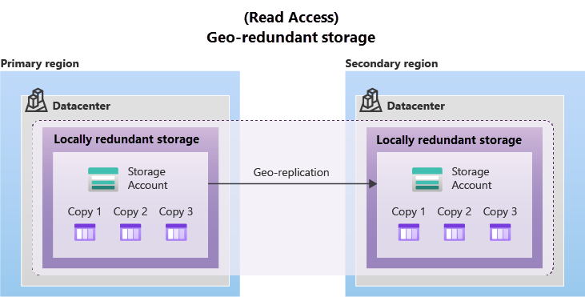

Azure Storage 是微软提供的云原生托管存储解决方案，专为满足现代数据存储的高可用性、可扩展性及安全性需求而设计。
作为 Azure 云服务的核心组件，它为企业提供了多样化的存储服务，无需管理底层硬件即可实现全球级数据管理。

## 1. Azure Storage 提供 5 种存储类型
### 1.1 Blob Storage（块）
适用于非结构化数据（文本、图像、视频、日志等）的海量对象存储。 
- 核心特性​：
    - 支持分层存储（热/冷/存档），成本差异显著（如存档层价格最低，适用于合规性归档）。
    - 集成 ​Data Lake Storage Gen2，提供 Hadoop 兼容的文件系统与细粒度 ACL，支持大数据分析。
- ​典型场景​：静态网站托管、媒体流、备份与灾难恢复。

Azure 存储为 Blob 存储提供不同的访问层，有助于以最经济高效的方式存储对象数据。 可用的访问层包括：
- **Hot access tier（热访问层）**：针对存储经常访问的数据（例如网站图像）进行了优化。
- **Cool access tier（冷访问层）**：为不常访问且存储时间至少为 30 天的数据（例如客户发票）进行了优化。
- **Cold access tier（寒访问层）**：已经过优化，可存储不经常访问且存储至少 90 天的数据。
- **Archive access tier（归档访问层）**：适用于极少访问、存储时间至少为 180 天且延迟要求不严格的数据（例如长期备份）。

**从上至下，Hot access tier 访问费用最低、但存储费用最高，Archive access tier 访问费用最高、但存储费用最低。**


需要注意：
- 在帐户级别只能设置“热”、“冷”和“寒”访问层。 存档访问层在帐户级别不可用。
- 可以在上传期间或上传后在 Blob 级别设置热层、冷层、寒层和存档层。
- 冷和寒访问层中的数据可以容忍略低的可用性，但仍然需要类似于热数据的高持久性、检索延迟和吞吐量特性。 与热数据相比，冷数据和寒数据接受以略低的可用性服务级别协议 (SLA) 和较高的访问成本为代价实现较低的存储成本。
- 归档存储可脱机存储数据，其存储费用最低，但数据解除冻结和访问费用最高。

### 1.2 Azure FIles (共享文件)
全托管文件共享服务，可通过行业标准的服务器消息块 (SMB) 协议或网络文件系统 (NFS) 协议进行访问。
- 核心特性：
    - 基于 SMB 协议，可以从任意 Windows、Linux 和 macOS 客户端进行访问；基于 NFS 协议，可以从任意 Linux 或 macOS 客户进行端访问。
    - 可以在云资源或本地部署的资源，以并发的方式挂载 Azure Files。
    - 支持混合部署，本地服务器可通过 ​Azure File Sync​ 同步云端文件。
- 典型场景：企业级文件共享。
### 1.3 Queue Storage（消息队列）
Queue Storage 是一个可存储大量消息的服务。 存储消息后，可使用 HTTP 或 HTTPS 带身份验证从任何地方访问消息。 
- 核心特性：
    - 消息的大量存储。队列可以在存储帐户空间允许的情况下包含尽可能多的消息（可以存储数百万条）。 每条单独的消息最大可为 64 KB。
    - 集成 Azure Functions 等计算函数，在收到消息时触发处理操作。
- 典型场景：用于创建要异步处理的积压工作。
### 1.4 Table Storage（表）
适用于非关系型的结构化数据。
### 1.5 Disk Storage（磁盘）
用于给 Azure VM 挂载块级存储卷。从概念上讲，它们与物理磁盘相同，但它们是虚拟化的 - 可提供比物理磁盘更好的复原能力和可用性。

## 2. Azure storage redundancy（存储冗余）
Azure 存储始终会存储数据的多个副本，以防范各种计划内和计划外的事件，例如暂时性的硬件故障、网络中断或断电、自然灾害等。 冗余可确保即使遇到故障，存储帐户也能达到其可用性和持久性目标。

在确定最适合自己方案的冗余选项时，请考虑如何在较低成本与较高可用性之间做出取舍。 可帮助你确定应选择哪种冗余选项的因素包括：

- 如何在 primary region（主要区域，灾备中的概念）中复制数据。
- 是否要将你的数据复制到地理上距 primary region 较远的另一个 region，以防范区域性灾难。
- 如果 primary region 变得不可用，应用程序是否需要对 secondary region （次要区域，或者也叫备用区）中复制的数据进行读取访问。

### 2.1 Primary Region 中的冗余策略类型
数据在 Storage Account 中默认都会有三个副本，Azure 提供了两种复制策略选项：locally redundant storage (LRS) and zone-redundant storage (ZRS)。

#### 2.1.1 LRS（本地冗余存储）
在 primary region 内部的单个数据中心内同步复制数据 3 次。

LRS 在一年中为对象提供至少 11 个 9 的持续可用性。与其他选项相比，LRS 是成本最低的冗余选项，但提供的持久性也最低。 LRS 可以保护数据，使其不受服务器机架和驱动器故障影响。 但是，如果数据中心发生火灾或洪水等灾难，使用 LRS 的存储帐户的所有副本可能会丢失或无法恢复。

#### 2.1.2 RS（可用性区冗余存储）
注意，不是 region 的区域冗余。在 primary region 内部跨 3 个 Zone 一共同步复制 3 份数据。

ZRS 在一年中为 Azure 存储数据对象提供至少 12 个 9 的持续可用性。通过使用 ZRS，即使某个 Zone 变得不可用，也仍可访问你的数据进行读写操作。相比 LRS，ZRS 可以防止部分范围内的灾害，但对于大面积的灾害如地震等，防御程度有限。

### 2.2  Secondary Region 中的冗余策略类型
对于需要高持续性的应用程序，可以选择将存储帐户中的数据另外复制到距离 primary region 数百公里外的 secondary region。这样当 primary region 发生大面积灾难故障时，应用程序依然可用。
secondary region 并非用户可任意选择的，是由 Azure 提供，与 primary region 结对的区域（Azure Region Pairs）—— 不可更改，但有 Azure 提供更优化过的网络和基础设施支持。
针对 secondary region，Azure 同样提供了两种复制策略选项：geo-redundant storage (GRS) and geo-zone-redundant storage (GZRS)，以及额外一种提高 sencodary region 资源利用率 或 进行方案扩展的 read-access geo-redundant storage（RA-GRS / RA-GZRS）。


由于数据以异步方式复制到 secondary region，因此存在 RPO （recovery point objective），Azure 存储的 RPO 通常小于 15 分钟，但目前没有 SLA 的硬性保证和规定。


#### 2.2.1 GRS（异地冗余存储）
GRS 在 primary region 使用 LRS 创建3个副本，同时异步复制到 seconday region 内再创建 3 个副本。

GRS 在一年中为 Azure 存储数据对象提供至少 16 个 9 的持续可用性。

#### 2.2.2 GZRS（异地可用性区冗余存储）
GZRS 在 primary region 使用 ZRS 创建3个副本，同时异步复制到 seconday region 内使用 LRS 再创建 3 个副本。

GZRS 可在一年中为存储数据对象提供至少 16 个 9 的持续可用性。

#### 2.2.3 RA-GRS or RA-GZRS（次区可读的 GRS 或 GZRS）
默认情况下，除非客户启动故障转移到 secondary region，否则无法对 secondary region 中的数据进行读取或写入访问。 若要在 primary region 运行尚佳的情况下，对 secondary region 进行读取访问，可设置冗余策略选项 RA-GRS 或 RA-GZRS。


但要注意，由于 RPO 的影响，secondary region 的数据存在延迟、不是最新的。


